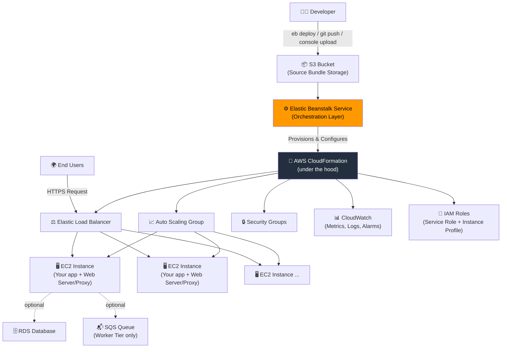
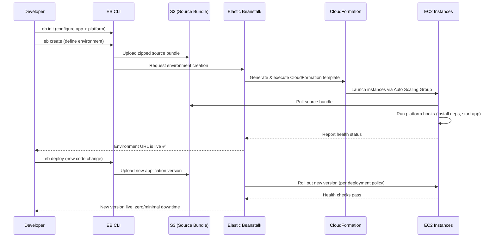

# AWS Elastic Beanstalk — The Complete Practical Guide

> A from-scratch-to-production learning resource for AWS Elastic Beanstalk (EB) — built to actually deploy things, not just read about them.


---

## 📚 What's in This Repository

This isn't a single wall of text — it's split into four focused documents so you can jump straight to what you need:

| File | What it's for |
|---|---|
| **[README.md](./README.md)** (this file) | The theory: what EB is, how it works under the hood, its architecture, core features, and when to actually use it |
| **[commands-cheatsheet.md](./commands-cheatsheet.md)** | Every EB CLI (and relevant AWS CLI) command you'll realistically ever need, organized by task |
| **[hands-on-labs.md](./hands-on-labs.md)** | Step-by-step labs — from an empty folder to a fully deployed, database-backed, HTTPS-secured production app |
| **[troubleshooting.md](./troubleshooting.md)** | The errors you *will* hit, why they happen, and exactly how to fix them |

---

## 🧭 Table of Contents

1. [What is Elastic Beanstalk?](#-what-is-elastic-beanstalk)
2. [Why Does It Exist? (The Problem It Solves)](#-why-does-it-exist-the-problem-it-solves)
3. [Core Concepts & Terminology](#-core-concepts--terminology)
4. [High-Level Architecture & Service Flow](#-high-level-architecture--service-flow)
5. [Core Features — Deep Dive](#-core-features--deep-dive)
6. [Step-by-Step Configuration & Implementation Guide](#-step-by-step-configuration--implementation-guide)
7. [How to Use & Where to Use It (Target Use Cases)](#-how-to-use--where-to-use-it-target-use-cases)
8. [Elastic Beanstalk vs. Other AWS Compute Options](#-elastic-beanstalk-vs-other-aws-compute-options)
9. [Prerequisites](#-prerequisites)
10. [Pricing — What You Actually Pay For](#-pricing--what-you-actually-pay-for)
11. [Security Best Practices](#-security-best-practices)
12. [Repository Structure](#-repository-structure)
13. [Further Reading](#-further-reading)

---

## 🧩 What is Elastic Beanstalk?

**AWS Elastic Beanstalk (EB)** is a **Platform-as-a-Service (PaaS)** offering from AWS that lets you deploy and manage applications without having to manually provision, configure, and stitch together the underlying infrastructure.

Think of it this way: you write your application code (Python, Node.js, Java, .NET, PHP, Ruby, Go, or Docker), zip it up, and hand it to Elastic Beanstalk. EB then takes care of:

- Provisioning EC2 instances to run your code
- Setting up a Load Balancer to distribute traffic
- Configuring Auto Scaling to handle demand
- Setting up health monitoring
- Managing your application's deployment and versioning
- Wiring up logging, metrics, and alarms

The key idea: **you focus on code, EB handles infrastructure** — but unlike a fully "black box" PaaS, EB doesn't hide AWS from you. Every resource it creates (EC2 instances, an Elastic Load Balancer, Auto Scaling Groups, Security Groups, CloudWatch Alarms, S3 buckets) is a normal AWS resource that you can see, inspect, and even manually tweak in the console. This is often described as **"PaaS with an escape hatch to IaaS."**

> 💡 **In plain English:** Elastic Beanstalk is what you'd get if you asked "I just want to run my app on AWS reliably, without spending three days learning how to configure a load balancer and auto-scaling by hand." EB does that grunt work for you, while still letting you pop the hood open whenever you need to.

---

## 🎯 Why Does It Exist? (The Problem It Solves)

Before PaaS offerings like Elastic Beanstalk, deploying a web app on AWS "the right way" meant manually:

1. Launching and configuring EC2 instances
2. Installing the runtime (Python/Node/Java/etc.) and your app's dependencies
3. Setting up a reverse proxy (Nginx/Apache)
4. Creating and configuring a Load Balancer
5. Creating an Auto Scaling Group with scaling policies
6. Setting up Security Groups and networking (VPC, subnets)
7. Wiring up CloudWatch for logs, metrics, and alarms
8. Building a deployment pipeline to push new code without downtime
9. Repeating all of the above, carefully, for every single environment (dev/staging/prod)

That's a lot of undifferentiated heavy lifting — work that doesn't make your product better, it just needs to be done. Elastic Beanstalk automates all of it while remaining transparent and inspectable, striking a balance between:

- **Raw EC2** — full control, full responsibility, slow to set up
- **AWS Lambda** — zero server management, but constrained execution model (great for events/APIs, less natural for long-running or stateful traditional web apps)
- **Elastic Beanstalk** — fast to set up like a PaaS, but backed by normal, visible AWS resources you fully control

---

## 🔑 Core Concepts & Terminology

Understanding EB requires understanding its object model. These terms show up constantly — get them straight early.

### Application
The top-level container in EB. It's a logical folder that groups together environments, versions, and configurations for one project. Think of it as the "project name."

### Application Version
A specific, deployable iteration of your code — literally a labeled, timestamped snapshot (a ZIP/WAR file stored in S3) that EB can deploy to any environment. This is what makes rollbacks trivial: you're just telling EB "deploy application version v12 instead of v13."

### Environment
A running instantiation of an application version. This is where the actual infrastructure lives — the EC2 instances, load balancer, auto-scaling group, security groups, and so on. **One application can have multiple environments** (e.g., `my-app-dev`, `my-app-staging`, `my-app-prod`), each running the same or a different application version, each with its own independent configuration.

### Environment Tier
EB environments come in two flavors:

| Tier | Purpose | Backing Infra |
|---|---|---|
| **Web Server Tier** | Handles HTTP(S) requests directly from users/clients | EC2 + Elastic Load Balancer + Auto Scaling Group |
| **Worker Tier** | Processes background/async jobs pulled from a queue | EC2 + Auto Scaling Group + an SQS queue (EB creates and manages it) — **no load balancer** |

### Platform
The combination of OS + language runtime + web/app server that EB uses to run your code (e.g., "Python 3.12 running on 64bit Amazon Linux 2023"). AWS maintains and patches these platforms regularly. You can also bring your own container image via the **Docker platform**.

### Configuration (Saved Configuration / `.ebextensions`)
The set of settings that define how an environment is built: instance type, scaling limits, environment variables, VPC settings, health check paths, etc. These can be:
- Set via the console/CLI at environment creation or update time
- Defined declaratively in `.ebextensions/*.config` files in your source bundle (version-controlled, repeatable, my strong recommendation)
- Saved as a reusable **Saved Configuration Template** and applied to multiple environments

### Source Bundle
The actual ZIP file (up to 512 MB) containing your application code that you upload to EB for deployment.

### Environment URL / CNAME
Every environment automatically gets a public URL like `my-app-env.us-east-1.elasticbeanstalk.com`, which you can later point a custom domain to via Route 53.

---

## 🏗️ High-Level Architecture & Service Flow

### The Big Picture



**Key insight:** Elastic Beanstalk itself is **free** — you never pay for "Elastic Beanstalk" as a line item. You pay for the underlying resources it creates (EC2, ELB, RDS if used, S3 storage, data transfer, CloudWatch). EB is purely an orchestration and management layer sitting on top of **AWS CloudFormation** — every environment you create is, behind the scenes, a CloudFormation stack.

### The Deployment Flow, Step by Step



### What Actually Happens on the Instance

Every EC2 instance in a web-tier environment runs:
1. The **Elastic Beanstalk host agent** — polls for commands, reports health, ships logs
2. A **reverse proxy** (Nginx by default on Amazon Linux 2/2023 platforms, previously Apache was an option) sitting in front of your app
3. Your **application process**, managed by a process manager appropriate to the platform (e.g., systemd unit)
4. **CloudWatch agent** (if enabled) for enhanced OS-level metrics and log streaming

---

## 🚀 Core Features — Deep Dive

### 1. Supported Platforms

EB natively supports "managed platforms" for:

- **Python** (with WSGI servers like Gunicorn)
- **Node.js**
- **Java SE** and **Java with Tomcat**
- **.NET on Linux** and **.NET on Windows Server**
- **PHP**
- **Ruby**
- **Go**
- **Docker** (single container) and **Docker Compose / Multi-container Docker** (legacy — largely superseded by ECS for complex multi-container needs)

Each platform is versioned (e.g., "Python 3.12 running on 64bit Amazon Linux 2023") and AWS regularly ships **platform updates** containing OS patches, runtime updates, and security fixes.

### 2. Deployment Policies (How New Code Rolls Out)

This is one of the most important concepts to internalize — **how** EB replaces old code with new code determines your downtime, rollback speed, and cost during deployment.

| Policy | How it Works | Downtime | Rollback Speed | Extra Cost | Best For |
|---|---|---|---|---|---|
| **All at Once** | Deploys to every instance simultaneously | Yes, brief | Slow (manual redeploy) | None | Dev/test environments, speed over safety |
| **Rolling** | Deploys in batches; takes each batch out of service during update | No full outage, but reduced capacity during rollout | Slow (roll forward again) | None | Cost-sensitive prod with tolerance for brief reduced capacity |
| **Rolling with Additional Batch** | Launches one new batch *before* taking any instances down, keeping full capacity | None | Slow | Small (temporary extra instances) | Production apps that can't lose capacity |
| **Immutable** | Launches an entirely new Auto Scaling Group with new instances running the new version, validates health, then swaps traffic over and terminates old ones | None | **Fast** — just terminate the new ASG | Temporary (double capacity briefly) | Production — safest built-in option |
| **Traffic Splitting** | Immutable deployment + gradually shifts a % of live traffic to the new version (canary-style) before full cutover | None | Fast, automatic rollback on failed health | Temporary | Canary testing in production |
| **Blue/Green** | Not a built-in policy — a *pattern*: deploy to a brand-new separate environment, test it, then swap CNAMEs | None | Instant (swap back) | Full duplicate environment while both exist | Major version changes, high-risk deploys |

> 🧠 **Rule of thumb:** Use **Immutable** for production by default. Use **Blue/Green** (via `eb swap` or CNAME swap) for high-stakes releases where you want a full pre-production smoke test on real infrastructure before flipping the switch.

### 3. Auto Scaling

EB configures an **Auto Scaling Group (ASG)** for your environment automatically. You control:
- **Minimum and maximum instance count**
- **Scaling triggers** — based on CloudWatch metrics like average CPU utilization, network I/O, or request count per target
- **Cooldown periods** to avoid rapid scale up/down thrashing

### 4. Load Balancing

Web-tier environments can use:
- **Application Load Balancer (ALB)** — Layer 7, supports path/host-based routing, WebSockets, HTTP/2 — the modern default
- **Network Load Balancer (NLB)** — Layer 4, for extreme performance/static IP needs
- **Classic Load Balancer (CLB)** — legacy, avoid for new environments
- **No load balancer (Single Instance)** — for dev/test environments where you just need one server and want to save cost

### 5. Health Monitoring

EB offers **Enhanced Health Reporting** (recommended, default on modern platforms), which gives:
- Per-instance health status: **Ok, Warning, Degraded, Severe, Info**
- Causes (e.g., high CPU, failed health checks, deployment failures, application errors like 5xx spikes)
- A health color rollup for the whole environment, visible in the console dashboard and via `eb health`

Basic Health Reporting (legacy) only gives you a simple green/yellow/red based on ELB health checks — much less useful for debugging.

### 6. Configuration via `.ebextensions`

You can declaratively configure almost everything about your environment by adding `.config` YAML/JSON files inside a `.ebextensions/` folder at the root of your source bundle. This lets you:
- Install OS packages
- Run setup commands
- Set environment variables
- Configure Nginx/Apache
- Create CloudWatch alarms
- Set resource options (instance type, scaling, etc.) as code

This is the **Infrastructure-as-Code** face of Elastic Beanstalk, and it's what makes environments reproducible and version-controlled rather than manually clicked together.

### 7. Environment Variables

Simple key-value configuration exposed to your app as OS environment variables. Ideal for things like `DATABASE_URL`, `API_KEY`, `NODE_ENV`. Settable via console, CLI (`eb setenv`), or `.ebextensions`.

### 8. Managed Platform Updates

EB can automatically apply minor platform version updates (patches, security fixes) during a defined maintenance window, optionally with automatic rollback if the update causes health degradation. Major version updates still require manual action.

### 9. Logs & Monitoring

- **On-demand logs**: pull the last 100 lines or a full log bundle via `eb logs` or the console
- **Log streaming to CloudWatch Logs**: enable this for real-time, retained, searchable logs — essential for production
- Integrates with **CloudWatch Alarms**, **AWS X-Ray** (tracing), and **AWS CodePipeline/CodeDeploy** for CI/CD

### 10. Networking (VPC)

By default, EB can launch into the account's default VPC, but production setups should:
- Launch into a **custom VPC**
- Place EC2 instances in **private subnets**
- Place the Load Balancer in **public subnets**
- Use a **NAT Gateway** for instances to reach the internet (for package installs, etc.) without being directly internet-facing

### 11. Databases

Two approaches:
- **Coupled RDS instance** (created *through* EB) — simple, great for dev/test, but the database's lifecycle is tied to the environment (deleting the environment can delete the DB unless you enable deletion protection/snapshot-on-delete)
- **Decoupled RDS instance** (created *separately*, outside EB, and referenced via environment variables) — **strongly recommended for production**, since your database now has an independent lifecycle from your compute environment

### 12. HTTPS & Custom Domains

- Request/manage a TLS certificate via **AWS Certificate Manager (ACM)** (free for AWS-issued certs)
- Attach it to the Load Balancer listener (443) — EB config or console
- Point a custom domain to the environment via **Route 53** (usually an ALIAS record to the ELB, or a CNAME to the EB environment URL)

### 13. Security Model — Two Distinct IAM Roles

This trips up almost everyone at first, so it deserves its own callout:

| Role | Used By | Purpose |
|---|---|---|
| **Service Role** | The Elastic Beanstalk *service itself* | Lets EB call other AWS APIs on your behalf (create ASGs, ELBs, CloudWatch alarms, etc.) |
| **Instance Profile** | The *EC2 instances* running your app | Lets your running application code call AWS APIs (e.g., read from S3, write to DynamoDB) |

Two different identities, two different jobs — never confuse them when debugging permission errors.

### 14. CI/CD Integrations

EB plugs cleanly into:
- **AWS CodePipeline + CodeBuild** — fully AWS-native pipeline
- **GitHub Actions** — using the `aws-actions` toolkit and EB CLI to deploy on push
- **Jenkins / GitLab CI** — via the EB CLI or AWS CLI in a build stage

---

## 🛠️ Step-by-Step Configuration & Implementation Guide

This is the condensed roadmap — the **[hands-on-labs.md](./hands-on-labs.md)** file walks through each step in full detail with actual commands and expected output.

```mermaid
flowchart LR
    A["1️⃣ Install & configure\nAWS CLI + EB CLI"] --> B["2️⃣ eb init\n(link project to EB,\nchoose platform/region)"]
    B --> C["3️⃣ Add .ebextensions\n(optional but recommended)"]
    C --> D["4️⃣ eb create\n(provision environment)"]
    D --> E["5️⃣ eb open\n(verify it's live)"]
    E --> F["6️⃣ eb setenv\n(configure env vars/secrets)"]
    F --> G["7️⃣ Iterate:\nedit code → eb deploy"]
    G --> H["8️⃣ Add RDS / custom domain /\nHTTPS as needed"]
    H --> I["9️⃣ Set up CI/CD"]
    I --> J["🔟 Monitor, scale,\nand maintain"]
```



**In short:**

1. **Install tools** — AWS CLI, EB CLI, configure credentials (`aws configure`)
2. **Initialize** — `eb init` inside your project folder; choose region, platform, and (optionally) set up SSH keys
3. **Configure as code** — add `.ebextensions/*.config` for anything beyond defaults (packages, env vars, scaling)
4. **Create the environment** — `eb create` provisions everything: EC2, ELB, ASG, security groups
5. **Verify** — `eb open` launches the live URL in your browser; `eb status` and `eb health` confirm it's healthy
6. **Configure secrets/env vars** — `eb setenv KEY=value`
7. **Deploy iteratively** — make code changes, run `eb deploy`, EB handles the rollout per your deployment policy
8. **Add production concerns** — attach a decoupled RDS database, a custom domain via Route 53, HTTPS via ACM
9. **Automate** — wire up CI/CD so `git push` triggers a deploy
10. **Operate** — monitor via CloudWatch, tune Auto Scaling thresholds, apply managed platform updates

---

## 🎯 How to Use & Where to Use It (Target Use Cases)

### ✅ Great fit for:
- **Traditional web applications** — Django, Flask, Rails, Express, Spring Boot, ASP.NET apps that expect a "normal server" to run on
- **APIs and backend services** that run continuously and benefit from a persistent process (vs. cold-start-sensitive serverless)
- **Startups / small teams** who want production-grade infrastructure without hiring a dedicated DevOps engineer
- **Teams migrating from traditional hosting** (e.g., a VPS or Heroku) who want more AWS-native control without a full re-architecture
- **Proof-of-concept and MVP deployments** that need to look and behave like "real" production infrastructure quickly
- **Background job processing** via the Worker Tier + SQS, decoupled from a web-facing tier
- **Educational/learning environments** for understanding how EC2 + ELB + ASG fit together, since EB exposes rather than hides these

### ⚠️ Reconsider for:
- **Highly event-driven, spiky, or infrequent workloads** — AWS Lambda will usually be cheaper and simpler
- **Complex microservices architectures** with many interdependent containers — ECS/EKS give you more granular orchestration control
- **Teams already deep into Kubernetes** — EKS keeps you in that ecosystem
- **Static websites** — S3 + CloudFront is far cheaper and simpler
- **Workloads needing extremely fine-grained infrastructure customization beyond what `.ebextensions`/`.platform` hooks allow**

---

## ⚖️ Elastic Beanstalk vs. Other AWS Compute Options

| Criteria | Elastic Beanstalk | Raw EC2 | ECS/Fargate | Lambda | App Runner |
|---|---|---|---|---|---|
| Setup speed | Fast | Slow | Medium | Fast | Fast |
| Infra control | High (full access to underlying resources) | Full | High | None (fully abstracted) | Low |
| Best for | Traditional apps/APIs | Custom/legacy needs | Microservices/containers | Event-driven/serverless functions | Simple containerized web apps |
| Scaling | Automatic (ASG-based) | Manual/custom | Automatic | Automatic (instant, per-request) | Automatic |
| Pricing model | Pay for underlying resources | Pay for instances | Pay for tasks/vCPU-memory | Pay per invocation/duration | Pay for compute + requests |
| Learning curve | Low–Medium | High | Medium–High | Low–Medium | Low |
| State/long-running processes | ✅ Natural fit | ✅ Natural fit | ✅ Natural fit | ⚠️ Awkward (stateless, time-limited) | ✅ Good fit |

---

## ✅ Prerequisites

Before starting the hands-on labs, make sure you have:

- **An AWS account** ([sign up here](https://aws.amazon.com)) — a free-tier eligible account works fine for these labs
- **An IAM user** (not the root account!) with programmatic access and, at minimum, the `AdministratorAccess-AWSElasticBeanstalk` managed policy (or full admin while learning, tightened later)
- **AWS CLI v2** installed and configured (`aws configure`)
- **Python 3.7+** installed (needed to `pip install` the EB CLI)
- **EB CLI** installed (`pip install awsebcli --upgrade --user`)
- **Git** installed and a basic comfort level with the command line
- A code editor (VS Code recommended)
- Basic familiarity with at least one supported language/framework (examples in the labs use Python/Flask, but the concepts transfer directly)

Full installation instructions are in **[hands-on-labs.md → Lab 0](./hands-on-labs.md#lab-0-environment-setup)**.

---

## 💰 Pricing — What You Actually Pay For

Elastic Beanstalk the *service* is **free**. You are billed for the AWS resources it provisions:

| Resource | Typical Cost Driver |
|---|---|
| EC2 instances | Instance type × hours running (biggest cost lever — right-size this!) |
| Elastic Load Balancer | Hourly charge + per-GB data processed |
| RDS (if used) | Instance size + storage + backup retention |
| S3 | Source bundle storage (usually negligible) |
| Data Transfer | Outbound data transfer to the internet |
| CloudWatch | Custom metrics/alarms beyond free tier, log ingestion/storage |
| Elastic IP (if unused/detached) | Small hourly charge for **idle** EIPs |

**Cost-saving tips:**
- Use **Single Instance** environments (no load balancer) for dev/test
- Set aggressive **min/max ASG limits** for non-prod environments
- **Terminate environments** you're not using — `eb terminate` (don't just leave them running!)
- Use **decoupled RDS** with `t3.micro`/`t4g.micro` for learning (and remember to delete it when done)

---

## 🔐 Security Best Practices

1. **Never hardcode secrets** — use environment variables or better, AWS Secrets Manager / SSM Parameter Store referenced at runtime
2. **Use decoupled databases** in production so environment termination can't accidentally destroy your data
3. **Restrict Security Groups** — don't leave SSH (22) open to `0.0.0.0/0`; use a bastion/Session Manager instead
4. **Enable HTTPS only** — redirect HTTP → HTTPS at the load balancer
5. **Use least-privilege IAM** — scope the instance profile down to only what your app actually needs
6. **Enable log streaming to CloudWatch** and set retention policies (don't keep logs forever, don't lose them either)
7. **Turn on Managed Platform Updates** with automatic rollback for security patching
8. **Use private subnets** for EC2 instances behind the load balancer in production VPC setups
9. **Enable deletion protection** on production RDS instances

---

## 📁 Repository Structure

```
.
├── README.md                   # You are here — theory, architecture, concepts
├── commands-cheatsheet.md      # Every EB CLI / AWS CLI command, organized by task
├── hands-on-labs.md            # Step-by-step labs, from zero to deployed production app
└── troubleshooting.md          # Common errors and their fixes
```

---

## 📖 Further Reading

- [Official AWS Elastic Beanstalk Documentation](https://docs.aws.amazon.com/elasticbeanstalk/)
- [EB CLI Command Reference](https://docs.aws.amazon.com/elasticbeanstalk/latest/dg/eb-cli3-commands.html)
- [.ebextensions Configuration Reference](https://docs.aws.amazon.com/elasticbeanstalk/latest/dg/ebextensions.html)
- [AWS Well-Architected Framework](https://aws.amazon.com/architecture/well-architected/)

---

**Next step:** Head to [`hands-on-labs.md`](./hands-on-labs.md) and deploy your first application from scratch. 🚀
