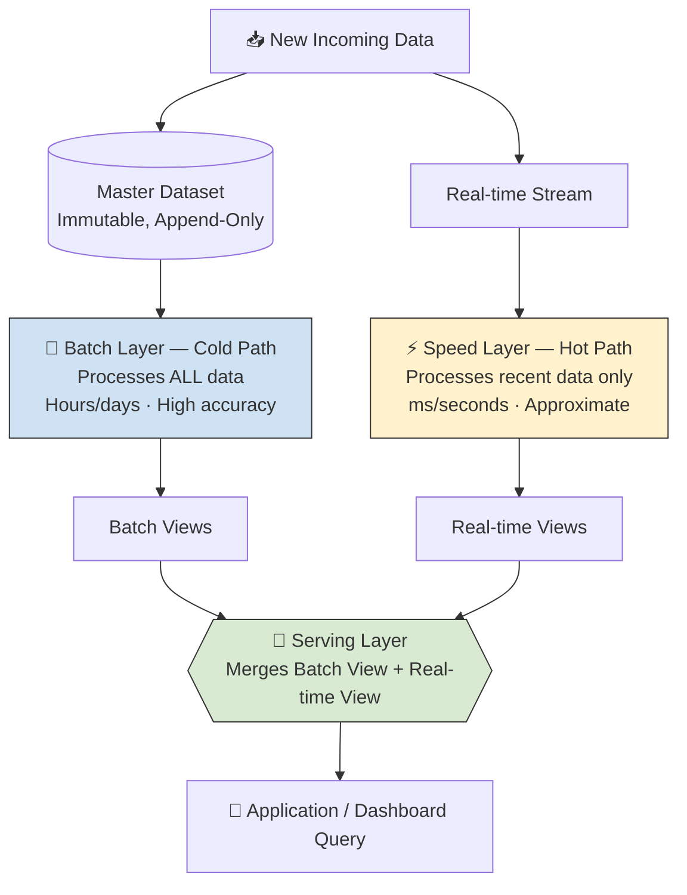
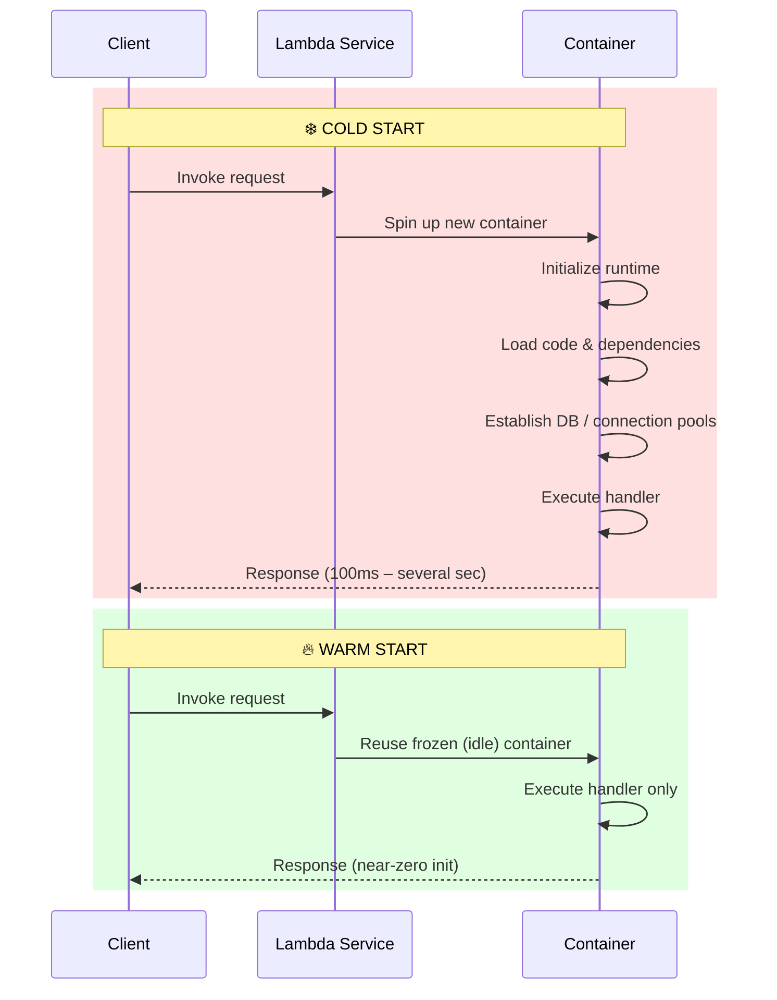
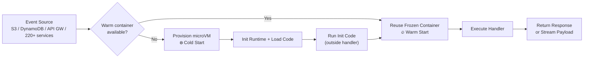

# ⚡ Lambda — End-to-End Practical Guide

A hands-on reference that untangles **two different things that share the name "Lambda"**:

| | What it is | Domain |
|---|---|---|
| **Lambda Architecture** | A big-data processing *pattern* (Batch + Speed + Serving layers) | Data Engineering |
| **AWS Lambda** | A serverless *compute service* (run code without managing servers) | Cloud / Infrastructure |

This repo covers both end-to-end: concepts → architecture → configuration → hands-on labs → troubleshooting.

> 📌 **Note:** This guide currently covers Lambda Architecture + AWS Lambda only. AWS Step Functions content will be added once available — see [Next Steps](#-next-steps--further-exploration).

---

## 📖 Table of Contents

- [Part 1: Lambda Architecture (Data Processing Pattern)](#part-1-lambda-architecture-data-processing-pattern)
  - [The Three Layers](#the-three-layers)
  - [Key Points](#key-points)
  - [Benefits](#benefits)
  - [Practical Scenarios](#practical-scenarios)
- [Part 2: Cold Start vs Warm Start](#part-2-cold-start-vs-warm-start)
- [Part 3: AWS Lambda — Features & Configuration](#part-3-aws-lambda--features--configuration)
  - [Core & Modern Features](#core--modern-features)
  - [Critical Configuration Options](#critical-configuration-options)
  - [Cold Start Best Practices](#cold-start-best-practices)
- [Next Steps](#-next-steps--further-exploration)
- [Related Docs](#-related-docs-in-this-repo)

---

## Part 1: Lambda Architecture (Data Processing Pattern)

Lambda Architecture is a data-processing design for handling massive data volumes (Big Data) by combining **batch processing** and **stream processing**, balancing latency, throughput, and fault tolerance.

### Diagram

### The Three Layers

**Batch Layer (Cold Path)**
- Manages the master dataset — an immutable, append-only set of raw data.
- Pre-computes batch views over the *entire* dataset.
- High accuracy, high latency (hours to days).

**Speed Layer (Hot Path)**
- Processes recent data not yet captured by the batch layer.
- Prioritizes low latency (ms to seconds) over perfect accuracy.
- Handles updates as they arrive.

**Serving Layer**
- Indexes both batch and real-time views for low-latency querying.
- Merges results from the batch view and the real-time view into one complete, up-to-date answer when queried.

### Key Points

- **Immutability** — raw data is never modified; new data is only appended. This means views can always be recomputed from scratch if logic changes or bugs are found.
- **Separation of Concerns** — real-time and batch processing are handled independently, so neither compromises the other's stability or depth.
- **Eventual Consistency** — the speed layer gives a temporary approximation; the batch layer continuously corrects it toward absolute accuracy.

### Benefits

- **Fault Tolerance** — because the master dataset is immutable, a bug in processing logic can be fixed and the batch layer simply rerun over history.
- **Scale** — scales horizontally using systems like Hadoop/Spark (batch) and Kafka/Flink (speed).
- **Low Latency Queries** — users get real-time insight without losing historical depth.

### Practical Scenarios

| Scenario | Speed Layer (Hot) | Batch Layer (Cold) |
|---|---|---|
| **E-Commerce Recommendations** | Captures what the user is clicking right now to tweak homepage recs instantly | Analyzes weeks of behavior to build deep preference profiles |
| **Financial Fraud Detection** | Flags/blocks a transaction that deviates wildly from a user's pattern immediately | Updates credit scoring & historical risk models overnight |
| **IoT Fleet Monitoring** | Raises alerts for immediate engine overheating / sudden braking | Runs predictive maintenance models to schedule service over the next month |

---

## Part 2: Cold Start vs Warm Start

This concept applies broadly to serverless/containerized components (and is central to understanding AWS Lambda's latency behavior in Part 3).

**Cold Start** — occurs on first trigger, or after long idle time. The system spins up a new container, initializes the runtime, loads code/dependencies, and establishes connections (e.g. DB pools). **Impact:** hundreds of ms to several seconds of added latency.

**Warm Start** — occurs while a previously used container is still alive/idle. The system thaws the frozen container and reuses the environment, code, and existing connections. **Impact:** near-zero init time, optimal low latency.

### Diagram

---

## Part 3: AWS Lambda — Features & Configuration

AWS Lambda is the industry-standard serverless compute service and has evolved well beyond a basic "trigger-on-demand" model.

### Core & Modern Features

| Feature | What it does |
|---|---|
| **Event-Driven Execution** | Natively integrates with 220+ AWS services and SaaS events (S3 uploads, DynamoDB row updates, API Gateway calls, etc.) |
| **Durable Functions** | Build long-running, multi-step stateful workflows and AI agentic loops natively — checkpointing, pausing, and resuming without billing for idle time |
| **MicroVMs & Managed Instances** | Complete VM-level isolation for security; Managed Instances on dedicated EC2 capacity support multi-concurrency for steady-state traffic |
| **Response Streaming** | Streams response payloads back progressively — improves perceived latency for heavy payloads or generative AI output |
| **Processor Choice** | x86 or ARM64 (Graviton); ARM64 is ~20% cheaper with 15–40% better performance |

### Critical Configuration Options

| Configuration | Range / Options | Architectural Impact |
|---|---|---|
| **Memory** | 128 MB – 10,240 MB | Scales CPU power proportionally — a CPU-bound function may get *faster and cheaper* with more memory |
| **Ephemeral Storage (`/tmp`)** | 512 MB – 10,240 MB | Local disk during execution — for caching ML models, PDF generation, heavy file transforms |
| **Timeout** | 1 sec – 15 min | Max runtime before AWS force-terminates the invocation |
| **Concurrency Controls** | Reserved vs Provisioned | Reserved = ceiling to protect account resources; Provisioned = keeps containers warm to eliminate cold starts |
| **VPC Configuration** | Subnets & Security Groups | Connects Lambda privately to RDS, ElastiCache, or internal microservices |

### Execution Flow Diagram

### Cold Start Best Practices

1. **Initialize Outside the Handler** — DB pools, SDK clients, and heavy config should be instantiated once, outside the handler function, so they persist across warm invocations.
2. **Minimize Package Bloat** — keep deployment zips lean; avoid importing monolithic libraries for a single helper method. Smaller packages decompress onto the microVM faster.
3. **Leverage SnapStart** — for historically slow-starting runtimes (Java, Python 3.13+, .NET), SnapStart snapshots the initialized environment, dropping cold starts from seconds to sub-200ms.

---

## 🧭 Next Steps / Further Exploration

- **Kappa Architecture** — a simplification of Lambda Architecture that removes the batch layer entirely and reprocesses everything through the stream layer, eliminating the dual-codebase problem. (Explored conceptually in `hands-on-labs.md`.)
- **AWS Step Functions** — orchestration for multi-step Lambda workflows. *Not yet covered — paste that content and this guide will be extended to match the same 4-file structure.*
- **IAM Permission Design** — precise least-privilege policies for a database-connected Lambda function.

---

## 🔗 Related Docs in This Repo

| File | Contents |
|---|---|
| [`commands-cheatsheet.md`](./commands-cheatsheet.md) | AWS CLI, SAM CLI, and Boto3 commands for everything above |
| [`hands-on-labs.md`](./hands-on-labs.md) | Step-by-step labs — local pipeline, real deployment, cold-start experiments, concurrency tuning |
| [`troubleshooting.md`](./troubleshooting.md) | Common failure modes and fixes for both Lambda Architecture pipelines and AWS Lambda deployments |
