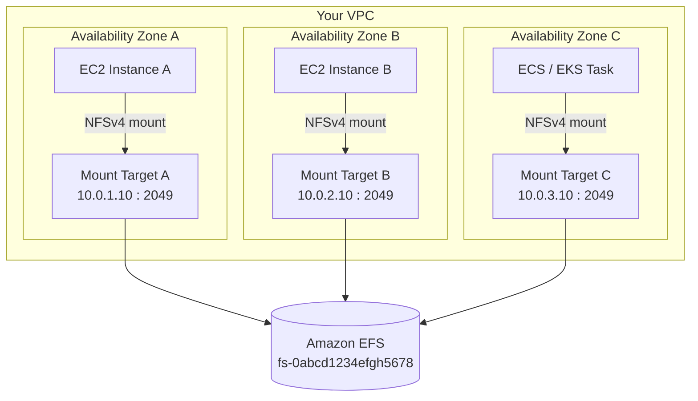
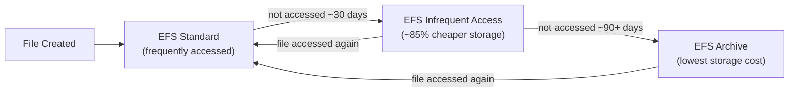
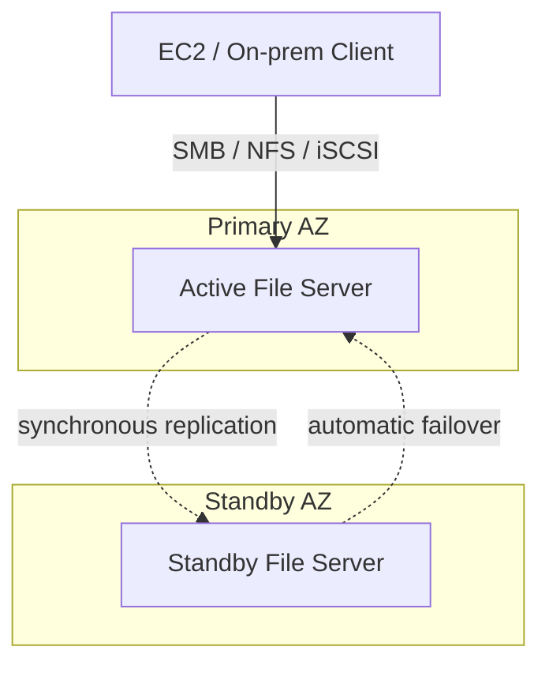
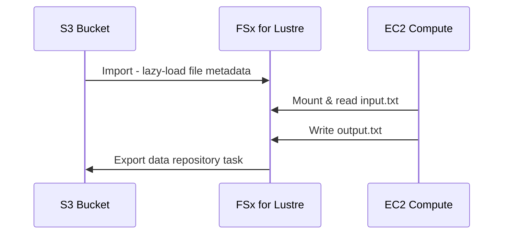
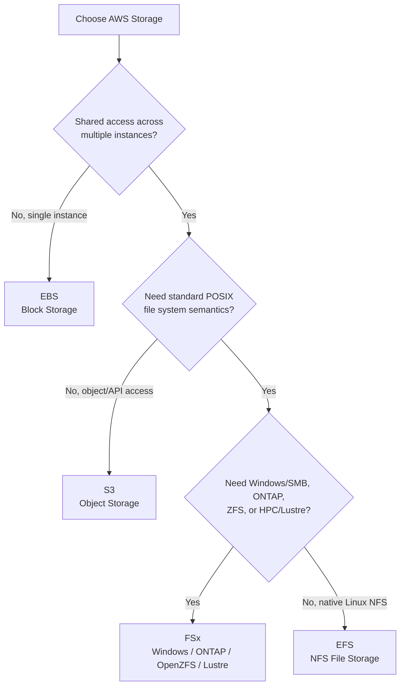

# AWS Shared File Storage — EFS & FSx: End-to-End Practical Guide

A hands-on reference covering **Amazon EFS** and **Amazon FSx** — architecture, storage/performance options, decision-making, and fully working labs — built for anyone learning AWS shared storage from zero to production.

## 📂 Repository Structure

| File | Purpose |
|---|---|
| [`README.md`](./README.md) | Concepts, architecture, diagrams, decision guide (this file) |
| [`hands-on-labs.md`](./hands-on-labs.md) | Step-by-step labs: EFS multi-EC2 demo, FSx for Lustre + S3 demo |
| [`commands-cheatsheet.md`](./commands-cheatsheet.md) | Every CLI/console command used, grouped by task |
| [`troubleshooting.md`](./troubleshooting.md) | Common errors and how to fix them |

---

## 1. Amazon EFS (Elastic File System)

Amazon EFS is a **fully managed, serverless, elastic NFS file system** that can be mounted by thousands of EC2 instances, containers, or on-prem servers **at the same time**. It grows and shrinks automatically as files are added or removed — there is no capacity to pre-provision.

### 1.1 Core Architecture

- **Protocol:** NFSv4 / NFSv4.1
- **Regional resource:** data is stored redundantly across multiple Availability Zones (AZs) by default
- **Mount Targets:** one per AZ, each with its own IP + DNS name inside a subnet — this is the actual network endpoint instances connect to
- **Security Groups:** control access on **TCP port 2049**, exactly like any other AWS resource

Because every AZ has its own mount target, an instance always mounts the **local** endpoint for its AZ — this keeps latency low while all AZs still see the exact same shared file system.

### 1.2 Storage Classes & Lifecycle Management

| Storage Class | Use Case | Cost Profile |
|---|---|---|
| **EFS Standard** | Frequently accessed data | Higher storage cost, zero access fee |
| **EFS Infrequent Access (IA)** | Not accessed daily (backups, retention) | ~85% cheaper storage, small per-GB read/write fee |
| **EFS Archive** | Accessed a few times a year | Lowest storage cost, higher access fee |
| **One Zone / One Zone-IA** | Dev, easily-reproducible data | Cheapest — data lives in a single AZ only (no cross-AZ redundancy) |

**Lifecycle Management** automatically moves a file between these classes based on when it was last accessed — you never move data manually.

### 1.3 Performance Modes

| Mode | Best For |
|---|---|
| **General Purpose** (default) | Latency-sensitive apps: web servers, CMS, home directories |
| **Max I/O** | Massive parallel workloads (big data, media processing) across hundreds of clients — trades a bit of latency for higher aggregate throughput |

### 1.4 Throughput Modes

| Mode | Behavior |
|---|---|
| **Elastic** (recommended) | Scales automatically with your workload; pay only for what you use |
| **Provisioned** | You lock in a fixed MiB/s independent of how much data is stored |

### 1.5 Security

- **Network:** VPC Security Groups restrict access on port 2049
- **Encryption:** at rest via AWS KMS, in transit via TLS (`-o tls` mount option)
- **Permissions:** standard POSIX file permissions for users/groups, plus IAM policies for AWS-level control (who can mount/manage the file system)

---

## 2. Amazon FSx

Amazon FSx runs **specialized, commercial/open-source file systems natively in AWS**, with zero code rewrites — for workloads that don't fit a plain Linux NFS model.

### 2.1 Core Architecture

- AWS provisions and fully manages the file servers and backing SSD/HDD storage
- **Multi-AZ deployment:** an active file server in one AZ, a synchronously-replicated standby in another — automatic failover if the primary fails
- **Single-AZ deployment:** cheaper option for dev/test
- Integrates natively with IAM (access control), KMS (encryption at rest), and Active Directory (Windows permissions)

### 2.2 The Four FSx Flavors

| Type | Use Case | Protocols | Key Feature |
|---|---|---|---|
| **FSx for Windows File Server** | Windows apps, user home directories, corporate shares | SMB | Native Active Directory integration, Windows ACLs |
| **FSx for NetApp ONTAP** | Enterprise multi-protocol data management, NetApp migrations | NFS, SMB, iSCSI | Deduplication, compression, cloning |
| **FSx for OpenZFS** | Migrating ZFS/Linux file servers as-is | NFS v3/v4/v4.1/v4.2 | Sub-millisecond latency, high IOPS |
| **FSx for Lustre** | HPC, ML training, big-data analytics | Lustre client | Hundreds of GB/s throughput, direct S3 linking |

### 2.3 FSx for Lustre ↔ S3 Data Repository

FSx for Lustre can link directly to an S3 bucket: file **metadata** loads instantly (lazy-load), actual bytes are pulled on first read, and results can be exported back to S3 as a repository task.

---

## 3. Choosing the Right Storage: EFS vs EBS vs S3 vs FSx

| Service | Model | Shared Access | Best For |
|---|---|---|---|
| **EBS** | Block storage | Single instance, same AZ | Ultra-low latency, e.g. a traditional database disk |
| **S3** | Object storage | Any client via HTTP/API | Infinite, cheap storage — not a POSIX file system |
| **EFS** | Elastic NFS file system | Thousands of Linux clients, multi-AZ | Standard shared Linux folder structure (e.g. `/var/www/html`) |
| **FSx** | Managed specialized file system | Many clients (SMB/NFS/Lustre), multi-AZ | Windows shares, NetApp features, ZFS, or HPC/ML workloads |

---

## 4. Where to Go Next

- 🧪 Run the full demos yourself → [`hands-on-labs.md`](./hands-on-labs.md)
- 📋 Copy-paste every command used → [`commands-cheatsheet.md`](./commands-cheatsheet.md)
- 🛠️ Stuck on a mount error or IAM issue? → [`troubleshooting.md`](./troubleshooting.md)

---

## 5. Quick Facts Cheat Sheet

- EFS uses **NFSv4**; mount targets listen on **TCP 2049**
- FSx for Lustre listens on **TCP 988**
- EFS is **fully serverless** — no capacity planning
- FSx requires you to **specify storage capacity** up front (can be increased later)
- EFS IA/Archive save up to **~85%** on storage cost, at the price of a per-GB access fee
- Both support encryption at rest (KMS) and in transit (TLS)
