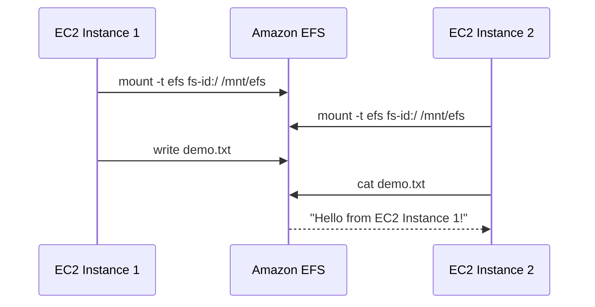
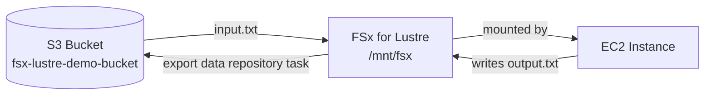

# Hands-On Labs: EFS & FSx

Two complete, reproducible labs. Lab 1 proves EFS's core value proposition (shared writes across instances, seen instantly). Lab 2 proves FSx for Lustre's S3 integration for HPC/analytics workloads.

> 💡 All console click-paths below have an equivalent AWS CLI command in [`commands-cheatsheet.md`](./commands-cheatsheet.md) if you'd rather script the whole lab.

---

## Lab 1: EFS Shared Storage Across Two EC2 Instances

**Goal:** Create an EFS file system, mount it on two separate EC2 instances, write a file from one, and read it instantly from the other.



### Step 1 — Create a Security Group for EFS

1. EC2 Dashboard → **Security Groups** → **Create security group**
2. Name: `efs-sg`, VPC: your default VPC
3. Inbound rule: **Type = NFS**, **Port = 2049**, **Source = Anywhere-IPv4 (0.0.0.0/0)**
   - ⚠️ For production, restrict the source to your EC2 instances' security group instead of `0.0.0.0/0`.
4. Create security group.

### Step 2 — Create the EFS File System

1. EFS Console → **Create file system** → **Customize**
2. **Settings:** Name = `my-shared-efs`, Storage class = Standard → Next
3. **Network access:** select your VPC; for **every** Availability Zone, set the Security Group to `efs-sg` → Next
4. Accept defaults on the remaining screens → **Create**
5. Copy the **File System ID** (e.g. `fs-0abcd1234efgh5678`) — you'll need it below.

### Step 3 — Launch Two EC2 Instances

1. EC2 Dashboard → **Launch instances**
2. Number of instances: **2**, Name: `EFS-Demo-Node`
3. AMI: **Amazon Linux 2023**, Type: `t2.micro` / `t3.micro`
4. Key pair: existing or new
5. Network: **same VPC as EFS**, enable auto-assign public IP, security group allowing **SSH (22)** from your IP
6. **Launch instance**

### Step 4 — Mount EFS on BOTH Instances

Open two terminals — one SSH session per instance — and run the following **on both**:

```bash
# 1. Install EFS helper utilities
sudo dnf update -y
sudo dnf install -y amazon-efs-utils

# 2. Create the local mount directory
sudo mkdir -p /mnt/efs

# 3. Mount (replace with YOUR file system ID)
sudo mount -t efs -o tls fs-0abcd1234efgh5678:/ /mnt/efs

# 4. Verify
df -h
```

You should see an entry pointing to your EFS ID mounted at `/mnt/efs`.

### Step 5 — Prove the Shared Write

**On EC2 Instance 1:**

```bash
cd /mnt/efs
sudo touch demo.txt
echo "Hello from EC2 Instance 1!" | sudo tee demo.txt
```

**On EC2 Instance 2:**

```bash
cd /mnt/efs
ls -la
cat demo.txt
```

**Expected result:** Instance 2 instantly prints `Hello from EC2 Instance 1!` — proof that both instances share the exact same live file system.

### Step 6 — Clean Up (Avoid Charges)

```bash
# On both instances
cd ~
sudo umount /mnt/efs
```

Then in the console: terminate both EC2 instances → delete the EFS file system (type the file system ID to confirm).

---

## Lab 2: FSx for Lustre Linked to S3

**Goal:** Create an FSx for Lustre file system linked to an S3 bucket, read S3 data from EC2 via the Lustre mount, and export new results back to S3.



### Step 1 — Create an S3 Bucket and Seed Data

1. S3 Console → **Create bucket**, name it `fsx-lustre-demo-bucket` (must be globally unique)
2. Locally create `input.txt` containing: `Processing data with FSx for Lustre!`
3. Upload `input.txt` to the bucket.

### Step 2 — Create the FSx for Lustre File System

1. FSx Console → **Create file system** → **Amazon FSx for Lustre** → Next
2. Name: `my-lustre-fs`
3. Deployment type: **Scratch** (temporary/processing) — use **Persistent** for long-term storage
4. Storage capacity: minimum required (typically **1.2 TiB** baseline)
5. Network & Security: your VPC, a subnet, and a security group allowing inbound on **port 988**
6. **Data Repository Integration:** expand → *Import data from and export data to S3* → select `s3://fsx-lustre-demo-bucket`
7. Next → Review → **Create file system** (provisioning takes 5–10 minutes)

### Step 3 — Mount FSx on an EC2 Instance

Launch an Amazon Linux 2023 instance in the **same VPC and AZ** as the FSx file system (public IP + SSH access), then:

```bash
sudo dnf update -y
sudo dnf install -y lustre-client

sudo mkdir -p /mnt/fsx

# Get File-System-DNS-Name and Mount-Name from the FSx console summary page
sudo mount -t lustre -o noatime,flock File-System-DNS-Name@tcp:/Mount-Name /mnt/fsx
```

### Step 4 — Verify S3 Integration & Write Data Back

```bash
cd /mnt/fsx
ls -la
```

`input.txt` is already there — FSx lazily loaded the metadata straight from S3.

```bash
echo "Analysis complete." | sudo tee output.txt
```

To push `output.txt` back to S3: FSx Console → your file system → **Data Repository** tab → **Create data repository task** → **Export**.

Once the task completes, `output.txt` will appear in your S3 bucket.

### Step 5 — Clean Up

```bash
sudo umount /mnt/fsx
```

Then: terminate the EC2 instance → delete the FSx file system → empty and delete the S3 bucket.

---

## What Each Lab Demonstrates

| Lab | Core Concept Proven |
|---|---|
| Lab 1 (EFS) | Multiple EC2 instances writing/reading the **same** live NFS file system simultaneously |
| Lab 2 (FSx) | A high-performance file system (Lustre) transparently backed by, and synced with, S3 object storage |
