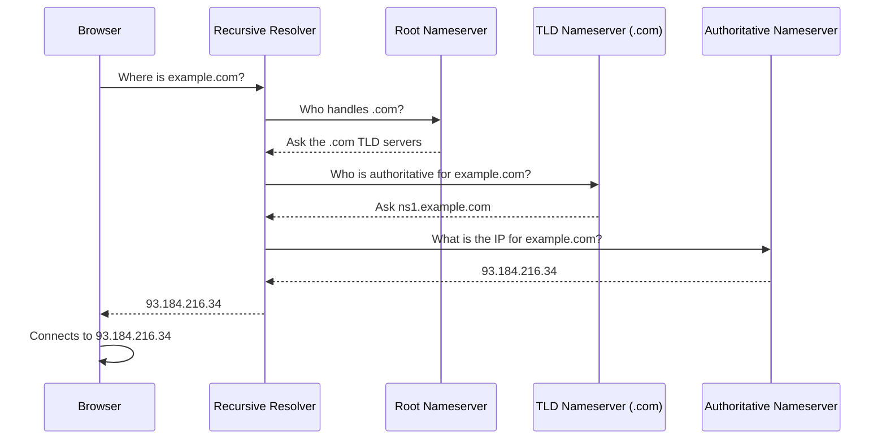
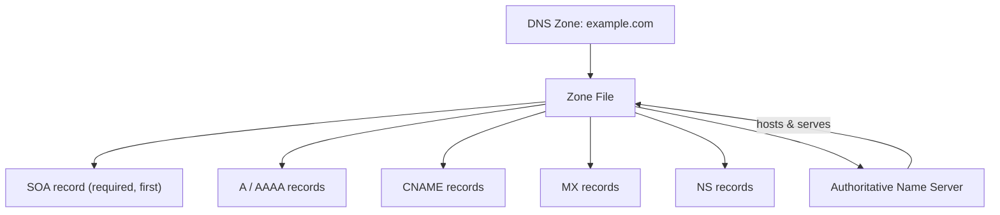
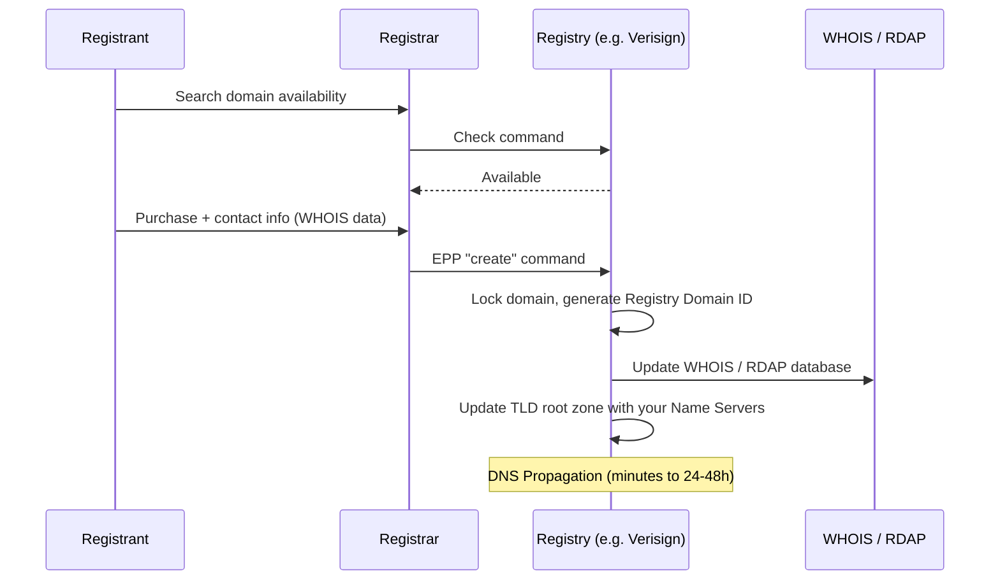
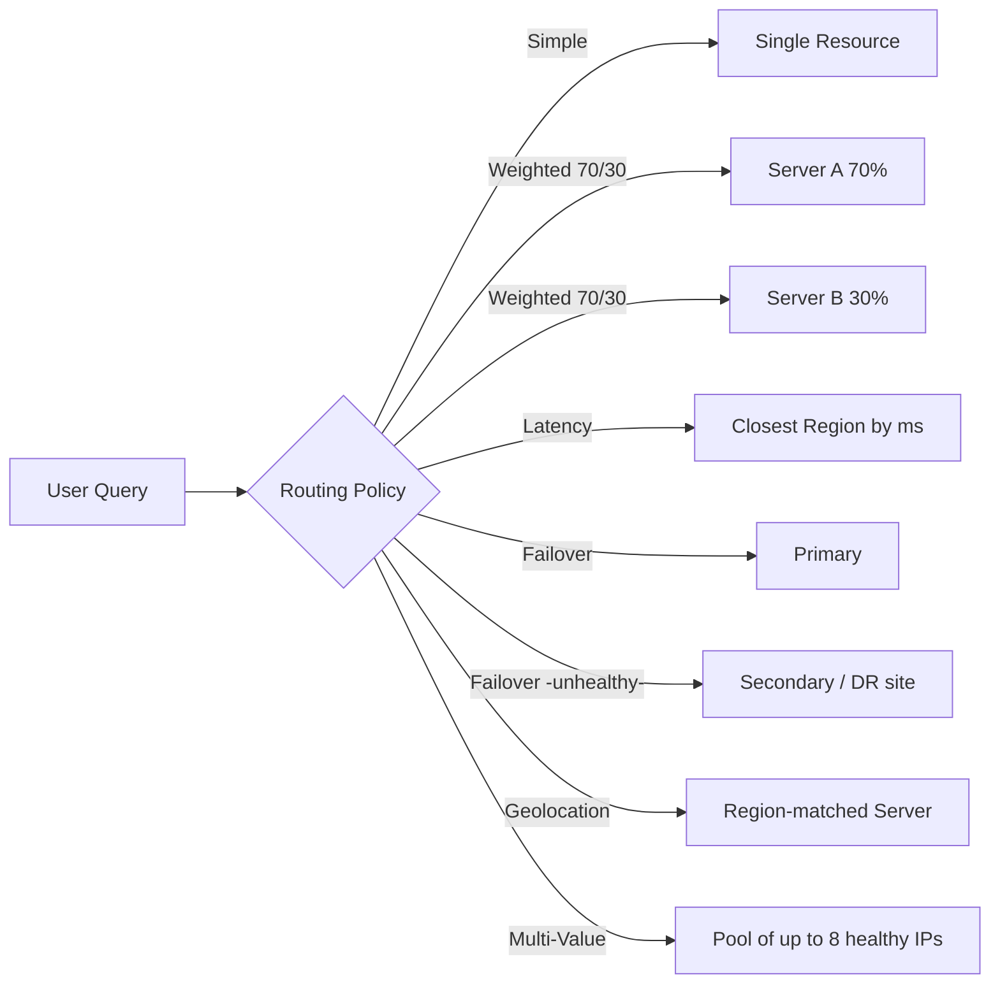
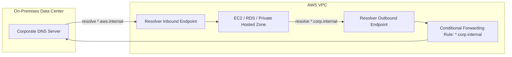
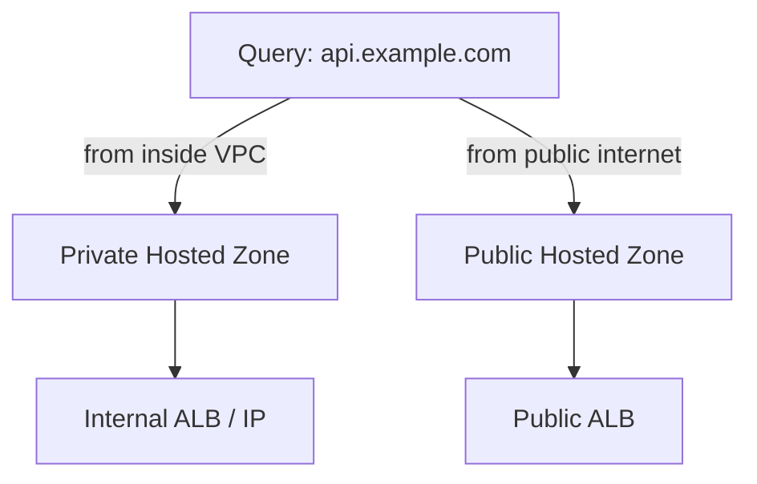

# 🌐 DNS & AWS Route 53 — End-to-End Practical Learning Guide

A complete, hands-on reference covering DNS fundamentals through advanced AWS Route 53
architecture — built for practical learning and portfolio demonstration.

> 📁 **This repo contains 4 files:**
> - **`README.md`** — Concepts, theory, and diagrams (this file)
> - **[`hands-on-labs.md`](./hands-on-labs.md)** — Step-by-step labs you can actually build
> - **[`commands-cheatsheet.md`](./commands-cheatsheet.md)** — AWS CLI, Terraform & CLI diagnostic commands
> - **[`troubleshooting.md`](./troubleshooting.md)** — Common errors and how to fix them

---

## 📑 Table of Contents

**Part 1 — DNS Fundamentals**
1. [What is DNS?](#1-what-is-dns)
2. [How DNS Resolution Works](#2-how-dns-resolution-works)
3. [DNS Caching](#3-dns-caching)
4. [DNS Key Terms — Zone, Zone File, Name Server](#4-dns-key-terms)
5. [Domain Registration Flow](#5-domain-registration-flow)
6. [Domain Status Codes (EPP)](#6-domain-status-codes-epp)

**Part 2 — Amazon Route 53**
7. [What is Route 53?](#7-what-is-route-53)
8. [Hosted Zones](#8-hosted-zones)
9. [Record Types — A, AAAA, CNAME, Alias](#9-record-types)
10. [Routing Policies (all 7)](#10-routing-policies)
11. [High Availability — Anycast & 100% SLA](#11-high-availability--anycast--100-sla)

**Part 3 — Advanced Concepts**
12. [Route 53 Resolver — Hybrid DNS](#12-route-53-resolver--hybrid-dns)
13. [DNSSEC](#13-dnssec)
14. [Route 53 Resolver DNS Firewall](#14-route-53-resolver-dns-firewall)
15. [Split-Horizon DNS](#15-split-horizon-dns)
16. [Route 53 Traffic Flow](#16-route-53-traffic-flow)
17. [Health Checks & CloudWatch Integration](#17-health-checks--cloudwatch-integration)
18. [Extra Concepts Added](#18-extra-concepts-added-not-in-original-notes)

---

## Part 1 — DNS Fundamentals

### 1. What is DNS?

DNS (**Domain Name System**) is the "phonebook of the internet." Computers address each
other using numeric **IP addresses** (e.g. `142.250.190.46`), but humans remember **names**
(e.g. `google.com`). DNS is the distributed system that translates one into the other every
time you open a browser, send an email, or connect an app to a backend.

### 2. How DNS Resolution Works

A single domain lookup travels through up to four kinds of servers:

| Server | Role | Analogy |
|---|---|---|
| **Recursive Resolver** | Receives the query from your device and does all the legwork of tracking down the answer | A librarian who goes and finds the book for you |
| **Root Nameserver** | Doesn't know the IP, but knows which TLD server to ask next | The library's index by subject |
| **TLD Nameserver** (`.com`, `.org`, etc.) | Knows which authoritative server owns the specific domain | The shelf for one subject |
| **Authoritative Nameserver** | Holds the actual DNS records and returns the final IP | The actual book |

### 3. DNS Caching

To avoid repeating this full walk for every request, DNS answers are **cached** at multiple
layers — your OS, your router, and your ISP's resolver — each governed by the record's
**TTL (Time To Live)**. A low TTL means changes propagate faster but generates more queries;
a high TTL means better performance but slower propagation of changes.

### 4. DNS Key Terms

**DNS Zone**
An administrative portion of the DNS namespace, starting at a domain and optionally including
its subdomains, managed by one entity. A subdomain can be **delegated** into its own
independent zone.

**DNS Zone File**
The plain-text file (hosted on a nameserver) that holds the actual **Resource Records (RRs)**
for a zone — the real "database" of the zone.

**Name Server**
The server software/machine that answers DNS queries. Two types:
- **Authoritative Name Server** — holds the real zone file, gives the final answer.
- **Recursive Name Server (Resolver)** — has no records of its own; it's the middleman that
  hunts down the authoritative answer on your behalf.

**Common Resource Record Types**

| Record | Purpose |
|---|---|
| **SOA** | Start of Authority — *must* be the first record in every zone file; holds admin email, refresh interval, serial number |
| **A** | Hostname → IPv4 address |
| **AAAA** | Hostname → IPv6 address |
| **CNAME** | Alias of one hostname to another domain name (cannot be used at the zone apex/root) |
| **MX** | Directs email to the correct mail server, with a priority value |
| **NS** | Delegates a zone/subdomain to specific nameservers |
| **TXT** | Free-text records used for domain verification, SPF/DKIM email authentication, etc. |

### 5. Domain Registration Flow

Three parties are involved: the **Registrant** (you), the **Registrar** (e.g. GoDaddy,
Namecheap, Route 53), and the **Registry** (the org managing a TLD, e.g. Verisign for `.com`).

**WHOIS contact roles required by ICANN:**
- **Registrant** — legal owner of the domain
- **Administrative Contact** — handles business/legal decisions
- **Technical Contact** — manages DNS/server configuration
- **Billing Contact** — pays for renewals

> Most registrars offer free **WHOIS Privacy**, masking your personal details with their own
> corporate proxy information in the public WHOIS database.

During registration, default **Name Servers** are assigned (e.g. `ns1.registrar.com`) — this
is where your zone file physically lives, and it can be changed later to point at a
third-party DNS provider such as Route 53.

### 6. Domain Status Codes (EPP)

| Status | Meaning |
|---|---|
| `clientTransferProhibited` / `serverTransferProhibited` | Safety lock preventing unauthorized transfer to another registrar |
| `active` / `ok` | Domain is live and resolving correctly |
| `pendingDelete` | Expired, past all grace periods, about to be released to the public |
| `clientHold` / `serverHold` | Domain is suspended and will not resolve |
| `redemptionPeriod` | Deleted domain in a grace window before permanent release |

---

## Part 2 — Amazon Route 53

### 7. What is Route 53?

**Amazon Route 53** is AWS's highly available, scalable cloud DNS web service. The name
combines **Route 66** (the famous highway) with **port 53** — the standard port for DNS
traffic.

Route 53 bundles three capabilities into one service:

1. **Domain Registration** — search, buy, and manage domains directly in AWS.
2. **DNS Routing** — resolve names to AWS resources (EC2, ALB, S3, CloudFront) and external
   infrastructure.
3. **Health Checking** — monitor endpoints and automatically reroute traffic away from
   unhealthy resources.

### 8. Hosted Zones

A **Hosted Zone** is the container of routing configuration for a domain and its subdomains.

- **Public Hosted Zone** — routes traffic on the public internet.
- **Private Hosted Zone** — routes traffic only within one or more Amazon VPCs, invisible to
  the public internet.

Every new hosted zone automatically gets two default records:
- **NS record** — 4 assigned AWS name servers (must be copied to an external registrar if the
  domain isn't registered in Route 53).
- **SOA record** — zone administrative metadata.

### 9. Record Types

Standard record types (A, AAAA, CNAME, MX, TXT, NS, SOA) work as in any DNS system, plus one
AWS-proprietary type:

**Alias Record**
A "smart CNAME" that:
- **Can be used at the zone apex/root** (`example.com`), unlike a standard CNAME.
- Points directly at AWS resources (ALB, CloudFront, S3 website endpoint, another Route 53
  record) and **auto-updates** if the underlying resource's IP changes.
- Is queried **free of charge** by AWS.

| | CNAME | Alias |
|---|---|---|
| Usable at root domain? | ❌ No | ✅ Yes |
| Points to AWS resources natively? | Manually via hostname | ✅ Built-in dropdown |
| Auto-updates on resource IP change? | ❌ No | ✅ Yes |
| Query cost | Billed | ✅ Free |

### 10. Routing Policies

| Policy | Primary Metric | Health Checks? | Best For |
|---|---|---|---|
| **Simple** | None (single/random target) | ❌ No | Small, single-server setups |
| **Weighted** | Assigned % weight (0–255) | ✅ Yes | Blue/green deployments, canary testing |
| **Latency-based** | Lowest network latency region | ✅ Yes | Global apps optimizing load speed |
| **Failover** | Primary/secondary availability | ✅ Yes | Active-passive disaster recovery |
| **Geolocation** | User's physical location | ✅ Yes | Content localization, legal/geo compliance |
| **Geoproximity** | Distance + custom bias (-99 to +99) | ✅ Yes | Fine-grained regional capacity balancing |
| **Multi-Value Answer** | Random, health-filtered (up to 8) | ✅ Yes | Low-cost DNS-level load balancing |

- **Weighted**: weight `0` on all-but-one record stops traffic to those records; setting all
  records to `0` is treated as equal weighting.
- **Failover**: Route 53 health-checks the **primary**; on failure, all traffic flips to the
  **secondary** automatically.
- **Geoproximity** requires the visual **Traffic Flow** tool (see §16).

### 11. High Availability — Anycast & 100% SLA

AWS backs Route 53 with a **100% availability SLA**, achieved through:

- **Anycast networking** — no single data center; requests are automatically routed to the
  nearest healthy global edge location. If one location fails, traffic instantly reroutes.
- **Physical isolation** — each hosted zone is assigned 4 authoritative name servers spread
  across different TLDs (e.g. `.com`, `.net`, `.org`, `.co.uk`) on physically separate
  infrastructure, eliminating single points of failure.

---

## Part 3 — Advanced Route 53 Concepts

### 12. Route 53 Resolver — Hybrid DNS

Historically called the ".2 Resolver" / `AmazonProvidedDNS`, this component resolves DNS
natively inside your VPC and bridges DNS resolution between AWS and an on-premises network
(connected via Direct Connect or VPN).

- **Inbound Endpoints** — let your on-prem DNS servers forward queries *into* AWS (e.g. to
  resolve a private hosted zone or an RDS endpoint).
- **Outbound Endpoints + Conditional Forwarding Rules** — let AWS resources forward queries
  *out* to your corporate DNS. Example rule: *"If a query matches `*.corp.internal`, forward
  it to the on-prem DNS server IPs."*

### 13. DNSSEC

**DNSSEC (DNS Security Extensions)** adds cryptographic signatures to DNS records at both the
domain-registration and hosted-zone level. It protects against **cache poisoning** and
**man-in-the-middle attacks** by letting resolvers verify that a response genuinely came from
the authoritative source and wasn't tampered with in transit.

### 14. Route 53 Resolver DNS Firewall

Gives granular control over **outbound** DNS queries leaving your VPC. You create domain
**allow-lists** or **block-lists** (e.g. blocking known malware C2 domains or crypto-mining
pools), filtering malicious traffic at the DNS layer before a connection is ever made.

### 15. Split-Horizon DNS

The same domain name resolves differently depending on where the query originates:

- **Internal traffic**: an EC2 instance inside your VPC queries `api.example.com` → resolves
  via a **Private Hosted Zone** to an internal, secure IP.
- **External traffic**: a public internet user queries the same `api.example.com` → resolves
  via a **Public Hosted Zone** to a public-facing Application Load Balancer.

### 16. Route 53 Traffic Flow

A visual, drag-and-drop policy editor for building complex, multi-tier routing logic that
would be unmanageable as flat record lists — e.g. chaining **Geolocation → Latency →
Failover** into one decision tree. The result is saved as a versioned **Traffic Policy**.

### 17. Health Checks & CloudWatch Integration

Route 53 health checks go beyond a simple ping:

- **String Matching** — checks not just for an HTTP 200, but that a specific string (e.g.
  `"Database Connected"`) appears in the response body.
- **Calculated (Aggregate) Health Checks** — a parent check can monitor up to 256 child
  checks, with rules like *"mark the whole cluster unhealthy if 3 of 5 frontends fail."*
- **CloudWatch Alarm Integration** — health check status can drive CloudWatch Alarms → SNS
  notifications → automated rollback pipelines.

### 18. Extra Concepts Added (not in original notes)

To make this a genuinely complete reference, a few production-relevant topics have been added:

- **Domain Transfers** — moving a domain between registrars requires unlocking it
  (`clientTransferProhibited` removed), obtaining an **Auth/EPP code** from the losing
  registrar, and approving the transfer at the gaining registrar; the process typically takes
  5–7 days.
- **Infrastructure as Code (IaC)** — hosted zones, records, and health checks can be fully
  managed via **Terraform** (`aws_route53_zone`, `aws_route53_record`) or **CloudFormation**
  (`AWS::Route53::RecordSet`) instead of the console — see `commands-cheatsheet.md`.
- **Route 53 Application Recovery Controller (ARC)** — a higher-tier disaster-recovery
  service built on top of Route 53 that adds readiness checks and manual/automated routing
  controls for multi-region failover, for teams needing more control than simple Failover
  routing.
- **Quotas & Pricing basics** — hosted zones, records, and health checks are billed monthly;
  Alias queries to AWS resources are free; default account quotas include 500 hosted zones
  and 10,000 records per zone (both raisable via a service quota increase request).
- **CloudFront + Route 53** — CloudFront distributions are commonly fronted by a Route 53
  Alias record at the zone apex, combining global caching (CDN) with DNS routing.

---

## Where to Go Next

- 🧪 Build it yourself → **[`hands-on-labs.md`](./hands-on-labs.md)**
- ⌨️ Copy-paste commands → **[`commands-cheatsheet.md`](./commands-cheatsheet.md)**
- 🩹 Something broken? → **[`troubleshooting.md`](./troubleshooting.md)**
