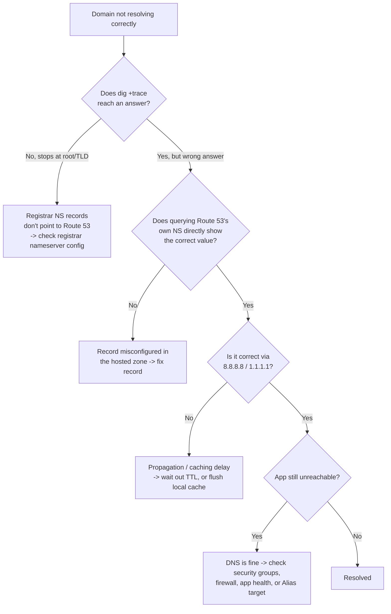

# 🩹 Troubleshooting — DNS & Route 53

A field guide to the errors you'll actually hit while working through the labs, organized by
symptom.

---

## 📑 Contents
- [Diagnostic Toolkit](#diagnostic-toolkit)
- [Troubleshooting Flowchart](#troubleshooting-flowchart)
- [General DNS Errors](#general-dns-errors)
- [Route 53 Console / API Errors](#route-53-console--api-errors)
- [Record & Routing Issues](#record--routing-issues)
- [Private Hosted Zone Issues](#private-hosted-zone-issues)
- [Health Check Issues](#health-check-issues)
- [DNSSEC Issues](#dnssec-issues)
- [Propagation & Caching Issues](#propagation--caching-issues)

---

## Diagnostic Toolkit

Run these first, in this order, before anything else:

```bash
# 1. What does Route 53 itself say the record is?
aws route53 list-resource-record-sets --hosted-zone-id YOUR_ZONE_ID

# 2. What do YOUR name servers say directly (bypasses caching)?
dig yourname.com A @ns-123.awsdns-45.com +short

# 3. What does the public internet see right now?
dig yourname.com A @8.8.8.8 +short
dig yourname.com A @1.1.1.1 +short

# 4. Full resolution path — shows exactly where it breaks
dig +trace yourname.com

# 5. Registrar-level check — are the right NS records delegated?
dig yourname.com NS +short
whois yourname.com | grep -i "name server"
```

If step 2 is correct but step 3 is wrong → it's a **propagation/caching** issue.
If step 2 is already wrong → the problem is in your **hosted zone configuration**.
If step 5 doesn't list Route 53's 4 name servers → the problem is at the **registrar**, not
in Route 53 at all.

---

## Troubleshooting Flowchart



---

## General DNS Errors

### `NXDOMAIN`
The domain/record genuinely doesn't exist from the resolver's point of view.
- Check for typos in the queried name.
- Confirm the record actually exists: `aws route53 list-resource-record-sets ...`.
- If you just created the record, this can be a brief caching artifact — wait for the TTL to
  expire and retry.

### `SERVFAIL`
The authoritative server failed to give a valid answer — often a **DNSSEC validation
failure** or a broken delegation chain.
- Run `dig +trace` to see exactly where the chain breaks.
- If DNSSEC is enabled, verify the **DS record** at the registrar matches the **KSK** in
  Route 53 (see [DNSSEC Issues](#dnssec-issues)).

### `dig` returns nothing at all
- Confirm you're querying the right record **type** (`A` vs `CNAME` vs `MX` vs `AAAA`).
- Confirm you have connectivity to the resolver you specified (`@8.8.8.8` etc.).

---

## Route 53 Console / API Errors

### `InvalidChangeBatch`
The most common error when submitting a record change. Usual causes:
- Trying to create a record that **already exists** — use `UPSERT` instead of `CREATE`.
- Mixing a plain value and an `AliasTarget` in the same record.
- TTL specified on an Alias record (Alias records don't use TTL — the underlying AWS
  resource's TTL applies instead; remove the `TTL` field entirely for Alias records).

### `PriorRequestNotComplete`
You submitted a change while a previous change to the same hosted zone was still processing.
Wait a few seconds and retry — Route 53 processes one change batch per zone at a time.

### Cannot delete a hosted zone
Route 53 blocks deletion of a hosted zone that still has records **other than** the default
`NS` and `SOA`. Delete all custom records first, then delete the zone.

### `AccessDenied` on `route53domains` or `route53resolver` calls
These are **separate IAM action namespaces** from plain `route53:*`. Confirm your IAM policy
explicitly includes `route53domains:*` and/or `route53resolver:*` actions as needed.

---

## Record & Routing Issues

### CNAME "cannot be created" at the root domain
This is by design — CNAME records are not allowed at the **zone apex** (`yourname.com` with
no subdomain) because the DNS spec requires the apex to also carry `SOA`/`NS` records, which
can't coexist with a CNAME. **Use an Alias record instead** — it's built exactly for this
case and works at the root.

### S3 Alias record shows "bucket not found" in the console dropdown
- The bucket name must be an **exact match** to the full subdomain (`web.yourname.com`, not
  `my-web-bucket`).
- The bucket must be in the **same region** you selected in the Alias wizard.
- Static website hosting must be enabled on the bucket (not just public read access).

### Weighted/Multi-Value record traffic split looks wrong
- A low TTL can make small sample sizes look skewed — query more times before concluding
  something's broken.
- Confirm each record has a distinct **Set Identifier** — records sharing a name but missing
  a Set ID will conflict.
- If a weighted record's health check is failing, Route 53 silently stops sending it traffic
  — check health check status, not just the weight configuration.

### Failover never triggers even though the primary is down
- Confirm the health check is actually **attached to the primary record**, not just created
  standalone.
- Check the health check's own status first — `aws route53 get-health-check-status`. A
  misconfigured check (wrong port/path) can be "healthy" even when your app is actually down,
  or vice versa.
- Remember the propagation delay: `FailureThreshold × RequestInterval` seconds must elapse
  before failover triggers (e.g. 3 × 30s = 90s minimum).

---

## Private Hosted Zone Issues

### Private hosted zone records don't resolve from inside the VPC
- The VPC must have both **`enableDnsSupport`** and **`enableDnsHostnames`** set to `true`.
- Confirm the instance is actually querying the VPC's default resolver
  (`.2` address, e.g. `10.0.0.2`) and not a custom `/etc/resolv.conf` override.
- Confirm the private hosted zone is **associated with that specific VPC** — zones aren't
  visible across VPCs unless explicitly associated with each one.

### Split-horizon setup returns the wrong answer for internal clients
- Make sure the domain name is **identical** in both the public and private zone — a typo or
  trailing-dot mismatch will silently create two unrelated zones instead of one split-horizon
  pair.
- Private zones take priority for resources launched with the VPC's default resolver — if an
  internal client still gets the public answer, it's likely bypassing the VPC resolver
  entirely (e.g. hardcoded to `8.8.8.8`).

---

## Health Check Issues

### Health check shows "Unhealthy" but the app works fine in a browser
- **Security group / NIC firewall blocking Route 53's health checker IP ranges** is the #1
  cause — Route 53 checks originate from a published set of AWS IP ranges that must be
  allow-listed inbound on the health check port.
- Confirm the health check's **path** actually returns a `2xx`/`3xx` status — a redirect to
  HTTPS on an HTTP-only health check will read as unhealthy.
- If using **String Matching**, confirm the exact string appears in the **first 5,120 bytes**
  of the response body — Route 53 does not scan the full page.

### Calculated health check status seems inconsistent
- Double check the `HealthThreshold` value — it's the **minimum number of healthy children**
  required for the parent to report healthy, not a percentage.

---

## DNSSEC Issues

### Domain fails to resolve entirely after enabling DNSSEC
This is almost always a **mismatched or missing DS record** at the registrar.
- Re-fetch the DS record values from the Route 53 console/API after creating your KSK.
- Confirm the registrar (if external) has the **exact same** DS record published.
- If in doubt, temporarily disable DNSSEC at the registrar (remove the DS record) to restore
  resolution, then re-verify the KSK/DS pairing before re-enabling.

### `get-dnssec` shows the KSK stuck in `ACTION_NEEDED`
This usually means the DS record hasn't been detected at the parent zone yet — this is
expected immediately after creation and should clear once the DS record is published and
propagated.

---

## Propagation & Caching Issues

### Changed a record but still see the old value
- Check the record's **TTL** — a browser, OS, or ISP resolver will keep serving the cached
  answer until the TTL expires, regardless of what Route 53 now says.
- Flush your local DNS cache:
  - macOS: `sudo dscacheutil -flushcache; sudo killall -HUP mDNSResponder`
  - Windows: `ipconfig /flushdns`
  - Linux (systemd-resolved): `sudo resolvectl flush-caches`
- Query Route 53's own name servers directly (bypasses all caching layers) to confirm the
  zone itself is already correct — see [Diagnostic Toolkit](#diagnostic-toolkit).

### Just changed the domain's NS delegation and nothing resolves yet
This is expected — NS-level delegation changes (as opposed to record changes within an
already-delegated zone) can take **24–48 hours** to propagate globally, since resolvers
worldwide cache the parent TLD's answer about which name servers to use. Use
[dnschecker.org](https://dnschecker.org) to watch propagation progress in near-real-time
across regions.

---

> 📝 Still stuck? Cross-reference the concept in [`README.md`](./README.md) and re-run the
> matching lab in [`hands-on-labs.md`](./hands-on-labs.md) from a clean state — most issues
> trace back to a skipped prerequisite (Elastic IP not attached, VPC DNS settings off, bucket
> name mismatch, etc.).
>
> 💡 Tip: always test record changes in a non-production hosted zone or throwaway domain
> before applying them to anything live, since misconfigured DNS can take a site offline.
