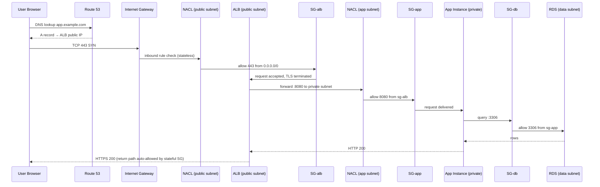
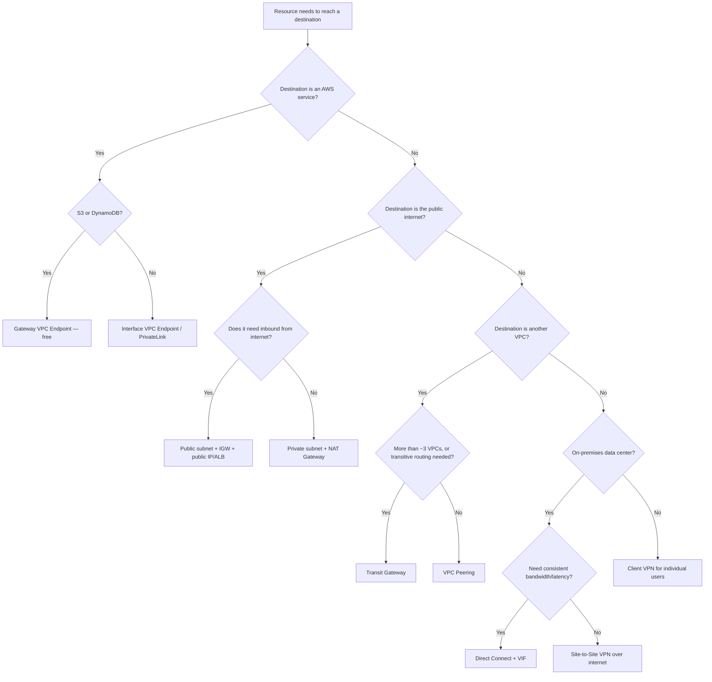

# AWS VPC — The Complete Practical Handbook

> A from-zero-to-production guide to Amazon Virtual Private Cloud.
> Written the way you'd want a senior engineer to explain it to you: plain language first, then the deep technical truth, then the commands you actually type.

[](https://aws.amazon.com/vpc/)
[]()
[]()

---

## Table of Contents

1. [What This Repository Is](#1-what-this-repository-is)
2. [Prerequisites](#2-prerequisites)
3. [The Mental Model — What a VPC Actually Is](#3-the-mental-model--what-a-vpc-actually-is)
4. [High-Level Architecture & Service Flow](#4-high-level-architecture--service-flow)
5. [Core Building Blocks — Deep Dive](#5-core-building-blocks--deep-dive)
6. [Packet Walkthroughs — Follow the Bytes](#6-packet-walkthroughs--follow-the-bytes)
7. [Connectivity Options — Joining VPCs and Data Centers](#7-connectivity-options--joining-vpcs-and-data-centers)
8. [Observability, Security & Governance](#8-observability-security--governance)
9. [Step-by-Step Configuration & Implementation Guide](#9-step-by-step-configuration--implementation-guide)
10. [Reference Architectures — Where to Use What](#10-reference-architectures--where-to-use-what)
11. [Design Rules, Quotas & Limits](#11-design-rules-quotas--limits)
12. [Cost Model — What Actually Costs Money](#12-cost-model--what-actually-costs-money)
13. [Best Practices Checklist](#13-best-practices-checklist)
14. [Interview & Concept Q&A](#14-interview--concept-qa)
15. [Glossary](#15-glossary)
16. [Repository Map & Next Steps](#16-repository-map--next-steps)

---

## 1. What This Repository Is

This is a **complete, practical learning path for AWS VPC** — the networking layer that every other AWS service quietly sits on top of. EC2, RDS, EKS, Lambda-in-a-VPC, Redshift, ElastiCache: all of them are just tenants inside a network *you* designed.

Most people learn VPC by clicking "Create VPC" in the console, getting something that works, and never understanding why. Then one day a subnet can't reach the internet, or a database is unexpectedly public, or two teams pick the same CIDR and peering becomes impossible — and there's no mental model to fall back on.

This handbook fixes that.

### Repository structure

| File | What it gives you |
|---|---|
| **README.md** (this file) | Theory, architecture, diagrams, every core concept explained, and a guided configuration walkthrough |
| **commands-cheatsheet.md** | Every AWS CLI command you'll realistically need, grouped by resource, copy-paste ready |
| **hands-on-labs.md** | 12 labs that build a real multi-tier VPC from an empty account to a hardened production-shaped network |
| **troubleshooting.md** | Symptom → root cause → fix, plus verbatim error messages and what they really mean |

### How to use it

- **Complete beginner?** Read sections 1–6 here, then do Labs 1–4.
- **Studying for SAA / SysOps / DevOps Pro?** Read the whole README, then sections 7–8, then Labs 5–10, then section 14.
- **Debugging something right now?** Go straight to `troubleshooting.md`.
- **Need a command?** `commands-cheatsheet.md`.

---

## 2. Prerequisites

### Knowledge you should have (or pick up as you go)

| Topic | Why it matters | Minimum you need |
|---|---|---|
| **IP addressing & CIDR** | Every subnet decision is a CIDR decision | Know that `/24` = 256 addresses, `/16` = 65,536 |
| **Subnetting** | You'll split a VPC CIDR into subnets by hand | Be able to split `10.0.0.0/16` into `/20`s |
| **Routing basics** | Route tables are literally routing tables | Understand "longest prefix match" |
| **TCP/IP & ports** | Security groups are port rules | Know 22=SSH, 80=HTTP, 443=HTTPS, 3306=MySQL |
| **Stateful vs stateless firewalls** | SG vs NACL is exactly this distinction | Know what "connection tracking" means |
| **DNS** | Private DNS, endpoints, and Route 53 Resolver all hinge on it | A/AAAA/CNAME records, resolvers |
| **Linux CLI** | Labs use `ssh`, `curl`, `dig`, `traceroute` | Comfortable in a terminal |

> **Don't know CIDR yet?** Section 5.1 teaches it from scratch. Start there.

### Tooling

```bash
# 1. AWS CLI v2 — install
curl "https://awscli.amazonaws.com/awscli-exe-linux-x86_64.zip" -o "awscliv2.zip"
unzip awscliv2.zip && sudo ./aws/install
aws --version          # expect: aws-cli/2.x.x

# 2. Configure credentials
aws configure
#   AWS Access Key ID     : ...
#   AWS Secret Access Key : ...
#   Default region name   : us-east-1
#   Default output format : json

# 3. Verify you're who you think you are
aws sts get-caller-identity

# 4. Optional but recommended
#    jq          -> parse JSON output
#    Session Manager plugin -> SSH-less access to instances
sudo yum install -y jq        # or: sudo apt install -y jq
```

### AWS account requirements

- An AWS account (Free Tier is fine for most labs — NAT Gateway and VPN are **not** free, see §12).
- An IAM user or role with, at minimum:
  - `AmazonVPCFullAccess`
  - `AmazonEC2FullAccess` (to launch test instances)
  - `CloudWatchLogsFullAccess` + `iam:PassRole` (for Flow Logs)
- **Never use the root account** for daily work.
- A billing alarm set to a number that would upset you. Do it now.

---

## 3. The Mental Model — What a VPC Actually Is

### The one-sentence answer

> **A VPC is your own private, software-defined data center network inside AWS — you choose the IP range, carve it into subnets, decide what routes where, and control every packet in and out.**

### The analogy that actually sticks

Think of an **office building you've leased inside a giant business park**:

| Real world | AWS VPC |
|---|---|
| The business park | An AWS **Region** |
| Separate buildings with independent power | **Availability Zones** |
| Your leased floor, with your own locked door | Your **VPC** |
| The street address range assigned to your floor | The **VPC CIDR block** |
| Rooms on that floor | **Subnets** |
| The hallway signs telling you which door leads outside | **Route tables** |
| The main lobby door to the public street | **Internet Gateway** |
| The mailroom that sends letters out but won't accept unsolicited visitors | **NAT Gateway** |
| A guard at each *office door* checking each person | **Security Group** (instance level, stateful) |
| A guard at the *room entrance* checking everyone in and out | **Network ACL** (subnet level, stateless) |
| A private service corridor to a partner company, no street exposure | **VPC Endpoint / PrivateLink** |
| A tunnel to your other building | **VPC Peering / Transit Gateway** |
| The building's CCTV log | **VPC Flow Logs** |

### Three truths people learn the hard way

1. **A VPC is regional, subnets are zonal.** Your VPC spans every AZ in the region automatically. A subnet lives in exactly one AZ and cannot be moved.
2. **"Public subnet" is not a setting.** A subnet is public *only* because its route table has a `0.0.0.0/0 → igw-xxxx` route. There's no checkbox called "public".
3. **Everything is default-deny at the edge, default-allow inside.** Instances in the same VPC can reach each other *if security groups allow it*; nothing from the internet gets in unless you explicitly built a path.

### Why VPC exists at all

Before VPC (the "EC2-Classic" era), all AWS customers shared one flat network. Your instance sat next to a stranger's instance. VPC introduced:

- **Isolation** — your address space is yours; overlapping CIDRs between accounts is fine because they never touch.
- **Control** — you define routing, not AWS.
- **Hybrid connectivity** — you can extend your on-prem network into AWS with matching, non-conflicting IP plans.
- **Compliance** — auditors want network segmentation; VPC gives you a provable boundary.

---

## 4. High-Level Architecture & Service Flow

### 4.1 The canonical 3-tier VPC

```
                                  ┌──────────────────────────────────┐
                                  │           I N T E R N E T        │
                                  └───────────────┬──────────────────┘
                                                  │
                                       ┌──────────▼──────────┐
                                       │  Internet Gateway   │  (igw-)
                                       └──────────┬──────────┘
╔═════════════════════════════════════════════════╪═══════════════════════════════════════════╗
║  VPC  10.0.0.0/16   (Region: us-east-1)         │                                           ║
║                                                 │                                           ║
║   ┌──────────────── AZ us-east-1a ──────────────┼───────┐  ┌─────────── AZ us-east-1b ────┐ ║
║   │                                             │       │  │                              │ ║
║   │  PUBLIC SUBNET 10.0.0.0/20  ────────────────┘       │  │  PUBLIC SUBNET 10.0.16.0/20  │ ║
║   │  ┌──────────┐   ┌────────────┐                      │  │  ┌──────────┐  ┌───────────┐ │ ║
║   │  │ ALB node │   │NAT Gateway │◄── EIP               │  │  │ ALB node │  │NAT GW (HA)│ │ ║
║   │  └────┬─────┘   └─────▲──────┘                      │  │  └────┬─────┘  └─────▲─────┘ │ ║
║   │       │               │                             │  │       │              │       │ ║
║   ├───────┼───────────────┼─────────────────────────────┤  ├───────┼──────────────┼───────┤ ║
║   │       ▼               │                             │  │       ▼              │       │ ║
║   │  PRIVATE APP SUBNET 10.0.32.0/20                    │  │  PRIVATE APP 10.0.48.0/20    │ ║
║   │  ┌────────────┐  ┌────────────┐                     │  │  ┌────────────┐              │ ║
║   │  │ EC2 / ECS  │──┤ egress via ├─────────────────────┘  │  │ EC2 / ECS  │──────────────┘ ║
║   │  └─────┬──────┘  │  NAT GW    │                        │  └─────┬──────┘                │ ║
║   │        │         └────────────┘                        │        │                       │ ║
║   ├────────┼───────────────────────────────────────────────┤  ──────┼───────────────────────┤ ║
║   │        ▼                                               │        ▼                       │ ║
║   │  PRIVATE DATA SUBNET 10.0.64.0/20                      │  PRIVATE DATA 10.0.80.0/20     │ ║
║   │  ┌────────────┐                                        │  ┌────────────┐                │ ║
║   │  │ RDS primary│◄───────── synchronous replication ────►│  │RDS standby │                │ ║
║   │  └────────────┘   (no route to 0.0.0.0/0 at all)       │  └────────────┘                │ ║
║   └────────────────────────────────────────────────────────┘  └─────────────────────────────┘ ║
║                                                                                               ║
║   ┌───────────────────────── VPC ENDPOINTS (no internet needed) ─────────────────────────┐    ║
║   │  Gateway EP → S3, DynamoDB      │   Interface EP → SSM, ECR, Secrets Manager, KMS   │    ║
║   └───────────────────────────────────────────────────────────────────────────────────────┘    ║
╚═══════════════════════════════════════════════════════════════════════════════════════════════╝
```

### 4.2 Service flow — an inbound HTTPS request, end to end



### 4.3 Service flow — outbound patching from a private instance

```
EC2 (10.0.32.15)  ──►  Route table: 0.0.0.0/0 → nat-0abc
                  ──►  NAT Gateway (10.0.0.50, EIP 54.x.x.x)
                            │  source NAT: 10.0.32.15 → 54.x.x.x
                  ──►  Route table (public): 0.0.0.0/0 → igw-0def
                  ──►  Internet Gateway   (1:1 NAT to public IP)
                  ──►  amazonlinux.repo   (returns packets to 54.x.x.x)
                  ◄──  NAT GW reverses translation → 10.0.32.15
```

The instance has **no public IP**, can reach the internet, and the internet **cannot** initiate a connection to it. That asymmetry is the whole point of a NAT Gateway.

### 4.4 Decision flow — "how should this thing reach that thing?"



---

## 5. Core Building Blocks — Deep Dive

### 5.1 CIDR — the foundation everything else stands on

**What it is.** CIDR (Classless Inter-Domain Routing) notation writes an IP range as `network address / prefix length`. The prefix length says how many leading bits are fixed.

```
10.0.0.0/16
└──┬───┘ └┬┘
   │      └── 16 bits fixed → 32-16 = 16 host bits → 2^16 = 65,536 addresses
   └───────── network portion: anything starting 10.0.x.x
```

**The quick math table.**

| CIDR | Total IPs | AWS usable IPs | Typical use |
|---|---|---|---|
| /16 | 65,536 | 65,531 | Whole VPC (largest allowed) |
| /18 | 16,384 | 16,379 | Large tier |
| /20 | 4,096 | 4,091 | Comfortable subnet |
| /22 | 1,024 | 1,019 | Standard app subnet |
| /24 | 256 | 251 | Small subnet |
| /26 | 64 | 59 | Endpoint / TGW attachment subnet |
| /28 | 16 | 11 | Smallest AWS subnet allowed |

**AWS reserves 5 IPs in every subnet.** For `10.0.1.0/24`:

| Address | Reserved for |
|---|---|
| `10.0.1.0` | Network address |
| `10.0.1.1` | VPC implied router |
| `10.0.1.2` | Amazon-provided DNS (`.2` of the *VPC* CIDR base, mapped per subnet) |
| `10.0.1.3` | Reserved for future use |
| `10.0.1.255` | Network broadcast (AWS doesn't support broadcast, but reserves it anyway) |

> **Gotcha:** this is why a `/28` gives you 11 usable IPs, not 16. Never size a subnet at exactly the number of instances you plan to run.

**VPC CIDR rules:**

- Allowed size: **/16 (max) to /28 (min)**.
- Should come from RFC 1918 private space: `10.0.0.0/8`, `172.16.0.0/12`, `192.168.0.0/16`. Public ranges are technically allowed but you then can't reach the real internet hosts in that range.
- The primary CIDR **cannot be changed or removed** after creation. You *can* add up to 4 secondary CIDRs (5 total by default, quota-increasable to 50).
- CIDRs must not overlap with anything you'll ever peer with. **Plan this at the organization level, not per project.**

**A sane enterprise IP plan:**

```
10.0.0.0/8  — the whole company
├── 10.0.0.0/12   us-east-1
│   ├── 10.0.0.0/16    prod
│   │   ├── 10.0.0.0/20    public-1a       (4,096)
│   │   ├── 10.0.16.0/20   public-1b
│   │   ├── 10.0.32.0/20   app-1a
│   │   ├── 10.0.48.0/20   app-1b
│   │   ├── 10.0.64.0/20   data-1a
│   │   ├── 10.0.80.0/20   data-1b
│   │   └── 10.0.96.0/19   RESERVED for growth  ← always do this
│   ├── 10.1.0.0/16    staging
│   └── 10.2.0.0/16    dev
├── 10.16.0.0/12  eu-west-1
└── 10.32.0.0/12  ap-south-1
```

Rules of thumb:
- Leave **at least 30–40 %** of the VPC CIDR unallocated.
- Same-purpose subnets across AZs should be **the same size** — it makes automation trivial.
- Write the plan down in a shared document (or better, use **AWS IPAM**, §5.19) before anyone creates a VPC.

---

### 5.2 The VPC itself

**What.** A logically isolated virtual network in one AWS Region, defined by one or more CIDR blocks.

**Key properties:**

| Property | Detail |
|---|---|
| Scope | **Regional** — spans all AZs in the region |
| Identifier | `vpc-0a1b2c3d4e5f` |
| Tenancy | `default` (shared hardware) or `dedicated` (your own hardware, expensive, rarely needed) |
| DNS support | `enableDnsSupport` — makes the `.2` resolver work. Default **on**. |
| DNS hostnames | `enableDnsHostnames` — gives instances DNS names. Default **on** for default VPC, **off** for custom VPCs |
| Default limit | 5 VPCs per region (soft, raise via quotas) |

**Default VPC vs Custom VPC:**

| | Default VPC | Custom VPC |
|---|---|---|
| CIDR | `172.31.0.0/16` (fixed) | You choose |
| Subnets | One `/20` public subnet per AZ, pre-created | None until you create them |
| IGW | Attached | Not attached |
| Route to internet | Already there | You add it |
| Auto-assign public IP | **On** | **Off** |
| Use it for | Quick tests, tutorials | **Everything real** |

> **Production rule:** never build production in the default VPC. Its subnets are all public, and someone will eventually launch a database there.

**Creating one:**

```bash
aws ec2 create-vpc \
  --cidr-block 10.0.0.0/16 \
  --tag-specifications 'ResourceType=vpc,Tags=[{Key=Name,Value=prod-vpc},{Key=Env,Value=prod}]'

aws ec2 modify-vpc-attribute --vpc-id vpc-0abc --enable-dns-hostnames '{"Value":true}'
```

---

### 5.3 Subnets

**What.** A slice of the VPC CIDR, bound to exactly **one Availability Zone**.

**The three types (by behaviour, not by AWS setting):**

| Type | Route table has | Contains | Public IPs? |
|---|---|---|---|
| **Public** | `0.0.0.0/0 → igw-xxx` | ALB/NLB, NAT GW, bastion, public web tier | Yes (or Elastic IP) |
| **Private (with egress)** | `0.0.0.0/0 → nat-xxx` | App servers, ECS/EKS nodes, Lambda ENIs | No |
| **Isolated / Private (no egress)** | No default route at all | RDS, ElastiCache, Redshift, sensitive workloads | No |

**Critical facts:**

- A subnet **cannot span AZs**. Multi-AZ = multiple subnets.
- Subnet CIDR **cannot be changed** after creation. Delete and recreate.
- A subnet is associated with **exactly one route table** (but a route table can serve many subnets).
- If you don't explicitly associate a route table, the subnet uses the **VPC main route table** — a very common source of accidental exposure or accidental isolation.
- `MapPublicIpOnLaunch` controls auto-assignment of a public IPv4 to instances launched there. Off by default in custom VPCs.

```bash
aws ec2 create-subnet --vpc-id vpc-0abc \
  --cidr-block 10.0.0.0/20 --availability-zone us-east-1a \
  --tag-specifications 'ResourceType=subnet,Tags=[{Key=Name,Value=public-1a},{Key=Tier,Value=public}]'

aws ec2 modify-subnet-attribute --subnet-id subnet-0aaa --map-public-ip-on-launch
```

> **Use AZ IDs, not AZ names, for multi-account work.** `us-east-1a` in Account A may be different physical hardware from `us-east-1a` in Account B. AZ *IDs* (`use1-az1`) are consistent across accounts. Check with `aws ec2 describe-availability-zones`.

---

### 5.4 Route tables

**What.** A set of rules mapping destination CIDRs to targets. Every subnet has one. Every VPC has a **main** route table created automatically.

**The one entry you can't delete:**

```
Destination     Target    Status
10.0.0.0/16     local     active     ← the "local" route: intra-VPC communication
```

This route is why every subnet in a VPC can reach every other subnet **at the routing layer** (security groups still decide whether the packet is accepted).

**Longest prefix match wins.** Given:

```
0.0.0.0/0        → igw-0abc
10.0.0.0/16      → local
10.1.0.0/16      → pcx-0def   (peering)
10.1.5.0/24      → tgw-0ghi   (transit gateway)
```

A packet to `10.1.5.20` uses the **/24 → TGW** route, because /24 is more specific than /16. A packet to `10.1.9.20` uses the /16 → peering route. A packet to `8.8.8.8` falls through to `0.0.0.0/0`.

**Valid targets:**

| Target | Prefix | Purpose |
|---|---|---|
| `local` | — | Within the VPC (implicit) |
| Internet Gateway | `igw-` | Public IPv4/IPv6 internet |
| Egress-only IGW | `eigw-` | IPv6 outbound-only |
| NAT Gateway | `nat-` | IPv4 outbound-only from private subnets |
| Network Interface | `eni-` | NAT instance, firewall appliance, custom router |
| VPC Peering | `pcx-` | Another VPC, 1:1 |
| Transit Gateway | `tgw-` | Hub for many VPCs/VPNs/DX |
| Virtual Private Gateway | `vgw-` | Site-to-Site VPN / Direct Connect |
| Gateway Load Balancer EP | `vpce-` | Inline inspection appliances |
| Gateway VPC Endpoint | `pl-` (prefix list) | S3, DynamoDB |
| Carrier Gateway | `cagw-` | Wavelength / 5G |
| Local Gateway | `lgw-` | Outposts |

**Route propagation.** When you enable propagation on a route table with a VGW or TGW attachment, learned BGP routes appear automatically instead of you adding them by hand. Static routes always beat propagated routes at equal specificity.

**Edge association (Gateway Route Tables).** You can attach a route table to the **IGW itself** to force inbound traffic through an appliance before it reaches subnets — the standard pattern for inline IDS/IPS.

```bash
aws ec2 create-route-table --vpc-id vpc-0abc
aws ec2 create-route --route-table-id rtb-0pub --destination-cidr-block 0.0.0.0/0 --gateway-id igw-0abc
aws ec2 associate-route-table --route-table-id rtb-0pub --subnet-id subnet-0aaa
```

---

### 5.5 Internet Gateway (IGW)

**What.** A horizontally-scaled, redundant, **highly available** VPC component that performs two jobs:

1. Provides a target in route tables for internet-routable traffic.
2. Performs **1:1 NAT** between an instance's private IPv4 and its public IPv4/Elastic IP.

**That second point surprises people.** Your EC2 instance never sees its own public IP — `ip addr` shows only the private one. The IGW rewrites the header on the way out and back.

**Requirements for an instance to actually reach the internet — all four must be true:**

1. ✅ IGW attached to the VPC
2. ✅ Subnet route table has `0.0.0.0/0 → igw-xxx`
3. ✅ Instance has a public IPv4 or Elastic IP
4. ✅ Security group (outbound) and NACL (both directions) allow the traffic

Miss any one and it silently fails. This checklist solves ~60 % of "my instance has no internet" tickets.

**Properties:** free, no bandwidth limit, no AZ (it's regional and redundant), **one IGW per VPC**.

```bash
aws ec2 create-internet-gateway
aws ec2 attach-internet-gateway --internet-gateway-id igw-0abc --vpc-id vpc-0abc
```

---

### 5.6 NAT Gateway & NAT Instance

**Why it exists.** Private instances need to download patches, call APIs, and pull container images — but must not be reachable from the internet. NAT gives **outbound-only** connectivity.

**How it works.** The NAT Gateway sits in a **public** subnet with an Elastic IP. Private subnets route `0.0.0.0/0` to it. It rewrites the source IP to its own EIP (source NAT / PAT), tracks the connection, and reverses the translation on the return packets.

**NAT Gateway vs NAT Instance:**

| | NAT Gateway | NAT Instance |
|---|---|---|
| Managed by | AWS | You |
| Availability | Highly available **within its AZ** | Single EC2 — you build HA |
| Bandwidth | 5 Gbps → auto-scales to 100 Gbps | Depends on instance type |
| Connections | 55,000 simultaneous per unique destination | Instance-dependent |
| Security Groups | **Cannot** be attached | Yes |
| Port forwarding / bastion | No | Yes |
| Source/dest check | N/A | **Must be disabled** |
| Cost | Hourly + per-GB (expensive) | EC2 cost only (cheaper at low volume) |
| Maintenance | None | Patching, monitoring, failover scripts |

**Verdict:** use NAT Gateway in production. Use NAT instance only for dev/lab cost saving or when you need SG control / port forwarding.

**HA pattern — this is the mistake people make:**

```
❌ WRONG: one NAT GW in us-east-1a, both private subnets route to it.
   → AZ 1a fails → 1b instances lose internet too, AND you paid
     cross-AZ data transfer for every byte before the failure.

✅ RIGHT: one NAT GW per AZ, each private subnet routes to the NAT GW
   in its OWN AZ. Costs more, but is actually available.
```

**Public vs Private NAT Gateway (2021+):** A *private* NAT Gateway has no EIP and no internet path; it translates addresses for traffic going to **on-premises or peered networks**, solving overlapping-CIDR problems in hybrid setups.

```bash
aws ec2 allocate-address --domain vpc
aws ec2 create-nat-gateway --subnet-id subnet-0pub-1a --allocation-id eipalloc-0abc \
  --tag-specifications 'ResourceType=natgateway,Tags=[{Key=Name,Value=nat-1a}]'
aws ec2 create-route --route-table-id rtb-0priv-1a --destination-cidr-block 0.0.0.0/0 --nat-gateway-id nat-0abc
```

---

### 5.7 Security Groups — the stateful, instance-level firewall

**What.** A virtual firewall attached to **ENIs** (so, effectively, to instances, RDS, ALBs, Lambda-in-VPC, endpoints).

**The rules of security groups:**

| Rule | Detail |
|---|---|
| **Allow only** | You cannot write a "deny" rule. Anything not allowed is denied. |
| **Stateful** | If you allow inbound 443, the response is automatically allowed out. And vice-versa. |
| **Default outbound** | A new SG allows **all outbound** traffic. |
| **Default inbound** | A new SG allows **nothing** inbound. |
| **Multiple SGs** | Up to 5 per ENI (raisable to 16). Rules are **unioned** — most permissive wins. |
| **Source can be another SG** | The killer feature. See below. |
| **Evaluation** | All rules are evaluated; there is no rule order or number. |
| **Scope** | VPC-level — an SG can only be attached to resources in its own VPC. |

**SG referencing — use it everywhere:**

```
sg-alb   : inbound 443 from 0.0.0.0/0
sg-app   : inbound 8080 from  sg-alb      ← not a CIDR, the security group itself
sg-db    : inbound 3306 from  sg-app
```

Now you can scale the app tier, change subnets, or re-IP everything, and the rules still work. Never hardcode instance IPs.

**Self-referencing SG** (`sg-cluster` allows all traffic from `sg-cluster`) is how you let cluster members talk to each other — used by EKS, Elasticsearch, Kafka.

**Anatomy of a rule:**

```
Type: Custom TCP | Protocol: TCP | Port range: 8080 | Source: sg-0abc | Description: "from ALB"
```

> **Always fill in the Description field.** Six months later, "why is 8080 open from that SG?" is answered instantly.

```bash
aws ec2 create-security-group --group-name sg-app --description "App tier" --vpc-id vpc-0abc

aws ec2 authorize-security-group-ingress --group-id sg-0app \
  --ip-permissions 'IpProtocol=tcp,FromPort=8080,ToPort=8080,UserIdGroupPairs=[{GroupId=sg-0alb,Description="from ALB"}]'
```

---

### 5.8 Network ACLs — the stateless, subnet-level firewall

**What.** An optional layer of defence operating at the **subnet boundary**.

| Property | Security Group | Network ACL |
|---|---|---|
| Level | ENI / instance | Subnet |
| Rules | Allow only | **Allow and Deny** |
| State | **Stateful** | **Stateless** |
| Evaluation | All rules | **Lowest rule number first, stop at first match** |
| Return traffic | Automatic | You must explicitly allow it |
| Applies to | Resources you attach it to | Everything in the subnet, no exceptions |
| Default (custom NACL) | — | Deny all in **and** out |
| Default (default NACL) | — | Allow all in and out |

**The ephemeral port trap.** Because NACLs are stateless, allowing inbound 443 is not enough — the server's *reply* leaves from port 443 to the client's **ephemeral port**. You must allow outbound `1024–65535`.

Ephemeral port ranges by client:
- Linux kernels: `32768–60999`
- Windows (modern): `49152–65535`
- NLB / Lambda: `1024–65535`
- **Safe blanket rule:** allow `1024–65535`.

**A working custom NACL for a public web subnet:**

| # | Type | Protocol | Port | Source/Dest | Allow/Deny |
|---|---|---|---|---|---|
| **Inbound** | | | | | |
| 100 | HTTPS | TCP | 443 | 0.0.0.0/0 | ALLOW |
| 110 | HTTP | TCP | 80 | 0.0.0.0/0 | ALLOW |
| 120 | SSH | TCP | 22 | 203.0.113.0/24 | ALLOW |
| 130 | Custom | TCP | 1024–65535 | 0.0.0.0/0 | ALLOW ← return traffic |
| 900 | Custom | TCP | 22 | 0.0.0.0/0 | DENY |
| * | All | All | All | 0.0.0.0/0 | DENY (implicit) |
| **Outbound** | | | | | |
| 100 | HTTP | TCP | 80 | 0.0.0.0/0 | ALLOW |
| 110 | HTTPS | TCP | 443 | 0.0.0.0/0 | ALLOW |
| 120 | Custom | TCP | 1024–65535 | 0.0.0.0/0 | ALLOW ← replies to clients |
| * | All | All | All | 0.0.0.0/0 | DENY (implicit) |

**Practical guidance:** leave NACLs at "allow all" and do your filtering in security groups **unless** you have a compliance requirement or need to block a specific malicious CIDR at subnet scale. NACLs are a blunt instrument and a leading cause of maddening intermittent failures.

**Order of evaluation for an inbound packet:**

```
Internet → IGW → Subnet NACL (inbound rules) → Security Group (inbound) → Instance
Instance → Security Group (stateful, auto-allow) → Subnet NACL (outbound rules) → IGW → Internet
```

---

### 5.9 Elastic Network Interfaces (ENI)

**What.** A virtual network card. Every EC2 instance has at least one (`eth0`, the **primary** ENI, which cannot be detached).

**An ENI carries:**
- One primary private IPv4 + optional secondary private IPv4s
- One Elastic IP per private IPv4
- One public IPv4 (auto-assigned, non-persistent)
- One or more IPv6 addresses
- A MAC address
- One or more security groups
- A source/destination check flag

**Why you'd use a secondary ENI:**
- **Management network separation** — one ENI for app traffic, one for admin.
- **Fixed MAC for licensing** — some vendors license by MAC; move the ENI, keep the licence.
- **Low-cost HA failover** — detach the ENI from a failed instance, attach to a standby; the private IP and EIP move with it.
- **Network/security appliances** — one ENI per inspected network.

**Constraints:** an ENI is locked to one **subnet** (and therefore one AZ). Max ENIs and IPs per ENI depend on instance type.

**Source/destination check:** enabled by default — the instance drops packets not addressed to it. **Disable it** on NAT instances and software routers.

```bash
aws ec2 modify-instance-attribute --instance-id i-0abc --no-source-dest-check
```

---

### 5.10 IP addressing — private, public, Elastic

| Type | Persists across stop/start? | Cost | Notes |
|---|---|---|---|
| **Private IPv4** | ✅ Yes, for instance lifetime | Free | From subnet CIDR |
| **Public IPv4 (auto)** | ❌ **No** — new IP on every start | **$0.005/hr since Feb 2024** | Released on stop |
| **Elastic IP (EIP)** | ✅ Yes | $0.005/hr always (even when attached) | Static, remappable, 5 per region default |
| **IPv6** | ✅ Yes | Free | Globally routable — always public |

**Key insight:** an Elastic IP's real value isn't "static IP", it's **remappability**. You can move an EIP to a standby instance in seconds for failover — no DNS TTL wait.

> **Since February 2024, all public IPv4 addresses are charged**, attached or not. This turned IPv6 adoption and endpoint usage from "nice to have" into a real cost lever.

**BYOIP** — you can bring your own publicly-routable IP range to AWS (requires a ROA / RPKI proof of ownership) and allocate EIPs from it. Useful when partners have your IPs allow-listed.

---

### 5.11 DNS inside a VPC

**Two VPC attributes control everything:**

| Attribute | Effect if enabled |
|---|---|
| `enableDnsSupport` | The Amazon-provided DNS resolver at **VPC CIDR base + 2** (and `169.254.169.253`) answers queries |
| `enableDnsHostnames` | Instances receive public DNS hostnames (`ec2-54-x-x-x.compute-1.amazonaws.com`) |

Both must be **on** for private hosted zones, Interface Endpoint private DNS, and RDS endpoint resolution to work.

**The `.2` resolver (a.k.a. Route 53 Resolver / AmazonProvidedDNS):**
- Lives at the second address of the VPC CIDR (`10.0.0.2` for `10.0.0.0/16`).
- Also reachable at the link-local `169.254.169.253`.
- Resolves public DNS, `*.amazonaws.com` service endpoints, private hosted zones, and Interface Endpoint private DNS names.
- Hard-limited to **1,024 packets per second per ENI**. Exceed it and you get intermittent `SERVFAIL` — a classic mystery outage in high-throughput containerised workloads.

**Route 53 Resolver Endpoints (for hybrid DNS):**

| Endpoint | Direction | Purpose |
|---|---|---|
| **Inbound** | On-prem → AWS | Your data-center DNS servers resolve AWS private zones |
| **Outbound** | AWS → on-prem | Your VPC resolves `corp.internal` via forwarding rules |

**DHCP Option Sets** let you override DNS servers, domain name, NTP servers, NetBIOS settings for the VPC. Common use: point instances at Active Directory DNS servers.

```bash
aws ec2 create-dhcp-options --dhcp-configurations \
  'Key=domain-name-servers,Values=10.0.0.10,10.0.0.11' \
  'Key=domain-name,Values=corp.internal'
aws ec2 associate-dhcp-options --dhcp-options-id dopt-0abc --vpc-id vpc-0abc
```

> **Gotcha:** you cannot edit a DHCP option set. Create a new one and re-associate. Changes reach instances only on DHCP lease renewal (or reboot).

---

### 5.12 VPC Endpoints & PrivateLink

**The problem they solve.** Your private EC2 instance calls `s3.amazonaws.com`. That's a *public* endpoint — so the traffic goes out through the NAT Gateway, across the internet edge, and back into AWS. You pay NAT processing charges, and the traffic technically leaves your VPC.

**VPC Endpoints keep it on the AWS backbone.**

#### Three kinds

| | Gateway Endpoint | Interface Endpoint (PrivateLink) | Gateway Load Balancer Endpoint |
|---|---|---|---|
| Supports | **S3 and DynamoDB only** | 100+ AWS services, partner SaaS, your own services | Third-party appliances |
| Mechanism | A **route table entry** to a prefix list | An **ENI with a private IP** in your subnet | An ENI that redirects to a GWLB |
| Cost | **Free** | ~$0.01/hr per AZ + per-GB | Hourly + per-GB |
| Security control | **Endpoint policy** | Endpoint policy + **Security Group** | — |
| Cross-region / peering / VPN | ❌ No | ✅ Yes | ✅ Yes |
| DNS | Uses public DNS name, routed privately | Gets private DNS name that overrides the public one | — |

#### Gateway Endpoint (S3 / DynamoDB)

```bash
aws ec2 create-vpc-endpoint \
  --vpc-id vpc-0abc \
  --service-name com.amazonaws.us-east-1.s3 \
  --route-table-ids rtb-0priv-1a rtb-0priv-1b
```

This injects a route into those route tables:

```
Destination                       Target
pl-63a5400a (com.amazonaws.s3)    vpce-0abc
```

Because it's a route, **no cost and no bandwidth ceiling**. But it only works from inside the VPC — on-prem traffic over VPN/DX cannot use it.

#### Interface Endpoint (PrivateLink)

Creates an ENI in each subnet you choose, with a private IP. With **private DNS enabled**, `secretsmanager.us-east-1.amazonaws.com` resolves to that private IP — your existing SDK code needs zero changes.

Commonly needed for a truly private, NAT-free VPC:

```
com.amazonaws.<region>.ssm              ┐
com.amazonaws.<region>.ssmmessages      ├─ Session Manager (SSH without bastion)
com.amazonaws.<region>.ec2messages      ┘
com.amazonaws.<region>.ecr.api          ┐
com.amazonaws.<region>.ecr.dkr          ├─ ECS/EKS pulling images
com.amazonaws.<region>.s3               ┘  (ECR layers live in S3)
com.amazonaws.<region>.logs                CloudWatch Logs
com.amazonaws.<region>.monitoring          CloudWatch Metrics
com.amazonaws.<region>.secretsmanager
com.amazonaws.<region>.kms
com.amazonaws.<region>.sts
com.amazonaws.<region>.sqs / .sns
```

> **Don't forget the security group.** An Interface Endpoint's ENI has one. If it doesn't allow inbound 443 from your app subnets, everything times out with no useful error.

**Endpoint policies** are resource policies on the endpoint — a powerful guardrail:

```json
{
  "Version": "2012-10-17",
  "Statement": [{
    "Effect": "Allow",
    "Principal": "*",
    "Action": ["s3:GetObject", "s3:PutObject"],
    "Resource": ["arn:aws:s3:::my-approved-bucket/*"]
  }]
}
```

Now instances in this VPC can only reach *that* bucket via the endpoint — data exfiltration to a personal S3 bucket is blocked at the network layer.

#### PrivateLink for your own service

Put your service behind an **NLB**, create a **VPC Endpoint Service**, and share it with specific AWS accounts. Consumers create an Interface Endpoint in their VPC. Result: private, one-way, unidirectional connectivity with **no CIDR overlap concerns and no route table changes**. This is how most AWS Marketplace SaaS integrations work.

---

### 5.13 VPC Peering

**What.** A direct, one-to-one network connection between two VPCs. Same account or cross-account, same region or cross-region.

**Properties:**
- Uses AWS backbone, **not** the public internet.
- **No single point of failure**, no bandwidth bottleneck, no hourly charge (only data transfer).
- **CIDRs must not overlap.** Period.
- **Not transitive.** A↔B and B↔C does **not** give A↔C.
- Max 125 peering connections per VPC.
- You must add routes on **both** sides, and update security groups.

**The non-transitivity picture:**

```
        ┌───────┐  pcx-1   ┌───────┐  pcx-2   ┌───────┐
        │ VPC A │◄────────►│ VPC B │◄────────►│ VPC C │
        └───────┘          └───────┘          └───────┘
             ╲                                    ╱
              ╲──────────  ✗ NO PATH  ───────────╱

To connect A and C you need a third peering — hence n(n-1)/2 connections
for a full mesh. 10 VPCs = 45 peerings. This is why Transit Gateway exists.
```

**Also not supported across a peering:** the other VPC's IGW, NAT Gateway, gateway endpoints, or VPN/DX connections. Edge-to-edge routing is prohibited.

**Cross-account SG referencing** *is* supported over peering in the same region — very handy.

```bash
aws ec2 create-vpc-peering-connection --vpc-id vpc-A --peer-vpc-id vpc-B --peer-owner-id 111122223333
aws ec2 accept-vpc-peering-connection --vpc-peering-connection-id pcx-0abc
aws ec2 create-route --route-table-id rtb-A --destination-cidr-block 10.1.0.0/16 --vpc-peering-connection-id pcx-0abc
aws ec2 create-route --route-table-id rtb-B --destination-cidr-block 10.0.0.0/16 --vpc-peering-connection-id pcx-0abc
```

---

### 5.14 Transit Gateway (TGW)

**What.** A regional network hub. Attach VPCs, VPNs, Direct Connect gateways, and other TGWs (peering) — and it routes between them.

**Why it beats peering at scale:**

```
   PEERING (mesh)                        TRANSIT GATEWAY (hub-and-spoke)

   A ─── B                                    A     B     C
   │ ╲ ╱ │                                     ╲    │    ╱
   │  ╳  │                                      ╲   │   ╱
   │ ╱ ╲ │                                    ┌──▼──▼──▼──┐
   D ─── C                                    │    TGW    │
                                              └──▲──▲──▲──┘
   6 connections for 4 VPCs                     ╱   │   ╲
   45 for 10 VPCs                              D   VPN   DX
   n(n-1)/2 — unmanageable                   n attachments — linear
```

**Key capabilities:**

| Feature | Detail |
|---|---|
| Transitive routing | ✅ Yes — that's the point |
| Attachment types | VPC, VPN, Direct Connect Gateway, TGW Peering, Connect (GRE/BGP) |
| **TGW Route Tables** | Multiple, for segmentation |
| Cross-region | ✅ via TGW peering |
| Cross-account | ✅ via AWS RAM |
| Bandwidth | 50 Gbps per VPC attachment (burst) |
| Multicast | ✅ Supported |
| Cost | Hourly per attachment + per-GB processed |

**Segmentation via TGW route tables** — the pattern that sells TGW:

```
Route table "prod"     : prod VPCs can reach shared-services + on-prem, NOT dev
Route table "dev"      : dev VPCs can reach shared-services, NOT prod
Route table "shared"   : reachable by everyone
Route table "inspect"  : all traffic hairpins through a firewall VPC first
```

Each attachment is *associated* with one route table (which routes it uses) and can *propagate* into many (who can see it). That association/propagation split is the mental model to hold on to.

**Appliance mode:** enable on the attachment hosting stateful firewalls so that both directions of a flow use the same AZ — otherwise asymmetric routing breaks the firewall's connection tracking.

---

### 5.15 Site-to-Site VPN

**What.** IPsec tunnels between your on-prem network and AWS over the public internet.

**Components:**

| Component | Role |
|---|---|
| **Customer Gateway (CGW)** | AWS's representation of *your* device — its public IP and BGP ASN |
| **Virtual Private Gateway (VGW)** | The AWS-side endpoint, attached to one VPC |
| **Transit Gateway** | Alternative AWS-side endpoint, for many VPCs |
| **VPN Connection** | The pair of tunnels |

**Facts that matter:**
- Every AWS VPN connection has **two tunnels** in different AZs, for redundancy. Configure **both** on your device — many outages are "we only configured tunnel 1".
- Throughput: **~1.25 Gbps per tunnel**. Need more? Use ECMP with multiple VPN connections over a TGW.
- Routing: **static** (you list prefixes) or **dynamic (BGP)** — BGP is strongly preferred for failover.
- Latency is internet latency — variable. Not for latency-sensitive workloads.
- **Accelerated VPN** routes over AWS Global Accelerator edge locations for more consistent performance (TGW attachments only).

---

### 5.16 AWS Direct Connect (DX)

**What.** A dedicated physical fibre link from your data centre (or a colocation facility) into an AWS Direct Connect location.

| | Site-to-Site VPN | Direct Connect |
|---|---|---|
| Medium | Public internet | Private fibre |
| Bandwidth | ~1.25 Gbps/tunnel | 1 / 10 / 100 Gbps dedicated; 50 Mbps–10 Gbps hosted |
| Latency | Variable | Consistent, low |
| Provisioning | Minutes | **Weeks to months** |
| Cost | Low | High (port hours + data transfer) |
| Encryption | ✅ Built in (IPsec) | ❌ Not by default — add MACsec or run a VPN over DX |

**Virtual Interfaces (VIFs):**

| VIF type | Reaches |
|---|---|
| **Private VIF** | One VPC's private IPs (via VGW) |
| **Transit VIF** | A Direct Connect Gateway → Transit Gateway → many VPCs |
| **Public VIF** | AWS public services (S3, DynamoDB) over DX, using public IPs |

**Direct Connect Gateway** is a global object letting one DX connection reach VPCs in **any region** (except China).

**Resilience patterns AWS recommends:**
- **Development:** single connection, single location
- **High resilience:** two connections at **two different DX locations**
- **Maximum resilience:** two connections at each of two locations, terminating on separate customer devices
- **Always** keep a Site-to-Site VPN as backup — it's cheap insurance.

---

### 5.17 AWS Client VPN

**What.** Managed OpenVPN-based remote access for **individual users** (laptops) into your VPC.

- Auth: Active Directory, SAML federation (Okta/Entra ID), or mutual certificate.
- Authorization rules control which CIDRs a user group can reach.
- **Split-tunnel** (only VPC traffic through the VPN) vs full-tunnel (everything).
- Billed per endpoint-association-hour + per connection-hour. Turn off dev endpoints overnight.

**Client VPN vs Site-to-Site VPN:** Client = people. Site-to-Site = networks.

---

### 5.18 VPC Flow Logs

**What.** Metadata about IP traffic to and from network interfaces. **Not packet contents** — headers and counters only.

**Capture level:** VPC, subnet, or individual ENI. VPC-level covers everything including future resources.

**Destinations:** CloudWatch Logs (queryable, alarmable), **S3** (cheap, Athena-queryable — the usual choice), or Kinesis Data Firehose.

**Default record format:**

```
version account-id interface-id srcaddr dstaddr srcport dstport protocol packets bytes start end action log-status
```

Example:

```
2 123456789012 eni-0abc 10.0.32.15 52.94.236.248 43210 443 6 12 1832 1719840000 1719840060 ACCEPT OK
2 123456789012 eni-0abc 198.51.100.7 10.0.32.15 51234 22 6 1 40 1719840000 1719840060 REJECT OK
```

Read it as: *"protocol 6 (TCP), from 10.0.32.15:43210 to 52.94.236.248:443, 12 packets / 1832 bytes, ACCEPTED."*

**Custom fields worth adding:** `vpc-id`, `subnet-id`, `instance-id`, `tcp-flags`, `pkt-srcaddr`, `pkt-dstaddr`, `flow-direction`, `traffic-path`, `az-id`.

- `tcp-flags` tells you if a connection was ever established (SYN with no SYN-ACK = blocked).
- `pkt-srcaddr` vs `srcaddr` reveals the **original** source behind a NAT Gateway.

**Reading ACCEPT vs REJECT for diagnosis:**

| Pattern | Meaning |
|---|---|
| REJECT on inbound | Security group or NACL blocked it |
| ACCEPT inbound, no matching outbound | NACL blocked the return (stateless!) or app not listening |
| No log entry at all | Traffic never reached the ENI — routing problem, not a firewall problem |

**Not logged:** traffic to the `.2` DNS resolver, DHCP, instance metadata (`169.254.169.254`), Windows licence activation, and traffic to the reserved VPC router IP.

**Aggregation interval:** 1 minute or 10 minutes. Use 1 minute for security investigation.

```bash
aws ec2 create-flow-logs \
  --resource-type VPC --resource-ids vpc-0abc \
  --traffic-type ALL \
  --log-destination-type s3 \
  --log-destination arn:aws:s3:::my-flowlogs-bucket/prefix/ \
  --max-aggregation-interval 60
```

---

### 5.19 IP Address Manager (IPAM)

**What.** A service that plans, tracks, and allocates your IP space across accounts, regions, and organizations.

**Why you want it:** the spreadsheet always drifts. IPAM gives you a hierarchical pool structure, automatic CIDR allocation on VPC creation, overlap detection, utilisation metrics, and compliance monitoring.

```
IPAM
└── Top-level pool  10.0.0.0/8
    ├── Regional pool  us-east-1   10.0.0.0/12
    │   ├── prod pool     10.0.0.0/16
    │   └── dev pool      10.1.0.0/16
    └── Regional pool  eu-west-1   10.16.0.0/12
```

Then `create-vpc --ipv4-ipam-pool-id ipam-pool-0abc --netmask-length 20` and IPAM picks a free, non-overlapping block for you.

---

### 5.20 Prefix Lists

**What.** A named, reusable set of CIDR blocks you can reference in security groups and route tables.

- **Customer-managed:** e.g. `pl-office-ranges` containing all your branch office CIDRs. Update it once, and every SG referencing it updates.
- **AWS-managed:** `com.amazonaws.<region>.s3`, `.dynamodb`, and `com.amazonaws.global.cloudfront.origin-facing` — the last one lets you restrict an origin's SG to CloudFront only.

Prefix lists can be shared cross-account with AWS RAM. They count toward SG rule quotas by their **max entries** setting, not their current size — size them realistically.

---

### 5.21 IPv6 in a VPC

**Key differences from IPv4:**

| | IPv4 | IPv6 |
|---|---|---|
| Private ranges | RFC1918 | **All AWS IPv6 addresses are globally routable** |
| VPC block | You choose | Amazon-assigned `/56` (or BYOIP) |
| Subnet block | You choose | Must be a `/64` |
| NAT for outbound-only | NAT Gateway | **Egress-Only Internet Gateway** (`eigw-`) |
| Cost of addresses | $0.005/hr | Free |
| Can you disable it? | No — VPC always has IPv4 | Optional (or IPv6-only subnets) |

**Egress-Only Internet Gateway** is the IPv6 analogue of a NAT Gateway: stateful, outbound-only, **free**, no EIP needed. Because IPv6 has no address shortage, it does no address translation — it just enforces directionality.

```bash
aws ec2 associate-vpc-cidr-block --vpc-id vpc-0abc --amazon-provided-ipv6-cidr-block
aws ec2 create-egress-only-internet-gateway --vpc-id vpc-0abc
aws ec2 create-route --route-table-id rtb-0priv --destination-ipv6-cidr-block ::/0 --egress-only-internet-gateway-id eigw-0abc
```

> ⚠️ **Security groups and NACLs need separate IPv6 rules.** Adding `0.0.0.0/0` does **not** cover `::/0`. Many accidental exposures come from an IPv6 rule nobody audited.

---

### 5.22 AWS Network Firewall

**What.** A managed, stateful network firewall and IDS/IPS for VPC traffic — much deeper than NACLs.

**Capabilities:**
- **Stateless rules** (5-tuple, fast path)
- **Stateful rules** in **Suricata-compatible syntax** — signature-based IDS/IPS
- **Domain-name filtering** (allow-list `*.amazonaws.com`, block everything else)
- **TLS inspection** (with your certificate)
- Managed threat-intelligence rule groups from AWS

**Deployment pattern — the "inspection VPC":**

```
     Internet
        │
      [IGW]
        │  ← IGW route table (edge association) sends traffic to the firewall endpoint
   ┌────▼──────────────────┐
   │  Firewall subnet      │  Network Firewall endpoint (one per AZ)
   └────┬──────────────────┘
        │
   ┌────▼──────────────────┐
   │  Protected subnets    │
   └───────────────────────┘
```

For multi-VPC, put the firewall in a central inspection VPC and hairpin all TGW traffic through it.

> Keep the firewall endpoint in its **own dedicated subnet** with nothing else in it — this is a hard requirement.

---

### 5.23 Traffic Mirroring

**What.** Copies actual **packet payloads** from an ENI to a target (an NLB, GWLB, or another ENI) for deep packet inspection with tools like Zeek, Suricata, or Wireshark.

- Flow Logs = metadata. Traffic Mirroring = the actual packets.
- Filters let you mirror only specific traffic (avoid drowning in data and cost).
- Mirrored traffic counts against instance bandwidth.
- Supported on Nitro-based instances.

Use it for forensic investigation and compliance-mandated content inspection — not routinely.

---

### 5.24 Reachability Analyzer & Network Access Analyzer

Two underrated tools that turn "why can't A reach B?" into a definitive answer.

**Reachability Analyzer** — static configuration analysis (no packets sent). Give it a source ENI and a destination, and it tells you *reachable* or *not reachable*, and if not, **exactly which component blocks it** ("the security group sg-0abc does not allow traffic on port 3306").

```bash
aws ec2 create-network-insights-path \
  --source i-0app --destination i-0db --destination-port 3306 --protocol tcp
aws ec2 start-network-insights-analysis --network-insights-path-id nip-0abc
aws ec2 describe-network-insights-analyses --network-insights-analysis-ids nia-0abc
```

**Network Access Analyzer** — the inverse: "show me every path from the internet to anything in my VPCs" or "prove no path exists from prod to dev". A compliance-team favourite.

---

### 5.25 Bandwidth, MTU & performance

| Concept | Detail |
|---|---|
| **Instance bandwidth** | Determined by instance type. Smaller types get *burstable* baseline bandwidth. |
| **5 Gbps single-flow cap** | A single TCP flow to a destination outside the placement group is capped at 5 Gbps (10 Gbps within a cluster placement group). Use **multiple parallel flows** for higher throughput. |
| **Jumbo frames (9001 MTU)** | Supported within a VPC, over TGW (8500), and over DX. **Not** over IGW to the internet (1500) or over VPC peering to a different region. |
| **Path MTU discovery** | Must not be blocked — allow ICMP type 3 code 4 (`Destination Unreachable: Fragmentation Needed`), or you get the classic "SSH connects then hangs on large output". |
| **ENA / ENA Express** | Enhanced networking driver. ENA Express uses SRD for lower tail-latency, single-flow up to 25 Gbps. |
| **EFA** | Elastic Fabric Adapter — OS-bypass for HPC/ML collective communication. |
| **Placement groups** | *Cluster* = low latency, same rack. *Spread* = separate hardware. *Partition* = fault-isolated groups for HDFS/Cassandra. |

---

## 6. Packet Walkthroughs — Follow the Bytes

### 6.1 Instance in a public subnet browsing the internet

```
1. App writes packet:  src 10.0.0.10:41000  →  dst 93.184.216.34:443
2. Instance routing: not in 10.0.0.0/16 → send to default gateway 10.0.0.1 (VPC router)
3. Subnet NACL — OUTBOUND rules evaluated. Allow 443 out? Yes → continue.
4. Security Group — OUTBOUND. Default allow-all → continue. Connection tracked.
5. Route table lookup: 0.0.0.0/0 → igw-0abc
6. IGW performs 1:1 NAT:  src rewritten 10.0.0.10 → 54.210.1.20 (its public IP)
7. Packet leaves onto the internet.
   ── RESPONSE ──
8. Returns to 54.210.1.20:41000. IGW rewrites dst → 10.0.0.10.
9. Subnet NACL — INBOUND. Must allow ephemeral 1024-65535! (stateless)
10. Security Group — INBOUND. Stateful: matches tracked connection → auto-allowed.
11. Delivered to the app.
```

**The classic bug lives at step 9.** People allow 443 inbound on the NACL and wonder why outbound browsing fails.

### 6.2 Instance in a private subnet reaching S3 via a Gateway Endpoint

```
1. App calls  s3.us-east-1.amazonaws.com
2. DNS query → 10.0.0.2 → returns a PUBLIC S3 IP, e.g. 52.216.x.x
3. Route table lookup for 52.216.x.x:
      0.0.0.0/0        → nat-0abc     (/0 = 0 bits)
      pl-63a5400a      → vpce-0abc    (S3 prefix list — MORE SPECIFIC) ← wins
4. Traffic goes to the gateway endpoint, stays on the AWS backbone.
5. Endpoint policy evaluated → bucket policy evaluated → IAM evaluated.
6. Response returns the same way. No NAT charges. No internet transit.
```

Note that **DNS still returns a public IP** — the magic is entirely in routing, via a prefix list. This is why Gateway Endpoints don't work from on-prem: your data-centre routers don't have that route.

### 6.3 Two instances in different subnets, same VPC

```
1. src 10.0.32.15 → dst 10.0.64.20 (RDS)
2. Route table: 10.0.0.0/16 → local  (the local route always matches first for in-VPC)
3. Source subnet NACL — OUTBOUND 3306 allowed?
4. Source SG — OUTBOUND 3306 allowed?
5. Destination subnet NACL — INBOUND 3306 allowed?
6. Destination SG — INBOUND 3306 from sg-app allowed?
7. Delivered. Return path: SG stateful (auto), but BOTH NACLs must allow ephemeral ports.
```

**Four checkpoints in each direction.** When intra-VPC traffic fails, walk this list in order.

---

## 7. Connectivity Options — Joining VPCs and Data Centers

### 7.1 Comparison matrix

| Option | Transitive | Bandwidth | Encryption | Cost profile | Best for |
|---|---|---|---|---|---|
| **VPC Peering** | ❌ | No limit | AWS backbone (not IPsec) | Data transfer only | 2–5 VPCs, simple |
| **Transit Gateway** | ✅ | 50 Gbps/attachment | Backbone | Attachment-hour + GB | Many VPCs, hybrid hub |
| **PrivateLink** | N/A (one-way service access) | 10 Gbps/ENI (scales) | TLS you provide | Endpoint-hour + GB | Overlapping CIDRs, SaaS |
| **Site-to-Site VPN** | via TGW | 1.25 Gbps/tunnel | ✅ IPsec | Connection-hour + GB | Hybrid, fast to set up |
| **Direct Connect** | via DXGW/TGW | up to 100 Gbps | ❌ (add MACsec/VPN) | Port-hour + GB | Steady high volume, low latency |
| **Client VPN** | N/A | Per-user | ✅ | Endpoint + connection hours | Remote workers |
| **VPC Sharing (RAM)** | N/A — same VPC | Native | Native | Free | Many accounts, one network |

### 7.2 VPC Sharing — the option people forget

With **AWS RAM**, one account (the *owner*) creates a VPC and shares **specific subnets** with other accounts (*participants*). Participants launch resources into those subnets.

**Why it's great:**
- No peering, no TGW cost, no CIDR sprawl — it's literally one network.
- Central network team owns routing and security posture; app teams own their resources.
- Participants can't modify or delete VPC-level resources.

**Constraints:** same AWS Organization; participants can't see each other's resources; some services have limitations.

### 7.3 Overlapping CIDRs — your four options

Sooner or later a merger hands you two `10.0.0.0/16`s.

1. **Re-IP one side.** Correct, painful, sometimes impossible.
2. **PrivateLink.** Consumer connects via an ENI in its own address space — overlap is irrelevant. Best answer for service-to-service access.
3. **Private NAT Gateway.** Translate the overlapping range into a non-overlapping "transit" range.
4. **Secondary non-overlapping CIDR.** Add a fresh CIDR to each VPC, put the interconnected resources there, and route only that.

---

## 8. Observability, Security & Governance

### 8.1 Layered defence — what protects what

```
┌───────────────────────────────────────────────────────────┐
│ Route 53 / CloudFront / Shield / WAF   ← edge, L7, DDoS   │
├───────────────────────────────────────────────────────────┤
│ Internet Gateway                        ← the only door   │
├───────────────────────────────────────────────────────────┤
│ AWS Network Firewall / GWLB appliance   ← L3-L7 IDS/IPS   │
├───────────────────────────────────────────────────────────┤
│ Network ACL                             ← subnet, L3/L4   │
├───────────────────────────────────────────────────────────┤
│ Security Group                          ← ENI, L3/L4      │
├───────────────────────────────────────────────────────────┤
│ Host firewall (iptables/Windows FW)     ← OS              │
├───────────────────────────────────────────────────────────┤
│ IAM + resource policies + encryption    ← identity, data  │
└───────────────────────────────────────────────────────────┘
```

Assume any single layer will be misconfigured someday. That's why there are seven.

### 8.2 Monitoring signals worth alarming on

| Metric / signal | Source | Why |
|---|---|---|
| `ErrorPortAllocation` | NAT Gateway (CloudWatch) | You're exhausting the 55k connection limit — add NAT GWs or fix connection reuse |
| `PacketsDropCount` | NAT Gateway | Something's wrong upstream |
| `IdleTimeoutCount` | NAT Gateway | Long-lived idle connections dying (350 s idle timeout) |
| `BytesOutToDestination` | NAT Gateway | Cost driver + possible exfiltration |
| Flow Log REJECT spike | Flow Logs → CW Logs Insights | Scanning or a broken deploy |
| `TunnelState` | VPN | A tunnel is down — alarm on **each** tunnel |
| `ConnectionAttemptCount` vs `ConnectionEstablishedCount` | DX | Link health |
| `NetworkAddressUsage` | IPAM / VPC | Approaching an IP exhaustion cliff |
| GuardDuty findings | GuardDuty (uses Flow Logs + DNS logs) | Crypto mining, C2 traffic, port scans |

**Useful CloudWatch Logs Insights query** — top rejected sources:

```sql
fields @timestamp, srcaddr, dstaddr, dstport, action
| filter action = "REJECT"
| stats count(*) as attempts by srcaddr, dstport
| sort attempts desc
| limit 20
```

### 8.3 Governance guardrails

- **SCPs** to prevent `ec2:DeleteVpc`, `ec2:DetachInternetGateway`, or creating IGWs in workload accounts.
- **AWS Config rules:** `vpc-sg-open-only-to-authorized-ports`, `vpc-default-security-group-closed`, `restricted-ssh`, `vpc-flow-logs-enabled`, `subnet-auto-assign-public-ip-disabled`.
- **Tagging standard:** `Name`, `Env`, `Tier`, `Owner`, `CostCenter` on every network resource. Untagged networks become archaeology.
- **Infrastructure as Code always.** A hand-clicked VPC is undocumented and unreproducible. See Lab 11.

---

## 9. Step-by-Step Configuration & Implementation Guide

This is the guided build. The same thing appears as executable labs in `hands-on-labs.md` — read this for the *why*, do the labs for the *how*.

### Step 0 — Plan on paper first

Answer these before touching the console:

| Question | Example answer |
|---|---|
| Which region? | `us-east-1` |
| How many AZs? | 2 minimum, 3 for critical workloads |
| VPC CIDR? | `10.0.0.0/16` — checked against the org IP plan |
| Which tiers? | public / app / data |
| Does the app tier need internet egress? | Yes → NAT GW per AZ |
| Does the data tier need internet? | No → no default route |
| Which AWS services will be called? | S3, SSM, ECR → create endpoints |
| IPv6? | Not yet, but leave room |
| Hybrid connectivity later? | Yes → reserve a `/26` per AZ for TGW attachments |

**Subnet plan for `10.0.0.0/16`, 2 AZs:**

| Subnet | CIDR | AZ | Type |
|---|---|---|---|
| public-1a | 10.0.0.0/20 | us-east-1a | Public |
| public-1b | 10.0.16.0/20 | us-east-1b | Public |
| app-1a | 10.0.32.0/20 | us-east-1a | Private + NAT |
| app-1b | 10.0.48.0/20 | us-east-1b | Private + NAT |
| data-1a | 10.0.64.0/20 | us-east-1a | Isolated |
| data-1b | 10.0.80.0/20 | us-east-1b | Isolated |
| *(reserved)* | 10.0.96.0/19 | — | Future growth |

### Step 1 — Create the VPC

```bash
VPC_ID=$(aws ec2 create-vpc --cidr-block 10.0.0.0/16 \
  --tag-specifications 'ResourceType=vpc,Tags=[{Key=Name,Value=prod-vpc}]' \
  --query 'Vpc.VpcId' --output text)

aws ec2 modify-vpc-attribute --vpc-id $VPC_ID --enable-dns-support   '{"Value":true}'
aws ec2 modify-vpc-attribute --vpc-id $VPC_ID --enable-dns-hostnames '{"Value":true}'
```

✅ **Verify:** `aws ec2 describe-vpcs --vpc-ids $VPC_ID`

### Step 2 — Create the subnets

Create all six per the plan, tagging `Tier` so automation can find them later.

✅ **Verify:** `aws ec2 describe-subnets --filters Name=vpc-id,Values=$VPC_ID --query 'Subnets[].[Tags[?Key==`Name`].Value|[0],CidrBlock,AvailabilityZone]' --output table`

### Step 3 — Internet Gateway

```bash
IGW_ID=$(aws ec2 create-internet-gateway --query 'InternetGateway.InternetGatewayId' --output text)
aws ec2 attach-internet-gateway --internet-gateway-id $IGW_ID --vpc-id $VPC_ID
```

### Step 4 — Public route table

One public route table can serve both public subnets (they share the same default route).

```bash
RTB_PUB=$(aws ec2 create-route-table --vpc-id $VPC_ID --query 'RouteTable.RouteTableId' --output text)
aws ec2 create-route --route-table-id $RTB_PUB --destination-cidr-block 0.0.0.0/0 --gateway-id $IGW_ID
aws ec2 associate-route-table --route-table-id $RTB_PUB --subnet-id $SUBNET_PUB_1A
aws ec2 associate-route-table --route-table-id $RTB_PUB --subnet-id $SUBNET_PUB_1B
```

### Step 5 — NAT Gateways (one per AZ)

```bash
for AZ in 1a 1b; do
  EIP=$(aws ec2 allocate-address --domain vpc --query AllocationId --output text)
  aws ec2 create-nat-gateway --subnet-id $PUB_SUBNET_$AZ --allocation-id $EIP
done
```

Wait for `State=available` before adding routes.

### Step 6 — Private route tables (one per AZ — this matters)

```bash
# AZ-1a
RTB_APP_1A=$(aws ec2 create-route-table --vpc-id $VPC_ID --query 'RouteTable.RouteTableId' --output text)
aws ec2 create-route --route-table-id $RTB_APP_1A --destination-cidr-block 0.0.0.0/0 --nat-gateway-id $NAT_1A
aws ec2 associate-route-table --route-table-id $RTB_APP_1A --subnet-id $APP_1A
# Repeat for 1b pointing at NAT_1B
```

### Step 7 — Data tier route table (deliberately no default route)

```bash
RTB_DATA=$(aws ec2 create-route-table --vpc-id $VPC_ID --query 'RouteTable.RouteTableId' --output text)
# Only the implicit local route. That's the point.
aws ec2 associate-route-table --route-table-id $RTB_DATA --subnet-id $DATA_1A
aws ec2 associate-route-table --route-table-id $RTB_DATA --subnet-id $DATA_1B
```

### Step 8 — Security groups, layered by reference

```bash
# ALB: open to the world on 443
aws ec2 authorize-security-group-ingress --group-id $SG_ALB \
  --protocol tcp --port 443 --cidr 0.0.0.0/0

# App: only from ALB
aws ec2 authorize-security-group-ingress --group-id $SG_APP \
  --ip-permissions 'IpProtocol=tcp,FromPort=8080,ToPort=8080,UserIdGroupPairs=[{GroupId='$SG_ALB'}]'

# DB: only from App
aws ec2 authorize-security-group-ingress --group-id $SG_DB \
  --ip-permissions 'IpProtocol=tcp,FromPort=3306,ToPort=3306,UserIdGroupPairs=[{GroupId='$SG_APP'}]'
```

Also: **lock down the default security group**, which allows all traffic from itself and all outbound.

```bash
aws ec2 revoke-security-group-egress --group-id $DEFAULT_SG --protocol -1 --port -1 --cidr 0.0.0.0/0
```

### Step 9 — VPC endpoints

```bash
# S3 gateway endpoint (free) — attach to every private route table
aws ec2 create-vpc-endpoint --vpc-id $VPC_ID \
  --service-name com.amazonaws.us-east-1.s3 \
  --route-table-ids $RTB_APP_1A $RTB_APP_1B $RTB_DATA

# SSM interface endpoints (so you never need a bastion)
for SVC in ssm ssmmessages ec2messages; do
  aws ec2 create-vpc-endpoint --vpc-id $VPC_ID --vpc-endpoint-type Interface \
    --service-name com.amazonaws.us-east-1.$SVC \
    --subnet-ids $APP_1A $APP_1B --security-group-ids $SG_ENDPOINTS \
    --private-dns-enabled
done
```

`$SG_ENDPOINTS` must allow **inbound TCP 443 from the VPC CIDR**.

### Step 10 — Flow Logs

```bash
aws ec2 create-flow-logs --resource-type VPC --resource-ids $VPC_ID \
  --traffic-type ALL --log-destination-type s3 \
  --log-destination arn:aws:s3:::my-flowlogs/$VPC_ID/ \
  --max-aggregation-interval 60
```

### Step 11 — Validate before you trust it

```bash
# Does the app instance actually have no public exposure?
aws ec2 describe-instances --instance-ids $APP_INSTANCE \
  --query 'Reservations[].Instances[].PublicIpAddress'   # → null

# Can the app instance reach the DB?
aws ec2 create-network-insights-path --source $APP_INSTANCE --destination $DB_INSTANCE \
  --destination-port 3306 --protocol tcp

# From inside the instance (via Session Manager):
curl -s https://checkip.amazonaws.com    # should return the NAT Gateway EIP
aws s3 ls                                 # should work via gateway endpoint
```

### Step 12 — Codify it

Once it works, delete it and rebuild it with Terraform or CloudFormation. If you can't rebuild it from code, you don't own it. Lab 11 covers this.

---

## 10. Reference Architectures — Where to Use What

### 10.1 Single-tier public web app (smallest sensible design)

```
VPC 10.0.0.0/24
├── public-1a 10.0.0.0/26  → IGW  → EC2 + EIP
└── public-1b 10.0.0.64/26 → IGW  → EC2 (for AZ redundancy)
```
**Use when:** portfolio site, internal tool, cost matters more than isolation.
**Don't** put a database here.

### 10.2 Classic 3-tier web application ⭐ the default choice

Exactly the architecture in §4.1.
**Use when:** any standard web/API workload with a database.
**Key properties:** ALB public, app private with NAT, DB isolated, SG chaining, multi-AZ.

### 10.3 Fully private / air-gapped VPC

```
No IGW. No NAT Gateway. No public IPs anywhere.
Everything reached through:
  • Interface endpoints for AWS APIs (SSM, ECR, Logs, KMS, STS, Secrets Manager)
  • Gateway endpoint for S3 / DynamoDB
  • Session Manager for admin access
  • Site-to-Site VPN or Direct Connect for on-prem users
```
**Use when:** PCI-DSS, HIPAA, government, financial workloads.
**Trade-off:** you must create an endpoint for every service you use, and endpoints cost money. Budget for it.

### 10.4 Hub-and-spoke with Transit Gateway

```
                          ┌─────────────────┐
                          │ Shared Services │  (AD, DNS, artifact repo, monitoring)
                          └────────┬────────┘
   ┌──────────┐                    │                    ┌──────────┐
   │ Prod VPC │────────────┐  ┌────▼────┐  ┌────────────│ Dev VPC  │
   └──────────┘            └─►│   TGW   │◄─┘            └──────────┘
   ┌──────────┐               └──┬───┬──┘               ┌──────────┐
   │Stage VPC │──────────────────┘   └──────────────────│Egress VPC│→ NAT → Internet
   └──────────┘                       │                 └──────────┘
                              ┌───────▼────────┐
                              │ VPN / DX to    │
                              │ on-premises    │
                              └────────────────┘
```
**Use when:** more than ~4 VPCs, multi-account organisation, hybrid.
**Bonus pattern:** a **centralised egress VPC** — one set of NAT Gateways for the whole org instead of per-VPC. Big cost saving, single blast radius.

### 10.5 Centralised inspection

All inter-VPC and egress traffic hairpins through an inspection VPC running AWS Network Firewall or a GWLB-fronted third-party appliance.
**Use when:** regulated environments requiring documented, inspected east-west traffic.

### 10.6 Multi-region active-active

```
us-east-1 VPC 10.0.0.0/16  ──TGW peering──  eu-west-1 VPC 10.16.0.0/16
        │                                             │
   Route 53 latency/geo routing spreads users across regions
   Aurora Global Database / DynamoDB Global Tables replicate data
```
**Use when:** global user base, strict RTO/RPO.
**Watch out for:** cross-region data transfer cost, and CIDRs that must never collide.

### 10.7 SaaS provider serving customers

```
Your VPC:  App behind an NLB  →  VPC Endpoint Service (PrivateLink)
Customer VPC: Interface Endpoint  →  reaches your service privately
```
**Use when:** you sell software and customers refuse public-internet integration. No CIDR coordination needed — the killer advantage.

### 10.8 EKS / container networking notes

- EKS with the **VPC CNI** gives each **pod a real VPC IP**. A `/24` subnet will exhaust fast — size for pods, not nodes.
- Use **prefix delegation** (`/28` blocks per ENI) to increase pod density.
- Control plane ENIs live in your subnets — tag subnets `kubernetes.io/role/elb` (public) and `kubernetes.io/role/internal-elb` (private) so the load-balancer controller places LBs correctly.
- Consider a **secondary CIDR** from `100.64.0.0/10` (CGNAT space) purely for pods, keeping your routable space free.

---

## 11. Design Rules, Quotas & Limits

### Hard rules (cannot be changed)

| Rule |
|---|
| VPC CIDR: /16 max, /28 min |
| Primary VPC CIDR cannot be modified or deleted |
| Subnet CIDR cannot be modified |
| A subnet lives in exactly one AZ |
| 5 IPs reserved per subnet |
| One IGW per VPC |
| Peering is never transitive |
| Peered VPC CIDRs must not overlap |
| Security groups cannot deny |
| NACLs are stateless |
| A subnet has exactly one route table association |

### Default quotas (most are raisable via Service Quotas)

| Resource | Default |
|---|---|
| VPCs per region | 5 |
| Subnets per VPC | 200 |
| IPv4 CIDRs per VPC | 5 (max 50) |
| Route tables per VPC | 200 |
| Routes per route table | 50 (max 1,000) |
| Security groups per VPC | 2,500 |
| Rules per security group | 60 inbound + 60 outbound |
| Security groups per ENI | 5 (max 16) |
| NACLs per VPC | 200 |
| Rules per NACL | 20 (max 40) |
| Elastic IPs per region | 5 |
| NAT Gateways per AZ | 5 |
| Active peering connections per VPC | 50 (max 125) |
| Interface endpoints per VPC | 50 |
| Gateway endpoints per region | 20 |
| Flow Logs per resource | 2 |
| TGWs per account | 5 |
| Attachments per TGW | 5,000 |
| Routes per TGW route table | 10,000 |

> **60 rules × 5 SGs = 300 rules per ENI**, and there's a hard limit of 1,000 rules per ENI overall. Use **prefix lists** to stay under it.

---

## 12. Cost Model — What Actually Costs Money

### Free

- The VPC itself, subnets, route tables
- Internet Gateway (the gateway; data transfer still applies)
- Security groups, NACLs
- **Gateway endpoints** (S3, DynamoDB)
- Egress-only Internet Gateway
- VPC Peering *setup* (data transfer charged)
- **Data transfer IN** from the internet
- Data transfer between EC2 and S3 **in the same region**

### Costs money

| Item | Rough US pricing (verify current rates) | Notes |
|---|---|---|
| **NAT Gateway** | ~$0.045/hr + ~$0.045 per GB processed | Usually the #1 VPC line item |
| **Public IPv4 address** | $0.005/hr each | Since Feb 2024, *all* public IPv4s |
| **Interface endpoint** | ~$0.01/hr per AZ + ~$0.01/GB | Multiply by AZs and services |
| **Data transfer OUT to internet** | ~$0.09/GB (tiered) | First 100 GB/month free account-wide |
| **Cross-AZ data transfer** | $0.01/GB **each direction** | Silent budget killer |
| **Cross-region transfer** | $0.02/GB+ | |
| **Transit Gateway** | ~$0.05/hr per attachment + ~$0.02/GB | |
| **Site-to-Site VPN** | ~$0.05/hr per connection | |
| **Direct Connect** | Port hours + reduced DTO rates | Pays back above ~10 TB/month |
| **Client VPN** | ~$0.10/hr endpoint-association + ~$0.05/hr per connection | |
| **Flow Logs** | Ingestion + storage cost of destination | S3 far cheaper than CW Logs |
| **Network Firewall** | ~$0.395/hr per endpoint + ~$0.065/GB | Expensive — plan placement |

### Five cost optimisations that actually move the needle

1. **Add a Gateway Endpoint for S3 and DynamoDB.** It's free and immediately removes that traffic from NAT processing charges. Do this on day one, every time.
2. **Keep traffic in-AZ.** Route each private subnet to the NAT Gateway in *its own* AZ. Cross-AZ NAT traffic is charged twice: transfer + NAT processing.
3. **Centralise egress** through one shared VPC in large orgs instead of NAT Gateways in every VPC.
4. **Release unused Elastic IPs** and audit auto-assigned public IPs — every one is billed hourly now.
5. **Audit your Interface Endpoints.** Three endpoints × three AZs = nine ENIs = ~$65/month before a single byte moves. Only deploy in AZs you actually use.

---

## 13. Best Practices Checklist

### Design
- [ ] IP plan agreed org-wide before the first VPC exists (use IPAM)
- [ ] Non-overlapping CIDRs across all environments and on-prem
- [ ] At least 30 % of the VPC CIDR reserved for growth
- [ ] Minimum 2 AZs; 3 for critical workloads
- [ ] Tiered subnets (public / private / isolated) with consistent sizing
- [ ] Never build production in the default VPC

### Security
- [ ] Databases in subnets with **no** route to `0.0.0.0/0`
- [ ] Security groups reference other security groups, never hardcoded IPs
- [ ] No `0.0.0.0/0` on port 22 or 3389 — use **Session Manager** instead of bastions
- [ ] Default security group has all rules removed
- [ ] Endpoint policies restrict S3 endpoints to approved buckets
- [ ] IPv6 rules audited separately from IPv4
- [ ] Network Access Analyzer run periodically to prove no unintended internet paths
- [ ] GuardDuty enabled

### Reliability
- [ ] One NAT Gateway per AZ, routed in-AZ
- [ ] Both VPN tunnels configured and alarmed
- [ ] Interface endpoints in every AZ where workloads run
- [ ] Subnets sized for peak scaling (and for pods, if EKS)

### Operations
- [ ] VPC Flow Logs enabled at VPC level → S3, with custom fields
- [ ] Every resource tagged: `Name`, `Env`, `Tier`, `Owner`, `CostCenter`
- [ ] Entire network defined in Terraform/CloudFormation/CDK
- [ ] AWS Config rules enforcing network posture
- [ ] Alarms on NAT `ErrorPortAllocation`, VPN `TunnelState`, and Flow Log REJECT spikes
- [ ] Reachability Analyzer paths saved for critical flows, as living documentation

---

## 14. Interview & Concept Q&A

<details>
<summary><b>Q1. What's the difference between a security group and a NACL?</b></summary>

SG is stateful, operates at the ENI level, allow-rules only, evaluates all rules. NACL is stateless, operates at the subnet level, supports allow **and** deny, evaluates rules in number order and stops at the first match. Because NACLs are stateless you must explicitly allow return traffic on ephemeral ports. In practice, do your filtering in security groups and use NACLs only for coarse subnet-wide blocks.
</details>

<details>
<summary><b>Q2. What makes a subnet "public"?</b></summary>

Exactly one thing: its route table contains a route to an Internet Gateway (`0.0.0.0/0 → igw-xxx`). Nothing else. Instances in it also need a public IP or EIP to actually be reachable.
</details>

<details>
<summary><b>Q3. Why is my private instance unable to reach the internet even though there's a NAT Gateway?</b></summary>

Check in this order: (1) is the NAT GW in a **public** subnet? (2) does that public subnet route to the IGW? (3) does the private route table point `0.0.0.0/0` at the NAT GW? (4) is the NAT GW in `available` state with an EIP? (5) do the NACLs allow ephemeral ports back in? A NAT Gateway in a private subnet is the single most common version of this mistake.
</details>

<details>
<summary><b>Q4. Peering vs Transit Gateway — when do you switch?</b></summary>

Peering is free (except data transfer) and has no bandwidth limits, but it's non-transitive, so a full mesh needs n(n-1)/2 connections. Around 4–5 VPCs the management overhead exceeds TGW's hourly cost. Switch to TGW when you need transitivity, hybrid connectivity, segmentation via route tables, or centralised inspection.
</details>

<details>
<summary><b>Q5. Gateway endpoint vs interface endpoint?</b></summary>

Gateway endpoints work only for S3 and DynamoDB, are implemented as route table entries with a prefix list, and are free — but they're not reachable from on-prem or peered VPCs. Interface endpoints create an ENI with a private IP, support 100+ services and PrivateLink, work across VPN/DX/peering, support security groups, and cost hourly plus per-GB.
</details>

<details>
<summary><b>Q6. How many usable IPs in a /26 subnet on AWS?</b></summary>

64 total − 5 reserved = **59**.
</details>

<details>
<summary><b>Q7. Can two VPCs with the same CIDR communicate?</b></summary>

Not via peering or TGW — overlapping CIDRs are rejected. Options: PrivateLink (address-space independent), a private NAT Gateway to translate, or re-IP. PrivateLink is usually the pragmatic answer.
</details>

<details>
<summary><b>Q8. What is edge-to-edge routing and why does it fail?</b></summary>

Using one VPC's IGW, NAT Gateway, VPN, or gateway endpoint *through* a peering connection from another VPC. AWS prohibits it. If VPC-B needs internet, it needs its own path — or route through a TGW to a dedicated egress VPC (which is allowed, because TGW supports transitive routing).
</details>

<details>
<summary><b>Q9. Your app intermittently fails DNS resolution under load. Why?</b></summary>

The Route 53 Resolver enforces a hard limit of **1,024 packets per second per ENI**. High-concurrency containerised apps blow through it. Fixes: enable DNS caching on the host (`nscd`/`dnsmasq`/NodeLocal DNSCache on EKS), reduce `ndots` in `resolv.conf` to stop search-domain amplification, and spread load across more ENIs.
</details>

<details>
<summary><b>Q10. How do you give a private instance shell access with no bastion and no internet?</b></summary>

**AWS Systems Manager Session Manager.** Attach an instance profile with `AmazonSSMManagedInstanceCore`, create interface endpoints for `ssm`, `ssmmessages`, and `ec2messages`, and allow 443 to those endpoints. No inbound ports, no SSH keys, fully audited in CloudTrail, and the session is loggable to S3/CloudWatch.
</details>

<details>
<summary><b>Q11. What's the difference between a NAT Gateway and an Egress-Only Internet Gateway?</b></summary>

NAT Gateway is for IPv4: it translates private addresses to a public one and is billed hourly plus per-GB. Egress-Only IGW is for IPv6: since IPv6 addresses are already globally routable, it performs no translation — it just enforces "outbound only" statefully. It's free.
</details>

<details>
<summary><b>Q12. You need to allow a partner SaaS to reach only one internal API. How?</b></summary>

Put the API behind an NLB, create a VPC Endpoint Service, and allow-list the partner's AWS account principal. They create an interface endpoint. Traffic is one-directional (they can reach you, you can't reach them), no routes are exchanged, and CIDR overlap doesn't matter.
</details>

<details>
<summary><b>Q13. What does the flow log field `pkt-srcaddr` give you that `srcaddr` doesn't?</b></summary>

`srcaddr` is the immediate source seen at the ENI — behind a NAT Gateway that's the NAT's address. `pkt-srcaddr` is the **original** source inside the packet, so you can attribute traffic to the actual instance. Essential for investigating outbound traffic through a NAT.
</details>

<details>
<summary><b>Q14. How would you cut a large NAT Gateway bill?</b></summary>

Add gateway endpoints for S3/DynamoDB and interface endpoints for high-volume services (ECR, CloudWatch Logs); make sure private subnets route to the NAT Gateway **in their own AZ**; centralise egress in a shared VPC; and check Flow Logs for unexpected high-volume destinations — often log shipping or container image pulls that should be going over an endpoint.
</details>

<details>
<summary><b>Q15. Explain the difference between association and propagation on a Transit Gateway.</b></summary>

**Association** determines which TGW route table an attachment *uses* when sending traffic — one per attachment. **Propagation** determines which route tables *learn* that attachment's routes — many possible. Segmentation designs (prod can't see dev) are built entirely by choosing associations and propagations carefully.
</details>

---

## 15. Glossary

| Term | Meaning |
|---|---|
| **AZ** | Availability Zone — an isolated datacenter cluster within a region |
| **CIDR** | Classless Inter-Domain Routing notation for IP ranges |
| **CGW** | Customer Gateway — AWS's record of your on-prem VPN device |
| **DX** | Direct Connect |
| **DXGW** | Direct Connect Gateway — connects a DX to VPCs in any region |
| **EIGW** | Egress-Only Internet Gateway (IPv6) |
| **EIP** | Elastic IP — a static public IPv4 you own |
| **ENA** | Elastic Network Adapter — enhanced networking driver |
| **ENI** | Elastic Network Interface — a virtual NIC |
| **EFA** | Elastic Fabric Adapter — HPC/ML networking |
| **GWLB** | Gateway Load Balancer — for inline appliance insertion |
| **IGW** | Internet Gateway |
| **IPAM** | IP Address Manager |
| **NACL** | Network Access Control List |
| **NAT** | Network Address Translation |
| **PrivateLink** | Private connectivity to services via interface endpoints |
| **RAM** | Resource Access Manager — cross-account sharing |
| **SG** | Security Group |
| **SNAT** | Source NAT — what a NAT Gateway performs |
| **TGW** | Transit Gateway |
| **VGW** | Virtual Private Gateway — AWS-side VPN/DX endpoint for one VPC |
| **VIF** | Virtual Interface — a logical connection on a DX link |
| **VPCE** | VPC Endpoint |

---

## 16. Repository Map & Next Steps

```
aws-vpc/
├── README.md                 ← you are here — theory, architecture, config guide
├── commands-cheatsheet.md    ← every CLI command, grouped and copy-paste ready
├── hands-on-labs.md          ← 12 labs, empty account → production-shaped VPC
└── troubleshooting.md        ← symptom → cause → fix, plus real error messages
```

### Suggested learning order

| Week | Do this |
|---|---|
| 1 | README §1–6 · Labs 1–3 (VPC, subnets, IGW, public instance) |
| 2 | README §5.6–5.8 · Labs 4–5 (NAT, private tier, SG/NACL) |
| 3 | README §5.12, §5.18 · Labs 6–7 (endpoints, flow logs) |
| 4 | README §7 · Labs 8–9 (peering, Transit Gateway) |
| 5 | README §5.21, §8 · Labs 10–11 (IPv6, Terraform) |
| 6 | README §14 · Lab 12 (break/fix drills) · full teardown |

### Where to go after this

- **Advanced networking:** AWS Advanced Networking Specialty study path — DX resilience, BGP tuning, multicast, Cloud WAN
- **Adjacent:** Route 53 (DNS routing policies), CloudFront + WAF (edge security), ELB deep dive
- **Automation:** Terraform `terraform-aws-modules/vpc`, AWS CDK `ec2.Vpc` construct

---

<div align="center">

**If this helped, a ⭐ on the repo is appreciated.**
Issues and PRs welcome — corrections especially.

</div>
