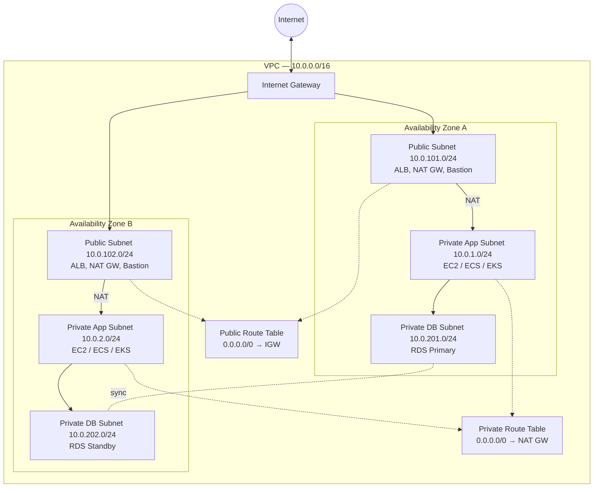
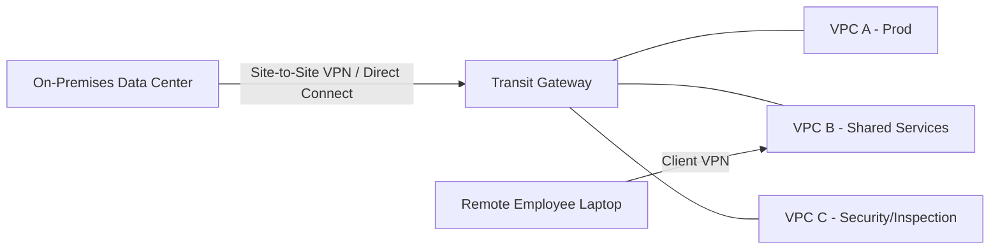

# AWS VPC (Virtual Private Cloud) — Production Reference Guide

> Part of the AWS Networking documentation series. This document covers Amazon VPC end-to-end: architecture, core components, configuration, and decision criteria for production environments.

## Table of Contents

- [1. High-Level Architecture & Service Flow](#1-high-level-architecture--service-flow)
- [2. Core Features & Deep-Dive](#2-core-features--deep-dive)
- [3. Step-by-Step Configuration & Implementation Guide](#3-step-by-step-configuration--implementation-guide)
- [4. How to Use & Where to Use (Target Use Cases)](#4-how-to-use--where-to-use-target-use-cases)
- [5. Security Checklist](#5-security-checklist)
- [6. Cost Considerations](#6-cost-considerations)
- [7. Service Quotas / Limits Reference](#7-service-quotas--limits-reference)
- [Related Files in This Repo](#related-files-in-this-repo)

---

## Overview

Amazon VPC (Virtual Private Cloud) is a logically isolated section of the AWS Cloud where you provision resources in a network you define. You control the IP address range, subnets, route tables, gateways, and security boundaries — it is the networking foundation almost every other AWS service (EC2, RDS, Lambda-in-VPC, EKS, ECS, ElastiCache, etc.) sits on top of.

**Mental model:** A VPC is your own private plot of land inside the AWS "city." You decide the fencing (CIDR block), the internal roads (route tables), who can enter from outside (Internet Gateway / NAT Gateway), and the checkpoints along the way (Security Groups / NACLs).

---

## 1. High-Level Architecture & Service Flow

### 1.1 Conceptual Layout (3-Tier Production Pattern)



### 1.2 Request/Response Traffic Flow (Inbound)

1. **Client** on the internet sends a request to a public DNS name (Route 53) resolving to an **Application Load Balancer (ALB)** in the public subnets.
2. Traffic enters the VPC through the **Internet Gateway (IGW)**, which is the routing target in the **public route table** (`0.0.0.0/0 → igw-xxxx`).
3. The **NACL** on the public subnet evaluates the packet (stateless — checked both ways).
4. The **Security Group** on the ALB evaluates the packet (stateful — allow-only).
5. ALB forwards the request to a target in the **private application subnet** over the port defined in the target group.
6. The **App Tier Security Group** only allows inbound traffic from the **ALB Security Group** (SG-to-SG reference, not IP-based).
7. The application server queries the **Database Tier** in an isolated private subnet; the **DB Security Group** only allows inbound traffic from the **App Tier Security Group**.
8. Response traverses back the same path. Because Security Groups are **stateful**, no explicit outbound rule is needed for the return leg. NACLs are **stateless**, so an explicit outbound (ephemeral port) rule is required.

### 1.3 Outbound-Only Traffic Flow (Private Subnet → Internet)

1. An instance in a **private subnet** needs to reach the internet (e.g., OS patching, calling an external API).
2. The **private route table** sends `0.0.0.0/0` traffic to the **NAT Gateway**, which lives in a **public subnet**.
3. The NAT Gateway translates the private IP to its own Elastic IP and forwards the request through the **IGW**.
4. Return traffic comes back to the NAT Gateway (because the connection was **initiated from inside**), which routes it back to the originating private instance.
5. The internet **cannot** initiate a new connection to the private instance — NAT only permits outbound-initiated, inbound-return traffic.

### 1.4 Multi-VPC / Hybrid Flow



- On-premises networks connect via **Site-to-Site VPN** or **Direct Connect** into a **Transit Gateway**, which acts as a central hub routing traffic between all attached VPCs (transitive routing).
- Remote users connect via **AWS Client VPN** directly into a VPC endpoint for individual, certificate/SSO-authenticated access.

---

## 2. Core Features & Deep-Dive

### 2.1 CIDR Blocks & IP Addressing

- Each VPC has a **primary IPv4 CIDR block** sized between **/16** (65,536 IPs) and **/28** (16 IPs).
- You can attach up to **5 secondary CIDR blocks** per VPC by default (quota can be raised).
- AWS reserves **5 IP addresses per subnet** (first 4 + last 1) — e.g., in a `/24` (256 IPs) only 251 are usable:
  - `.0` — Network address
  - `.1` — Reserved for the VPC router
  - `.2` — Reserved for AWS DNS
  - `.3` — Reserved for future use
  - `.255` — Network broadcast (not supported, but reserved anyway)
- Use **RFC 1918 private ranges** (`10.0.0.0/8`, `172.16.0.0/12`, `192.168.0.0/16`) — avoid overlapping ranges across VPCs you may later peer or connect via Transit Gateway (overlapping CIDRs cannot be peered).
- **IPv6** is optional: you can associate an Amazon-provided `/56` IPv6 CIDR (auto-assigned globally unique) or bring your own (BYOIP). IPv6 addresses are always publicly routable — there is no "private IPv6"; isolation is enforced purely via Security Groups/NACLs/route tables (or an **Egress-Only Internet Gateway** for outbound-only IPv6, the IPv6 equivalent of a NAT Gateway).

### 2.2 Subnets

| Type | Route to 0.0.0.0/0 | Typical Use |
|---|---|---|
| Public Subnet | Internet Gateway | ALBs, NAT Gateways, Bastion Hosts |
| Private Subnet (routable) | NAT Gateway | App servers, containers, internal APIs |
| Private Subnet (isolated) | None / VPC-local only | Databases, internal caches, no egress needed |

- A subnet exists **entirely within a single Availability Zone** — it cannot span AZs.
- Best practice: spread subnets across **at least 2 (ideally 3) AZs** for high availability.
- Subnets inherit the **Main Route Table** of the VPC unless explicitly associated with a custom one — this is a common misconfiguration source (a subnet silently becomes "public" if the main table has an IGW route).
- **Auto-assign public IPv4** is a subnet-level setting; even in a "public" subnet, an instance won't get a public IP unless this is enabled (or one is assigned manually/via Elastic IP).

### 2.3 Route Tables

- Every route table has an immutable **`local`** route for intra-VPC traffic (cannot be deleted/modified).
- **Longest prefix match wins** — a `/24` route is preferred over a `/0` route for matching traffic.
- One subnet → one route table at a time; one route table → many subnets.
- Default quota: **200 route tables per VPC**, **50 routes per table** (both adjustable).
- Route **propagation** can be enabled on a Virtual Private Gateway or Transit Gateway attachment so VPN/TGW routes populate automatically instead of being added manually.

### 2.4 Internet Gateway (IGW)

- Horizontally scaled, redundant, highly available — **no bandwidth constraints**, no configuration beyond attach/detach.
- **One IGW per VPC**, and an IGW can only attach to one VPC at a time.
- Performs 1:1 static NAT for instances with a **public IPv4 address**.
- **Bi-directional**: internet can initiate connections in; instance can initiate connections out.
- Free of charge (only standard data transfer rates apply).

### 2.5 NAT Gateway vs NAT Instance

| Aspect | NAT Gateway (Managed) | NAT Instance (Self-Managed EC2) |
|---|---|---|
| Availability | AWS-managed, HA within its AZ | You manage HA (scripts/failover) |
| Bandwidth | Scales to 100 Gbps | Limited by instance type |
| Maintenance | None (fully managed) | Patching, monitoring required |
| Cost | Hourly + per-GB processed | EC2 instance cost only |
| Security Groups | Not supported (uses NACLs only) | Supported |
| Use as bastion | No | Yes (can also proxy other traffic) |

- **Deploy one NAT Gateway per AZ** for high availability — a single NAT Gateway is a single point of failure if its AZ goes down (`single_nat_gateway = false` in the Terraform module referenced in Section 3).
- Default quota: **5 NAT Gateways per AZ** (adjustable).

### 2.6 Security Groups vs Network ACLs

| Feature | Security Group (SG) | Network ACL (NACL) |
|---|---|---|
| Applies to | ENI / instance level | Subnet level |
| State | **Stateful** (return traffic auto-allowed) | **Stateless** (must allow both directions explicitly) |
| Rule types | Allow only | Allow **and** Deny |
| Evaluation | All rules evaluated before decision | Rules evaluated **in numeric order**, first match wins |
| Default behavior | Deny all inbound, allow all outbound | Default NACL allows all; custom NACLs deny all until rules added |
| Reference by | Security Group ID (SG-to-SG chaining) | CIDR blocks only |
| Default quota | 5 SGs per ENI, 60 in/60 out rules per SG (adjustable to 1000 rules total) | 20 rules per direction (default), max 40 |

**3-Tier SG chaining pattern** (no hard-coded IPs):
- `Web-SG`: inbound 443/80 from `0.0.0.0/0`
- `App-SG`: inbound 8080 **from `Web-SG`** only
- `DB-SG`: inbound 3306/5432 **from `App-SG`** only

### 2.7 VPC Peering

- Direct, private, non-transitive 1:1 connection between two VPCs (same or different accounts/regions).
- **No transitive routing**: if A↔B and B↔C are peered, A **cannot** reach C through B.
- No single point of failure and no bandwidth bottleneck (uses AWS backbone).
- CIDR blocks of peered VPCs **must not overlap**.
- Good for a small number of VPC-to-VPC relationships; becomes unmanageable ("mesh") beyond a handful of VPCs — **N VPCs need N(N-1)/2 peering connections**.

### 2.8 Transit Gateway (TGW)

- Regional, highly available, managed **hub-and-router** for VPCs, VPNs, and Direct Connect connections.
- Supports **transitive routing** — unlike peering.
- Each VPC/VPN/DX attaches to the TGW; TGW **route tables** (separate from VPC route tables) control which attachments can talk to which.
- Can be **peered cross-region** (Transit Gateway Peering) to build global networks.
- Scales to thousands of attachments (quota: 5,000 attachments per TGW by default).
- Per-attachment bandwidth: burst up to **50 Gbps**.
- Common pattern: **Centralized egress/inspection VPC** — route all spoke VPC traffic through a shared TGW attachment to a security/inspection VPC running a firewall appliance (e.g., AWS Network Firewall) before it reaches the internet.

### 2.9 VPC Endpoints (PrivateLink)

| Type | Backing Service Examples | Mechanism | Cost |
|---|---|---|---|
| **Gateway Endpoint** | S3, DynamoDB | Adds a route table entry (prefix list target) | Free |
| **Interface Endpoint** | Most other AWS services (SSM, KMS, ECR, Secrets Manager, etc.), and third-party PrivateLink services | Provisions an ENI with a private IP in your subnet | Hourly + per-GB |

- Lets private subnets reach AWS services **without traversing the internet or a NAT Gateway** — improves security posture and can reduce NAT data-processing costs significantly.
- Interface endpoints can be restricted with **endpoint policies** and **Security Groups**, in addition to the target service's own IAM policies.

### 2.10 VPN Connectivity

- **Site-to-Site VPN**: connects an on-premises network to a VPC (via Virtual Private Gateway or Transit Gateway) over the public internet using IPsec. AWS provisions **2 tunnels** per connection for redundancy.
- **Client VPN**: managed, elastic, OpenVPN-based endpoint for individual remote users; supports Active Directory, certificate-based, and SAML/SSO (e.g., Okta) authentication; access can be scoped per Active Directory group via **authorization rules**.
- **Route Propagation** must be enabled on the gateway so the VPC's route table learns the on-premises CIDR automatically.

### 2.11 VPN vs Direct Connect (DX)

| Feature | Site-to-Site VPN | Direct Connect |
|---|---|---|
| Connection medium | Public internet (encrypted) | Private, dedicated fiber |
| Setup time | Minutes | Weeks to months (physical provisioning) |
| Bandwidth | ~1.25 Gbps per tunnel | 1 Gbps – 100 Gbps (dedicated) |
| Cost | Low (hourly + data) | High (port fee + circuit + possible colo cost) |
| Encryption | Native IPsec | Not encrypted by default (pair with VPN over DX if required) |
| Use case | Quick setup, backup link, small/medium workloads | Large, consistent, latency-sensitive enterprise workloads |

**Best practice:** Use **Direct Connect as primary** with a **Site-to-Site VPN as failover** for critical hybrid connectivity.

### 2.12 DNS in a VPC

- Two VPC attributes control DNS behavior:
  - `enableDnsSupport` — whether the Amazon-provided DNS resolver (at the `.2` address) responds to queries.
  - `enableDnsHostnames` — whether instances receive DNS hostnames matching their public/private IPs.
- **Route 53 Resolver** allows hybrid DNS: forwarding rules can send on-prem-bound queries out via **Outbound Endpoints** and accept on-prem queries via **Inbound Endpoints**.

### 2.13 DHCP Option Sets

- Controls DNS servers, domain name, NTP servers, and NetBIOS settings handed out to instances via DHCP.
- Immutable once created — to change settings you create a new option set and associate it with the VPC.

### 2.14 VPC Flow Logs

- Capture metadata (not payload) about IP traffic: source/dest IP, port, protocol, bytes, action (ACCEPT/REJECT), and timestamps.
- Can be enabled at the **VPC, Subnet, or ENI** level.
- Destinations: **CloudWatch Logs**, **S3**, or **Kinesis Data Firehose**.
- Primary tool for auditing, security investigation (e.g., feeding GuardDuty), and troubleshooting connectivity/NACL/SG issues.

### 2.15 VPC Sharing (AWS RAM)

- Using **AWS Resource Access Manager**, a central network account can share subnets with other accounts in an AWS Organization.
- Participant accounts can launch resources into shared subnets but **cannot** manage the VPC's core networking (route tables, IGWs, etc.) — useful for centralizing network governance while giving application teams autonomy over their own resources.

### 2.16 Egress-Only Internet Gateway

- The IPv6 equivalent of a NAT Gateway: allows **outbound-only** IPv6 traffic from a subnet, preventing unsolicited inbound IPv6 connections (since IPv6 has no concept of private/NAT addressing).

---

## 3. Step-by-Step Configuration & Implementation Guide

### 3.1 Design Checklist (Before You Build)

1. Choose a **non-overlapping CIDR block** (check against any VPCs you may peer with or connect via TGW/VPN).
2. Decide the number of **tiers** (web/app/db) and **AZs** (minimum 2 for HA).
3. Plan subnet sizing — leave room to grow (don't use every IP in a `/16` on day one; reserve ranges for future subnets).
4. Decide NAT strategy: 1 NAT Gateway per AZ (HA, higher cost) vs. 1 shared NAT Gateway (cost-saving, single point of failure).
5. Decide DNS, Flow Logs, and endpoint requirements up front — they're easy to bolt on later, but plan for them.

### 3.2 Console Walkthrough (Manual Build)

1. **VPC** → Create VPC → choose "VPC and more" (auto-generates subnets, route tables, IGW, and optionally NAT Gateways) *or* build manually for full control.
2. **Create VPC**: set CIDR (e.g., `10.0.0.0/16`), name tag.
3. **Create Subnets**: one per tier per AZ (e.g., `pub-a`, `pub-b`, `app-a`, `app-b`, `db-a`, `db-b`).
4. **Create and attach an Internet Gateway** to the VPC.
5. **Create a Public Route Table**: add route `0.0.0.0/0 → igw-xxxx`; associate with public subnets.
6. **Allocate an Elastic IP**, then **create a NAT Gateway** in each public subnet using that EIP.
7. **Create a Private Route Table**: add route `0.0.0.0/0 → nat-xxxx`; associate with private (app/db) subnets.
8. **Create Security Groups**: `web-sg`, `app-sg`, `db-sg`, chaining rules as shown in Section 2.6.
9. **(Optional) Create custom NACLs** if you need subnet-wide allow/deny rules beyond SGs; remember to allow ephemeral ports (1024–65535) for return traffic.
10. **Enable VPC Flow Logs** on the VPC, targeting CloudWatch Logs or S3.
11. **Validate**: launch a test instance in the public subnet (should reach internet directly) and one in the private subnet (should reach internet only via NAT, and should not be reachable from the internet).

### 3.3 AWS CLI Walkthrough

```bash
# 1. Create the VPC
aws ec2 create-vpc --cidr-block 10.0.0.0/16 \
  --tag-specifications 'ResourceType=vpc,Tags=[{Key=Name,Value=production-vpc}]'

# 2. Create subnets (repeat per AZ/tier)
aws ec2 create-subnet --vpc-id vpc-xxxx --cidr-block 10.0.101.0/24 \
  --availability-zone ap-south-1a \
  --tag-specifications 'ResourceType=subnet,Tags=[{Key=Name,Value=public-a}]'

# 3. Create and attach Internet Gateway
aws ec2 create-internet-gateway \
  --tag-specifications 'ResourceType=internet-gateway,Tags=[{Key=Name,Value=production-igw}]'
aws ec2 attach-internet-gateway --vpc-id vpc-xxxx --internet-gateway-id igw-xxxx

# 4. Create public route table and route
aws ec2 create-route-table --vpc-id vpc-xxxx \
  --tag-specifications 'ResourceType=route-table,Tags=[{Key=Name,Value=public-rt}]'
aws ec2 create-route --route-table-id rtb-xxxx \
  --destination-cidr-block 0.0.0.0/0 --gateway-id igw-xxxx
aws ec2 associate-route-table --route-table-id rtb-xxxx --subnet-id subnet-xxxx

# 5. Allocate EIP and create NAT Gateway
aws ec2 allocate-address --domain vpc
aws ec2 create-nat-gateway --subnet-id subnet-xxxx --allocation-id eipalloc-xxxx \
  --tag-specifications 'ResourceType=natgateway,Tags=[{Key=Name,Value=nat-a}]'

# 6. Create private route table and route to NAT
aws ec2 create-route-table --vpc-id vpc-xxxx \
  --tag-specifications 'ResourceType=route-table,Tags=[{Key=Name,Value=private-rt}]'
aws ec2 create-route --route-table-id rtb-yyyy \
  --destination-cidr-block 0.0.0.0/0 --nat-gateway-id nat-xxxx
aws ec2 associate-route-table --route-table-id rtb-yyyy --subnet-id subnet-yyyy
```

> See `commands-cheatsheet.md` for the full command reference, including Security Groups, NACLs, peering, and Flow Logs.

### 3.4 Infrastructure as Code (Terraform) — 3-Tier Module

```hcl
module "vpc" {
  source  = "terraform-aws-modules/vpc/aws"
  version = "~> 5.0"

  name = "production-vpc"
  cidr = "10.0.0.0/16"

  azs              = ["ap-south-1a", "ap-south-1b"]
  public_subnets   = ["10.0.101.0/24", "10.0.102.0/24"]
  private_subnets  = ["10.0.1.0/24", "10.0.2.0/24"]      # App tier
  database_subnets = ["10.0.201.0/24", "10.0.202.0/24"]  # DB tier (isolated)

  enable_nat_gateway     = true
  single_nat_gateway     = false   # one NAT GW per AZ for HA
  one_nat_gateway_per_az = true

  enable_dns_hostnames = true
  enable_dns_support   = true

  create_database_subnet_group           = true
  create_database_subnet_route_table     = true
  database_subnet_group_name             = "production-db-subnet-group"

  enable_flow_log                        = true
  flow_log_destination_type              = "cloud-watch-logs"
  flow_log_max_aggregation_interval      = 60

  tags = {
    Environment = "production"
    ManagedBy   = "terraform"
  }
}

resource "aws_security_group" "web" {
  name_prefix = "web-sg-"
  vpc_id      = module.vpc.vpc_id

  ingress {
    from_port   = 443
    to_port     = 443
    protocol    = "tcp"
    cidr_blocks = ["0.0.0.0/0"]
  }
  egress {
    from_port   = 0
    to_port     = 0
    protocol    = "-1"
    cidr_blocks = ["0.0.0.0/0"]
  }
}

resource "aws_security_group" "app" {
  name_prefix = "app-sg-"
  vpc_id      = module.vpc.vpc_id

  ingress {
    from_port       = 8080
    to_port         = 8080
    protocol        = "tcp"
    security_groups = [aws_security_group.web.id]   # SG-to-SG reference
  }
}

resource "aws_security_group" "db" {
  name_prefix = "db-sg-"
  vpc_id      = module.vpc.vpc_id

  ingress {
    from_port       = 5432
    to_port         = 5432
    protocol        = "tcp"
    security_groups = [aws_security_group.app.id]
  }
}
```

### 3.5 Post-Build Validation Steps

- Confirm public instances get a public IP and can be reached (if intended).
- Confirm private instances have **no** public IP, and outbound-only internet access works (e.g., `curl https://amazon.com` succeeds; unsolicited inbound from the internet fails).
- Use **VPC Reachability Analyzer** to trace a path between two resources and confirm the expected route/SG/NACL chain.
- Review Flow Logs for unexpected `REJECT` entries.

---

## 4. How to Use & Where to Use (Target Use Cases)

### 4.1 VPC Peering vs. Transit Gateway — Decision Matrix

| Criteria | Choose VPC Peering | Choose Transit Gateway |
|---|---|---|
| Number of VPCs to connect | 2–4, simple relationships | 5+, or growing over time |
| Need transitive routing | No | Yes |
| Centralized inspection/egress | No | Yes |
| Multi-account / multi-region hub | Manageable manually | Yes, purpose-built |
| Cost sensitivity | Free (data transfer only) | Hourly + per-GB per attachment |

### 4.2 NAT Gateway vs NAT Instance

- **Choose NAT Gateway** for virtually all production workloads — managed, HA-capable, scales automatically.
- **Choose NAT Instance** only for cost-constrained dev/test environments, or if you need it to double as a bastion/proxy with custom traffic inspection logic.

### 4.3 VPN vs Direct Connect

- **Choose VPN** for: quick setup, disaster-recovery/failover link, low-to-moderate bandwidth needs, budget-constrained projects, temporary connectivity.
- **Choose Direct Connect** for: large enterprises with sustained high-bandwidth hybrid workloads, latency-sensitive applications (trading systems, large data migrations), compliance requirements for private (non-internet) connectivity.

### 4.4 Gateway Endpoint vs Interface Endpoint

- **Gateway Endpoint**: use for **S3 and DynamoDB only** — it's free and simplest (route table entry).
- **Interface Endpoint (PrivateLink)**: use for every other AWS service you need to reach privately (SSM Session Manager, Secrets Manager, KMS, ECR, CloudWatch Logs, etc.), or to consume/publish third-party SaaS privately.

### 4.5 Security Group vs NACL — When to Use Each

- **Default to Security Groups** for almost all access control — they're stateful, easy to reason about, and support SG-to-SG chaining.
- **Add NACLs** when you need:
  - An explicit **Deny** rule (SGs cannot deny — e.g., blocking a known-bad IP range at the subnet level).
  - A coarse, subnet-wide guardrail independent of individual instance configuration (defense-in-depth).

### 4.6 Choosing a Subnet Architecture

| Scenario | Recommended Pattern |
|---|---|
| Simple web app, cost-sensitive | 2-tier: public (web) + private (app+db combined) |
| Standard production web app | 3-tier: public (web/ALB), private-app, private-db, across 2+ AZs |
| Regulated / highly sensitive data | 3-tier + isolated DB subnets (no NAT route at all) + PrivateLink for AWS service access + centralized inspection VPC |
| Multi-team / multi-account org | Shared VPC via AWS RAM, centrally managed by a network team |
| Global, multi-region hybrid | Transit Gateway + Direct Connect (primary) + Site-to-Site VPN (failover) + TGW peering across regions |

---

## 5. Security Checklist

- [ ] No security group allows `0.0.0.0/0` on port 22/3389 (use SSM Session Manager or a bastion + VPN instead).
- [ ] Database subnets have **no route to an Internet Gateway or NAT Gateway** unless explicitly required.
- [ ] Security Groups reference **other Security Groups**, not hardcoded IPs, for internal tiers.
- [ ] VPC Flow Logs are enabled and shipped to a monitored destination.
- [ ] NACLs (if customized) explicitly allow **ephemeral port ranges** (1024–65535) for return traffic.
- [ ] Sensitive AWS API traffic (S3, KMS, Secrets Manager, SSM) uses **VPC Endpoints**, not the public internet.
- [ ] Overlapping CIDR ranges are avoided across all VPCs likely to be peered/connected via TGW.
- [ ] Multi-AZ redundancy exists for NAT Gateways, subnets, and any stateful workloads.
- [ ] Route tables are explicitly associated per subnet — nothing is left relying on the "Main" route table by accident.

---

## 6. Cost Considerations

| Component | Billing Model | Cost Optimization Tip |
|---|---|---|
| NAT Gateway | Hourly + per-GB processed | Use VPC Endpoints for S3/DynamoDB/other AWS APIs to avoid routing that traffic through NAT |
| Interface VPC Endpoint | Hourly per AZ + per-GB | Only deploy in AZs actually in use |
| Data Transfer (cross-AZ) | Per-GB both directions | Co-locate chatty services in the same AZ where latency/HA trade-off is acceptable |
| Elastic IP | Free while attached to a running instance; charged if idle/unattached | Release unused EIPs |
| Transit Gateway | Hourly per attachment + per-GB processed | Consolidate low-traffic VPCs before attaching everything blindly |
| Site-to-Site VPN | Hourly per connection + data | Use Direct Connect for sustained high-volume transfer instead |
| Internet Gateway | Free (data transfer rates apply) | N/A |

---

## 7. Service Quotas / Limits Reference

| Resource | Default Quota | Adjustable? |
|---|---|---|
| VPCs per Region | 5 | Yes |
| Subnets per VPC | 200 | Yes |
| CIDR blocks per VPC | 5 (1 primary + 4 secondary) | Yes |
| Route tables per VPC | 200 | Yes |
| Routes per route table | 50 | Yes |
| Security Groups per ENI | 5 | Yes |
| Rules per Security Group | 60 inbound / 60 outbound | Yes (up to 1,000 total via quota increase) |
| Rules per NACL (per direction) | 20 | Yes (max 40) |
| NAT Gateways per AZ | 5 | Yes |
| Internet Gateways per VPC | 1 | No |
| VPC Peering connections per VPC | 50 | Yes |
| Transit Gateway attachments per TGW | 5,000 | Yes |
| Elastic IPs per Region | 5 | Yes |

> Quotas change periodically — always confirm current values in the **Service Quotas** console before capacity planning.

---

## Related Files in This Repo

| File | Purpose |
|---|---|
| [`commands-cheatsheet.md`](./commands-cheatsheet.md) | Full AWS CLI command reference for every VPC component |
| [`hands-on-labs.md`](./hands-on-labs.md) | Guided, buildable labs from a basic VPC through Transit Gateway hub-and-spoke |
| [`troubleshooting.md`](./troubleshooting.md) | Diagnostic playbooks for the most common VPC connectivity failures |
