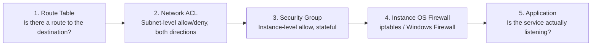

# AWS VPC — Troubleshooting Playbook

> Diagnostic guides for the most common VPC connectivity failures, organized by symptom. Each entry lists likely causes (in order of probability), the commands/console checks to confirm each cause, and the fix.

## Table of Contents

- [General Diagnostic Method](#general-diagnostic-method)
- [1. Instance in a Public Subnet Is Not Reachable from the Internet](#1-instance-in-a-public-subnet-is-not-reachable-from-the-internet)
- [2. Private Subnet Instance Cannot Reach the Internet](#2-private-subnet-instance-cannot-reach-the-internet)
- [3. Two Instances in the Same VPC Cannot Communicate](#3-two-instances-in-the-same-vpc-cannot-communicate)
- [4. VPC Peering Connection Traffic Not Flowing](#4-vpc-peering-connection-traffic-not-flowing)
- [5. NACL Blocking Return Traffic (Stateless Trap)](#5-nacl-blocking-return-traffic-stateless-trap)
- [6. NAT Gateway Not Working](#6-nat-gateway-not-working)
- [7. VPC Endpoint Not Being Used / Traffic Still Going Through NAT](#7-vpc-endpoint-not-being-used--traffic-still-going-through-nat)
- [8. Site-to-Site VPN Tunnel Down or Traffic Not Passing](#8-site-to-site-vpn-tunnel-down-or-traffic-not-passing)
- [9. Transit Gateway Routing Not Working Between VPCs](#9-transit-gateway-routing-not-working-between-vpcs)
- [10. DNS Resolution Failing Inside the VPC](#10-dns-resolution-failing-inside-the-vpc)
- [11. "DependencyViolation" When Deleting VPC Resources](#11-dependencyviolation-when-deleting-vpc-resources)
- [Quick Reference: Diagnostic Tools](#quick-reference-diagnostic-tools)

---

## General Diagnostic Method

For any VPC connectivity problem, check components **in this order** — each layer can independently block traffic:



1. **Route Table** — is there a route to the destination CIDR/gateway at all?
2. **NACL** — subnet-level, stateless, check **both** inbound and outbound.
3. **Security Group** — instance-level, stateful, check inbound (outbound is usually open by default).
4. **OS-level firewall** — `iptables`, `firewalld`, Windows Firewall on the instance itself.
5. **Application** — is the process actually listening on the expected port/interface (`0.0.0.0` vs `127.0.0.1`)?

The fastest way to walk this automatically is **VPC Reachability Analyzer**, which traces the exact path and tells you precisely which component is blocking traffic.

---

## 1. Instance in a Public Subnet Is Not Reachable from the Internet

**Likely causes (check in order):**

| # | Cause | How to Confirm | Fix |
|---|---|---|---|
| 1 | Instance has no public IP | `aws ec2 describe-instances --instance-ids i-xxxx --query 'Reservations[0].Instances[0].PublicIpAddress'` returns `null` | Enable "auto-assign public IP" on the subnet before launch, or attach an Elastic IP |
| 2 | Subnet's route table has no IGW route | `aws ec2 describe-route-tables --filters "Name=association.subnet-id,Values=subnet-xxxx"` — look for `0.0.0.0/0 → igw-xxxx` | Add the route, or associate the subnet with the correct public route table |
| 3 | Security Group doesn't allow the port | `aws ec2 describe-security-groups --group-ids sg-xxxx` | Add an inbound rule for the required port/source |
| 4 | NACL denies inbound or outbound | `aws ec2 describe-network-acls --filters "Name=association.subnet-id,Values=subnet-xxxx"` | Add allow rules for the port in, and ephemeral ports out |
| 5 | IGW not attached to the VPC | `aws ec2 describe-internet-gateways --filters "Name=attachment.vpc-id,Values=vpc-xxxx"` | `aws ec2 attach-internet-gateway` |
| 6 | OS-level firewall blocking the port | SSH/SSM into the instance, check `iptables -L` or `sudo ufw status` | Open the port at the OS level |

---

## 2. Private Subnet Instance Cannot Reach the Internet

**Likely causes:**

| # | Cause | How to Confirm | Fix |
|---|---|---|---|
| 1 | No route to a NAT Gateway | Check the subnet's route table for `0.0.0.0/0 → nat-xxxx` | Add the route |
| 2 | NAT Gateway is in the wrong subnet (must be public) | `aws ec2 describe-nat-gateways` — confirm its subnet has a route to an IGW | Recreate the NAT Gateway in a genuinely public subnet |
| 3 | NAT Gateway's Elastic IP was released/detached | `describe-nat-gateways` shows `failed` state | Recreate the NAT Gateway with a valid EIP |
| 4 | Security Group blocks outbound (rare, since default allows all outbound) | Check SG egress rules | Add an outbound allow rule (e.g., 443 to `0.0.0.0/0`) |
| 5 | NACL blocks outbound to internet or inbound ephemeral return traffic | Check both directions on the subnet's NACL | Allow outbound 443/80 and inbound ephemeral (1024–65535) |
| 6 | Instance is in the wrong AZ relative to a single, non-shared NAT Gateway, and the route table wasn't updated | Compare instance AZ vs. NAT Gateway AZ vs. route table target | Deploy a NAT Gateway per AZ, or verify the routing intentionally crosses AZs |

---

## 3. Two Instances in the Same VPC Cannot Communicate

**Likely causes:**

| # | Cause | How to Confirm | Fix |
|---|---|---|---|
| 1 | Security Group on the **destination** doesn't allow the source | Check destination instance's SG inbound rules — confirm source SG/CIDR is listed | Add an inbound rule referencing the source SG (preferred) or CIDR |
| 2 | Custom NACL on either subnet blocks the traffic | Check NACLs on both source and destination subnets, both directions | Add matching allow rules |
| 3 | Instances are in different subnets with overlapping custom route tables missing the `local` expectation | Confirm the `local` route (10.0.0.0/16 → local) still exists — it's automatic but can be shadowed by a bad custom route with the same/broader CIDR | Remove the conflicting route; `local` should always win for intra-VPC traffic due to longest-prefix match unless misconfigured |
| 4 | Host-based firewall on destination | Check `iptables`/`firewalld` on the destination instance | Allow the port at the OS level |
| 5 | Application only listening on `127.0.0.1` instead of `0.0.0.0` | `netstat -tulpn` or `ss -tulpn` on the destination | Bind the application to `0.0.0.0` (or the private interface IP) |

---

## 4. VPC Peering Connection Traffic Not Flowing

**Likely causes:**

| # | Cause | How to Confirm | Fix |
|---|---|---|---|
| 1 | Peering connection not yet **accepted** | `aws ec2 describe-vpc-peering-connections` — status must be `active`, not `pending-acceptance` | Accept the connection from the peer account/region |
| 2 | Missing route on **one or both sides** | Check both VPCs' route tables for a route to the peer CIDR via `pcx-xxxx` | Add the route on the missing side — routes must be added on **both** VPCs |
| 3 | Security Group doesn't allow the peer VPC's CIDR | Peering doesn't support SG-to-SG cross-VPC references unless both VPCs are in the same region and you explicitly reference the peer SG | Allow the peer VPC's CIDR block explicitly, or use cross-VPC SG references if same-region |
| 4 | Trying to reach a VPC that's only transitively connected (A↔B, B↔C, expecting A↔C) | This is expected behavior — peering is **not transitive** | Use a Transit Gateway instead if transitive routing is needed |
| 5 | Overlapping CIDR blocks | `describe-vpcs` on both VPCs — compare CIDR ranges | Peering with overlapping CIDRs is not possible; re-IP one VPC or use a different connectivity method |

---

## 5. NACL Blocking Return Traffic (Stateless Trap)

**Symptom:** Inbound connection appears to be allowed, but the client sees a timeout rather than a response.

**Cause:** NACLs are stateless. An inbound allow rule (e.g., port 443 in) does **not** automatically allow the response traffic out. The response uses a **high ephemeral port** (typically 1024–65535) as its destination, which must be explicitly allowed outbound.

**Fix:**

```bash
aws ec2 create-network-acl-entry --network-acl-id acl-xxxx \
  --egress --rule-number 100 --protocol tcp \
  --port-range From=1024,To=65535 --cidr-block 0.0.0.0/0 --rule-action allow
```

**Confirm via Flow Logs:** look for an `ACCEPT` on the inbound leg but a `REJECT` on the corresponding outbound leg from the same ENI.

---

## 6. NAT Gateway Not Working

| # | Cause | How to Confirm | Fix |
|---|---|---|---|
| 1 | NAT Gateway state is `failed` or `pending` | `aws ec2 describe-nat-gateways --filter "Name=vpc-id,Values=vpc-xxxx"` | If `failed`, recreate it; if `pending`, wait — creation takes a few minutes |
| 2 | NAT Gateway placed in a private subnet by mistake | Check the subnet it was created in has a route to an IGW | Recreate in a true public subnet |
| 3 | Private route table still points to the old/deleted NAT Gateway | Route shows a stale `nat-xxxx` target that no longer exists (shown as blackholed) | Update the route to the current NAT Gateway ID |
| 4 | Hit the per-AZ NAT Gateway quota (default 5) | `describe-nat-gateways` count per AZ | Request a quota increase or consolidate |

---

## 7. VPC Endpoint Not Being Used / Traffic Still Going Through NAT

| # | Cause | How to Confirm | Fix |
|---|---|---|---|
| 1 | Gateway Endpoint not associated with the subnet's route table | `describe-vpc-endpoints` → check `RouteTableIds` includes the subnet's table | Modify the endpoint to add the missing route table |
| 2 | Interface Endpoint's private DNS is disabled | Check `PrivateDnsEnabled` on the endpoint | Enable private DNS so the service's standard hostname resolves to the endpoint's private IP instead of the public one |
| 3 | Interface Endpoint's Security Group doesn't allow the client | Check endpoint SG inbound rules | Allow the client's SG/CIDR on the relevant port (typically 443) |
| 4 | Client explicitly using a regional/global endpoint URL that bypasses DNS override | Application config hardcodes an IP or non-standard endpoint | Point the application at the standard AWS service DNS name so private DNS resolution applies |

---

## 8. Site-to-Site VPN Tunnel Down or Traffic Not Passing

| # | Cause | How to Confirm | Fix |
|---|---|---|---|
| 1 | Tunnel status is `DOWN` | `aws ec2 describe-vpn-connections --vpn-connection-ids vpn-xxxx` → check `VgwTelemetry` status per tunnel | Verify on-prem device config matches AWS-generated config exactly (PSK, IKE version, encryption algorithms) |
| 2 | Route propagation not enabled | Check the VPC route table for the on-prem CIDR | `aws ec2 enable-vgw-route-propagation` |
| 3 | On-premises firewall blocking UDP 500/4500 or ESP (protocol 50) | Check on-prem firewall/NAT device rules | Open UDP 500, UDP 4500, and IP protocol 50 outbound/inbound to AWS's tunnel endpoints |
| 4 | Static routing configured but BGP expected (or vice versa) | Check `Options.StaticRoutesOnly` on the VPN connection vs. actual on-prem device config | Align both sides to the same routing mode |
| 5 | Only one tunnel is up, but the on-prem device isn't configured for failover | Check both tunnel statuses | Configure the on-prem device to use both tunnels (active/standby or ECMP) for redundancy |

---

## 9. Transit Gateway Routing Not Working Between VPCs

| # | Cause | How to Confirm | Fix |
|---|---|---|---|
| 1 | VPC attachment not associated with the correct TGW route table | `describe-transit-gateway-route-tables` and check associations | Associate the attachment with the right TGW route table |
| 2 | TGW route table missing a route/propagation for the other VPC's CIDR | `search-transit-gateway-routes` | Enable route propagation from the attachment, or add a static route |
| 3 | VPC's own route table missing a route to the TGW | Check the VPC route table for `<peer CIDR> → tgw-xxxx` | Add the missing route |
| 4 | Segmented route tables intentionally isolating VPCs (by design) | Confirm whether this is an intentional security boundary before "fixing" it | If isolation is intentional, this is expected behavior, not a bug |
| 5 | Security Group/NACL blocking at the instance/subnet level (TGW only handles routing, not filtering) | Standard SG/NACL checks | Adjust SG/NACL rules |

---

## 10. DNS Resolution Failing Inside the VPC

| # | Cause | How to Confirm | Fix |
|---|---|---|---|
| 1 | `enableDnsSupport` disabled on the VPC | `aws ec2 describe-vpc-attribute --vpc-id vpc-xxxx --attribute enableDnsSupport` | `aws ec2 modify-vpc-attribute --vpc-id vpc-xxxx --enable-dns-support` |
| 2 | `enableDnsHostnames` disabled | `describe-vpc-attribute --attribute enableDnsHostnames` | `modify-vpc-attribute --enable-dns-hostnames` |
| 3 | Custom DHCP Option Set points to invalid/unreachable DNS servers | `describe-dhcp-options` | Associate a correct option set (or the default, which uses the Amazon DNS resolver at the `.2` address) |
| 4 | Hybrid DNS: on-prem names not resolving from AWS | Check Route 53 Resolver outbound endpoint and forwarding rules | Configure a Resolver outbound endpoint with a forwarding rule for the on-prem domain |
| 5 | Security Group/NACL blocking DNS (UDP/TCP 53) to the resolver | Check egress rules | Allow UDP/TCP 53 outbound to the VPC's `.2` address or custom DNS servers |

---

## 11. "DependencyViolation" When Deleting VPC Resources

**Symptom:** `aws ec2 delete-vpc` or similar fails with `DependencyViolation`.

**Cause:** A dependent resource still references the one you're deleting (e.g., trying to delete a subnet that still has an ENI, or a VPC that still has an attached IGW).

**Fix — check and remove in this order:**

1. Terminate all EC2 instances / delete stray ENIs in the target subnets.
2. Delete NAT Gateways (wait for `deleted` state) and release their Elastic IPs.
3. Delete VPC Endpoints.
4. Delete VPN connections and detach/delete Virtual Private Gateways.
5. Delete Transit Gateway attachments referencing the VPC.
6. Remove non-default route table associations, then the route tables.
7. Detach and delete the Internet Gateway.
8. Delete the subnets.
9. Delete custom Security Groups and NACLs (default SG/NACL are deleted automatically with the VPC).
10. Delete the VPC.

> Full commands are in `commands-cheatsheet.md` under **Cleanup / Teardown Order**.

---

## Quick Reference: Diagnostic Tools

| Tool | Use For |
|---|---|
| **VPC Reachability Analyzer** | Automatically traces a path between two resources and identifies the exact blocking component (route, SG, NACL) |
| **VPC Flow Logs** | Historical/ongoing record of ACCEPT/REJECT decisions at the ENI level — best for auditing and post-incident analysis |
| **`describe-route-tables` / `describe-network-acls` / `describe-security-groups`** | Fast manual checks of the three core filtering/routing layers |
| **AWS Network Manager** | Visualizing large-scale Transit Gateway / hybrid topologies |
| **CloudWatch Logs Insights** | Querying Flow Logs at scale (see Lab 9 in `hands-on-labs.md`) |
| **`traceroute` / `mtr` / `tcpdump` on the instance** | OS-level confirmation once you've ruled out AWS-layer blocking |
| **VPC Endpoint / NAT Gateway metrics (CloudWatch)** | `BytesOutToDestination`, `ActiveConnectionCount`, `ErrorPortAllocation` — useful for NAT port exhaustion issues under high connection load |

> **Note on NAT port exhaustion:** A single NAT Gateway supports up to 55,000 simultaneous connections per unique destination. If you see `ErrorPortAllocation > 0` in CloudWatch metrics, you're exhausting available ports — mitigate by distributing traffic across multiple NAT Gateways, reducing connection churn, or using VPC Endpoints to remove AWS-service traffic from the NAT path entirely.
