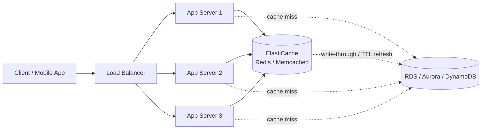
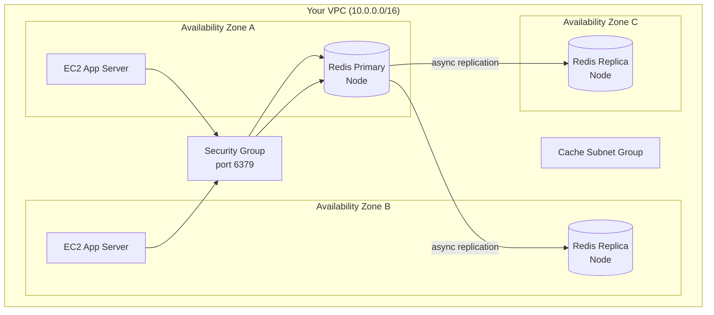
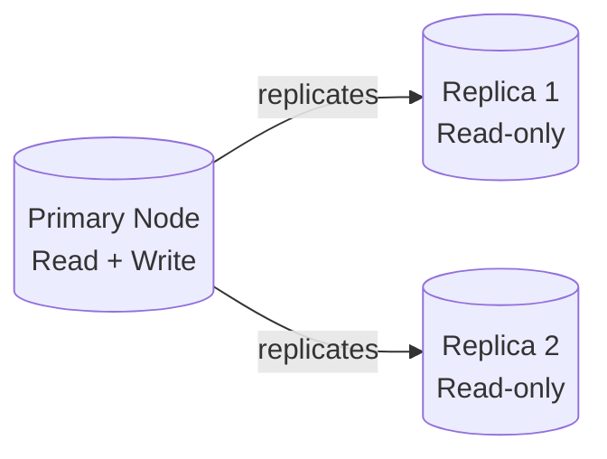
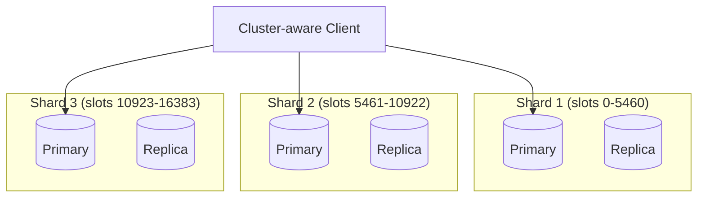
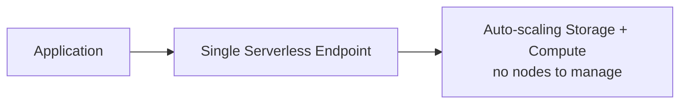

# Amazon ElastiCache — The Complete Practical Guide

> A from-scratch-to-production learning repo for Amazon ElastiCache (Redis OSS, Valkey, and Memcached). Built for engineers who want to actually *understand* caching, not just click "Create Cluster" and hope for the best.

---

## 📚 How This Repo Is Organized

Instead of one giant wall of text, this project is split into four focused documents. Read them in this order the first time through:

| File | What it's for |
|---|---|
| **README.md** (this file) | Theory, architecture, core concepts, and the mental model you need before touching the console |
| **[commands-cheatsheet.md](./commands-cheatsheet.md)** | Every AWS CLI command you'll realistically need, organized by task |
| **[hands-on-labs.md](./hands-on-labs.md)** | 9 guided labs — from your first cluster to multi-region failover |
| **[troubleshooting.md](./troubleshooting.md)** | Real error messages, why they happen, and how to fix them |

---

## 1. What Is Amazon ElastiCache?

Imagine your application talks to a database (RDS, DynamoDB, whatever). Every read is a round trip: network hop → disk I/O → query engine → data comes back. That's fine at low traffic. At scale, it's slow and expensive — you're paying to recompute or re-fetch the same answer thousands of times a second.

**ElastiCache is a managed in-memory data store.** It sits between your application and your database (or acts as a standalone data store) and keeps frequently-used data in RAM, where reads and writes happen in microseconds instead of milliseconds. AWS handles the provisioning, patching, backups, failover, and monitoring, so you focus on using it, not babysitting it.

ElastiCache is **not one product** — it's a management layer over three engines:

| Engine | What it is | Why you'd pick it |
|---|---|---|
| **Redis OSS** | Open-source Redis, AWS-managed | Rich data structures, persistence, pub/sub, replication, transactions |
| **Valkey** | Open-source Redis fork (Linux Foundation), API-compatible with Redis | Same features as Redis OSS, community-governed, AWS's recommended default going forward |
| **Memcached** | Simple, multi-threaded key-value store | Pure caching, nothing fancy, dead simple, scales across CPU cores natively |

> 💡 **Humanized take:** If someone asks "Redis or Memcached?", the honest answer is: *use Redis (or Valkey) unless you have a specific reason not to.* Memcached is genuinely simpler and multi-threaded out of the box, but Redis does almost everything Memcached does, plus persistence, replication, pub/sub, and rich data types. Most teams that pick Memcached do it out of habit, not necessity.

---

## 2. Why Does This Exist? (The Problem It Solves)

Three recurring problems in backend systems, and how caching fixes them:

1. **Database read overload** — Your Postgres/MySQL instance is drowning in repeated `SELECT` queries for the same rows. Cache the result, serve from RAM.
2. **Expensive computation** — You calculate a leaderboard, a recommendation, or an aggregate report, and it takes 3 seconds. Compute it once, cache it, serve it instantly to the next 10,000 requests.
3. **Session state at scale** — You have multiple stateless app servers behind a load balancer, but you need to remember who's logged in. A shared, fast, external session store solves this cleanly.

---

## 3. Target Use Cases (Where This Actually Gets Used)

| Use Case | Why ElastiCache fits | Typical Engine |
|---|---|---|
| Database query result caching | Cuts DB load, sub-millisecond reads | Redis / Memcached |
| Session store for web apps | Shared state across stateless servers | Redis |
| Real-time leaderboards / gaming | Sorted Sets give O(log N) ranked inserts | Redis |
| Rate limiting / API throttling | Atomic INCR + TTL = free rate limiter | Redis |
| Pub/Sub messaging & real-time feeds | Built-in publish/subscribe | Redis |
| Message queues (lightweight) | Lists, Streams | Redis |
| Full-page / fragment caching (CMS, e-commerce) | Reduce origin load | Redis / Memcached |
| Real-time analytics dashboards | Fast counters, HyperLogLog for unique counts | Redis |
| Machine learning feature store (low-latency lookups) | Sub-ms vector/feature retrieval | Redis |
| Geospatial queries ("find nearby drivers") | Native GEO commands | Redis |

---

## 4. High-Level Architecture & Service Flow

### 4.1 Where ElastiCache Sits in Your Stack



**The flow, step by step:**
1. Request comes in → app server checks ElastiCache first.
2. **Cache Hit** → data returned in microseconds, database never touched.
3. **Cache Miss** → app queries the real database, gets the result, writes it into the cache (with a TTL), *then* returns it to the client.
4. Next request for the same key = cache hit.

### 4.2 Networking Architecture (VPC View)

ElastiCache nodes always live **inside a VPC**, never publicly. This is a hard architectural rule, unlike RDS, which can optionally be public.



**Key networking building blocks:**

- **Subnet Group** — tells ElastiCache *which subnets* (and therefore which AZs) it's allowed to place nodes in. You must create this before a cluster.
- **Security Group** — acts as a virtual firewall. You open port `6379` (Redis) or `11211` (Memcached) *only* to the security groups of your application servers — never to `0.0.0.0/0`.
- **VPC Peering / Transit Gateway** — needed if your app lives in a different VPC (or account) than the cache.
- **No public endpoints** — you cannot reach ElastiCache from the public internet, period. Access is always via VPC (EC2, Lambda-in-VPC, ECS, EKS, etc.).

### 4.3 Redis Deployment Topologies

This is the part people get confused about most, so let's slow down.

**A. Cluster Mode Disabled (single shard, replicas for HA)**


- One primary, up to 5 replicas.
- All data lives on the primary (up to the max node memory — e.g., ~1 shard's worth).
- Replicas are for **read scaling** and **high availability**, not for scaling total data size.
- Simple, but you're capped by a single node's RAM for writes.

**B. Cluster Mode Enabled (sharded / partitioned)**


- Data is **partitioned** across up to 500 shards using **16,384 hash slots**.
- Each shard is its own primary + replicas (its own mini "Cluster Mode Disabled" group).
- Lets you scale **write throughput and total dataset size horizontally**, not just reads.
- Requires a **cluster-aware client** (one that understands `MOVED`/`ASK` redirects and hash slots).

**When to pick which:**

| Situation | Choice |
|---|---|
| Dataset fits comfortably in one node's RAM, mainly need HA + read scaling | Cluster Mode Disabled |
| Dataset is huge, or you need to scale writes horizontally | Cluster Mode Enabled |
| You're not sure yet | Start disabled — it's simpler, and migrating later is possible but non-trivial |

### 4.4 Serverless (the newer, simpler option)

**ElastiCache Serverless** removes node/shard sizing entirely. You pick the engine (Redis/Valkey/Memcached), set optional max limits, and AWS scales capacity up/down automatically based on actual usage. Billing is per GB-hour of data stored and ECPU (ElastiCache Processing Units) consumed.



Good for: unpredictable/spiky traffic, new projects where you don't want to guess node sizes, teams that want zero capacity planning.
Trade-off: less granular control, and it's a newer surface with fewer knobs (e.g., limited parameter group customization).

---

## 5. Core Features — Deep Dive

### 5.1 Replication & High Availability
- **Primary/Replica architecture**: the primary handles writes; replicas asynchronously copy data and can serve reads.
- **Multi-AZ with Automatic Failover**: if the primary fails a health check, ElastiCache **automatically promotes a replica** to primary and updates DNS — typically within 60-ish seconds, with no manual intervention.
- Without Multi-AZ, a primary failure means downtime until you manually intervene. **Always enable Multi-AZ in production.**

### 5.2 Sharding (Partitioning)
- Cluster Mode Enabled splits your keyspace across **16,384 hash slots**, distributed across shards.
- Redis computes `CRC16(key) mod 16384` to decide which slot (and therefore shard) a key belongs to.
- **Hash tags** (`{user123}.profile`, `{user123}.session`) let you force related keys onto the same shard, so multi-key operations (like transactions) still work.
- Resharding (adding/removing shards) is an **online operation** — no downtime, but it does consume some cluster CPU/network while slots migrate.

### 5.3 Persistence (Redis/Valkey only — Memcached has none)
- **RDB (snapshotting)**: point-in-time binary snapshot, written to S3 automatically for backups. Compact, fast to restore, but you can lose the last few minutes of writes.
- **AOF (Append-Only File)**: logs every write operation. More durable (less data loss on crash), but larger files and slightly slower.
- Automatic daily backups + manual on-demand snapshots are both supported and stored in S3 under the hood, though you don't manage the S3 bucket yourself.

### 5.4 Security

| Layer | What it does |
|---|---|
| **VPC + Security Groups** | Network-level access control (who can even reach the port) |
| **Encryption in Transit (TLS)** | Encrypts client↔node and node↔node traffic |
| **Encryption at Rest** | Encrypts data on disk (snapshots, swap) using KMS |
| **Redis AUTH** | A single shared password required to run commands |
| **RBAC (Role-Based Access Control)** | Redis 6+ / Valkey: named users, each with specific command/key permissions — like IAM but for Redis commands |
| **IAM Policies** | Control *who can manage* the ElastiCache resource itself (create/delete/modify) via AWS API |

> 🔒 **Humanized take:** AUTH is "one password for everyone" — fine for small setups. RBAC is "different users, different permissions" — what you actually want once more than one service or team touches the cache. Think of AUTH as a house key and RBAC as individual employee badges.

### 5.5 Global Datastore (Cross-Region Replication)
- Lets you replicate a Redis cluster from a primary region to up to 2 secondary (read-only) regions, asynchronously.
- Use case: low-latency reads for a global user base, or disaster recovery — if the primary region goes down, you can promote a secondary region to take over writes.

### 5.6 Monitoring & Observability
- **CloudWatch metrics** — CPU utilization, memory usage, evictions, cache hits/misses, current connections, replication lag, network throughput.
- **Events** — ElastiCache publishes events (failover started, node replaced, backup completed) you can subscribe to via SNS.
- **Slow Log (Redis)** — captures commands that took longer than a configurable threshold, essential for diagnosing latency spikes.

### 5.7 Parameter Groups
- A parameter group is a named set of engine configuration values (e.g., `maxmemory-policy`, `timeout`, `notify-keyspace-events`) applied to a cluster.
- AWS ships **default parameter groups** per engine version — read-only, sensible defaults.
- You create a **custom parameter group** (copy of the default) when you need to tweak something, e.g., changing the eviction policy.

### 5.8 Eviction Policies (`maxmemory-policy`) — one of the most important settings

| Policy | Behavior |
|---|---|
| `noeviction` | Return errors on write when memory is full — no data lost, but writes fail |
| `allkeys-lru` | Evict least-recently-used key, regardless of TTL |
| `volatile-lru` | Evict least-recently-used key **among keys with a TTL set** |
| `allkeys-lfu` | Evict least-frequently-used key |
| `volatile-lfu` | Evict least-frequently-used key among keys with TTL |
| `allkeys-random` | Evict a random key |
| `volatile-random` | Evict a random key among those with TTL |
| `volatile-ttl` | Evict the key with the shortest remaining TTL first |

> 💡 For a "pure cache" use case, `allkeys-lru` is the most common sane default. For "cache + some data I never want evicted," use `volatile-lru` and only set TTLs on the truly-cacheable keys.

### 5.9 Node Types & Sizing
- Node types follow the EC2-style family naming (e.g., `cache.r7g.large`, `cache.m7g.large`, `cache.t4g.micro`).
- **`r` family** = memory-optimized (most common for Redis, since RAM is the constraint).
- **`m` family** = balanced compute/memory.
- **`t` family** = burstable, good for dev/test, not recommended for sustained production load.
- **Graviton (`g` suffix)** = ARM-based, better price/performance — prefer these for new deployments unless you have an ARM-incompatible dependency.

### 5.10 Reserved Nodes & Cost Optimization
- Like RDS/EC2, you can purchase **Reserved Nodes** (1 or 3-year commitment) for a significant discount over On-Demand pricing if usage is steady and predictable.
- Serverless bills per GB-hour + ECPU — better for spiky/unpredictable workloads where you'd otherwise over-provision.

---

## 6. Prerequisites

Before starting the hands-on labs, make sure you have:

- [ ] An **AWS account** with permissions to create VPC resources, EC2 instances, and ElastiCache resources (`AmazonElastiCacheFullAccess` or an equivalent scoped policy).
- [ ] **AWS CLI v2** installed and configured (`aws configure`).
- [ ] A working **VPC** with at least 2 subnets in different Availability Zones (default VPC is fine for learning).
- [ ] Basic familiarity with **SSH** and connecting to an EC2 instance.
- [ ] (Optional but recommended) `redis-cli` installed locally or on a bastion/EC2 instance for testing.
- [ ] Comfort with basic networking concepts: subnets, security groups, CIDR blocks.

Check your CLI is ready:
```bash
aws --version
aws sts get-caller-identity
```

---

## 7. Step-by-Step Configuration & Implementation Guide (Overview)

This is the "birds-eye view" of implementation. Full command-by-command labs live in **hands-on-labs.md**.

1. **Plan your network** — identify/create a VPC, at least 2 private subnets across AZs, and a security group.
2. **Create a Cache Subnet Group** — tells ElastiCache which subnets it may deploy nodes into.
3. **Create a custom Parameter Group** (optional but recommended) — so you can tune settings later without being locked to defaults.
4. **Choose your engine & topology** — Redis vs Memcached; Cluster Mode Enabled vs Disabled; Serverless vs provisioned.
5. **Launch the cluster/replication group** — via Console, CLI, or IaC (CloudFormation/Terraform/CDK).
6. **Lock down security** — security group ingress rules, enable encryption in transit/at rest, set an AUTH token or configure RBAC users.
7. **Connect from your application** — via the primary/configuration endpoint, using a cache-aware client library.
8. **Set up monitoring** — CloudWatch alarms on `CPUUtilization`, `DatabaseMemoryUsagePercentage`, `Evictions`, `CurrConnections`.
9. **Set up backups** — enable automatic snapshots, define retention window.
10. **Test failover** — deliberately trigger/verify failover behavior before you trust it in production.

---

## 8. Redis vs Memcached — Full Comparison

| Feature | Redis / Valkey | Memcached |
|---|---|---|
| Data structures | Strings, Hashes, Lists, Sets, Sorted Sets, Streams, Bitmaps, HyperLogLog, Geospatial | Simple key-value strings/blobs only |
| Persistence | Yes (RDB + AOF) | No — pure in-memory, data lost on restart |
| Replication | Yes (Primary/Replica) | No native replication |
| Multi-AZ auto failover | Yes | No |
| Clustering / sharding | Yes (Cluster Mode) | Yes, but client-side sharding only |
| Multi-threading | Single-threaded per shard (mostly) | Multi-threaded natively |
| Pub/Sub | Yes | No |
| Transactions | Yes (MULTI/EXEC) | No |
| Lua scripting | Yes | No |
| Max item size | 512 MB (practically much smaller recommended) | 1 MB |
| Typical use case | Anything beyond pure caching | Extremely simple, high-throughput caching only |

---

## 9. Best Practices Checklist

- ✅ Always deploy across **at least 2 AZs** with Multi-AZ enabled for production.
- ✅ Use **TLS in transit** and **encryption at rest** for anything touching sensitive data.
- ✅ Prefer **RBAC users** over a single shared AUTH token for anything beyond a toy project.
- ✅ Set **TTLs** on cache keys — don't let the cache silently become your database.
- ✅ Choose an **eviction policy** deliberately; don't leave it at `noeviction` unless you have a real reason.
- ✅ Monitor **`Evictions`**, **`CurrConnections`**, and **`ReplicationLag`** — these catch problems before customers do.
- ✅ Use a **cluster-aware client library** if using Cluster Mode Enabled.
- ✅ Never expose ElastiCache security groups to `0.0.0.0/0`.
- ✅ Test failover and restore-from-snapshot **before** you need them in a real incident.
- ✅ Right-size nodes — over-provisioned `r7g.4xlarge` nodes sitting at 5% memory usage are wasted spend.

---

## 10. Glossary (Quick Reference)

| Term | Meaning |
|---|---|
| **Node** | A single instance running the cache engine |
| **Shard (Node Group)** | A primary node + its replicas, holding a subset of the keyspace |
| **Cluster** | For Memcached: the whole set of nodes. For Redis: often used loosely to mean the replication group |
| **Replication Group** | Redis-specific term for a primary + replicas (+ shards, if cluster mode is enabled) |
| **Endpoint** | The DNS address your app connects to — can be a Primary Endpoint, Reader Endpoint, or Configuration Endpoint |
| **Configuration Endpoint** | Used for Cluster Mode Enabled — client discovers shard topology automatically from here |
| **Hash Slot** | One of 16,384 buckets used to partition keys across shards |
| **Subnet Group** | A named collection of subnets ElastiCache can deploy into |
| **Parameter Group** | A named set of engine config values |
| **ECPU** | ElastiCache Processing Unit — the billing unit for Serverless compute |

---

## 11. Where to Go Next

- New to this? Start with **[hands-on-labs.md](./hands-on-labs.md) → Lab 0**.
- Need a command fast? Go to **[commands-cheatsheet.md](./commands-cheatsheet.md)**.
- Something broken? Check **[troubleshooting.md](./troubleshooting.md)** first — odds are it's covered.

---

## 📖 Further Reading (Official Docs)
- [Amazon ElastiCache User Guide](https://docs.aws.amazon.com/AmazonElastiCache/latest/red-ug/WhatIs.html)
- [Redis Documentation](https://redis.io/docs/)
- [Valkey Documentation](https://valkey.io/)

---

*This repo is a personal learning project documenting hands-on practice with Amazon ElastiCache. Corrections and PRs welcome.*
