# AWS RDS — End-to-End Practical Masterclass

A complete, diagram-driven reference for Amazon RDS: architecture, high availability, scaling, backups, security, and advanced operations. Built as a hands-on learning repo — every concept is paired with a diagram, and every diagram is paired with a lab.

## Repo Structure

| File | Purpose |
|---|---|
| [`README.md`](./README.md) | Core concepts, diagrams, comparisons (this file) |
| [`commands-cheatsheet.md`](./commands-cheatsheet.md) | AWS CLI + Terraform snippets for every feature |
| [`hands-on-labs.md`](./hands-on-labs.md) | Step-by-step labs + real-world incident scenarios |
| [`troubleshooting.md`](./troubleshooting.md) | Common errors, root causes, fixes |

## Table of Contents

1. [Introduction & Shared Responsibility](#1-introduction--shared-responsibility)
2. [Core Architecture & Storage](#2-core-architecture--storage)
3. [High Availability: Single-AZ, Multi-AZ Instance, Multi-AZ Cluster](#3-high-availability)
4. [Read Replicas](#4-read-replicas)
5. [Multi-AZ vs Read Replicas](#5-multi-az-vs-read-replicas)
6. [RPO & RTO](#6-rpo--rto)
7. [Backup, Restore & Point-in-Time Recovery](#7-backup-restore--point-in-time-recovery)
8. [Parameter Groups & Option Groups](#8-parameter-groups--option-groups)
9. [Data Security (Network, Encryption, Auth)](#9-data-security)
10. [IAM Database Authentication](#10-iam-database-authentication)
11. [RDS Proxy](#11-rds-proxy)
12. [RDS Custom](#12-rds-custom)
13. [Monitoring & Logging](#13-monitoring--logging)
14. [Version Upgrades & Blue/Green Deployments](#14-version-upgrades--bluegreen-deployments)
15. [Storage Auto-Scaling](#15-storage-auto-scaling)
16. [Amazon Aurora](#16-amazon-aurora)
17. [Quick Reference Summary](#17-quick-reference-summary)

---

## 1. Introduction & Shared Responsibility

Amazon RDS is a **fully managed relational database service**. You get a dedicated DB instance, but you never get OS/SSH access — AWS manages the underlying host, patching, and hardware.

**Shared Responsibility Model:**
- **AWS manages:** physical data centers, hypervisor, host OS patching, hardware failure recovery.
- **You manage:** network access (VPC/Security Groups), encryption configuration, database user permissions, schema, query performance, backups retention policy.

**7 Supported Engines:** MySQL, PostgreSQL, MariaDB, Oracle, Microsoft SQL Server, IBM Db2, and Amazon Aurora (MySQL/PostgreSQL compatible, cloud-native).

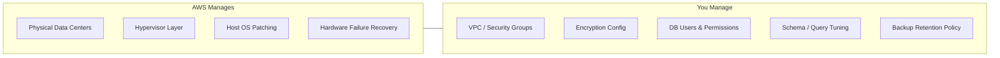

---

## 2. Core Architecture & Storage

Every RDS instance runs on **Amazon EBS**-backed storage.

| Storage Type | Best For | Notes |
|---|---|---|
| `gp3` | General purpose (default) | IOPS and throughput configured independently of size |
| `io1` / `io2` | High-performance, latency-sensitive workloads | Provisioned IOPS, higher cost |
| Magnetic (deprecated) | Legacy only | Not recommended for new workloads |

Configuration of the engine itself (not the OS) happens through two managed constructs:
- **Parameter Groups** — engine behavior/tuning (timeouts, buffer sizes, time zone)
- **Option Groups** — plugins and enterprise features (e.g., Oracle APEX, SQL Server TDE)

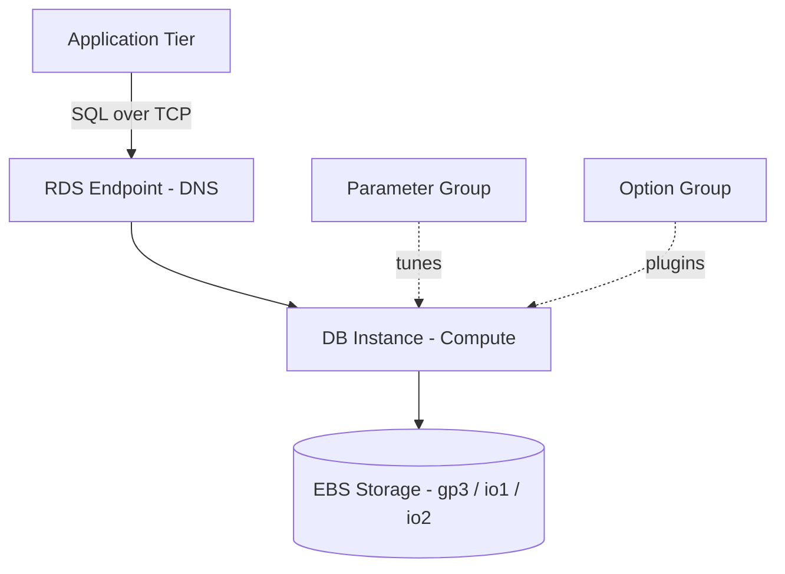

---

## 3. High Availability

RDS offers three availability tiers. Choosing the right one is a cost-vs-resilience trade-off.

### Single-AZ
One instance, one Availability Zone. No automatic failover. Cheapest — suitable for dev/test only.

### Multi-AZ Instance (1 Primary + 1 Standby)
The standby is **passive and not readable**. Replication is **synchronous** — the primary waits for standby acknowledgment before confirming a write, guaranteeing **RPO = 0** (zero data loss). Failover is automatic via DNS re-pointing, typically **30–60 seconds**.

### Multi-AZ Cluster (1 Writer + 2 Readable Standbys)
Uses **semi-synchronous quorum replication** across three AZs. The two standbys are *actually readable*, unlike the classic Multi-AZ standby. This gives up to **2x faster writes** and failovers **under ~35 seconds**.

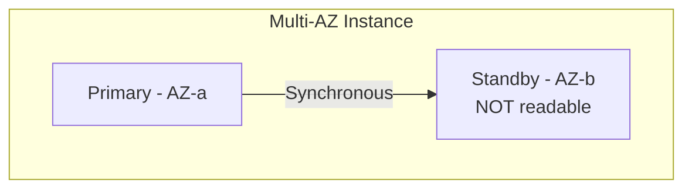

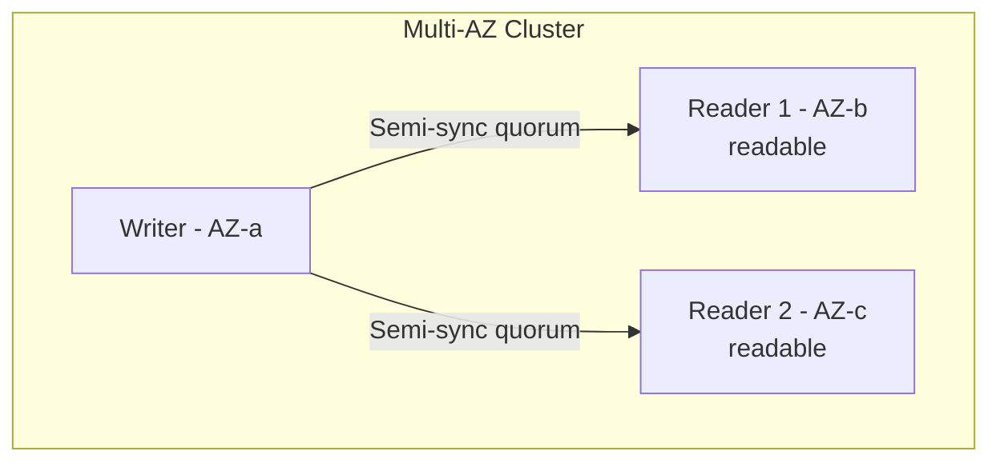

---

## 4. Read Replicas

A Read Replica is an **isolated, active, read-only copy** of the primary, built for **performance and scalability** — not disaster recovery.

**How it works:** writes go to the primary → AWS captures transaction logs → logs are shipped **asynchronously** to replicas → replicas apply them and stay queryable via their own endpoint.

**Key facts:**
- Up to **15 Read Replicas** per primary (MySQL, PostgreSQL, MariaDB).
- Requires **Automated Backups turned ON** on the primary as a prerequisite.
- Can be deployed **cross-region** for low-latency global reads or DR.
- Can be **manually promoted** to a standalone read/write primary (breaks replication link permanently).
- Does **not** need to match the primary's instance size — can be smaller/cheaper for dev/reporting workloads.
- Subject to **replica lag** since replication is asynchronous.

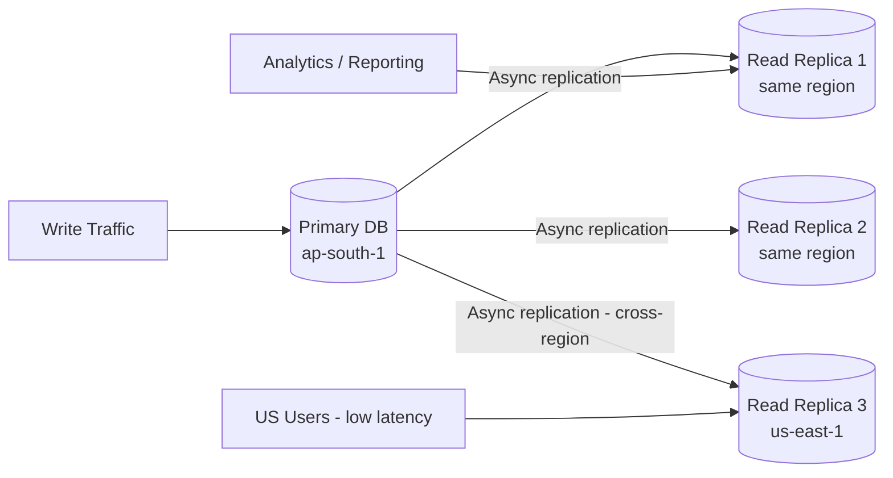

---

## 5. Multi-AZ vs Read Replicas

The single most tested distinction in cloud interviews. They solve **entirely different problems**.

| Feature | Multi-AZ (with Standby) | Read Replicas |
|---|---|---|
| Primary Goal | High Availability & Disaster Recovery | Scalability & Query Performance |
| Replication | Synchronous (no data gap) | Asynchronous (slight lag) |
| Is it usable/readable? | No — standby is passive/hidden | Yes — active, own endpoint |
| Failover | Automatic (DNS switch) | Manual (must promote) |
| Prerequisite | None | Automated Backups must be ON |

---

## 6. RPO & RTO

Two metrics that drive every DR architecture decision:

- **RPO (Recovery Point Objective)** — looks at the **past**. How much data (measured in time) can you tolerate losing? Multi-AZ gives RPO ≈ 0.
- **RTO (Recovery Time Objective)** — looks at the **future**. How long can you tolerate being offline? Multi-AZ Instance ≈ 30–60s, Multi-AZ Cluster ≈ under 35s.

---

## 7. Backup, Restore & Point-in-Time Recovery

### Automated Backups vs Manual Snapshots

| Dimension | Automated Backups | Manual Snapshots |
|---|---|---|
| Triggered by | AWS (daily schedule) | You / script / Terraform |
| Max retention | 1–35 days | Indefinite (until deleted) |
| Point-in-Time Recovery | Yes (down to the second) | No (exact snapshot moment only) |
| If instance is deleted | Purged automatically (unless retained explicitly) | Persist |
| Cross-account/region sharing | Cannot be shared directly | Can be shared |
| Storage model | Incremental (first is full, rest are deltas) | Incremental (first is full, rest are deltas) |

**Mechanics:** Automated backups take a **full daily snapshot** in a 30-minute backup window, plus continuously ship **transaction logs to S3 every 5 minutes** (WAL for Postgres, binlogs for MySQL).

**Golden Restore Rule:** You can **never restore over an existing database**. Every restore operation provisions a **brand-new instance**, **brand-new storage**, and a **brand-new endpoint** — your application must be reconfigured to point to it.

### Point-in-Time Recovery (PITR)

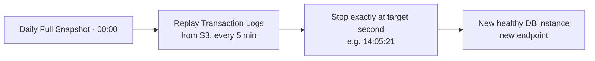

Given a target time (e.g., recovering 1 second *before* an accidental `DROP TABLE` at 14:05:22):
1. AWS provisions a fresh instance.
2. It restores the closest daily snapshot **before** the target time.
3. It replays transaction logs sequentially up to the exact second requested.
4. The instance opens for traffic under a **new endpoint**.

---

## 8. Parameter Groups & Option Groups

Since there's no OS/file access, all engine tuning happens through **Parameter Groups**.

- **Default Parameter Group** — stock settings, cannot be edited.
- **Custom Parameter Group** — created per engine family (`mysql8.0`, `postgres15`), editable, and reusable across many instances (one-to-many).

### Dynamic vs Static Parameters

| Type | Applied | Downtime | Example |
|---|---|---|---|
| **Dynamic** | Immediately | None | `max_connections`, query timeout, character set |
| **Static** | Saved immediately, but "pending-reboot" | Requires manual reboot | `innodb_buffer_pool_size`, `shared_buffers` |

> ⚠️ **Gotcha:** Attaching *any* new custom parameter group to an existing instance forces it into **pending-reboot** status — regardless of whether the specific parameters you changed are dynamic or static.

---

## 9. Data Security

Four pillars: **Network Security, Encryption at Rest, Encryption in Transit, Authentication.**

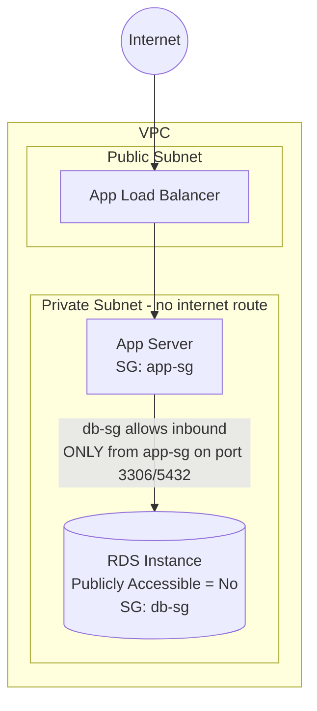

**Network:** private subnet placement, `Publicly Accessible = No`, and Security Group chaining — the DB's security group should accept inbound traffic **only** from the app tier's security group, never `0.0.0.0/0`.

**Encryption at Rest:** uses AWS KMS (default or a Customer Managed Key). Once enabled, it covers storage volumes, automated backups, manual snapshots, and read replicas.
> 🔑 **Golden Rule:** encryption must be set **at creation time**. To encrypt an existing unencrypted DB: snapshot it → copy the snapshot with encryption enabled → restore a new instance from the encrypted copy.

**Encryption in Transit:** every instance gets an auto-generated SSL/TLS certificate. Force it via parameter group (`rds.force_ssl = 1` for Postgres, `REQUIRE SSL` per user for MySQL).

**Authentication — two separate layers:**
- **IAM (infrastructure control):** who can delete/reboot/resize/snapshot the *instance* — controlled via IAM policy on the AWS Console/CLI/Terraform.
- **Database access (data control):** who can log in and query — either **Native DB Authentication** (username/password, ideally stored in Secrets Manager) or **IAM Database Authentication** (see next section).

### Security Checklist
- [ ] Private Subnet, Public Access = No
- [ ] Security Group inbound restricted to app tier SG only
- [ ] KMS encryption enabled at rest
- [ ] Parameter group forces SSL/TLS
- [ ] Credentials in Secrets Manager or IAM Auth (never hardcoded)

---

## 10. IAM Database Authentication

Log into the database using a temporary AWS IAM token instead of a static password.

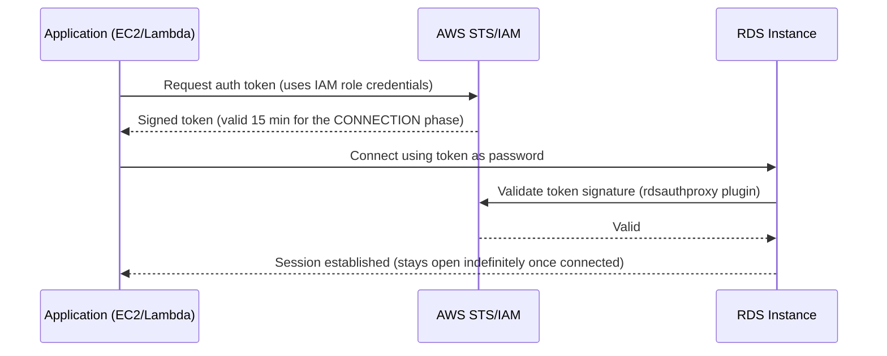

**Setup — 3 pillars:**
1. **Enable on the instance** — `iam_database_authentication_enabled = true`
2. **Map the DB user:**
   - PostgreSQL: `CREATE USER app_iam_user; GRANT rds_iam TO app_iam_user;`
   - MySQL: `CREATE USER 'app_iam_user'@'%' IDENTIFIED WITH AWSAuthenticationPlugin AS 'RDS';`
3. **Grant IAM policy to the compute role:**
   ```json
   {
     "Version": "2012-10-17",
     "Statement": [{
       "Effect": "Allow",
       "Action": "rds-db:connect",
       "Resource": "arn:aws:rds-db:ap-south-1:123456789012:dbuser:dbi-12345678/app_iam_user"
     }]
   }
   ```

**Trade-off:** tokens auto-expire in 15 minutes (connection phase only), eliminating hardcoded passwords — but token generation/validation is CPU-intensive. Historically capped at **200 new connections/second**, now scaled dynamically via **Dynamic Connection Rate Scaling** based on instance size. For high-throughput serverless workloads, pair with **RDS Proxy**.

---

## 11. RDS Proxy

Solves **connection exhaustion** — the classic failure mode when hundreds of short-lived Lambda invocations each try to open a direct DB connection.

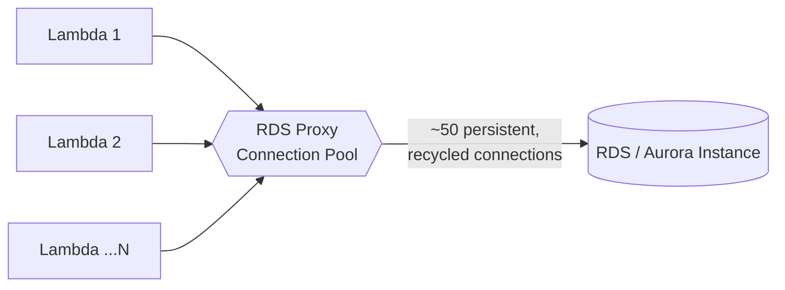

**How it works:** app connects to the **Proxy endpoint**, not the DB directly. The proxy maintains a small pool of persistent connections to the DB and **multiplexes** thousands of app-side sessions across it.

**Key benefits:**
- **Faster failovers** — up to 66% faster perceived downtime; the proxy holds app connections in a queue during failover instead of dropping them.
- **IAM auth offloading** — proxy validates tokens, sparing DB CPU.
- **Secrets Manager integration** — pulls credentials automatically.

**Supported engines:** Aurora (MySQL/PostgreSQL), RDS MySQL, RDS PostgreSQL, RDS MariaDB, RDS SQL Server.

> ⚠️ **Connection Pinning trap:** prepared statements, session-level variable changes, and temporary tables can "pin" a proxy session to one backend connection, disabling multiplexing for that session. Monitor pinning metrics in CloudWatch.

| Dimension | Direct Connection | With RDS Proxy |
|---|---|---|
| Connection capacity | Low (tied to DB RAM) | Very high (thousands) |
| Failover behavior | App drops, must retry | Connection held gracefully |
| Best fit | Monoliths/containers | Serverless / microservices |
| Cost | Free (included) | Extra charge (per vCPU/hour) |

---

## 12. RDS Custom

For legacy enterprise software (ERPs, commercial off-the-shelf apps) that **requires root OS access** — something standard RDS never allows.

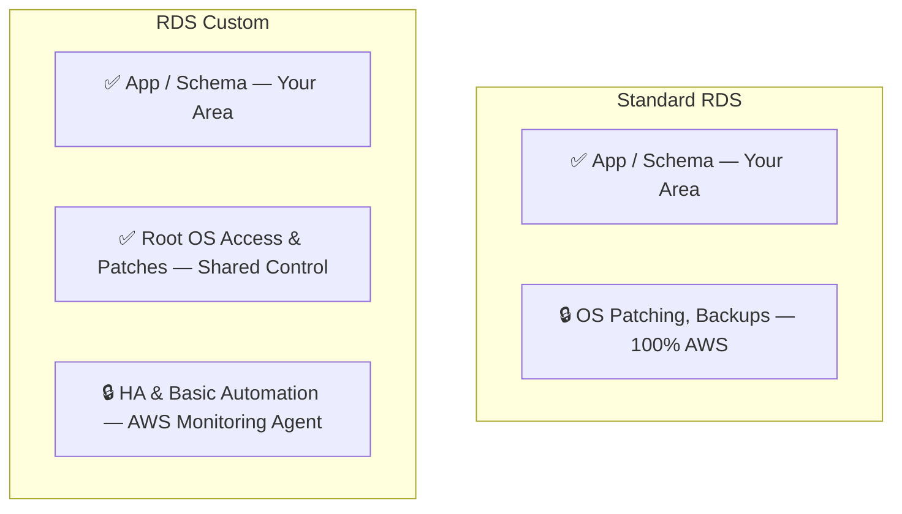

- **Supported engines:** SQL Server and Oracle only. *(Note: AWS is retiring RDS Custom for Oracle on March 31, 2027 — legacy Oracle workloads needing OS access should plan a move to EC2.)*
- **Support Guardrail:** you can **pause** automation monitoring during risky maintenance. If you break a required AWS system binary while automation is paused/active, the console flags the instance as **"outside the support perimeter"** with recovery instructions.

| Metric | Standard RDS | RDS Custom |
|---|---|---|
| OS/root access | No | Yes |
| Engines | MySQL, Postgres, MariaDB, SQL Server, Oracle, Db2, Aurora | SQL Server, Oracle only |
| Patching | Fully automatic | You control the schedule/binaries |
| 3rd-party agents | Not allowed | Allowed (AV, monitoring, security) |
| Best for | Cloud-native apps | Legacy COTS/ERP requiring OS access |

**Rule of thumb:** default to standard RDS. Only use RDS Custom when vendor docs explicitly require local admin/root OS access.

---

## 13. Monitoring & Logging

| Tool | Granularity | What it tells you |
|---|---|---|
| **CloudWatch Metrics** | Every 1 minute | Infrastructure health: `CPUUtilization`, `FreeableMemory`, `DatabaseConnections` |
| **Enhanced Monitoring** | Every 1 second (OS agent) | Exactly which system processes/threads consume CPU |
| **Performance Insights** | Query-level | Database load broken down by SQL statement, wait event, or user — pinpoints the exact slow query |

---

## 14. Version Upgrades & Blue/Green Deployments

- **Minor version upgrades** (e.g., MySQL 8.0.31 → 8.0.32): patches/bug fixes, safe to auto-apply during your weekly Maintenance Window.
- **Major version upgrades** (e.g., PostgreSQL 14 → 15): structural changes that can break app compatibility — never automatic.
- **Blue/Green Deployments:** spin up a full "Green" staging copy, upgrade and test it in isolation, then cut traffic over with minimal downtime and zero data loss.

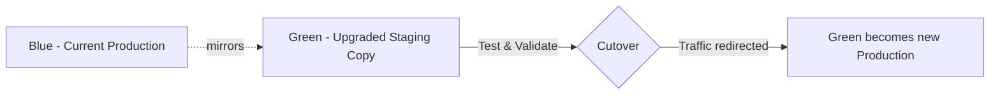

---

## 15. Storage Auto-Scaling

Set a maximum storage ceiling; when free space drops below **10%**, RDS automatically adds storage with **no downtime**. Note: any storage-type change or size scaling triggers an optimization process that can take **hours**, during which further storage modifications are blocked.

---

## 16. Amazon Aurora

AWS's cloud-native, MySQL/PostgreSQL-compatible engine — the evolution beyond "managed traditional RDBMS."

- **Decouples compute and storage** — storage scales independently and automatically.
- Data is **replicated 6 times across 3 Availability Zones** natively.
- **Aurora Serverless v2** scales compute up/down instantly based on live traffic, down to fractional capacity units.

---

## 17. Quick Reference Summary

| Dimension | Automated Backups | Manual Snapshots |
|---|---|---|
| Triggered by | AWS schedule | User / Terraform |
| Max retention | 35 days | Indefinite |
| PITR | Yes | No |
| Survives instance deletion | No (by default) | Yes |

| Availability Option | Data Loss (RPO) | Downtime (RTO) | Readable? |
|---|---|---|---|
| Single-AZ | High risk | Manual recovery | Yes |
| Multi-AZ Instance | ~0 | 30–60s | No (standby hidden) |
| Multi-AZ Cluster | ~0 | <35s | Yes (2 readers) |
| Read Replica | Lag-dependent | Manual promotion | Yes |

**Next:** jump into [`hands-on-labs.md`](./hands-on-labs.md) to build every one of these concepts in a real AWS account, or [`commands-cheatsheet.md`](./commands-cheatsheet.md) for copy-paste CLI/Terraform.
