# AWS IAM — End-to-End Practical Guide

A complete, hands-on map of AWS Identity and Access Management: from the four core building blocks to organization-wide guardrails, dynamic access control, and modern DevSecOps tooling. Built for practical learning — every concept links to a runnable lab.

> 📁 **This repo:**
> - `README.md` — concepts, architecture, diagrams (you are here)
> - [`commands-cheatsheet.md`](./commands-cheatsheet.md) — every AWS CLI command you need, grouped by topic
> - [`hands-on-labs.md`](./hands-on-labs.md) — 12 step-by-step labs you can run in a sandbox account
> - [`troubleshooting.md`](./troubleshooting.md) — decoding `AccessDenied`, PassRole issues, trust policy failures

---

## Table of Contents

1. [What is IAM?](#1-what-is-iam)
2. [The 4 Core Components](#2-the-4-core-components)
3. [Anatomy of an IAM Policy (PARC)](#3-anatomy-of-an-iam-policy-parc)
4. [Basic Request Evaluation Logic](#4-basic-request-evaluation-logic)
5. [Types of IAM Policies](#5-types-of-iam-policies)
6. [Types of IAM Roles](#6-types-of-iam-roles)
7. [Policy vs Role — At a Glance](#7-policy-vs-role--at-a-glance)
8. [Multi-Account Guardrails: SCPs & RCPs](#8-multi-account-guardrails-scps--rcps)
9. [Dynamic Access Control: ABAC & Policy Variables](#9-dynamic-access-control-abac--policy-variables)
10. [The `iam:PassRole` Mechanism](#10-the-iampassrole-mechanism)
11. [The Complete Policy Evaluation Order](#11-the-complete-policy-evaluation-order)
12. [Security & Auditing Tools](#12-security--auditing-tools)
13. [Human vs Machine Access Architecture](#13-human-vs-machine-access-architecture)
14. [DevSecOps: Shift-Left & Automated Policy Generation](#14-devsecops-shift-left--automated-policy-generation)
15. [Troubleshooting Authorization Failures](#15-troubleshooting-authorization-failures)
16. [Golden Rules / Best Practices](#16-golden-rules--best-practices)
17. [Suggested Learning Path](#17-suggested-learning-path)

---

## 1. What is IAM?

Think of IAM as the bouncer and security system for your entire AWS account. It answers two questions for every single API call:

- **Who are you?** → Authentication
- **What are you allowed to do?** → Authorization

AWS is **deny-by-default**: a brand-new identity can do *nothing* until a policy explicitly grants it permission. This is the Principle of Least Privilege baked into the platform itself.

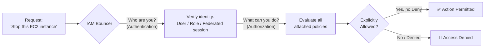

---

## 2. The 4 Core Components

| Component | What it is | Key fact |
|---|---|---|
| 👤 **Users** | A person or a service identity (e.g. `Alice`, `ci-cd-pipeline`) | Zero permissions by default; gets a console password and/or access keys |
| 👥 **Groups** | A collection of Users | Cannot be nested — a group can never contain another group |
| 🎭 **Roles** | An identity with permission policies, *not* tied to one person — meant to be **assumed** temporarily | Used by AWS services, cross-account users, and federated users |
| 📜 **Policies** | JSON documents that state what is Allowed/Denied | Attached to Users, Groups, Roles, or directly to Resources |

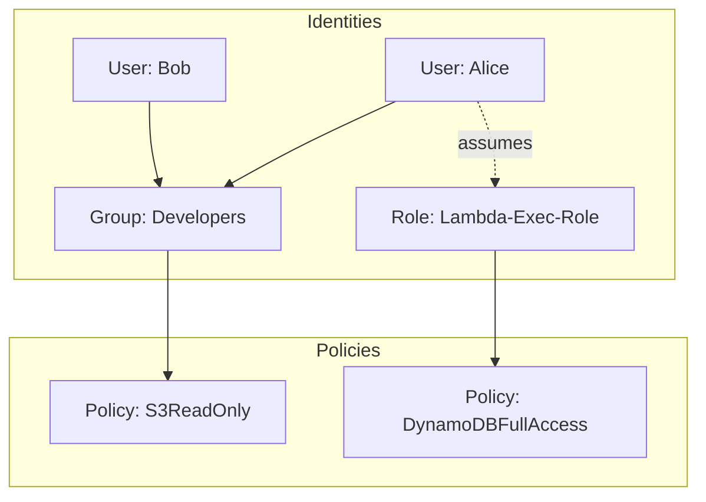

**Who assumes Roles?**
- **AWS Services** — an EC2 instance reading from S3
- **Cross-account users** — a user in Account A needs temporary access into Account B
- **Federated users** — employees logging in via corporate SSO (Okta, Azure AD, Google Workspace)

---

## 3. Anatomy of an IAM Policy (PARC)

Every policy is JSON. If you can read this block, you understand IAM permissions:

```json
{
  "Version": "2012-10-17",
  "Statement": [
    {
      "Effect": "Allow",
      "Action": [
        "s3:GetObject",
        "s3:ListBucket"
      ],
      "Resource": "arn:aws:s3:::my-awesome-bucket/*",
      "Condition": {
        "Bool": { "aws:MultiFactorAuthPresent": "true" }
      }
    }
  ]
}
```

Use the **PARC** framework to read any policy:

| Letter | Field | Question it answers |
|---|---|---|
| **P** | Principal | Who is asking? *(implicit for identity-based policies — it's whoever the policy is attached to)* |
| **A** | Action | What are they trying to do? e.g. `s3:GetObject` = download a file |
| **R** | Resource | Which exact AWS asset? Identified by ARN |
| **C** | Condition *(optional)* | Under what circumstances? e.g. only with MFA, or only from a given IP |

---

## 4. Basic Request Evaluation Logic

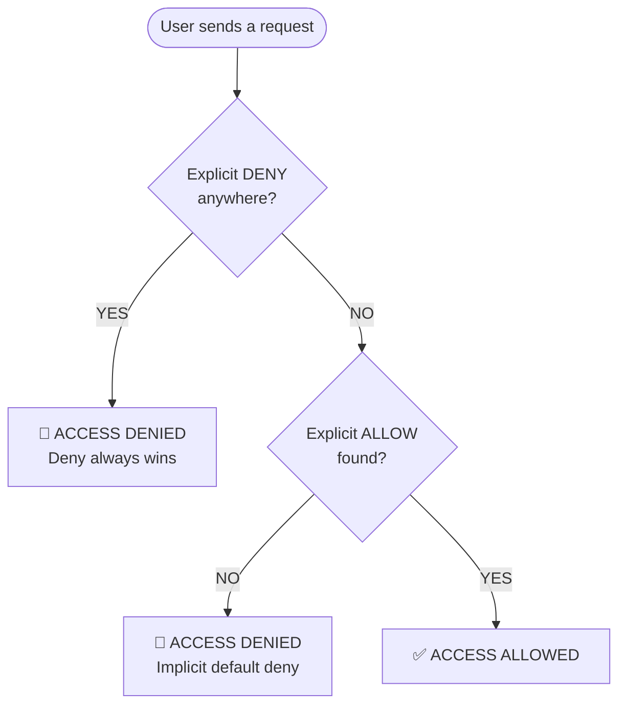

- **Deny by default** — every request starts denied.
- **Explicit Deny wins** — if *any* applicable policy says `Deny`, evaluation stops immediately. Nothing overrides it.
- **Explicit Allow** — if no Deny exists and at least one policy says `Allow`, the request proceeds.
- **Implicit Deny** — no Deny, no Allow found anywhere → denied automatically.

---

## 5. Types of IAM Policies

Policies split into **identity-based** (attached to a person/role) and **resource-based** (attached to the asset itself).

### 5.1 Managed Policies
Standalone policies you can attach to many identities at once.
- **AWS Managed** — created/maintained by AWS (e.g. `AdministratorAccess`, `AmazonS3ReadOnlyAccess`). Auto-updated by AWS as features evolve.
- **Customer Managed** — created and maintained by you. Best practice for production — precise, versioned control.

### 5.2 Inline Policies
Embedded directly into a *single* user/group/role — a strict 1:1 relationship. Delete the identity, the policy dies with it.
> Use rarely — only when you must guarantee a policy can never be reused elsewhere.

### 5.3 Resource-Based Policies
Attached directly to the AWS resource (S3 bucket, SQS queue, KMS key) instead of the identity.
- Must explicitly name a **Principal** (identity-based policies don't need this since the identity *is* the principal).
- Example: an S3 bucket policy that lets an external account download files.

### 5.4 Permissions Boundaries
An advanced guardrail that caps the **maximum** permissions an identity can ever hold — even if an attached policy grants more.

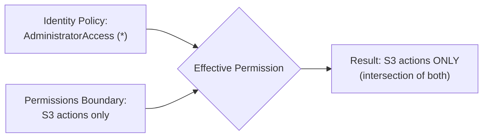

---

## 6. Types of IAM Roles

A role has **no permanent credentials** — it hands out short-lived credentials via **AWS STS**. Every role needs a **Trust Policy**, defining *who* is allowed to assume it.

### 6.1 AWS Service Roles
- **EC2 Instance Profile Role** — attached to a VM so the app inside can call S3, DynamoDB, etc. without hardcoded keys.
- **Lambda Execution Role** — grants a function permission to run and write logs to CloudWatch.

### 6.2 Cross-Account Access Roles
A user in Account A calls `sts:AssumeRole` to temporarily operate inside Account B — no duplicate IAM user needed. Core pattern for Dev/Stage/Prod account separation.

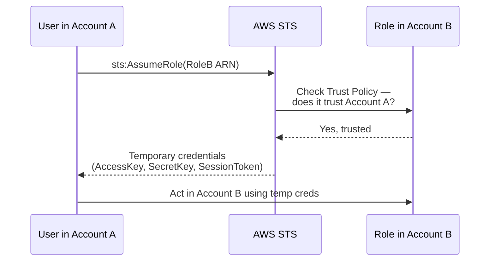

### 6.3 Identity Federation Roles (Web / SAML)
- **SAML 2.0 Federation** — connects AWS to a corporate IdP (Okta, Azure AD, Ping Identity).
- **Web Identity Federation (OIDC)** — connects apps to public identity providers (Login with Amazon, Google, Apple).

### 6.4 Service-Linked Roles
Predefined by AWS and linked to one specific service (e.g. Auto Scaling, CloudWatch monitoring). AWS creates/manages these automatically — you can't delete them until the dependent service is removed.

---

## 7. Policy vs Role — At a Glance

| Feature | IAM Policy | IAM Role |
|---|---|---|
| What is it? | A JSON permissions document | An assumable identity |
| Has credentials? | No | Yes — temporary only, via STS |
| Attached to | Users, Groups, Roles, or Resources | N/A — it *is* the identity |
| Analogy | A security clearance list | A temporary security uniform |

---

## 8. Multi-Account Guardrails: SCPs & RCPs

Individual IAM policies don't scale across dozens of AWS accounts. **AWS Organizations** adds two org-wide guardrail layers:

### Service Control Policies (SCPs)
Set the **maximum possible permissions** for an entire account. Attached at the Organization root or OU level. Even a user with `AdministratorAccess` inside the account is capped by the SCP.
> **Use case:** restrict all deployments to `us-east-1`/`ap-south-1`, or block anyone from disabling CloudTrail logging.

### Resource Control Policies (RCPs)
Complement SCPs by restricting access **to resources** at the org level (rather than restricting identities). Used to build a strict **data perimeter** — e.g. ensuring S3 buckets can only ever be touched by identities that belong to your organization, regardless of what an identity-based policy says.

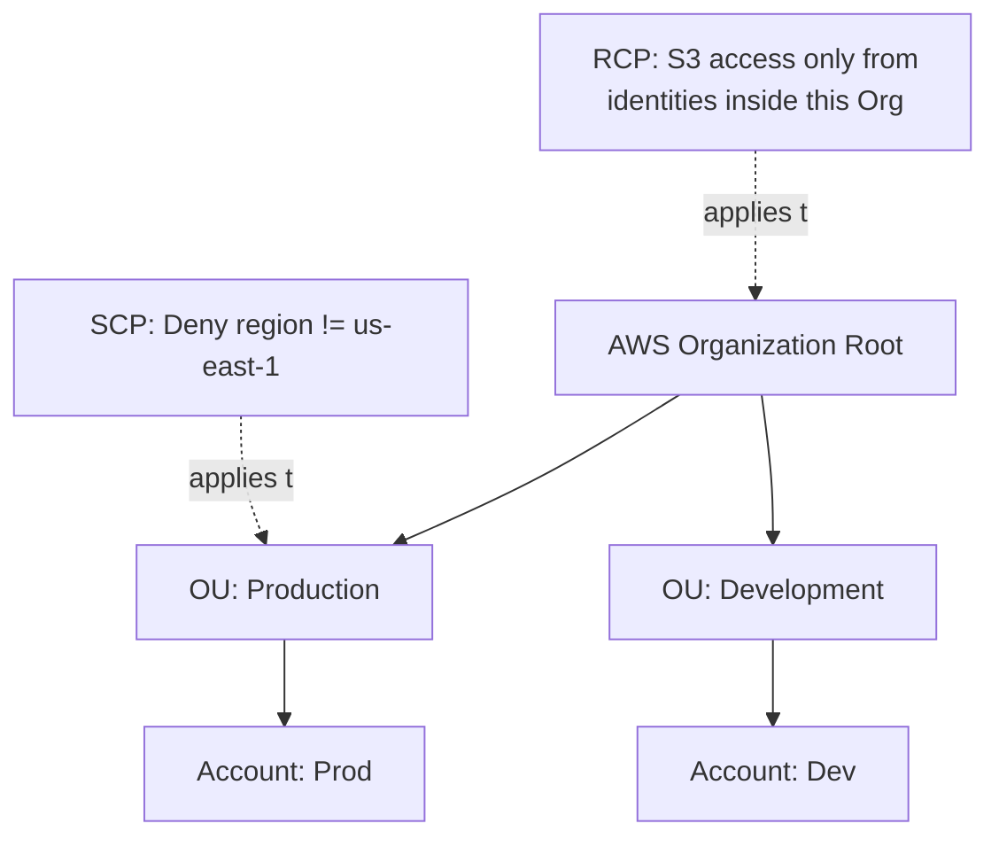

---

## 9. Dynamic Access Control: ABAC & Policy Variables

Writing a static policy per user doesn't scale. Two techniques fix this:

### Attribute-Based Access Control (ABAC)
Grant access based on **tags** on both the identity and the resource, instead of hardcoding usernames (RBAC).

> Example rule: *"An engineer can stop an EC2 instance only if the user's `team` tag matches the instance's `team` tag."*

When a new project starts, you just tag the new resources — no policy edits required.

### Policy Variables
Runtime context keys AWS substitutes when evaluating a policy:

```json
{
  "Effect": "Allow",
  "Action": "s3:*",
  "Resource": "arn:aws:s3:::my-bucket/home/${aws:username}/*"
}
```
One single policy, and every user only ever reaches their own folder.

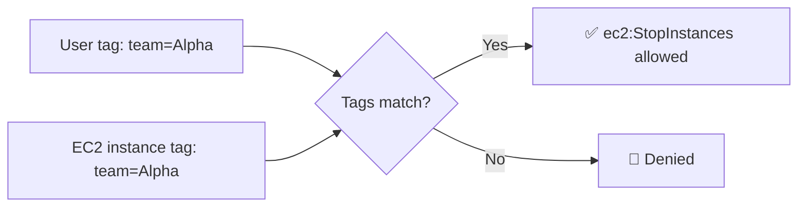

---

## 10. The `iam:PassRole` Mechanism

The API call that trips up nearly every engineer working with automation, Terraform, or CloudFormation.

When you configure a service (EC2, ECS, Lambda) to *run as* a given IAM Role, you are **passing** that role to the service. Your own identity needs explicit permission to call `iam:PassRole` on that specific target role — otherwise anyone could launch a resource with an all-powerful role attached.

> ⚠️ **The risk:** without restricting `PassRole`, a low-privilege developer could launch an EC2 instance, pass it an Admin role, SSH in, and pull admin credentials from the instance metadata — a privilege-escalation path.

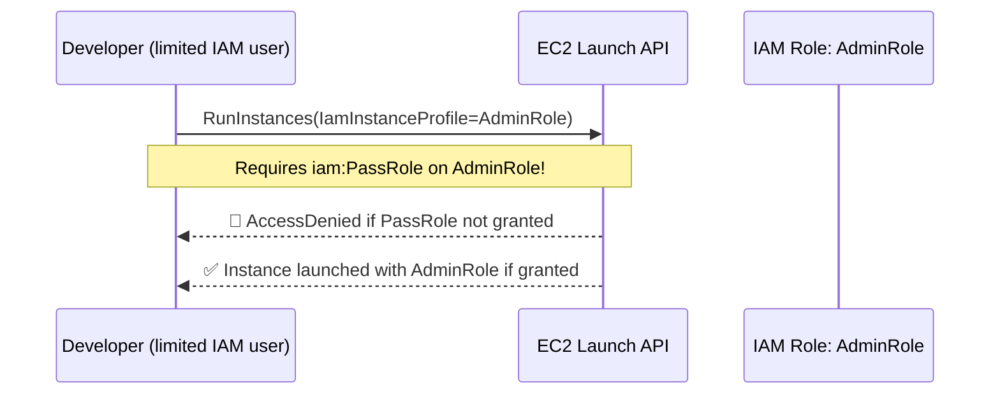

**Mitigation:** scope `iam:PassRole` down with a `Resource` ARN and a `Condition` (e.g. `iam:PassedToService`) so a developer can only pass *specific*, pre-approved roles.

---

## 11. The Complete Policy Evaluation Order

The simplified Allow/Deny logic from Section 4 is real, but in production every layer below is evaluated, in this exact order:

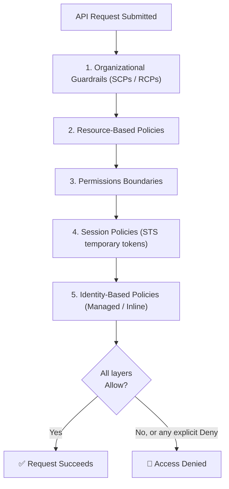

**The golden rule stands:** an explicit `Deny` at *any* layer instantly kills the request. For success, **every** layer in the chain must independently allow it — this is an intersection, not a majority vote.

---

## 12. Security & Auditing Tools

| Tool | What it does |
|---|---|
| **IAM Access Analyzer** | Scans resource-based policies to flag anything shared publicly or with external accounts. Can also mine CloudTrail logs to find **unused access** — permissions granted but never actually exercised — so you can safely trim them. |
| **IAM Policy Simulator** | Console/API tool to test a hypothetical policy against real API actions *without* actually executing anything in your live environment. |

---

## 13. Human vs Machine Access Architecture

Modern AWS environments split identity into two completely separate paths.

### Human Access → AWS IAM Identity Center
- **Old pattern (avoid):** individual IAM Users with console passwords and long-lived access keys.
- **Modern pattern:** IAM Identity Center (successor to AWS SSO), synced to Okta/Azure AD/Google Workspace via **SCIM**. Users authenticate once via SSO and receive short-lived temporary tokens.

### Machine Access → IAM Roles Anywhere
For workloads **outside** AWS (on-prem servers, other clouds) that need AWS credentials but can't hold an EC2 Instance Profile.
- Uses **PKI / X.509 certificates** to establish trust between your external infrastructure and AWS.
- External servers exchange a certificate for temporary credentials via STS — no hardcoded keys, ever.

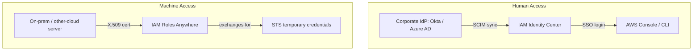

---

## 14. DevSecOps: Shift-Left & Automated Policy Generation

- **Shift-Left Validation** — tools like IAM Access Analyzer run inside CI/CD pipelines, scanning Terraform/CloudFormation *before* apply, blocking over-privileged or insecure roles from ever reaching production.
- **Automated Policy Generation — IAM Policy Autopilot** — an open-source AWS Labs tool (launched re:Invent 2025) available as a CLI and an MCP server. It statically analyzes your application code (Python, Go, TypeScript, Java) and deterministically maps real SDK calls to the exact IAM actions required, generating a tight baseline policy instead of a hand-written wildcard. It plugs into AI coding assistants like Claude Code, Kiro, and Cursor, and complements Access Analyzer for ongoing least-privilege refinement.

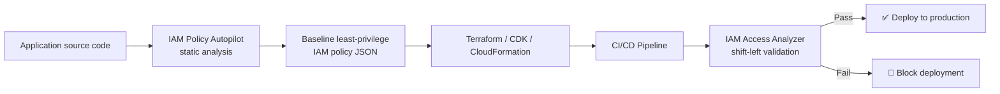

---

## 15. Troubleshooting Authorization Failures

When an app throws `AccessDenied`, AWS actually tells you *which* policy blocked it — the error text includes the ARN of the denying policy (organizational guardrail, resource policy, or identity boundary), cutting debugging time dramatically.

👉 Full decision tree, common error messages, and fixes: **[troubleshooting.md](./troubleshooting.md)**

---

## 16. Golden Rules / Best Practices

- 🔒 **Lock away the Root account** — create an IAM admin user for daily work, enable MFA on Root, and never use Root again.
- 🔑 **Never share or commit Access Keys** — treat them like passwords; never push to GitHub.
- 🎭 **Use Roles for EC2/Lambda** — never hardcode credentials in code running on AWS.
- ✅ **Enforce MFA** for all console users.
- 📉 **Least privilege by default** — start narrow, use Access Analyzer's unused-access findings to trim further, and use IAM Policy Autopilot to generate accurate baselines instead of wildcards.
- 🛡️ **Guard `iam:PassRole`** — always scope it to specific role ARNs.
- 🏢 **Prefer IAM Identity Center over IAM Users** for humans; prefer **Roles Anywhere** over static keys for non-AWS machines.

---

## 17. Suggested Learning Path

1. Read this README top to bottom once, fully.
2. Work through [`hands-on-labs.md`](./hands-on-labs.md) in order — each lab builds on the last.
3. Keep [`commands-cheatsheet.md`](./commands-cheatsheet.md) open in a second tab while you work.
4. When something breaks, go straight to [`troubleshooting.md`](./troubleshooting.md).

---

*Concept source: personal AWS IAM study notes. Diagrams rendered with [Mermaid](https://mermaid.js.org/) — view natively on GitHub.*
