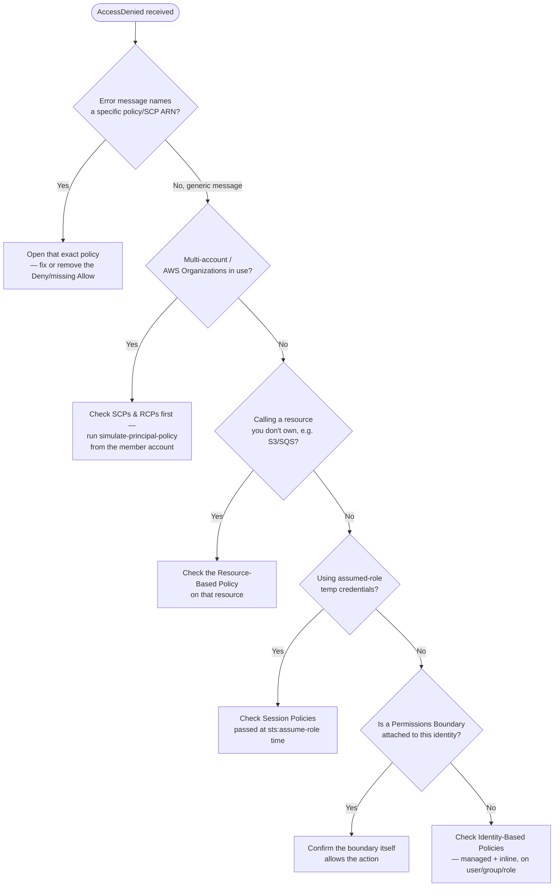

# AWS IAM — Troubleshooting Guide

A practical decision tree for `AccessDenied` and related IAM failures, plus fixes for the errors that trip people up most often. Pairs with [`README.md`](./README.md) §11 (Complete Policy Evaluation Order) and [`commands-cheatsheet.md`](./commands-cheatsheet.md) §17.

---

## 1. Start Here: Read the Error Message Fully

AWS embeds the **ARN of the denying policy** directly inside the `AccessDenied` message whenever an organizational guardrail, resource policy, or permissions boundary is the cause. Don't guess — the answer is often printed right there.

```
An error occurred (AccessDenied) when calling the StopInstances operation:
User: arn:aws:iam::123456789012:user/lab-contractor is not authorized to perform:
ec2:StopInstances because no identity-based policy allows the ec2:StopInstances action
```

Look for phrases like:
- `explicit deny in an identity-based policy`
- `explicit deny in a service control policy`
- `because no identity-based policy allows`
- `with an explicit deny in a resource-based policy`

Each phrase points to a **different layer** — go straight to that section below.

---

## 2. The Diagnostic Decision Tree



Remember the evaluation order from the README: **SCP/RCP → Resource Policy → Permissions Boundary → Session Policy → Identity Policy.** Work top-down; a Deny anywhere in that chain stops the request immediately, so start with the outermost layer.

---

## 3. Common Errors and Fixes

### "is not authorized to perform: `X` because no identity-based policy allows the `X` action"
- **Meaning:** implicit deny — nothing granted this action at all.
- **Fix:** attach a policy (managed, customer, or inline) to the user/group/role containing that action.
- **Verify before changing anything:**
  ```bash
  aws iam simulate-principal-policy \
    --policy-source-arn <principal-arn> \
    --action-names <the-action> \
    --resource-arns <the-resource-arn>
  ```

### "with an explicit deny in a service control policy"
- **Meaning:** an SCP at the OU/Org level is blocking this, full stop — no identity policy can override it.
- **Fix:** as an Organizations admin, find the SCP: `aws organizations list-policies-for-target --target-id <account-id> --filter SERVICE_CONTROL_POLICY`, then inspect and adjust it.
- **Common cause:** a region-lock or service-restriction SCP (see README §8) is broader than intended.

### "with an explicit deny in a resource-based policy"
- **Meaning:** the S3 bucket policy / KMS key policy / SQS queue policy itself denies you, even though your IAM policy allows it.
- **Fix:** `aws s3api get-bucket-policy --bucket <name>` and look for a `Deny` statement whose `Condition` matches your request (a very common one: `aws:SourceIp` or `aws:PrincipalOrgID` restrictions that unexpectedly exclude you).

### "User is not authorized to perform: `iam:PassRole` on resource: ..."
- **Meaning:** you're trying to launch a service (EC2/Lambda/ECS) with a role attached, but you personally lack `iam:PassRole` on that role ARN.
- **Fix:** grant a *scoped* PassRole permission — never a wildcard `Resource: "*"` for this action:
  ```json
  {
    "Effect": "Allow",
    "Action": "iam:PassRole",
    "Resource": "arn:aws:iam::123456789012:role/EXACT-ROLE-NAME",
    "Condition": { "StringEquals": { "iam:PassedToService": "ec2.amazonaws.com" } }
  }
  ```
- **Security note:** never fix this by attaching `iam:PassRole` with `Resource: "*"` — that reopens the privilege-escalation path described in README §10.

### "The security token included in the request is invalid" / "ExpiredToken"
- **Meaning:** you're using STS temporary credentials that have expired (default 1 hour, up to 12 hours depending on how they were requested).
- **Fix:** re-run `sts assume-role` (or refresh SSO login: `aws sso login`).

### Trust policy `AssumeRole` failures — "not authorized to perform: sts:AssumeRole"
- **Meaning:** the role's **trust policy** doesn't list your principal, or a condition (e.g. MFA, external ID) isn't satisfied.
- **Fix checklist:**
  1. `aws iam get-role --role-name <role> --query 'Role.AssumeRolePolicyDocument'`
  2. Confirm your exact ARN (user or role) appears in `Principal`.
  3. If there's a `Condition` block (MFA, `sts:ExternalId`), confirm your session actually satisfies it.
  4. For cross-account roles, confirm the calling side also has `sts:AssumeRole` allowed in its *own* identity policy targeting that role ARN — both sides must agree.

### Permissions Boundary silently blocking an "obviously allowed" action
- **Meaning:** the identity policy allows it, but the boundary doesn't include it — the *intersection* wins, so both must allow.
- **Fix:** `aws iam get-role --role-name <role> --query 'Role.PermissionsBoundary'` (or `get-user`), then inspect that boundary policy specifically.

### ABAC policy not matching even though tags "look right"
- **Common causes:**
  - Tag key/value **case mismatch** (`Team` vs `team`) — tag matching is case-sensitive.
  - Tag not yet propagated — resource tags can take a minute to be visible to policy evaluation.
  - Using `aws:ResourceTag` when you meant `aws:PrincipalTag`, or vice versa.
- **Fix:** `aws iam list-user-tags --user-name <user>` and compare directly against the resource's tags.

### Cross-Account resource sharing works for some principals but not others
- **Meaning:** likely a mismatch between a Resource-Based Policy naming one account/user and an RCP or bucket-level Block Public Access setting overriding it.
- **Fix:** check `aws s3api get-public-access-block --bucket <name>` in addition to the bucket policy — Block Public Access can silently override an otherwise-correct policy.

---

## 4. Tools to Confirm a Diagnosis (Don't Guess — Verify)

| Tool | When to use it |
|---|---|
| `aws iam simulate-principal-policy` | "Would this specific identity be allowed to do X on Y, right now, with all attached policies?" |
| `aws iam simulate-custom-policy` | "If I attached this **draft** policy, would it allow X?" — test before deploying |
| `aws accessanalyzer validate-policy` | Catches JSON syntax errors and IAM best-practice warnings before you attach anything |
| `aws cloudtrail lookup-events --lookup-attributes AttributeKey=EventName,AttributeValue=AccessDenied` | Find the exact recent denied call, its full error, and the identity that made it |
| `aws iam get-service-last-accessed-details` | "Has this role actually used the permissions it has?" — great for pruning over-broad policies |
| IAM Access Analyzer findings (console or `list-findings`) | "Is this resource policy accidentally exposing something externally?" |

---

## 5. General Debugging Checklist

1. **Read the full error text** — it usually names the layer and sometimes the exact policy ARN.
2. **Confirm your identity:** `aws sts get-caller-identity` — you may be authenticated as someone/something other than you expect (a stale assumed-role session is the #1 cause of confusing debugging sessions).
3. **Simulate before you edit** any policy — `simulate-principal-policy` tells you the answer in seconds instead of a trial-and-error deploy loop.
4. **Work outside-in:** Org guardrails (SCP/RCP) → Resource policy → Permissions boundary → Session policy → Identity policy.
5. **Check for `Deny` before looking for missing `Allow`** — an explicit Deny anywhere is a faster explanation than a missing grant, and it's the more common gotcha once you're past the beginner stage.
6. **When it "should just work":** double check tags (ABAC), trust policy principals (AssumeRole), and PassRole scoping — these three cause the majority of "but I attached AdministratorAccess and it's *still* denied" tickets.

---

⬅️ Back to [`README.md`](./README.md) · [`commands-cheatsheet.md`](./commands-cheatsheet.md) · [`hands-on-labs.md`](./hands-on-labs.md)
