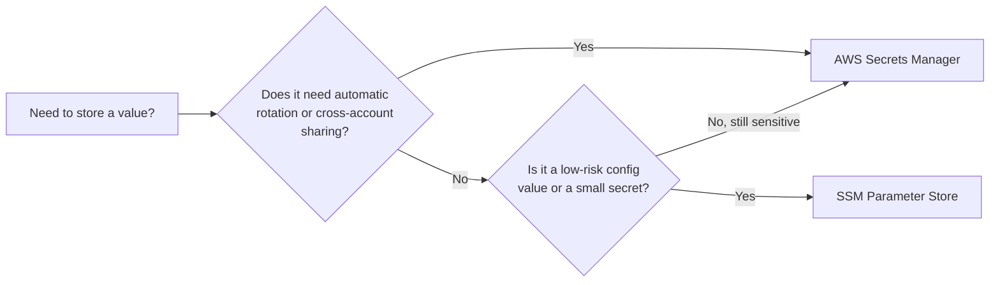
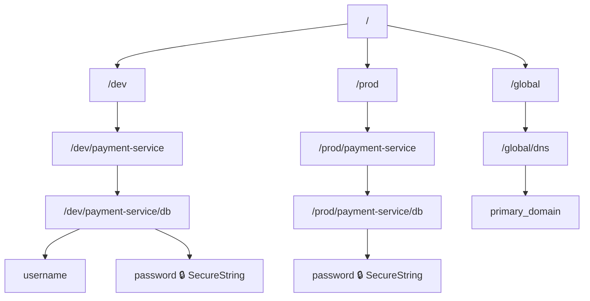
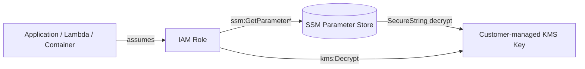
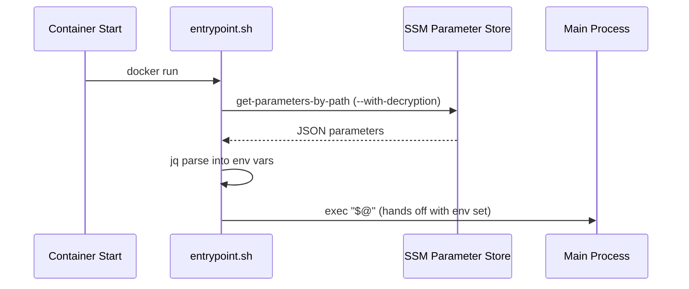
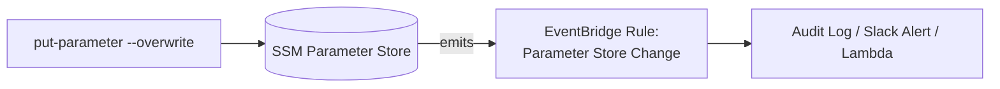
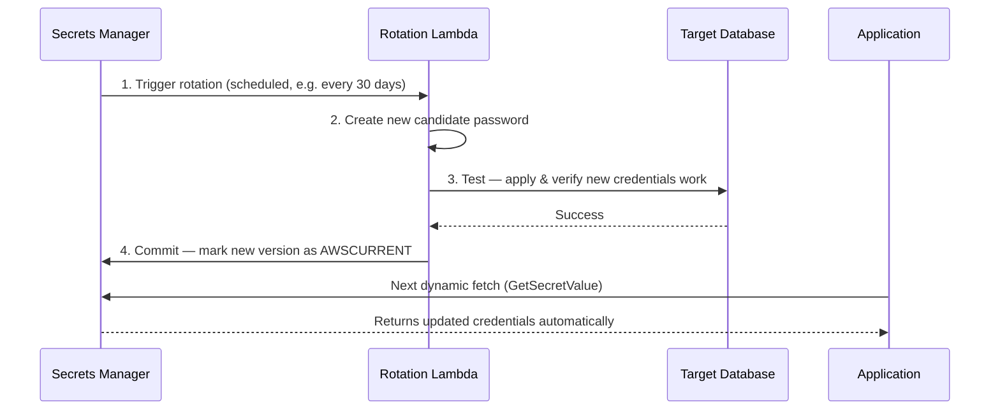
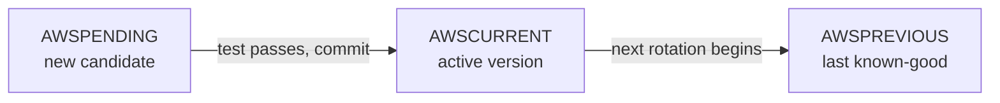

# AWS Configuration & Secrets Management — End to End

A practical, diagram-backed learning repo covering **AWS Systems Manager (SSM) Parameter Store** and **AWS Secrets Manager** — from path design and IAM, through Terraform provisioning, to application integration and automated rotation.

> 📁 This repo is split into four docs. Start here, then jump to whichever one matches what you're doing right now.

| File | Purpose |
|---|---|
| [`README.md`](./README.md) | Concepts, architecture, diagrams — the "why" and "how it fits together" |
| [`commands-cheatsheet.md`](./commands-cheatsheet.md) | Every CLI command, copy-paste ready |
| [`hands-on-labs.md`](./hands-on-labs.md) | Step-by-step labs you can actually run |
| [`troubleshooting.md`](./troubleshooting.md) | Common errors and how to fix them |

---

## Table of Contents

1. [Why Two Services?](#why-two-services)
2. [Part 1 — SSM Parameter Store](#part-1--ssm-parameter-store)
   - [1.1 Path Hierarchy Design](#11-path-hierarchy-design)
   - [1.2 Parameter Types & Tiers](#12-parameter-types--tiers)
   - [1.3 Architecture](#13-architecture)
   - [1.4 Infrastructure as Code](#14-infrastructure-as-code-terraform)
   - [1.5 Least-Privilege IAM](#15-least-privilege-iam)
   - [1.6 Application Integration](#16-application-integration)
   - [1.7 Operations: Throughput, Versioning, Drift](#17-operations-throughput-versioning-drift)
3. [Part 2 — AWS Secrets Manager](#part-2--aws-secrets-manager)
   - [2.1 Architecture & Secret Structure](#21-architecture--secret-structure)
   - [2.2 Infrastructure as Code](#22-infrastructure-as-code-terraform)
   - [2.3 Least-Privilege IAM](#23-least-privilege-iam)
   - [2.4 Application Integration](#24-application-integration)
   - [2.5 Automated Rotation](#25-automated-rotation)
   - [2.6 Version Staging Labels](#26-version-staging-labels)
4. [Part 3 — Choosing Between Them](#part-3--choosing-between-them)
5. [Repo Roadmap](#repo-roadmap)

---

## Why Two Services?

Both services store configuration/secret data as key-value pairs and both integrate with IAM and KMS. The split exists because they optimize for different things:

- **SSM Parameter Store** → free, simple, great for general app config and low-risk secrets.
- **AWS Secrets Manager** → paid, built for high-security credentials that need **automatic rotation** and **cross-account sharing**.



---

## Part 1 — SSM Parameter Store

### 1.1 Path Hierarchy Design

Avoid flat names like `DB_PASSWORD`. Use hierarchical paths so you can fetch settings in bulk and control access down to a specific environment.

```
/dev/payment-service/db/username
/dev/payment-service/db/password        (SecureString)
/prod/payment-service/db/password       (SecureString)
/global/dns/primary_domain              (shared across apps)
```



**Why this matters:** the path becomes your access-control boundary. An IAM policy scoped to `/dev/payment-service/*` physically cannot touch `/prod/*`, no matter what the application code does.

### 1.2 Parameter Types & Tiers

| Type | Use for |
|---|---|
| `String` | Plain config values (URLs, flags, region names) |
| `StringList` | Comma-separated lists |
| `SecureString` | Anything sensitive — encrypted via KMS |

| Tier | Size limit | Cost | Extra features |
|---|---|---|---|
| Standard | 4 KB | Free | — |
| Advanced | 8 KB | Paid per parameter | Parameter Policies (e.g. auto-expiry) |

### 1.3 Architecture



The app never talks to KMS directly for parameters — SSM does that on its behalf, but the caller's IAM role still needs `kms:Decrypt` permission on the key, or the decrypt call is denied.

### 1.4 Infrastructure as Code (Terraform)

Separate plain config from encrypted secrets, and use a **customer-managed KMS key** rather than the default AWS-managed key so you control the decryption boundary.

```hcl
# KMS key dedicated to SSM SecureStrings
resource "aws_kms_key" "ssm_key" {
  description             = "KMS key for Parameter Store SecureStrings"
  deletion_window_in_days = 7
}

# Standard configuration string
resource "aws_ssm_parameter" "db_url" {
  name        = "/dev/payment-service/db/url"
  type        = "String"
  value       = "jdbc:mysql://dev-db.local:3306/payments"
  description = "Database connection endpoint"
}

# Sensitive secret (encrypted via KMS)
resource "aws_ssm_parameter" "db_password" {
  name        = "/dev/payment-service/db/password"
  type        = "SecureString"
  key_id      = aws_kms_key.ssm_key.arn
  value       = "SuperSecretPassword123!"
  description = "Database primary password"
}
```

> ⚠️ In real projects, never hardcode the `value` in `.tf` source. Pass it via `-var`, a CI secret, or seed it once via CLI and manage drift outside Terraform (`lifecycle { ignore_changes = [value] }`).

### 1.5 Least-Privilege IAM

Grant an app running in `dev` read access to only its own path, plus decrypt on the specific key — nothing else.

```json
{
  "Version": "2012-10-17",
  "Statement": [
    {
      "Effect": "Allow",
      "Action": [
        "ssm:GetParameter",
        "ssm:GetParameters",
        "ssm:GetParametersByPath"
      ],
      "Resource": "arn:aws:ssm:us-east-1:123456789012:parameter/dev/payment-service/*"
    },
    {
      "Effect": "Allow",
      "Action": ["kms:Decrypt"],
      "Resource": "arn:aws:kms:us-east-1:123456789012:key/your-custom-kms-key-id"
    }
  ]
}
```

### 1.6 Application Integration

Two common patterns, depending on how the app is built.

**Strategy A — Runtime fetch (Python / boto3).** Good for Lambda, ECS, or anything that can call AWS APIs directly at startup.

```python
import boto3

def get_db_credentials():
    ssm = boto3.client('ssm', region_name='us-east-1')

    # Fetch everything under the service path in one call
    response = ssm.get_parameters_by_path(
        Path='/dev/payment-service/db/',
        Recursive=True,
        WithDecryption=True
    )

    config = {}
    for param in response['Parameters']:
        key = param['Name'].split('/')[-1]
        config[key] = param['Value']

    return config

db_creds = get_db_credentials()
print(f"Connecting with user: {db_creds.get('username')}")
```

**Strategy B — Container entrypoint injection (Bash + jq).** Good for legacy apps that only understand plain environment variables.

```bash
#!/bin/bash
PARAM_JSON=$(aws ssm get-parameters-by-path --path "/dev/payment-service/db/" --recursive --with-decryption --region us-east-1)

export DB_USER=$(echo $PARAM_JSON | jq -r '.Parameters[] | select(.Name | endswith("/username")) | .Value')
export DB_PASS=$(echo $PARAM_JSON | jq -r '.Parameters[] | select(.Name | endswith("/password")) | .Value')

exec "$@"
```



### 1.7 Operations: Throughput, Versioning, Drift

- **Throughput:** default cap is **40 TPS**. For high-scale or busy CI/CD pipelines, enable **High Throughput** in the console to raise this to **10,000 TPS**.
- **Versioning:** every `put-parameter --overwrite` increments a version automatically — no extra setup needed.
- **Drift/audit tracking:** pair Parameter Store with **EventBridge** to catch `Parameter Store Change` events and route them to an ops/audit system in near real time.



---

## Part 2 — AWS Secrets Manager

### 2.1 Architecture & Secret Structure

Secrets Manager stores secrets as a **single JSON blob** per secret name — bundling username, password, host, and port together instead of splitting them into separate parameters.

```
dev/payment-service/rds-mysql
prod/payment-service/rds-mysql
global/api-keys/stripe
```

```json
{
  "username": "db_admin",
  "password": "InitialSecurePasswordPassword123!",
  "engine": "mysql",
  "host": "prod-db.cluster-c123.us-east-1.rds.amazonaws.com",
  "port": "3306"
}
```

### 2.2 Infrastructure as Code (Terraform)

Split the secret **container** (name, KMS key, description) from its **versioned payload** — this mirrors how Secrets Manager itself models data internally.

```hcl
# Dedicated KMS key for this secret
resource "aws_kms_key" "secrets_key" {
  description             = "KMS key for encrypting production secrets"
  deletion_window_in_days = 7
}

# The secret container
resource "aws_secretsmanager_secret" "db_secret" {
  name        = "prod/payment-service/rds-mysql"
  kms_key_id  = aws_kms_key.secrets_key.arn
  description = "Production database credentials for payment service"
}

# The initial payload
resource "aws_secretsmanager_secret_version" "db_secret_val" {
  secret_id     = aws_secretsmanager_secret.db_secret.id
  secret_string = jsonencode({
    username = "db_admin"
    password = "InitialSecurePasswordPassword123!"
    engine   = "mysql"
    host     = "prod-db.cluster-c123.us-east-1.rds.amazonaws.com"
    port     = "3306"
  })
}
```

### 2.3 Least-Privilege IAM

```json
{
  "Version": "2012-10-17",
  "Statement": [
    {
      "Sid": "AllowReadSpecificSecret",
      "Effect": "Allow",
      "Action": [
        "secretsmanager:GetSecretValue",
        "secretsmanager:DescribeSecret"
      ],
      "Resource": "arn:aws:secretsmanager:us-east-1:123456789012:secret:prod/payment-service/*"
    },
    {
      "Sid": "AllowDecryptWithKey",
      "Effect": "Allow",
      "Action": "kms:Decrypt",
      "Resource": "arn:aws:kms:us-east-1:123456789012:key/your-custom-kms-key-id"
    }
  ]
}
```

### 2.4 Application Integration

Fetch dynamically at startup or on demand — never write the secret to disk or cache it indefinitely.

```python
import boto3
import json
from botocore.exceptions import ClientError

def get_production_secret():
    secret_name = "prod/payment-service/rds-mysql"
    region_name = "us-east-1"

    session = boto3.session.Session()
    client = session.client(service_name='secretsmanager', region_name=region_name)

    try:
        response = client.get_secret_value(SecretId=secret_name)
    except ClientError as e:
        # Handle access denied, resource not found, or throttling
        raise e

    secret_dict = json.loads(response['SecretString'])
    return secret_dict

credentials = get_production_secret()
print(f"Connecting to host: {credentials['host']} as user: {credentials['username']}")
```

### 2.5 Automated Rotation

This is the headline feature Parameter Store doesn't have natively: a Lambda function that logs into the target resource, rotates the credential, and updates the secret — with zero app downtime.



| Step | What happens |
|---|---|
| **Trigger** | Secrets Manager invokes the rotation Lambda on a schedule (e.g. every 30 days) |
| **Create** | Lambda generates a new password and stores it as a pending version |
| **Test** | Lambda applies the new password to the real database and verifies it works |
| **Commit** | Lambda flips the `AWSCURRENT` label to the new version — apps pick it up on their next fetch |

### 2.6 Version Staging Labels

Secrets Manager tracks history through staging labels rather than plain integer versions.



```bash
aws secretsmanager list-secret-version-ids --secret-id "prod/myapp/database"
```

---

## Part 3 — Choosing Between Them

| Feature | AWS Secrets Manager | SSM Parameter Store |
|---|---|---|
| Primary focus | High-security secrets & credentials | General config, text parameters, low-risk secrets |
| Automatic rotation | Yes (native or Lambda templates) | No — must build custom EventBridge + Lambda pipelines |
| Cost | ~$0.40/month per secret + API costs | Free (Standard tier) |
| Size limit | Up to 64 KB | 4 KB (Standard) / 8 KB (Advanced) |
| Cross-account access | Native | Complex — requires resource-based sharing workarounds |
| Data shape | Structured JSON blob | Individual key-value string |

**Rule of thumb:** use **Parameter Store** for general app config, infra strings, and low-risk secrets in lower environments to save cost. Use **Secrets Manager** for production databases, critical external API keys, and anywhere compliance requires automated rotation.

---

## Repo Roadmap

- ✅ Concepts & architecture — this file
- ➡️ Next: [`commands-cheatsheet.md`](./commands-cheatsheet.md) for copy-paste CLI reference
- ➡️ Then: [`hands-on-labs.md`](./hands-on-labs.md) to actually build this in a sandbox account
- 🩹 Stuck? [`troubleshooting.md`](./troubleshooting.md)
