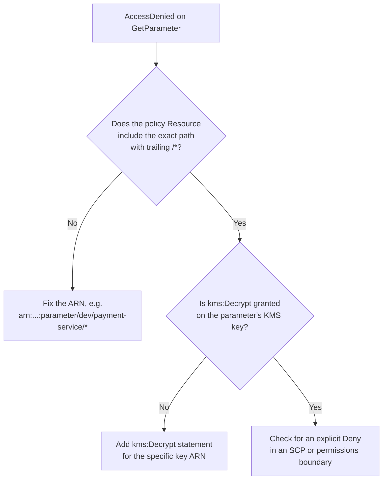
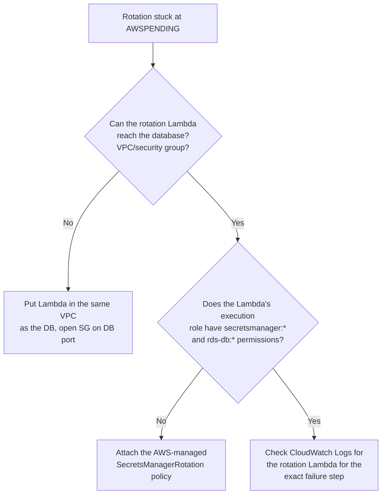

# Troubleshooting

Common errors you'll hit while working through this repo, grouped by service, with the fix and a way to confirm it worked.

---

## SSM Parameter Store

### `AccessDeniedException` on `GetParameter` / `GetParametersByPath`

**Symptom:**
```
An error occurred (AccessDeniedException) when calling the GetParameter operation
```

**Likely cause:** the caller's IAM policy resource ARN doesn't match the parameter path exactly, or is missing the trailing `/*`.

**Fix:**

Validate with:
```bash
aws sts get-caller-identity   # confirm you're the role you think you are
aws ssm get-parameter --name "/dev/myapp/db_url" --debug   # inspect the exact denied action/resource
```

### `ParameterNotFound`

**Cause:** typo in the name, wrong region, or the parameter was created under a different account.

**Fix:** list what actually exists under the parent path:
```bash
aws ssm get-parameters-by-path --path "/dev/myapp/" --recursive --query "Parameters[].Name"
```

### Getting ciphertext instead of plaintext

**Symptom:** `Value` looks like a long base64/AWS-KMS blob instead of your real secret.

**Cause:** you forgot `--with-decryption` on a `SecureString` read.

**Fix:**
```bash
aws ssm get-parameter --name "/dev/myapp/db_password" --with-decryption
```

### `ThrottlingException` — exceeding the TPS limit

**Symptom:** intermittent failures under load, especially from CI pipelines calling `get-parameter` in a tight loop.

**Cause:** the default Parameter Store throughput cap is **40 TPS**.

**Fix:**
1. Batch reads with `get-parameters-by-path` instead of looping individual `get-parameter` calls.
2. If you genuinely need more throughput, enable **High Throughput** (raises the cap to 10,000 TPS):
```bash
aws ssm update-service-setting \
    --setting-id "arn:aws:ssm:us-east-1:123456789012:servicesetting/ssm/parameter-store/high-throughput-enabled" \
    --setting-value "true"
```

### KMS `AccessDeniedException` specifically on decrypt

**Cause:** the IAM role has `ssm:GetParameter` but not `kms:Decrypt` on the specific key — or the **key policy** itself doesn't trust the calling role.

**Fix:** check both sides:
```bash
aws kms get-key-policy --key-id <key-id> --policy-name default
```
Make sure the role ARN appears in the key policy's `Principal`, *and* the IAM policy grants `kms:Decrypt` on that key ARN.

### Value too large / need Parameter Policies

**Symptom:** `ValidationException: Value exceeds size limit` on a `put-parameter` call over 4 KB.

**Fix:** switch the parameter to the **Advanced** tier:
```bash
aws ssm put-parameter --name "/dev/myapp/big-config" --value "$(cat config.json)" --type "String" --tier Advanced --overwrite
```

---

## AWS Secrets Manager

### `AccessDeniedException` on `GetSecretValue`

Same root causes as the SSM equivalent — check the IAM `Resource` ARN and the `kms:Decrypt` grant on the secret's KMS key. Note Secrets Manager ARNs include a random suffix (`-XyZ123`), so wildcard the resource:
```json
"Resource": "arn:aws:secretsmanager:us-east-1:123456789012:secret:prod/payment-service/*"
```

### `ResourceNotFoundException`

**Cause:** wrong `--secret-id`, wrong region, or the secret is mid-deletion (in its recovery window).

**Fix:**
```bash
aws secretsmanager list-secrets --query "SecretList[].Name"
# If it's pending deletion, restore it:
aws secretsmanager restore-secret --secret-id "prod/myapp/database"
```

### `json.JSONDecodeError` when parsing `SecretString` in application code

**Cause:** the secret wasn't stored as valid JSON (someone ran `put-secret-value` with a raw string instead of a JSON blob), or the code is double-decoding.

**Fix:** verify the raw stored value first:
```bash
aws secretsmanager get-secret-value --secret-id "prod/myapp/database" --query SecretString --output text
```
It should print a valid JSON object. If it prints a plain string, re-seed it correctly:
```bash
aws secretsmanager put-secret-value --secret-id "prod/myapp/database" \
  --secret-string '{"username":"admin_user","password":"...","host":"...","port":"3306"}'
```

### Rotation failures

**Symptom:** `list-secret-version-ids` shows a version stuck at `AWSPENDING` and never promotes to `AWSCURRENT`.


Check the actual failure reason in the Lambda's logs:
```bash
aws logs tail /aws/lambda/rotate-mysql-secret --since 1h
```

### Version staging label confusion (`AWSCURRENT` vs `AWSPREVIOUS` vs `AWSPENDING`)

**Quick mental model:**
- `AWSCURRENT` — what your app should be using right now.
- `AWSPREVIOUS` — the one-before-last version, kept for rollback.
- `AWSPENDING` — a candidate mid-rotation, not yet promoted.

**Fix for "my app is using an old password":** the app is likely caching the secret in memory from before the rotation. Re-fetch on a schedule or on auth failure, don't cache indefinitely:
```bash
aws secretsmanager get-secret-value --secret-id "prod/myapp/database" --version-stage AWSCURRENT
```

---

## Terraform-specific issues

### `Error: creating SSM Parameter: ParameterAlreadyExists`

**Cause:** the parameter was created manually via CLI before Terraform knew about it.

**Fix:** import it into state instead of recreating:
```bash
terraform import aws_ssm_parameter.db_password /dev/payment-service/db/password
```

### Plan shows the secret `value` changing on every `terraform apply`

**Cause:** something outside Terraform (a rotation Lambda, or a manual `put-secret-value`) is updating the live value, so Terraform keeps trying to reset it back to what's in source.

**Fix:** tell Terraform to stop managing the value after initial creation:
```hcl
resource "aws_secretsmanager_secret_version" "db_secret_val" {
  secret_id     = aws_secretsmanager_secret.db_secret.id
  secret_string = jsonencode({ ... })

  lifecycle {
    ignore_changes = [secret_string]
  }
}
```

---

## General diagnostic checklist

When something isn't working and you're not sure which layer is at fault, check in this order:

1. **Identity** — `aws sts get-caller-identity` — are you who you think you are?
2. **Existence** — does the parameter/secret actually exist at that exact name, in that exact region?
3. **IAM** — does the policy `Resource` ARN match, character for character, including trailing `/*` or wildcard suffix?
4. **KMS** — is `kms:Decrypt` granted both in the IAM policy *and* the key policy?
5. **Application layer** — is the app caching a stale value, or failing to pass `--with-decryption` / the right SDK parameter?
