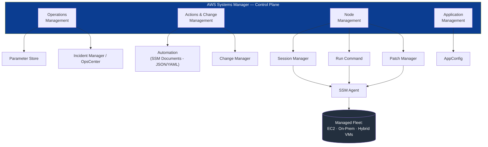
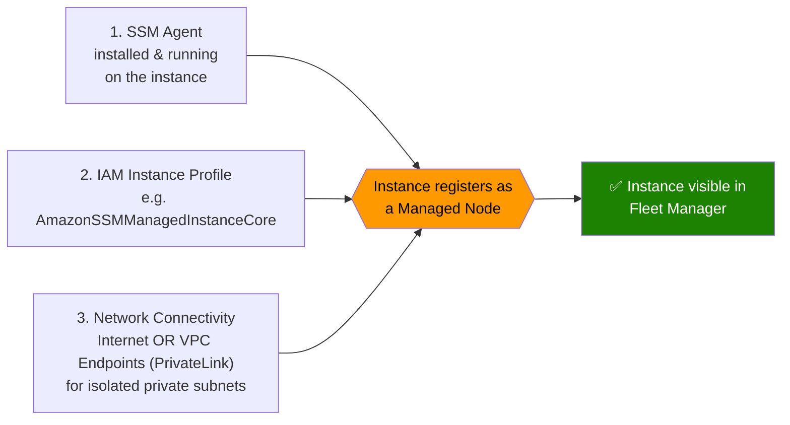
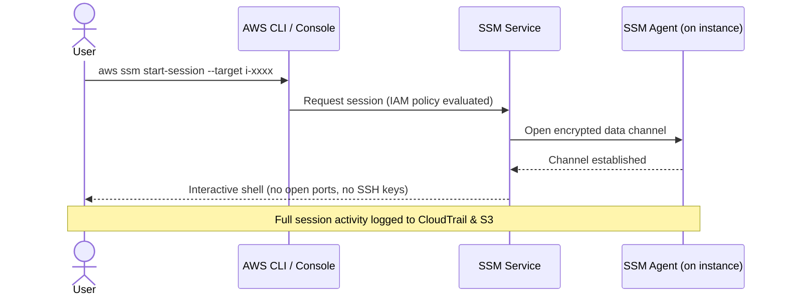

# AWS Systems Manager (SSM) — Complete Learning Guide

A practical, end-to-end reference for learning **AWS Systems Manager (SSM)** — from core concepts to hands-on labs. Built for self-study and portfolio use.

> 📁 This repo has 4 parts:
> - **[README.md](./README.md)** — concepts, architecture, diagrams (you are here)
> - **[commands-cheatsheet.md](./commands-cheatsheet.md)** — every CLI command you need, grouped by feature
> - **[hands-on-labs.md](./hands-on-labs.md)** — step-by-step labs to actually build and break things
> - **[troubleshooting.md](./troubleshooting.md)** — common failures and how to fix them

---

## Table of Contents

1. [What Is AWS Systems Manager](#what-is-aws-systems-manager)
2. [Architecture Overview](#architecture-overview)
3. [Core Pillars of Systems Manager](#core-pillars-of-systems-manager)
   - [1. Operations Management](#1-operations-management)
   - [2. Actions & Change Management](#2-actions--change-management)
   - [3. Node Management (The Core Engine)](#3-node-management-the-core-engine)
   - [4. Application Management](#4-application-management)
4. [How SSM Works Under the Hood (Prerequisites)](#how-ssm-works-under-the-hood-prerequisites)
5. [Session Manager Connection Flow](#session-manager-connection-flow)
6. [Parameter Store vs Secrets Manager](#parameter-store-vs-secrets-manager)
7. [Suggested Learning Path](#suggested-learning-path)
8. [Further Reading](#further-reading)

---

## What Is AWS Systems Manager

AWS Systems Manager (historically **Simple Systems Manager**, hence "SSM") is a management service that acts as a **centralized control plane** for securing, automating, and auditing your infrastructure.

Instead of logging into EC2 instances, on-premises servers, or hybrid virtual machines one at a time, SSM lets you view, patch, configure, and control **all of them from a single place** — with no need to open inbound SSH/RDP ports and no SSH keys to manage.

**Why it matters in practice:**
- Removes the need for bastion hosts / open port 22 or 3389
- Every action is auditable (CloudTrail + S3)
- Works across EC2, on-prem servers, and other clouds (hybrid activation)
- Central source of truth for configuration and secrets

---

## Architecture Overview

SSM is organized into four functional pillars, all built on top of a lightweight agent running on every managed node.

**Key idea:** everything above the agent is a "capability" you use from the console/CLI. Everything below the agent is the actual managed compute — EC2 instances, on-prem servers, or hybrid VMs — that must be running the **SSM Agent** to receive commands.

---

## Core Pillars of Systems Manager

### 1. Operations Management

**Parameter Store**
A secure, centralized string registry for configuration data — database connection strings, license codes, passwords, feature toggles.
- Integrates natively with **IAM** for access control
- Supports plaintext (`String`, `StringList`) and encrypted (`SecureString` via **KMS**) values
- Organized hierarchically (e.g. `/prod/db/password`, `/dev/api/key`)

**Incident Manager & OpsCenter**
Centralized hubs to track, investigate, and resolve operational issues.
- **OpsCenter** aggregates operational issues as "OpsItems" — a single place to triage problems across your fleet
- **Incident Manager** provides response plans, escalation, and runbooks for critical incidents

### 2. Actions & Change Management

**Automation**
Simplifies repetitive IT tasks: creating AMIs, patching, deploying updates.
- Workflows are defined using **SSM Documents** written in JSON or YAML
- Can be triggered manually, on a schedule, or from EventBridge

**Change Manager**
An enterprise framework for **requesting, approving, and tracking** operational changes before they hit production infrastructure — adds a governance/approval layer on top of Automation.

### 3. Node Management (The Core Engine)

This is where most day-to-day SSM usage happens. To manage a server, it must run the **SSM Agent** (pre-installed on Amazon Linux, Ubuntu, and Windows AMIs).

**Session Manager**
An SSH/RDP alternative — securely log into servers through the browser or AWS CLI.
- **No inbound ports** (22/3389) need to be open in the Security Group
- **No SSH key management**
- Every command executed is **fully auditable** via CloudTrail and S3

**Run Command**
Remotely execute a script or command across an entire fleet — hundreds of instances — **simultaneously**, without logging into each one individually.

**Patch Manager**
Automates scanning and applying OS patches across massive fleets, using patch baselines and maintenance windows.

### 4. Application Management

**AppConfig**
Deploy configuration and **feature flags** to running applications safely — without a code deployment or service restart. Supports gradual/validated rollouts to reduce blast radius.

---

## How SSM Works Under the Hood (Prerequisites)

For any compute node to be manageable by SSM, **three things must align**:

1. **The SSM Agent** — installed and running on the target instance (pre-baked into most AWS AMIs).
2. **IAM Role** — the instance must have an attached instance profile with permissions to talk to the SSM service (typically the AWS-managed policy `AmazonSSMManagedInstanceCore`).
3. **Network Connectivity** — the instance needs outbound access to SSM endpoints, either via the internet (NAT/IGW) or via **VPC Endpoints (AWS PrivateLink)** if it lives in a fully isolated private subnet.

Miss any one of these three, and the instance will simply never appear as a "Managed Instance" — see [troubleshooting.md](./troubleshooting.md) for the full diagnostic flow.

---

## Session Manager Connection Flow

---

## Parameter Store vs Secrets Manager

Both store key-value data and integrate with IAM/KMS, but they solve different problems. **Parameter Store** is a general-purpose configuration store that can also hold secrets. **Secrets Manager** is a purpose-built vault for high-stakes, rotating credentials.

| Feature | AWS SSM Parameter Store | AWS Secrets Manager |
|---|---|---|
| **Primary intent** | Application configuration & basic secret storage | Dedicated enterprise lifecycle secrets vault |
| **Native rotation** | ❌ No (requires custom Lambda + EventBridge) | ✅ Yes (built-in Lambda templates for RDS, Redshift, DocumentDB, etc.) |
| **Cross-region replication** | ❌ No (manual copy or via CI/CD) | ✅ Yes (automatic, with independent replica tracking) |
| **Cross-account sharing** | ❌ No | ✅ Yes (resource-based IAM policies on the secret) |
| **Maximum size** | 4 KB (Standard) / 8 KB (Advanced) | 64 KB |
| **Cost** | Standard tier free; Advanced tier has per-parameter charge | Charged per secret per month + API calls |

**Rule of thumb:** use **Parameter Store** for config values, feature flags, and low-churn secrets. Use **Secrets Manager** when you need automatic rotation, cross-account access, or you're storing database/service credentials that change frequently.

---

## Suggested Learning Path

| Step | Focus | File |
|---|---|---|
| 1 | Understand concepts above | README.md |
| 2 | Set up IAM role + verify agent | hands-on-labs.md → Lab 0 & 1 |
| 3 | Connect via Session Manager | hands-on-labs.md → Lab 2 |
| 4 | Store & retrieve config | hands-on-labs.md → Lab 3 |
| 5 | Run commands across a fleet | hands-on-labs.md → Lab 4 |
| 6 | Patch a fleet | hands-on-labs.md → Lab 5 |
| 7 | Build an Automation runbook | hands-on-labs.md → Lab 6 |
| 8 | Roll out a feature flag | hands-on-labs.md → Lab 7 |
| 9 | Capstone: end-to-end patch workflow | hands-on-labs.md → Lab 10 |

Keep [commands-cheatsheet.md](./commands-cheatsheet.md) open in a second tab while doing the labs, and use [troubleshooting.md](./troubleshooting.md) the moment something doesn't show up as expected.

---

## Further Reading

- [AWS Systems Manager User Guide](https://docs.aws.amazon.com/systems-manager/)
- [AWS Systems Manager Agent (SSM Agent)](https://docs.aws.amazon.com/systems-manager/latest/userguide/ssm-agent.html)
- [AWS Secrets Manager](https://docs.aws.amazon.com/secretsmanager/)
