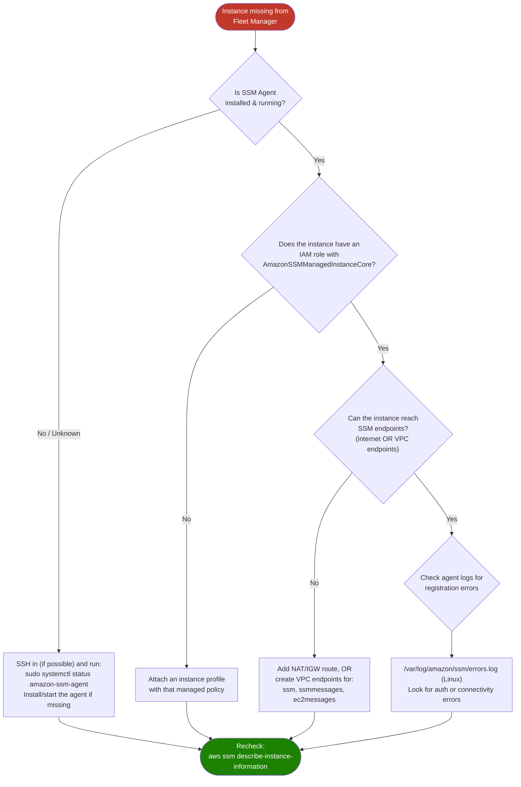

# AWS SSM — Troubleshooting Guide

Common failure modes across every SSM pillar, with the fastest path to a fix. Start with the diagnostic flow below, then jump to the specific section.

---

## Table of Contents

1. [Diagnostic Flow: Instance Not Showing Up in Fleet Manager](#diagnostic-flow-instance-not-showing-up-in-fleet-manager)
2. [Session Manager Issues](#session-manager-issues)
3. [Run Command Issues](#run-command-issues)
4. [Parameter Store Issues](#parameter-store-issues)
5. [Patch Manager Issues](#patch-manager-issues)
6. [Automation / Change Manager Issues](#automation--change-manager-issues)
7. [Network / VPC Endpoint Issues](#network--vpc-endpoint-issues)
8. [Useful Diagnostic Commands](#useful-diagnostic-commands)

---

## Diagnostic Flow: Instance Not Showing Up in Fleet Manager

This is the single most common SSM problem, and it always comes back to the three prerequisites from the README.



---

## Session Manager Issues

**Symptom: `TargetNotConnected` error when starting a session**
- The instance isn't registered as a managed node yet — run the diagnostic flow above first.
- Confirm the instance's `PingStatus` is `Online`:
  ```bash
  aws ssm describe-instance-information --filters "Key=InstanceIds,Values=<instance-id>"
  ```

**Symptom: `SessionManagerPlugin is not found` (locally, on your laptop)**
- The Session Manager plugin isn't installed on your machine — this is a client-side tool separate from the agent. Install it per your OS (see cheatsheet).

**Symptom: Session starts but immediately closes**
- Often an IAM permissions issue on the *user/role starting the session*, not the instance. Confirm your caller identity has `ssm:StartSession` and `ssm:TerminateSession` permissions.
- Check for an overly restrictive Session Manager preferences document (e.g. requiring an S3 bucket for logging that doesn't exist).

**Symptom: Port forwarding session connects but the target port is unreachable**
- Confirm the *local* service inside the instance (e.g. MySQL on 3306) is actually running and listening on that port — Session Manager only tunnels the connection, it doesn't start the service.

---

## Run Command Issues

**Symptom: Command shows `Invocation Doesn't Exist` or the instance never picks it up**
- Instance is offline/not registered — re-check `describe-instance-information`.
- Command was sent to the wrong tag/instance ID — double check `--targets`.

**Symptom: Command runs but returns non-zero exit / `Failed`**
- Fetch detailed output to see the actual stderr:
  ```bash
  aws ssm get-command-invocation --command-id <command-id> --instance-id <instance-id>
  ```
- Common cause: the instance's IAM role doesn't have permissions the *script itself* needs (e.g. calling other AWS services from inside the command).

**Symptom: Command times out**
- Default timeout may be too short for long-running scripts. Increase it explicitly:
  ```bash
  aws ssm send-command \
    --document-name "AWS-RunShellScript" \
    --parameters commands="long_running_script.sh" \
    --timeout-seconds 3600
  ```

---

## Parameter Store Issues

**Symptom: `AccessDeniedException` when reading a parameter**
- The caller's IAM policy doesn't include `ssm:GetParameter`/`GetParametersByPath` for that specific parameter path — check for overly narrow resource ARNs in the policy.
- If it's a `SecureString`, the caller also needs `kms:Decrypt` on the KMS key used to encrypt it.

**Symptom: `ParameterNotFound`**
- Check the exact path/casing — parameters are hierarchical and case-sensitive (`/prod/App` ≠ `/prod/app`).
- If using `get-parameters-by-path`, confirm you passed `--recursive` if the parameter is nested deeper than one level.

**Symptom: Parameter value looks encrypted/garbled when read from an app**
- You forgot `--with-decryption` (CLI) or the SDK equivalent when reading a `SecureString`.

---

## Patch Manager Issues

**Symptom: Instances stay `NON_COMPLIANT` after running Install**
- Confirm the instance is actually tagged with the **same patch group** referenced by the baseline registration.
- Some patches require a reboot to fully apply — check if `RebootOption` was set to `NoReboot` when it needed a reboot.

**Symptom: Patch scan/install command never reaches the instance**
- This is really a Run Command problem underneath — re-check agent status and IAM role first.

**Symptom: Maintenance window never triggers the patch task**
- Confirm the maintenance window's **schedule (cron)**, **duration**, and **cutoff** actually leave enough time for the task to run.
- Confirm the target instances are correctly associated with the maintenance window (by tag or instance ID).

---

## Automation / Change Manager Issues

**Symptom: Automation execution fails at a specific step**
- Pull the step-level detail — the top-level status alone won't tell you which step broke:
  ```bash
  aws ssm get-automation-execution --automation-execution-id <execution-id>
  ```
- Common cause: the Automation service role lacks permission for an action a step tries to perform (e.g. `ec2:CreateImage`).

**Symptom: Change request stuck in `Pending Approval`**
- Someone with approver permissions needs to act on it in-console; the CLI doesn't have a direct one-line "approve" call for most setups.
- Confirm the approver's IAM identity is actually listed as a valid approver on the change template.

---

## Network / VPC Endpoint Issues

**Symptom: Instance in a private subnet never registers, but has an IAM role and the agent is running**
- It has no path to the internet **and** no VPC endpoints. You need interface endpoints for all three:
  - `com.amazonaws.<region>.ssm`
  - `com.amazonaws.<region>.ssmmessages`
  - `com.amazonaws.<region>.ec2messages`
- Confirm the endpoint's security group allows inbound HTTPS (443) from the instance's security group/subnet.
- Confirm **private DNS** is enabled on the VPC endpoints — without it, the agent will resolve to public IPs it can't reach.

---

## Useful Diagnostic Commands

```bash
# Agent status (Linux)
sudo systemctl status amazon-ssm-agent

# Agent logs (Linux) — the first place to look for registration/auth failures
sudo tail -n 100 /var/log/amazon/ssm/amazon-ssm-agent.log
sudo tail -n 100 /var/log/amazon/ssm/errors.log

# Agent status (Windows)
Get-Service AmazonSSMAgent

# Confirm the instance's own IAM role
aws sts get-caller-identity   # run this FROM INSIDE the instance, via Session Manager

# Confirm your local caller has the right SSM permissions
aws sts get-caller-identity
aws iam simulate-principal-policy \
  --policy-source-arn <your-role-arn> \
  --action-names ssm:StartSession ssm:SendCommand ssm:GetParameter
```

---

**Still stuck?** Cross-check against [README.md](./README.md#how-ssm-works-under-the-hood-prerequisites) for the three-part prerequisite diagram, or re-run the exact lab step in [hands-on-labs.md](./hands-on-labs.md) to isolate whether the issue is your setup or a specific command.
