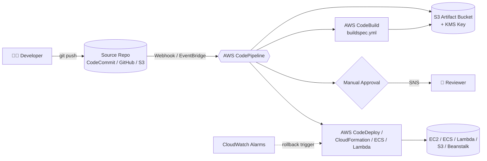
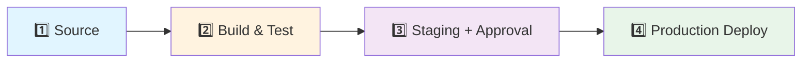
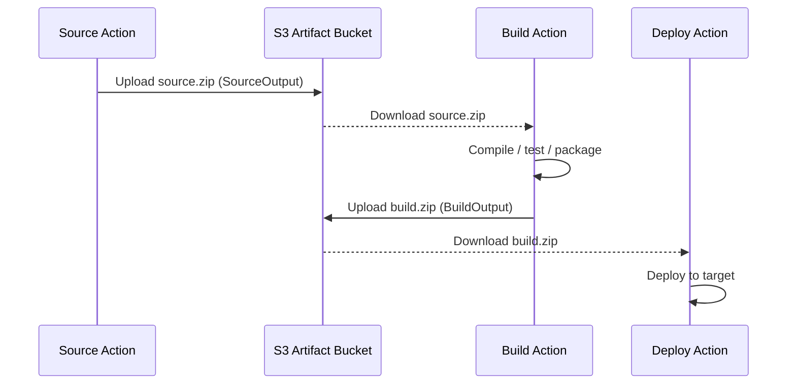
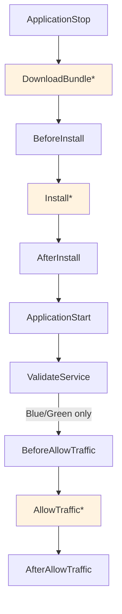
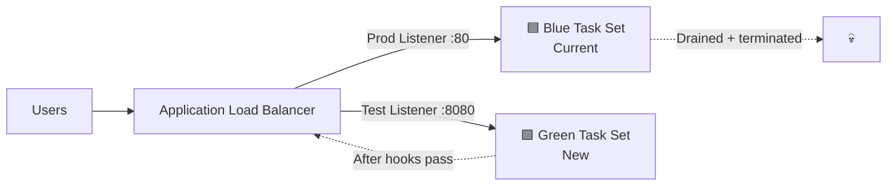
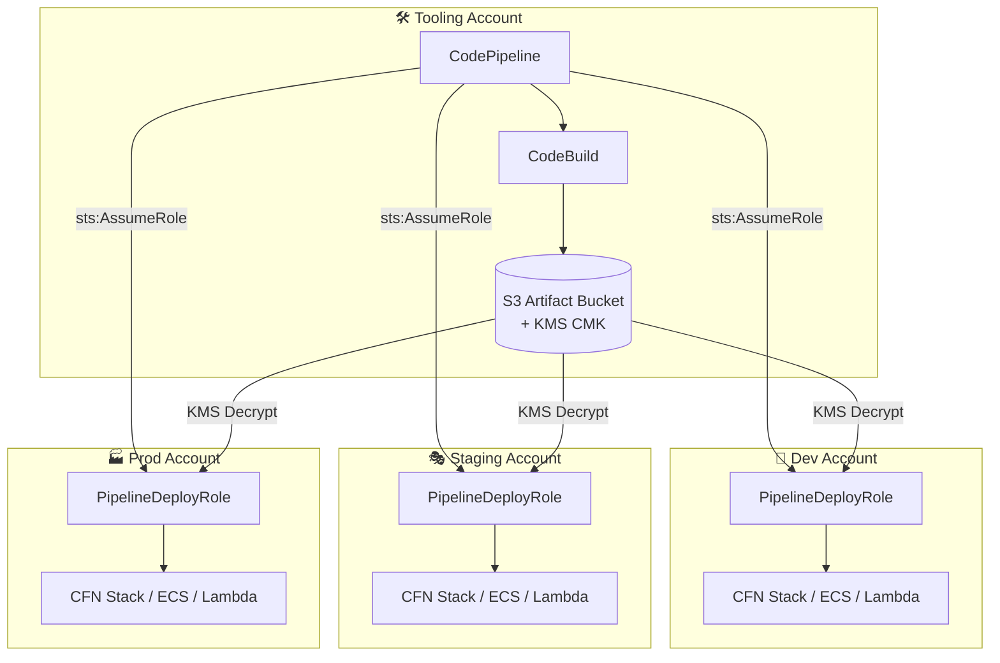
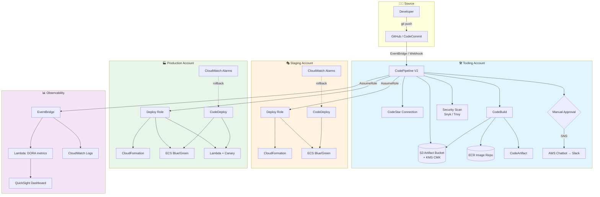

# AWS CodePipeline — End-to-End Practical Learning Guide

> A complete, hands-on reference to AWS CodePipeline: concepts, architecture, real-world configurations, IaC (CloudFormation / CDK / Terraform), multi-account deployments, buildspec/appspec files, rollback strategies, monitoring, and troubleshooting.

---

## 📂 Repository Structure

| File | Purpose |
|------|---------|
| `README.md` | Main learning document — concepts, architecture, diagrams, examples |
| `commands-cheatsheet.md` | AWS CLI, buildspec, appspec, IaC snippets |
| `hands-on-labs.md` | Step-by-step labs for EC2, ECS, Lambda, S3, CFN, multi-account |
| `troubleshooting.md` | Common failures, causes, and fixes |

---

## 📑 Table of Contents

1. [What is AWS CodePipeline?](#1-what-is-aws-codepipeline)
2. [Prerequisites](#2-prerequisites)
3. [Core Concepts & Terminology](#3-core-concepts--terminology)
4. [High-Level Architecture](#4-high-level-architecture)
5. [The Four Classic Stages](#5-the-four-classic-stages)
6. [Under the Hood: S3, IAM, KMS](#6-under-the-hood-s3-iam-kms)
7. [Source Stage — Deep Dive](#7-source-stage--deep-dive)
8. [Build Stage — CodeBuild & buildspec.yml](#8-build-stage--codebuild--buildspecyml)
9. [Test / Staging Stage & Manual Approvals](#9-test--staging-stage--manual-approvals)
10. [Deploy Stage — All Target Types](#10-deploy-stage--all-target-types)
11. [AppSpec File — EC2, ECS, Lambda](#11-appspec-file--ec2-ecs-lambda)
12. [Deployment Strategies (Blue/Green, Canary, Rolling)](#12-deployment-strategies-bluegreen-canary-rolling)
13. [V2 Pipelines: Triggers, Variables, Execution Modes](#13-v2-pipelines-triggers-variables-execution-modes)
14. [Multi-Account Deployment Architecture](#14-multi-account-deployment-architecture)
15. [Cross-Region Deployments](#15-cross-region-deployments)
16. [Pipeline as Code — CloudFormation, CDK, Terraform](#16-pipeline-as-code--cloudformation-cdk-terraform)
17. [Rollback Strategies & CloudWatch Alarms](#17-rollback-strategies--cloudwatch-alarms)
18. [Notifications — SNS, Slack, Chatbot](#18-notifications--sns-slack-chatbot)
19. [Monitoring, Logging & Metrics](#19-monitoring-logging--metrics)
20. [Secrets, Parameters & CodeArtifact](#20-secrets-parameters--codeartifact)
21. [Pricing Model](#21-pricing-model)
22. [CodePipeline vs GitHub Actions vs Jenkins](#22-codepipeline-vs-github-actions-vs-jenkins)
23. [Best Practices Checklist](#23-best-practices-checklist)
24. [Full Enterprise Ecosystem Diagram](#24-full-enterprise-ecosystem-diagram)
25. [Further Reading](#25-further-reading)

---

## 1. What is AWS CodePipeline?

AWS CodePipeline is a **fully managed Continuous Integration and Continuous Delivery (CI/CD)** service that automates release pipelines for fast, reliable application and infrastructure updates.

Think of it as the **orchestrator / conveyor belt** of your Software Development Lifecycle (SDLC). It does not compile or deploy code itself — instead, it **triggers, monitors, and moves your artifacts** through a series of stages that call other tools (CodeBuild, CodeDeploy, CloudFormation, Lambda, third-party services).

**Key characteristics:**

- Fully managed — no servers, no plugins to maintain
- Pay-as-you-go — ~$1 per active pipeline per month (V1) + underlying build/storage costs
- Deep AWS integration — IAM, KMS, CloudWatch, EventBridge, S3
- Extensible — supports GitHub, Bitbucket, GitLab, Jenkins, custom actions
- Visual + code-driven — console UI *or* CloudFormation/CDK/Terraform

---

## 2. Prerequisites

Before you build a pipeline you should have:

- An AWS account with admin (or scoped) IAM access
- AWS CLI v2 installed and configured (`aws configure`)
- A source repository — CodeCommit, GitHub, Bitbucket, GitLab, or S3
- A basic understanding of IAM roles, S3, and (for Build) Docker
- (Optional) AWS CDK, Terraform, or SAM CLI for Pipeline-as-Code

---

## 3. Core Concepts & Terminology

| Term | Definition |
|------|------------|
| **Pipeline** | The workflow structure that defines how software changes flow through release |
| **Stage** | Logical division within a pipeline (Source, Build, Test, Deploy). Contains 1–N actions |
| **Action** | An individual task — fetch code, run tests, deploy. Actions run in `runOrder` sequence or parallel |
| **Artifact** | Files/data passed between actions. Every action can have `inputArtifacts` and `outputArtifacts` |
| **Transition** | The link between stages. Can be manually **disabled** to freeze deployments (e.g., pre-holiday) |
| **Execution** | A single run of the pipeline, identified by a unique execution ID |
| **Action Provider** | The service/tool executing the action (e.g., `AWS CodeBuild`, `S3`, `Manual`) |
| **Source Revision** | The specific commit / object version that triggered the execution |
| **Artifact Store** | The S3 bucket (and KMS key) where CodePipeline persists artifacts between stages |

**Action categories:** `Source`, `Build`, `Test`, `Deploy`, `Approval`, `Invoke` (Lambda / Step Functions).

---

## 4. High-Level Architecture



---

## 5. The Four Classic Stages

A production-grade pipeline typically has **four stages**. Each stage is separated by a transition, and any failure halts progression.



### Stage 1 — Source

Triggers on a commit / object-version change.

- **Supported providers:** CodeCommit, GitHub (v1 OAuth or v2 via CodeStar Connections), GitHub Enterprise Server, Bitbucket, GitLab, GitLab Self-Managed, Amazon S3, Amazon ECR
- **Detection mechanism:** Webhooks (GitHub/Bitbucket), CloudWatch Events / EventBridge (CodeCommit, S3, ECR), or polling (legacy, deprecated for most providers)
- **Output:** Zipped source code stored in the artifact S3 bucket as the first *output artifact* (`SourceOutput`)

### Stage 2 — Build & Test

- **Primary tool:** AWS CodeBuild (Jenkins/TeamCity also supported as third-party actions)
- CodeBuild spins up a temporary Docker container, reads `buildspec.yml` from the artifact root, runs your commands, and emits an output artifact
- Typical activities: compile, unit test, lint, SAST scan, package (zip, JAR, Docker image push to ECR)

### Stage 3 — Test / Staging

- Deploy to a pre-prod environment
- Run integration/E2E tests, load tests, security scans (SonarQube, Snyk, CodeGuru)
- Insert a **Manual Approval** action to gate production

### Stage 4 — Deploy

Push tested artifacts to live environments — EC2, ECS, EKS, Lambda, Elastic Beanstalk, S3 static site, or via CloudFormation stack updates.

---

## 6. Under the Hood: S3, IAM, KMS

### 6.1 The Artifact Bucket

CodePipeline **never passes code directly** between actions. Every artifact round-trips through Amazon S3.



- CodePipeline auto-creates an S3 bucket per region named `codepipeline-<region>-<random>` on first use
- You can override this with a custom bucket for compliance / encryption requirements
- Bucket must have **versioning enabled** (required by CodePipeline)

### 6.2 IAM — The Two Key Roles

| Role | Used By | Purpose |
|------|---------|---------|
| **Pipeline Service Role** | CodePipeline itself | Permission to read/write S3 artifacts, invoke CodeBuild/CodeDeploy/CFN, publish to SNS, assume cross-account roles |
| **Action Roles** | CodeBuild, CodeDeploy, CFN, custom Lambda actions | Executes the actual work (e.g., CodeBuild role needs `ecr:*` to push images) |

### 6.3 KMS Encryption

- Default: S3 SSE with an AWS-managed key
- Best practice / mandatory for cross-account: **customer-managed KMS key (CMK)** with a key policy that grants `kms:Decrypt` + `kms:GenerateDataKey` to target-account roles
- Cross-region pipelines require **one CMK per region**

---

## 7. Source Stage — Deep Dive

### 7.1 CodeStar Connections (GitHub v2 / Bitbucket / GitLab)

Modern integrations use **CodeStar Connections** instead of the deprecated OAuth v1 flow.

```bash
aws codestar-connections create-connection \
  --provider-type GitHub \
  --connection-name my-github-conn
# Then open the AWS console to complete the OAuth handshake
```

Once ACTIVE, reference the connection ARN in the source action.

### 7.2 Source Providers Comparison

| Provider | Trigger Mechanism | Notes |
|----------|------------------|-------|
| CodeCommit | EventBridge rule | Native, IAM-based auth |
| GitHub (v2) | Webhook via CodeStar Connections | Recommended for GitHub.com |
| GitHub Enterprise Server | CodeStar Connections + Host | Requires GitHub Enterprise host resource |
| Bitbucket | CodeStar Connections | Cloud only |
| GitLab | CodeStar Connections | Cloud + Self-Managed |
| S3 | EventBridge / CloudTrail | Bucket must have versioning; artifact = specific object version |
| ECR | EventBridge | Triggers on image push |

### 7.3 Monorepo Filter (V2)

```yaml
Triggers:
  - ProviderType: CodeStarSourceConnection
    GitConfiguration:
      SourceActionName: Source
      Push:
        - Branches:
            Includes: [main]
          FilePaths:
            Includes: ['backend/**']
```

Only pushes to `main` that touch `backend/**` will trigger this pipeline. This lets you run separate pipelines per service in a monorepo.

---

## 8. Build Stage — CodeBuild & buildspec.yml

### 8.1 buildspec.yml — Anatomy

Lives at the **root of your source repo** (or specified inline in the CodeBuild project).

```yaml
version: 0.2

env:
  variables:
    NODE_ENV: production
  parameter-store:
    DB_HOST: /prod/db/host          # From SSM Parameter Store
  secrets-manager:
    API_KEY: prod/apikey:apikey     # From Secrets Manager (secretId:jsonKey)

phases:
  install:
    runtime-versions:
      nodejs: 20
    commands:
      - echo "Installing dependencies..."
      - npm ci
  pre_build:
    commands:
      - echo "Running lint + unit tests..."
      - npm run lint
      - npm test -- --watchAll=false --coverage
  build:
    commands:
      - echo "Building on `date`..."
      - npm run build
  post_build:
    commands:
      - echo "Build completed successfully!"

reports:
  jest_reports:
    files:
      - 'junit.xml'
    base-directory: 'coverage'
    file-format: 'JUNITXML'

artifacts:
  files:
    - '**/*'
  base-directory: build
  name: build-$(date +%Y-%m-%d)

cache:
  paths:
    - 'node_modules/**/*'
```

### 8.2 Key Sections

| Section | Purpose |
|---------|---------|
| `env` | Env vars, plus native pulls from SSM Parameter Store and Secrets Manager |
| `phases` | `install` → `pre_build` → `build` → `post_build`. Any non-zero exit code halts the build |
| `reports` | Test result reports viewable in the CodeBuild console |
| `artifacts` | Which files to zip and ship to the next stage |
| `cache` | Directories cached across builds (needs S3 or Local cache on the project) |

### 8.3 CodeBuild Compute Types

| Type | vCPU | Memory | Use case |
|------|------|--------|----------|
| `BUILD_GENERAL1_SMALL` | 3 | 3 GB | Small builds, lint checks |
| `BUILD_GENERAL1_MEDIUM` | 4 | 7 GB | Standard app builds |
| `BUILD_GENERAL1_LARGE` | 8 | 15 GB | Java/large monorepos |
| `BUILD_GENERAL1_2XLARGE` | 72 | 145 GB | Massive parallel builds |
| ARM / GPU / Lambda-compute | varies | varies | Specialty workloads |

### 8.4 Build Environment Images

- **Amazon Managed images:** `aws/codebuild/standard:7.0`, `standard:8.0`, `amazonlinux2-x86_64-standard:5.0`, `amazonlinux2-aarch64-standard:3.0`
- **Custom images:** any Docker image in ECR or Docker Hub
- Set `privilegedMode: true` when the build needs to build/push Docker images (required for the Docker daemon inside)

### 8.5 VPC Configuration

If your build needs to reach private resources (RDS, private ECR, on-prem via DX):

- Attach the CodeBuild project to a VPC + subnet + security group
- The subnet needs a NAT gateway for internet access (Docker Hub, npm)
- Adds ~30–90s cold-start; use VPC endpoints for S3/ECR/Secrets Manager to reduce latency and NAT costs

### 8.6 Caching Strategies

| Type | Where | Best for |
|------|-------|----------|
| **S3 cache** | S3 bucket | Cross-project sharing, larger caches |
| **Local cache** | Build host | Faster; supports `DOCKER_LAYER_CACHE`, `SOURCE_CACHE`, `CUSTOM_CACHE` |

---

## 9. Test / Staging Stage & Manual Approvals

### 9.1 Manual Approval Action

CodePipeline **pauses** at an approval action until a human clicks Approve/Reject.

```yaml
- Name: ApproveProdDeploy
  ActionTypeId:
    Category: Approval
    Owner: AWS
    Provider: Manual
    Version: '1'
  Configuration:
    NotificationArn: arn:aws:sns:us-east-1:123456789012:PipelineApprovals
    ExternalEntityLink: https://staging.example.com
    CustomData: 'Please verify the staging URL before approving production.'
```

- SNS topic can fan out to email, Lambda, Slack (via Chatbot), or a ticketing system
- Approvals expire after **7 days** by default — after that the pipeline execution fails
- IAM permission required to approve: `codepipeline:PutApprovalResult`

### 9.2 Test-Only Stages

Common patterns:

- CodeBuild action running `newman` (Postman), Cypress, or Playwright
- Invoke Lambda action calling out to Selenium Grid / BrowserStack
- CodeDeploy action deploying to a *staging* deployment group before prod

---

## 10. Deploy Stage — All Target Types

| Target | Deploy Action Provider | Notes |
|--------|-----------------------|-------|
| **EC2 / On-prem** | `CodeDeploy` | Uses AppSpec + lifecycle hooks; requires CodeDeploy agent |
| **Amazon ECS (rolling)** | `ECS` | Uses `imagedefinitions.json` |
| **Amazon ECS (Blue/Green)** | `CodeDeployToECS` | Uses `appspec.yaml` + `taskdef.json` |
| **AWS Lambda** | `CodeDeploy` (SAM) | Traffic shifting via aliases |
| **Elastic Beanstalk** | `ElasticBeanstalk` | Zipped app bundle deployed to environment |
| **CloudFormation** | `CloudFormation` | Create / Update / Delete stacks; parameter overrides |
| **S3 Static Site** | `S3` | Sync artifact to S3 bucket (auto sets `x-amz-acl` if configured) |
| **EKS** | Invoke Lambda / CodeBuild | Use `kubectl` / Helm inside a CodeBuild action |
| **Service Catalog** | `ServiceCatalog` | Publish product versions |
| **AppConfig** | `AppConfig` | Deploy config profiles |

### 10.1 Standard ECS Rolling Deploy — imagedefinitions.json

CodeBuild produces this file in `post_build`:

```bash
printf '[{"name":"web-container","imageUri":"%s"}]' \
  $ECR_REPO_URI:$IMAGE_TAG > imagedefinitions.json
```

Then in the artifact `files:` include `imagedefinitions.json`. The `ECS` deploy action reads it and updates the task definition's image.

### 10.2 ECS Blue/Green Deploy — taskdef.json + appspec.yaml

CodeBuild produces both files:

- `taskdef.json` — full ECS task definition with placeholder `<IMAGE1_NAME>` for the container image
- `appspec.yaml` — AppSpec (see next section)

The `CodeDeployToECS` action injects the actual image URI into `<IMAGE1_NAME>` at deploy time.

### 10.3 Elastic Beanstalk Deploy

```yaml
- Name: DeployToBeanstalk
  ActionTypeId:
    Category: Deploy
    Owner: AWS
    Provider: ElasticBeanstalk
    Version: '1'
  Configuration:
    ApplicationName: MyApp
    EnvironmentName: MyApp-prod
  InputArtifacts:
    - Name: BuildOutput
```

### 10.4 S3 Static Site Deploy

```yaml
Configuration:
  BucketName: my-static-site.example.com
  Extract: 'true'          # unzip the artifact into the bucket
  CannedACL: public-read   # optional
```

### 10.5 CloudFormation Deploy

Two-action pattern: **Create Change Set** → **Manual Approval** → **Execute Change Set**.

```yaml
Configuration:
  ActionMode: CHANGE_SET_REPLACE
  StackName: my-prod-stack
  ChangeSetName: pipeline-changeset
  Capabilities: CAPABILITY_NAMED_IAM,CAPABILITY_AUTO_EXPAND
  TemplatePath: BuildOutput::template.yaml
  TemplateConfiguration: BuildOutput::prod-params.json
  RoleArn: arn:aws:iam::123456789012:role/CFNDeploymentRole
```

---

## 11. AppSpec File — EC2, ECS, Lambda

The AppSpec file (`appspec.yml` / `appspec.yaml`) is used by **AWS CodeDeploy**. Its structure is completely different for each target.

### 11.1 EC2 / On-Premises AppSpec

Lives at the **root** of your revision. Copies files, sets permissions, runs lifecycle hooks.

```yaml
version: 0.0
os: linux
files:
  - source: /index.html
    destination: /var/www/html/
  - source: /scripts/
    destination: /var/www/scripts/
permissions:
  - object: /var/www/html
    pattern: "**"
    owner: apache
    group: apache
    mode: 644
    type:
      - file
hooks:
  ApplicationStop:
    - location: scripts/stop_server.sh
      timeout: 60
      runas: root
  BeforeInstall:
    - location: scripts/install_dependencies.sh
      timeout: 300
      runas: root
  AfterInstall:
    - location: scripts/after_install.sh
      timeout: 120
      runas: root
  ApplicationStart:
    - location: scripts/start_server.sh
      timeout: 180
      runas: root
  ValidateService:
    - location: scripts/validate_service.sh
      timeout: 60
      runas: root
```

#### EC2 Lifecycle Hook Order


*Hooks marked with `*` are AWS-managed; you cannot script them.*

### 11.2 ECS Blue/Green AppSpec

Points to the ECS service and load balancer — no file copying.

```yaml
version: 0.0
Resources:
  - TargetService:
      Type: AWS::ECS::Service
      Properties:
        TaskDefinition: <TASK_DEFINITION>
        LoadBalancerInfo:
          ContainerName: "web-container"
          ContainerPort: 8080
        PlatformVersion: "LATEST"
        NetworkConfiguration:
          AwsvpcConfiguration:
            Subnets: ["subnet-abc", "subnet-def"]
            SecurityGroups: ["sg-123"]
            AssignPublicIp: "DISABLED"
Hooks:
  - BeforeInstall:            "arn:aws:lambda:us-east-1:123456789012:function:pre-install"
  - AfterInstall:             "arn:aws:lambda:us-east-1:123456789012:function:post-install"
  - AfterAllowTestTraffic:    "arn:aws:lambda:us-east-1:123456789012:function:run-e2e"
  - BeforeAllowTraffic:       "arn:aws:lambda:us-east-1:123456789012:function:smoke-test"
  - AfterAllowTraffic:        "arn:aws:lambda:us-east-1:123456789012:function:notify-slack"
```

### 11.3 Lambda AppSpec

Traffic shifting between alias versions.

```yaml
version: 0.0
Resources:
  - MyLambdaFunction:
      Type: AWS::Lambda::Function
      Properties:
        Name: "my-processor-function"
        Alias: "live"
        CurrentVersion: "1"
        TargetVersion: "2"
Hooks:
  - PreTraffic:  "arn:aws:lambda:us-east-1:123456789012:function:BeforeTrafficCheck"
  - PostTraffic: "arn:aws:lambda:us-east-1:123456789012:function:AfterTrafficCheck"
```

### 11.4 Sample Validation Lambda (Node.js)

```javascript
const { CodeDeployClient, PutLifecycleEventHookExecutionStatusCommand } =
  require("@aws-sdk/client-codedeploy");
const client = new CodeDeployClient();

exports.handler = async (event) => {
  const { DeploymentId, LifecycleEventHookExecutionId } = event;
  let status = "Succeeded";
  try {
    const res = await fetch("http://lb-test-port.example.com/health");
    if (res.status !== 200) throw new Error(`Unhealthy: ${res.status}`);
  } catch (e) {
    console.error(e);
    status = "Failed";
  }
  await client.send(new PutLifecycleEventHookExecutionStatusCommand({
    deploymentId: DeploymentId,
    lifecycleEventHookExecutionId: LifecycleEventHookExecutionId,
    status,
  }));
};
```

---

## 12. Deployment Strategies (Blue/Green, Canary, Rolling)

### 12.1 Strategy Overview

| Strategy | How it works | Rollback speed | Cost |
|----------|-------------|----------------|------|
| **In-Place (Rolling)** | Update instances in place, batch by batch | Slow (redeploy old) | Low (no extra infra) |
| **Blue/Green** | New "green" fleet spun up, traffic shifted from "blue" | Instant (reroute) | 2× during cutover |
| **Canary** | Small % of traffic → new version, then 100% | Instant | Small overhead |
| **Linear** | Equal percentage shifts every X minutes | Instant | Small overhead |
| **All-at-Once** | 100% instantly | Instant but risky | Low |

### 12.2 CodeDeploy Deployment Configurations

**EC2:**
- `CodeDeployDefault.AllAtOnce`
- `CodeDeployDefault.HalfAtATime`
- `CodeDeployDefault.OneAtATime`
- Custom (`MinimumHealthyHosts` percentage or count)

**ECS / Lambda Blue-Green:**
- `CodeDeployDefault.ECSAllAtOnce`
- `CodeDeployDefault.ECSLinear10PercentEvery1Minutes` … `Every3Minutes`
- `CodeDeployDefault.ECSCanary10Percent5Minutes` … `15Minutes`
- `CodeDeployDefault.LambdaAllAtOnce`
- `CodeDeployDefault.LambdaCanary10Percent5Minutes` … `30Minutes`
- `CodeDeployDefault.LambdaLinear10PercentEvery1Minute` … `10Minutes`

### 12.3 Blue/Green Traffic Flow



---

## 13. V2 Pipelines: Triggers, Variables, Execution Modes

### 13.1 V1 vs V2

| Feature | V1 | V2 |
|---------|----|----|
| Trigger filters | None | Branch + file path filters |
| Execution modes | Superseded only | Superseded, Queued, Parallel |
| Pricing | $1/pipeline/month | $0.002 / action execution minute (usage-based) |
| Git tags trigger | No | Yes |
| Pipeline-level variables | No | Yes |

### 13.2 Execution Modes

- **Superseded** *(default V1 behavior)*: Newer executions cancel older in-flight ones. Saves time.
- **Queued**: Executions run one after another (FIFO). Up to 50 queued.
- **Parallel** *(V2 only)*: Independent executions run concurrently. Great for feature-branch previews.

### 13.3 Pipeline Variables

Pipeline-level, action-level, or resolved at runtime.

```yaml
Variables:
  - Name: EnvironmentName
    DefaultValue: dev
    Description: Target environment
    
# Referenced elsewhere:
Configuration:
  EnvironmentName: '#{variables.EnvironmentName}'
```

Action-produced variables (e.g., a CodeBuild output var) can be consumed downstream via `#{SourceVariables.CommitId}` or `#{BuildVariables.IMAGE_TAG}`.

### 13.4 Triggers with Filters (Push, PR, Tag)

```yaml
Triggers:
  - ProviderType: CodeStarSourceConnection
    GitConfiguration:
      SourceActionName: Source
      Push:
        - Branches:
            Includes: ['main', 'release/*']
          FilePaths:
            Includes: ['services/api/**']
            Excludes: ['**/*.md']
        - Tags:
            Includes: ['v*']
      PullRequest:
        - Events: [OPEN, UPDATED, CLOSED]
          Branches:
            Includes: ['main']
```

---

## 14. Multi-Account Deployment Architecture

Enterprise best practice: never deploy from the same account that hosts your workloads.



### 14.1 The Four Configuration Points

1. **Trust policy** on target-account `PipelineDeployRole` allowing tooling-account principal to `sts:AssumeRole`
2. **Pipeline service role** in tooling account with `sts:AssumeRole` on each target role
3. **S3 bucket policy** on artifact bucket granting `s3:Get*` to target roles
4. **KMS key policy** on CMK granting `kms:Decrypt` + `kms:GenerateDataKey` to target roles

### 14.2 Target Role Trust Policy (in target accounts)

```json
{
  "Version": "2012-10-17",
  "Statement": [{
    "Effect": "Allow",
    "Principal": { "AWS": "arn:aws:iam::TOOLING_ACCT:role/CodePipelineServiceRole" },
    "Action": "sts:AssumeRole"
  }]
}
```

### 14.3 Pipeline Action `RoleArn`

```yaml
- Name: DeployProd
  ActionTypeId: { Category: Deploy, Owner: AWS, Provider: CloudFormation, Version: '1' }
  RoleArn: arn:aws:iam::PROD_ACCT:role/PipelineDeployRole
  Configuration:
    ActionMode: CREATE_UPDATE
    StackName: my-prod-stack
    TemplatePath: BuildOutput::template.yaml
    RoleArn: arn:aws:iam::PROD_ACCT:role/CFNExecutionRole
```

---

## 15. Cross-Region Deployments

CodePipeline supports actions in **multiple regions** within a single pipeline.

```yaml
ArtifactStores:
  - Region: us-east-1
    ArtifactStore: { Type: S3, Location: pipeline-artifacts-use1, EncryptionKey: {...} }
  - Region: us-west-2
    ArtifactStore: { Type: S3, Location: pipeline-artifacts-usw2, EncryptionKey: {...} }

Stages:
  - Name: DeployMultiRegion
    Actions:
      - Name: DeployUSE1
        Region: us-east-1
        ...
      - Name: DeployUSW2
        Region: us-west-2
        ...
```

- Each remote region needs its own artifact bucket + KMS key
- CodePipeline replicates artifacts from the primary region to each remote region automatically

---

## 16. Pipeline as Code — CloudFormation, CDK, Terraform

### 16.1 CloudFormation (YAML)

```yaml
AWSTemplateFormatVersion: '2010-09-09'
Resources:
  ArtifactBucket:
    Type: AWS::S3::Bucket
    Properties:
      VersioningConfiguration: { Status: Enabled }

  PipelineRole:
    Type: AWS::IAM::Role
    Properties:
      AssumeRolePolicyDocument:
        Version: '2012-10-17'
        Statement:
          - Effect: Allow
            Principal: { Service: codepipeline.amazonaws.com }
            Action: sts:AssumeRole
      ManagedPolicyArns:
        - arn:aws:iam::aws:policy/AWSCodePipeline_FullAccess

  Pipeline:
    Type: AWS::CodePipeline::Pipeline
    Properties:
      RoleArn: !GetAtt PipelineRole.Arn
      ArtifactStore: { Type: S3, Location: !Ref ArtifactBucket }
      PipelineType: V2
      Stages:
        - Name: Source
          Actions:
            - Name: Source
              ActionTypeId:
                Category: Source
                Owner: AWS
                Provider: CodeStarSourceConnection
                Version: '1'
              Configuration:
                ConnectionArn: !Ref GitHubConnection
                FullRepositoryId: my-org/my-repo
                BranchName: main
              OutputArtifacts: [{ Name: SourceOutput }]
        - Name: Build
          Actions:
            - Name: Build
              ActionTypeId: { Category: Build, Owner: AWS, Provider: CodeBuild, Version: '1' }
              Configuration: { ProjectName: !Ref BuildProject }
              InputArtifacts: [{ Name: SourceOutput }]
              OutputArtifacts: [{ Name: BuildOutput }]
        - Name: Deploy
          Actions:
            - Name: Deploy
              ActionTypeId: { Category: Deploy, Owner: AWS, Provider: CloudFormation, Version: '1' }
              Configuration:
                ActionMode: CREATE_UPDATE
                StackName: my-app-stack
                TemplatePath: BuildOutput::template.yaml
                RoleArn: !GetAtt CFNDeployRole.Arn
              InputArtifacts: [{ Name: BuildOutput }]
```

### 16.2 AWS CDK (TypeScript)

```typescript
import * as cdk from 'aws-cdk-lib';
import * as codepipeline from 'aws-cdk-lib/aws-codepipeline';
import * as cpactions from 'aws-cdk-lib/aws-codepipeline-actions';
import * as codebuild from 'aws-cdk-lib/aws-codebuild';

const pipeline = new codepipeline.Pipeline(this, 'MyPipeline', {
  pipelineName: 'WebServicePipeline',
  crossAccountKeys: true,      // Auto-creates KMS CMK for cross-account
  pipelineType: codepipeline.PipelineType.V2,
});

const sourceOutput = new codepipeline.Artifact();
pipeline.addStage({
  stageName: 'Source',
  actions: [ new cpactions.CodeStarConnectionsSourceAction({
    actionName: 'GitHub',
    connectionArn: 'arn:aws:codestar-connections:...',
    owner: 'my-org', repo: 'my-repo', branch: 'main',
    output: sourceOutput,
  })],
});

const buildOutput = new codepipeline.Artifact();
const project = new codebuild.PipelineProject(this, 'Build', {
  environment: { buildImage: codebuild.LinuxBuildImage.STANDARD_7_0 },
});
pipeline.addStage({
  stageName: 'Build',
  actions: [ new cpactions.CodeBuildAction({
    actionName: 'CodeBuild', project, input: sourceOutput, outputs: [buildOutput],
  })],
});
```

### 16.3 Terraform

```hcl
resource "aws_codepipeline" "app" {
  name     = "web-service-pipeline"
  role_arn = aws_iam_role.pipeline.arn
  pipeline_type = "V2"

  artifact_store {
    location = aws_s3_bucket.artifacts.bucket
    type     = "S3"
    encryption_key {
      id   = aws_kms_key.pipeline.arn
      type = "KMS"
    }
  }

  stage {
    name = "Source"
    action {
      name             = "Source"
      category         = "Source"
      owner            = "AWS"
      provider         = "CodeStarSourceConnection"
      version          = "1"
      output_artifacts = ["source_output"]
      configuration = {
        ConnectionArn    = aws_codestarconnections_connection.github.arn
        FullRepositoryId = "my-org/my-repo"
        BranchName       = "main"
      }
    }
  }

  stage {
    name = "Build"
    action {
      name             = "Build"
      category         = "Build"
      owner            = "AWS"
      provider         = "CodeBuild"
      version          = "1"
      input_artifacts  = ["source_output"]
      output_artifacts = ["build_output"]
      configuration = { ProjectName = aws_codebuild_project.app.name }
    }
  }

  stage {
    name = "Deploy"
    action {
      name            = "Deploy"
      category        = "Deploy"
      owner           = "AWS"
      provider        = "CloudFormation"
      version         = "1"
      input_artifacts = ["build_output"]
      configuration = {
        ActionMode   = "CREATE_UPDATE"
        StackName    = "my-app-stack"
        TemplatePath = "build_output::template.yaml"
        RoleArn      = aws_iam_role.cfn_deploy.arn
      }
    }
  }
}
```

---

## 17. Rollback Strategies & CloudWatch Alarms

### 17.1 Types of Rollback

| Type | Triggered by | Where configured |
|------|-------------|------------------|
| **Auto rollback on deployment failure** | Any lifecycle hook fails | CodeDeploy deployment group |
| **Auto rollback on CloudWatch alarm** | ALARM state during / after deploy | CodeDeploy deployment group |
| **Automatic stage rollback** | Any action in the stage fails | Pipeline stage-level (V2) |
| **Manual rollback** | Human decision | `codepipeline:RollbackStage` API |

### 17.2 CloudWatch Alarm Rollback

Link a CodeDeploy deployment group to alarms like:

- `TargetGroup 5XX error rate > 5%`
- `EC2 CPUUtilization > 90% for 3 minutes`
- `Lambda Errors > 10 in 1 minute`

If any alarm fires **during** or within the configured **rollback window** after cutover, CodeDeploy:

1. Halts the current deployment
2. Reroutes traffic back to the previous version
3. Marks the deployment as **Failed — Rollback Complete**
4. Triggers the pipeline's failure notification (SNS / EventBridge)

### 17.3 Stage-Level Rollback (V2)

```yaml
Stages:
  - Name: DeployProd
    OnFailure:
      Result: ROLLBACK    # or RETRY / FAIL
    Actions: [...]
```

---

## 18. Notifications — SNS, Slack, Chatbot

### 18.1 Notification Rules

Create a Notification Rule attached to the pipeline resource — no need for custom EventBridge rules.

```bash
aws codestar-notifications create-notification-rule \
  --name pipeline-notifications \
  --resource arn:aws:codepipeline:us-east-1:123456789012:my-pipeline \
  --event-type-ids codepipeline-pipeline-pipeline-execution-succeeded \
                   codepipeline-pipeline-pipeline-execution-failed \
                   codepipeline-pipeline-manual-approval-needed \
  --targets TargetType=AWSChatbotSlack,TargetAddress=arn:aws:chatbot::123456789012:chat-configuration/slack-channel/prod-alerts \
  --detail-type FULL
```

### 18.2 Slack via AWS Chatbot

1. Create a Slack workspace configuration in AWS Chatbot
2. Add a channel configuration and IAM role
3. Point the notification rule target at the Chatbot ARN

### 18.3 Custom Notifications via EventBridge → Lambda

For richer messages (embed dashboards, links to logs), use EventBridge → Lambda → Slack webhook.

```yaml
EventPattern:
  source: [aws.codepipeline]
  detail-type: ["CodePipeline Pipeline Execution State Change"]
  detail:
    state: [FAILED, SUCCEEDED]
```

---

## 19. Monitoring, Logging & Metrics

### 19.1 Where the Logs Live

| Component | Log Location |
|-----------|-------------|
| Pipeline execution history | CodePipeline console → Execution history |
| CodeBuild build logs | CloudWatch Logs: `/aws/codebuild/<project>` |
| CodeDeploy agent logs (EC2) | `/var/log/aws/codedeploy-agent/` on the instance |
| CodeDeploy deployment logs | CodeDeploy console → Deployments |
| Lambda validation hooks | CloudWatch Logs: `/aws/lambda/<function>` |

### 19.2 Key CloudWatch Metrics

**CodePipeline:**
- `PipelineExecutionSuccess`, `PipelineExecutionFailure`
- `StageExecutionSuccess`, `StageExecutionFailure`
- `ActionExecutionDuration`

**CodeBuild:**
- `Builds`, `SucceededBuilds`, `FailedBuilds`, `Duration`

**CodeDeploy:**
- `Deployments`, `DeploymentDuration`
- `DeploymentFailure`, `DeploymentSuccess`

### 19.3 EventBridge Events

Every state change emits an event:

- `CodePipeline Pipeline Execution State Change`
- `CodePipeline Stage Execution State Change`
- `CodePipeline Action Execution State Change`

These are the backbone for custom notifications, auto-remediation Lambdas, and DORA metrics dashboards.

---

## 20. Secrets, Parameters & CodeArtifact

### 20.1 SSM Parameter Store

```yaml
env:
  parameter-store:
    DB_HOST: /prod/db/host
    DB_PORT: /prod/db/port
```

CodeBuild service role needs `ssm:GetParameters` on those parameter ARNs.

### 20.2 AWS Secrets Manager

```yaml
env:
  secrets-manager:
    DB_PASS: prod/db:password
    API_KEY: prod/api:apikey
```

Role needs `secretsmanager:GetSecretValue`.

### 20.3 CodeArtifact (Private Package Registry)

Store internal npm/pip/Maven packages. In `buildspec.yml`:

```bash
aws codeartifact login --tool npm --repository my-repo --domain my-domain
npm install                     # pulls from private repo
```

---

## 21. Pricing Model

| Item | V1 Cost | V2 Cost |
|------|---------|---------|
| Pipeline | $1 / active pipeline / month (free first 30 days) | $0.002 / action execution minute |
| CodeBuild | Per-minute on compute type (~$0.005 – $0.20 / min) | Same |
| S3 artifact storage | Standard S3 rates | Same |
| KMS | $1 / CMK / month + per-request | Same |
| Cross-region transfer | Standard data transfer | Same |

**Cost optimization tips:**

- Delete idle pipelines rather than disabling them (V1 still bills)
- Use CodeBuild local caching to reduce build minutes
- Right-size compute (don't use LARGE when SMALL suffices)
- Set S3 lifecycle rules on artifact bucket (expire old versions after 30 days)

---

## 22. CodePipeline vs GitHub Actions vs Jenkins

| Aspect | CodePipeline | GitHub Actions | Jenkins |
|--------|-------------|----------------|---------|
| **Hosting** | Fully managed | Managed (or self-hosted runners) | Self-hosted |
| **Cost** | Pay-per-use | Free tier + per-minute | Server + admin cost |
| **AWS integration** | Native (IAM, KMS, VPC) | Via OIDC federation | Via plugins |
| **Ecosystem** | AWS-centric | Massive marketplace | Massive plugin catalog |
| **Multi-cloud** | Poor | Excellent | Excellent |
| **Approvals** | Built-in | Environments + reviewers | Plugin |
| **Best for** | AWS-first shops | Open source, multi-cloud | Legacy / heavy customization |

---

## 23. Best Practices Checklist

- [ ] Use **V2 pipelines** for all new work
- [ ] Store the pipeline definition in **Git as IaC** (CDK / CFN / Terraform)
- [ ] Enable **S3 versioning** and lifecycle expiry on the artifact bucket
- [ ] Use a **customer-managed KMS key** with a scoped key policy
- [ ] Separate **tooling / dev / stage / prod accounts**; assume roles cross-account
- [ ] Set **least-privilege IAM** on pipeline and action roles (avoid `*:*`)
- [ ] Add **manual approval** before production deploys
- [ ] Wire **CloudWatch alarms** to CodeDeploy for auto-rollback
- [ ] Enable **CodeBuild caching** (local + S3) to cut build time and cost
- [ ] Emit **build reports** (JUnit / Cucumber) so failures surface in the console
- [ ] Fetch secrets from **Secrets Manager / SSM**, never bake into buildspec
- [ ] Enable **CloudWatch Container Insights** for ECS deployments
- [ ] Configure **notification rules** to Slack/Teams via Chatbot
- [ ] Use **`privilegedMode: true`** only when Docker-in-Docker is required
- [ ] Tag pipelines + build projects for cost allocation
- [ ] Set **build timeouts** (`--timeout-in-minutes`) to prevent runaway costs
- [ ] Run **security scans** (Trivy, Snyk, ECR image scanning) in the build stage
- [ ] Use **`imagedefinitions.json`** for standard ECS, **`taskdef.json` + `appspec.yaml`** for Blue/Green ECS
- [ ] Enable **deletion protection** on the pipeline in prod (via IAM deny on delete)
- [ ] Monitor via a **DORA metrics dashboard** built from EventBridge events

---

## 24. Full Enterprise Ecosystem Diagram



### 24.1 End-to-End Flow Recap

1. Engineers push code to GitHub / CodeCommit
2. CodePipeline V2 receives the webhook / EventBridge event instantly
3. Source stage zips the code and uploads to the KMS-encrypted S3 artifact bucket
4. CodeBuild spins up a Docker container, reads `buildspec.yml`, pulls secrets from Secrets Manager / SSM, runs tests, publishes reports, builds/pushes a Docker image to ECR
5. A security-scan action fails fast on critical CVEs
6. Manual Approval action notifies Slack via Chatbot; a lead approves
7. CodePipeline assumes a cross-account `PipelineDeployRole`, then CodeDeploy reads the `appspec.yaml` and executes a Blue/Green ECS deployment with a canary traffic shift
8. CloudWatch alarms watch 5XX / latency during the shift — any breach auto-rolls back
9. EventBridge streams every state change to a DORA-metrics Lambda that writes to a QuickSight dashboard

---

## 25. Further Reading

- 📘 [Official CodePipeline User Guide](https://docs.aws.amazon.com/codepipeline/latest/userguide/welcome.html)
- 📘 [CodeBuild buildspec reference](https://docs.aws.amazon.com/codebuild/latest/userguide/build-spec-ref.html)
- 📘 [CodeDeploy AppSpec reference](https://docs.aws.amazon.com/codedeploy/latest/userguide/reference-appspec-file.html)
- 📘 [Pipeline structure reference (YAML)](https://docs.aws.amazon.com/codepipeline/latest/userguide/reference-pipeline-structure.html)
- 📘 [AWS Well-Architected DevOps Guidance](https://docs.aws.amazon.com/wellarchitected/latest/devops-guidance/devops-guidance.html)
- 📘 [CDK Pipelines construct library](https://docs.aws.amazon.com/cdk/api/v2/docs/aws-cdk-lib.pipelines-readme.html)

---

## 🗺️ Continue Learning

- ➡️ Ready to type commands? See **[commands-cheatsheet.md](./commands-cheatsheet.md)**
- ➡️ Ready to build? See **[hands-on-labs.md](./hands-on-labs.md)**
- ➡️ Something broken? See **[troubleshooting.md](./troubleshooting.md)**

---

*Author: Tharun Thummala · License: MIT · PRs welcome*
