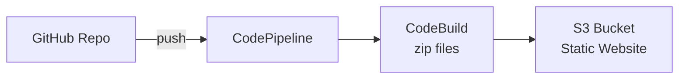
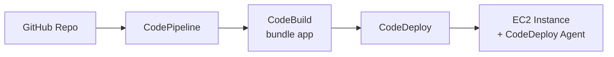
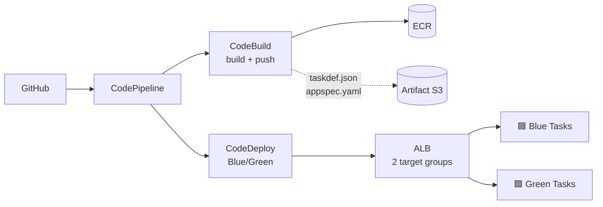

# AWS CodePipeline — Hands-On Labs

Progressive, self-contained labs that take you from "hello world" to enterprise-grade multi-account deployments. Every lab includes cost estimates, cleanup steps, and success criteria.

---

## 🎯 Lab Index

| # | Lab | Difficulty | Est. Time | Cost |
|---|-----|-----------|-----------|------|
| 0 | Environment Setup | ⭐ | 15 min | $0 |
| 1 | S3 Static Site Pipeline | ⭐ | 30 min | < $0.50 |
| 2 | EC2 Deploy with CodeDeploy | ⭐⭐ | 60 min | ~$2 |
| 3 | ECS Fargate Blue/Green | ⭐⭐⭐ | 90 min | ~$3 |
| 4 | Lambda Canary Deploy (SAM) | ⭐⭐ | 45 min | < $1 |
| 5 | Multi-Account Pipeline | ⭐⭐⭐⭐ | 120 min | ~$5 |
| 6 | CloudFormation Stack Deploy | ⭐⭐ | 45 min | ~$1 |
| 7 | Slack Approval + Notifications | ⭐⭐ | 30 min | $0 |
| 8 | CloudWatch Auto-Rollback | ⭐⭐⭐ | 45 min | ~$1 |

> Costs assume same-day teardown. Skip cleanup at your peril — running ECS/EC2 pipelines idle can hit real money.

---

## Lab 0 — Environment Setup

**Goal:** Have every tool you need on your workstation and a clean sandbox account.

### 0.1 Install Tools

```bash
# AWS CLI v2
curl "https://awscli.amazonaws.com/awscli-exe-linux-x86_64.zip" -o awscli.zip
unzip awscli.zip && sudo ./aws/install

# jq (for parsing JSON output)
sudo apt install -y jq

# git-remote-codecommit (optional, for CodeCommit HTTPS)
pip install git-remote-codecommit

# AWS SAM CLI (for Lab 4)
pip install aws-sam-cli

# AWS CDK (for later)
npm install -g aws-cdk

# Terraform (optional)
wget -O- https://apt.releases.hashicorp.com/gpg | sudo gpg --dearmor -o /usr/share/keyrings/hashicorp-archive-keyring.gpg
echo "deb [signed-by=/usr/share/keyrings/hashicorp-archive-keyring.gpg] https://apt.releases.hashicorp.com $(lsb_release -cs) main" | sudo tee /etc/apt/sources.list.d/hashicorp.list
sudo apt update && sudo apt install terraform
```

### 0.2 Configure

```bash
aws configure           # set region us-east-1 (or your preferred)
aws sts get-caller-identity   # verify
```

### 0.3 Success Criteria

- `aws --version` returns v2.x
- `aws sts get-caller-identity` returns your account ID
- You know your default region (used throughout)

---

## Lab 1 — S3 Static Site Pipeline

**Goal:** Auto-deploy a static site to S3 on every push.

### 1.1 Architecture



### 1.2 Steps

**1. Create the source repo** (locally, then push to GitHub):

```bash
mkdir static-site-demo && cd static-site-demo
git init
cat > index.html <<'EOF'
<html><body><h1>Deployed by CodePipeline v1</h1></body></html>
EOF
cat > buildspec.yml <<'EOF'
version: 0.2
phases:
  build:
    commands:
      - echo "Nothing to build - static files"
artifacts:
  files: ['**/*']
EOF
git add . && git commit -m "initial"
git remote add origin https://github.com/YOU/static-site-demo.git
git push -u origin main
```

**2. Create the S3 hosting bucket:**

```bash
BUCKET=my-cp-static-demo-$(date +%s)
aws s3api create-bucket --bucket $BUCKET
aws s3 website s3://$BUCKET/ --index-document index.html
aws s3api put-public-access-block --bucket $BUCKET \
  --public-access-block-configuration "BlockPublicAcls=false,IgnorePublicAcls=false,BlockPublicPolicy=false,RestrictPublicBuckets=false"
aws s3api put-bucket-policy --bucket $BUCKET --policy "{
  \"Version\":\"2012-10-17\",
  \"Statement\":[{\"Sid\":\"PublicRead\",\"Effect\":\"Allow\",\"Principal\":\"*\",\"Action\":\"s3:GetObject\",\"Resource\":\"arn:aws:s3:::$BUCKET/*\"}]}"
```

**3. Create GitHub connection** (Console: *Developer Tools → Settings → Connections*), then note the ARN.

**4. Build the pipeline** (Console → Create pipeline → V2):

- **Source:** GitHub via CodeStar Connections → your repo → `main`
- **Build:** New CodeBuild project, `aws/codebuild/standard:7.0`, use in-repo `buildspec.yml`
- **Deploy:** S3 → your bucket → check **Extract file before deploy**

**5. Verify:**

```bash
# After first execution succeeds
curl http://$BUCKET.s3-website-us-east-1.amazonaws.com
# Should return your <h1>
```

### 1.3 Cleanup

```bash
aws codepipeline delete-pipeline --name my-static-pipeline
aws codebuild delete-project --name my-static-build
aws s3 rb s3://$BUCKET --force
# Delete auto-created artifact bucket:
aws s3 ls | grep codepipeline-us-east-1
aws s3 rb s3://codepipeline-us-east-1-<random> --force
```

### 1.4 Success Criteria

- Pushing a change to `index.html` triggers the pipeline within seconds
- The S3 site reflects the new content within 2 minutes
- Total execution time under 3 minutes

---

## Lab 2 — EC2 Deploy with CodeDeploy

**Goal:** Deploy a Node.js/Apache app to an EC2 instance with lifecycle hooks.

### 2.1 Architecture



### 2.2 Prep

**1. Repo structure:**

```
ec2-app-demo/
├── appspec.yml
├── buildspec.yml
├── index.html
└── scripts/
    ├── install_dependencies.sh
    ├── start_server.sh
    ├── stop_server.sh
    └── validate_service.sh
```

**appspec.yml** and **scripts/**: use the templates from `commands-cheatsheet.md § 9`.

**buildspec.yml:**

```yaml
version: 0.2
phases:
  build:
    commands:
      - echo "Packaging..."
artifacts:
  files:
    - appspec.yml
    - index.html
    - scripts/**/*
```

Push to GitHub.

### 2.3 Provision EC2

**1. Instance profile:**

```bash
aws iam create-role --role-name EC2CodeDeployRole \
  --assume-role-policy-document '{"Version":"2012-10-17","Statement":[{"Effect":"Allow","Principal":{"Service":"ec2.amazonaws.com"},"Action":"sts:AssumeRole"}]}'
aws iam attach-role-policy --role-name EC2CodeDeployRole \
  --policy-arn arn:aws:iam::aws:policy/service-role/AmazonEC2RoleforAWSCodeDeploy
aws iam create-instance-profile --instance-profile-name EC2CodeDeployRole
aws iam add-role-to-instance-profile --instance-profile-name EC2CodeDeployRole --role-name EC2CodeDeployRole
```

**2. Launch instance (Ubuntu 22.04):**

```bash
aws ec2 run-instances \
  --image-id ami-0c7217cdde317cfec \
  --instance-type t3.micro \
  --iam-instance-profile Name=EC2CodeDeployRole \
  --tag-specifications 'ResourceType=instance,Tags=[{Key=Name,Value=cp-demo},{Key=Env,Value=demo}]' \
  --user-data 'file://userdata.sh' \
  --security-group-ids <sg-allowing-22-80>
```

**userdata.sh** (installs CodeDeploy agent):

```bash
#!/bin/bash
apt-get update -y
apt-get install -y ruby-full wget
cd /home/ubuntu
wget https://aws-codedeploy-us-east-1.s3.us-east-1.amazonaws.com/latest/install
chmod +x ./install
./install auto
systemctl start codedeploy-agent
```

### 2.4 CodeDeploy App + Deployment Group

```bash
aws deploy create-application --application-name ec2-demo --compute-platform Server

aws iam create-role --role-name CodeDeployServiceRole \
  --assume-role-policy-document '{"Version":"2012-10-17","Statement":[{"Effect":"Allow","Principal":{"Service":"codedeploy.amazonaws.com"},"Action":"sts:AssumeRole"}]}'
aws iam attach-role-policy --role-name CodeDeployServiceRole \
  --policy-arn arn:aws:iam::aws:policy/service-role/AWSCodeDeployRole

aws deploy create-deployment-group \
  --application-name ec2-demo \
  --deployment-group-name demo-group \
  --service-role-arn arn:aws:iam::<ACCT>:role/CodeDeployServiceRole \
  --ec2-tag-filters Key=Env,Value=demo,Type=KEY_AND_VALUE \
  --deployment-config-name CodeDeployDefault.AllAtOnce
```

### 2.5 Build the Pipeline

Console → Create pipeline → V2 → Source (GitHub) → Build (CodeBuild) → Deploy (CodeDeploy, app=`ec2-demo`, group=`demo-group`).

### 2.6 Verify

```bash
# Get instance public IP
IP=$(aws ec2 describe-instances --filters "Name=tag:Name,Values=cp-demo" \
  --query 'Reservations[0].Instances[0].PublicIpAddress' --output text)
curl http://$IP
# Should return your index.html
```

Push a change → watch the pipeline redeploy in ~3 minutes.

### 2.7 Cleanup

```bash
aws ec2 terminate-instances --instance-ids <ids>
aws deploy delete-deployment-group --application-name ec2-demo --deployment-group-name demo-group
aws deploy delete-application --application-name ec2-demo
aws codepipeline delete-pipeline --name my-ec2-pipeline
aws codebuild delete-project --name my-ec2-build
aws iam delete-role --role-name EC2CodeDeployRole  # detach policies first
```

### 2.8 Success Criteria

- Instance appears healthy in CodeDeploy console
- `ValidateService` script returns 200
- Rollback works: intentionally break `start_server.sh` and observe CodeDeploy revert

---

## Lab 3 — ECS Fargate Blue/Green

**Goal:** Zero-downtime container deploys with automatic rollback on 5XX errors.

### 3.1 Architecture



### 3.2 Prereqs

- VPC with 2 public subnets
- ECR repository: `aws ecr create-repository --repository-name my-app`
- ALB with **two target groups** (`blue-tg`, `green-tg`) and **two listeners** (:80 prod, :8080 test)
- ECS cluster: `aws ecs create-cluster --cluster-name demo`

### 3.3 Repo Structure

```
ecs-bg-demo/
├── Dockerfile
├── app/                      # your app
├── buildspec.yml
├── appspec.yaml
└── taskdef.json
```

Use the multi-artifact `buildspec.yml` from `commands-cheatsheet.md § 8.5` and the `appspec.yaml` from `§ 9.3`.

### 3.4 ECS Service (Blue/Green)

```bash
aws ecs create-service \
  --cluster demo \
  --service-name my-app \
  --task-definition my-app:1 \
  --desired-count 2 \
  --launch-type FARGATE \
  --deployment-controller type=CODE_DEPLOY \
  --load-balancers targetGroupArn=<blue-tg-arn>,containerName=web-container,containerPort=8080 \
  --network-configuration "awsvpcConfiguration={subnets=[subnet-a,subnet-b],securityGroups=[sg-x],assignPublicIp=ENABLED}"
```

### 3.5 CodeDeploy Application

```bash
aws deploy create-application --application-name my-app-ecs --compute-platform ECS

aws deploy create-deployment-group \
  --application-name my-app-ecs \
  --deployment-group-name prod \
  --service-role-arn arn:aws:iam::<ACCT>:role/CodeDeployECSRole \
  --deployment-config-name CodeDeployDefault.ECSCanary10Percent5Minutes \
  --deployment-style deploymentType=BLUE_GREEN,deploymentOption=WITH_TRAFFIC_CONTROL \
  --blue-green-deployment-configuration file://bg-config.json \
  --ecs-services serviceName=my-app,clusterName=demo \
  --load-balancer-info targetGroupPairInfoList=[{targetGroups=[{name=blue-tg},{name=green-tg}],prodTrafficRoute={listenerArns=[<prod-listener-arn>]},testTrafficRoute={listenerArns=[<test-listener-arn>]}}]
```

**bg-config.json:**

```json
{
  "terminateBlueInstancesOnDeploymentSuccess": {
    "action": "TERMINATE",
    "terminationWaitTimeInMinutes": 5
  },
  "deploymentReadyOption": {
    "actionOnTimeout": "CONTINUE_DEPLOYMENT"
  }
}
```

### 3.6 Pipeline

- **Source:** GitHub
- **Build:** CodeBuild → outputs `BuildArtifact` (appspec + taskdef) and `ImageArtifact`
- **Deploy:** `Amazon ECS (Blue/Green)` action
  - AppSpec artifact: `BuildArtifact` : `appspec.yaml`
  - TaskDefinition artifact: `BuildArtifact` : `taskdef.json`
  - Image details: `ImageArtifact` : `imagedefinitions.json`

### 3.7 Verify Canary

Push a change → CodeDeploy will:
1. Spin up green tasks
2. Route 10% of prod traffic → green
3. Wait 5 minutes
4. Route 100% if no alarms fire
5. Terminate blue tasks 5 min later

### 3.8 Cleanup

```bash
aws ecs update-service --cluster demo --service my-app --desired-count 0
aws ecs delete-service --cluster demo --service my-app --force
aws ecs delete-cluster --cluster demo
aws deploy delete-deployment-group --application-name my-app-ecs --deployment-group-name prod
aws deploy delete-application --application-name my-app-ecs
aws ecr delete-repository --repository-name my-app --force
# Delete ALB, TGs, VPC as needed
```

---

## Lab 4 — Lambda Canary Deploy (SAM)

**Goal:** Shift Lambda traffic 10% every 5 minutes with a pre-traffic health check.

### 4.1 SAM Template (`template.yaml`)

```yaml
AWSTemplateFormatVersion: '2010-09-09'
Transform: AWS::Serverless-2016-10-31
Resources:
  ProcessorFunction:
    Type: AWS::Serverless::Function
    Properties:
      FunctionName: my-processor
      Runtime: python3.12
      Handler: app.handler
      CodeUri: ./src
      AutoPublishAlias: live
      DeploymentPreference:
        Type: Canary10Percent5Minutes
        Alarms:
          - !Ref ErrorsAlarm
        Hooks:
          PreTraffic:  !Ref PreTrafficHook
          PostTraffic: !Ref PostTrafficHook

  PreTrafficHook:
    Type: AWS::Serverless::Function
    Properties:
      Runtime: python3.12
      Handler: hooks.pre_traffic
      CodeUri: ./hooks
      DeploymentPreference: { Enabled: false }
      Policies:
        - Version: '2012-10-17'
          Statement:
            - Effect: Allow
              Action: codedeploy:PutLifecycleEventHookExecutionStatus
              Resource: '*'
            - Effect: Allow
              Action: lambda:InvokeFunction
              Resource: !GetAtt ProcessorFunction.Arn
      Environment:
        Variables: { FN: !Ref ProcessorFunction.Version }

  PostTrafficHook:
    Type: AWS::Serverless::Function
    Properties:
      Runtime: python3.12
      Handler: hooks.post_traffic
      CodeUri: ./hooks
      DeploymentPreference: { Enabled: false }
      Policies:
        - Version: '2012-10-17'
          Statement:
            - Effect: Allow
              Action: codedeploy:PutLifecycleEventHookExecutionStatus
              Resource: '*'

  ErrorsAlarm:
    Type: AWS::CloudWatch::Alarm
    Properties:
      MetricName: Errors
      Namespace: AWS/Lambda
      Statistic: Sum
      Period: 60
      EvaluationPeriods: 2
      Threshold: 1
      ComparisonOperator: GreaterThanOrEqualToThreshold
      Dimensions:
        - Name: FunctionName
          Value: !Ref ProcessorFunction
```

### 4.2 Pre-Traffic Hook (Python)

```python
# hooks/hooks.py
import os, json, boto3
codedeploy = boto3.client('codedeploy')
lam = boto3.client('lambda')

def pre_traffic(event, context):
    dep_id = event['DeploymentId']
    hook_id = event['LifecycleEventHookExecutionId']
    status = "Succeeded"
    try:
        r = lam.invoke(FunctionName=os.environ['FN'],
                       InvocationType='RequestResponse',
                       Payload=json.dumps({"ping": True}))
        if r['StatusCode'] != 200:
            status = "Failed"
    except Exception as e:
        print("Pre-traffic failed:", e)
        status = "Failed"
    codedeploy.put_lifecycle_event_hook_execution_status(
        deploymentId=dep_id,
        lifecycleEventHookExecutionId=hook_id,
        status=status)

def post_traffic(event, context):
    codedeploy.put_lifecycle_event_hook_execution_status(
        deploymentId=event['DeploymentId'],
        lifecycleEventHookExecutionId=event['LifecycleEventHookExecutionId'],
        status="Succeeded")
```

### 4.3 buildspec.yml

```yaml
version: 0.2
phases:
  install:
    runtime-versions: { python: 3.12 }
    commands:
      - pip install aws-sam-cli
  build:
    commands:
      - sam build
      - sam package --s3-bucket $ARTIFACT_BUCKET --output-template packaged.yaml
artifacts:
  files: [packaged.yaml]
```

### 4.4 Pipeline

- **Source:** GitHub
- **Build:** CodeBuild (env var `ARTIFACT_BUCKET`)
- **Deploy:** CloudFormation `CHANGE_SET_REPLACE` → **Manual Approval** → `CHANGE_SET_EXECUTE`

### 4.5 Test It

Introduce a bug (`raise Exception`) in `app.handler`. On next execution:
- Pre-traffic hook fails → deployment fails immediately, no traffic shift
- Alternatively, if pre-traffic passes but real invocations error, ErrorsAlarm fires → auto-rollback

---

## Lab 5 — Multi-Account Pipeline

**Goal:** Pipeline in *Tooling* account deploys CloudFormation stacks into *Staging* and *Prod* accounts.

### 5.1 Architecture

See README § 14 diagram. Accounts required:

- Tooling: `111111111111`
- Staging: `222222222222`
- Prod:    `333333333333`

Use AWS Organizations if possible.

### 5.2 In Tooling Account

**a) Artifact bucket + KMS key** — see `commands-cheatsheet.md § 7.1 / 7.2` and use the cross-account policy.

**b) Pipeline service role** — grant `sts:AssumeRole` to both target-account deploy roles.

**c) S3 bucket policy** for cross-account read:

```json
{
  "Version": "2012-10-17",
  "Statement": [{
    "Effect": "Allow",
    "Principal": { "AWS": [
      "arn:aws:iam::222222222222:role/PipelineDeployRole",
      "arn:aws:iam::333333333333:role/PipelineDeployRole"
    ]},
    "Action": ["s3:Get*","s3:List*"],
    "Resource": [
      "arn:aws:s3:::my-pipeline-artifacts-usea1",
      "arn:aws:s3:::my-pipeline-artifacts-usea1/*"
    ]
  }]
}
```

### 5.3 In Each Target Account

Create **PipelineDeployRole** with trust policy allowing tooling account, and inline permissions for CloudFormation (or ECS/Lambda) and `iam:PassRole` for a CFN execution role.

Also create **CFNExecutionRole** trusted by `cloudformation.amazonaws.com`.

### 5.4 Pipeline Definition (excerpt)

```yaml
Stages:
  - Name: DeployStaging
    Actions:
      - Name: DeployToStaging
        RoleArn: arn:aws:iam::222222222222:role/PipelineDeployRole   # ← cross-account
        ActionTypeId: { Category: Deploy, Owner: AWS, Provider: CloudFormation, Version: '1' }
        Configuration:
          ActionMode: CREATE_UPDATE
          StackName: my-app-staging
          TemplatePath: BuildOutput::template.yaml
          RoleArn: arn:aws:iam::222222222222:role/CFNExecutionRole
        InputArtifacts: [{ Name: BuildOutput }]

  - Name: Approve
    Actions:
      - Name: ProdApproval
        ActionTypeId: { Category: Approval, Owner: AWS, Provider: Manual, Version: '1' }

  - Name: DeployProd
    Actions:
      - Name: DeployToProd
        RoleArn: arn:aws:iam::333333333333:role/PipelineDeployRole
        ActionTypeId: { Category: Deploy, Owner: AWS, Provider: CloudFormation, Version: '1' }
        Configuration:
          ActionMode: CREATE_UPDATE
          StackName: my-app-prod
          TemplatePath: BuildOutput::template.yaml
          RoleArn: arn:aws:iam::333333333333:role/CFNExecutionRole
        InputArtifacts: [{ Name: BuildOutput }]
```

### 5.5 Test It

Push a template change → verify stacks appear in **both** target-account CloudFormation consoles.

### 5.6 Common Gotcha

If Prod deploy fails with `KMS decryption failed`, your KMS key policy is missing the Prod role's ARN. Re-apply the policy from § 7.2.

---

## Lab 6 — CloudFormation Stack Deploy

Covered inline in Lab 5. Short standalone version:

1. Repo contains `template.yaml` + `dev-params.json` / `prod-params.json`
2. Pipeline stages: Source → Build (validate template with `cfn-lint`) → Deploy Dev → Approve → Deploy Prod
3. Use `TemplateConfiguration: BuildOutput::prod-params.json` for env-specific overrides
4. Pattern: `CHANGE_SET_REPLACE` → Manual Approval → `CHANGE_SET_EXECUTE` for production to preview changes before applying

---

## Lab 7 — Slack Approval + Notifications

### 7.1 Setup Chatbot

1. AWS Chatbot Console → *Configure new client* → Slack
2. Authorize the AWS app in your Slack workspace
3. *Configure new channel* → pick channel, create/attach IAM role with `AWS-Chatbot-NotificationsOnly-Policy`

### 7.2 Attach Notification Rule

```bash
aws codestar-notifications create-notification-rule \
  --name pipeline-slack \
  --resource arn:aws:codepipeline:us-east-1:<ACCT>:my-pipeline \
  --event-type-ids codepipeline-pipeline-manual-approval-needed \
                   codepipeline-pipeline-pipeline-execution-failed \
                   codepipeline-pipeline-pipeline-execution-succeeded \
  --targets TargetType=AWSChatbotSlack,TargetAddress=arn:aws:chatbot::<ACCT>:chat-configuration/slack-channel/prod-alerts \
  --detail-type FULL
```

### 7.3 Approve From Slack

When a manual approval is needed, Chatbot posts:

> :warning: Approval needed for `my-pipeline` — Stage `Approve` → Action `ProdApproval`
>
> [Approve] [Reject] buttons

Click Approve → done. No context switching.

---

## Lab 8 — CloudWatch Auto-Rollback

**Goal:** A deploy that intentionally breaks the app is automatically reverted by CodeDeploy.

### 8.1 Create the Alarm

```bash
aws cloudwatch put-metric-alarm \
  --alarm-name my-app-5xx \
  --alarm-description "5xx errors on target group" \
  --metric-name HTTPCode_Target_5XX_Count \
  --namespace AWS/ApplicationELB \
  --statistic Sum \
  --period 60 \
  --evaluation-periods 1 \
  --threshold 5 \
  --comparison-operator GreaterThanThreshold \
  --dimensions Name=TargetGroup,Value=<tg-id> Name=LoadBalancer,Value=<lb-id>
```

### 8.2 Attach to Deployment Group

```bash
aws deploy update-deployment-group \
  --application-name my-app-ecs \
  --current-deployment-group-name prod \
  --alarm-configuration enabled=true,alarms=[{name=my-app-5xx}] \
  --auto-rollback-configuration enabled=true,events=DEPLOYMENT_FAILURE,DEPLOYMENT_STOP_ON_ALARM
```

### 8.3 Trigger a Bad Deploy

Push code that returns HTTP 500 → after cutover, alarm fires within a minute → CodeDeploy rolls back → pipeline shows `Failed - Rollback Complete`.

### 8.4 Verify

- CodeDeploy console → Deployments → check *Rollback triggered*
- ALB metrics → 5xx count returns to zero within 2–3 min after rollback

---

## 🧹 Master Cleanup Checklist

After ALL labs:

- [ ] Delete pipelines
- [ ] Delete CodeBuild projects
- [ ] Delete CodeDeploy applications
- [ ] Terminate EC2 instances
- [ ] Delete ECS services + clusters + task definitions
- [ ] Empty and delete S3 buckets (including auto-created `codepipeline-<region>-<random>`)
- [ ] Delete ECR repos
- [ ] Delete Lambda functions + CFN stacks (deletes ALBs, target groups)
- [ ] Delete KMS keys (schedule 7-day deletion)
- [ ] Delete CodeStar connections
- [ ] Delete IAM roles + policies you created
- [ ] Delete CloudWatch alarms

```bash
# Quick check: any pipeline still running billing?
aws codepipeline list-pipelines
```

---

*Broke something? Head to [troubleshooting.md](./troubleshooting.md).*
