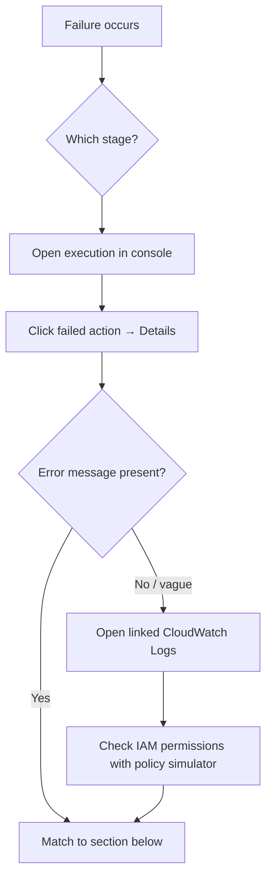

# AWS CodePipeline — Troubleshooting Guide

A field-tested list of the failures you *will* hit and exactly how to fix them.

---

## 📑 Contents

1. [How to Diagnose Any Failure](#1-how-to-diagnose-any-failure)
2. [Source Stage Failures](#2-source-stage-failures)
3. [Build Stage / CodeBuild Failures](#3-build-stage--codebuild-failures)
4. [Deploy Stage — EC2 / CodeDeploy](#4-deploy-stage--ec2--codedeploy)
5. [Deploy Stage — ECS](#5-deploy-stage--ecs)
6. [Deploy Stage — Lambda / SAM](#6-deploy-stage--lambda--sam)
7. [Deploy Stage — CloudFormation](#7-deploy-stage--cloudformation)
8. [Cross-Account & KMS Errors](#8-cross-account--kms-errors)
9. [Webhooks & Triggers Not Firing](#9-webhooks--triggers-not-firing)
10. [Manual Approvals Stuck](#10-manual-approvals-stuck)
11. [Rollback Loops](#11-rollback-loops)
12. [Log Locations Reference](#12-log-locations-reference)
13. [IAM Debug Kit](#13-iam-debug-kit)

---

## 1. How to Diagnose Any Failure

The universal debug loop:



**Key CLI commands to grab context fast:**

```bash
# What executions and when
aws codepipeline list-pipeline-executions --pipeline-name my-pipeline

# Full state of the last run
aws codepipeline get-pipeline-execution \
  --pipeline-name my-pipeline \
  --pipeline-execution-id <id>

# Per-action detail with error messages
aws codepipeline list-action-executions \
  --pipeline-name my-pipeline \
  --filter pipelineExecutionId=<id>

# CodeBuild log tail
aws logs tail /aws/codebuild/my-build --since 30m --follow
```

---

## 2. Source Stage Failures

### 2.1 `Access denied to repository`

**Cause:** CodeStar Connection in `PENDING` state, or the pipeline role lacks `codestar-connections:UseConnection`.

**Fix:**
```bash
aws codestar-connections get-connection --connection-arn <arn>
# ConnectionStatus must be AVAILABLE
```
If PENDING, open Console → Developer Tools → Settings → Connections → click the connection → **Update pending connection** and complete OAuth.

Also verify the pipeline service role has:
```json
{ "Effect": "Allow", "Action": "codestar-connections:UseConnection", "Resource": "arn:aws:codestar-connections:...:connection/*" }
```

### 2.2 `The requested branch was not found`

**Cause:** Branch renamed (`master` → `main`) or typo.

**Fix:** Update the pipeline source action's `BranchName`.

### 2.3 S3 source — `NoSuchVersion`

**Cause:** S3 bucket versioning disabled, or the object version referenced is expired.

**Fix:**
```bash
aws s3api put-bucket-versioning --bucket <bucket> --versioning-configuration Status=Enabled
```

### 2.4 CodeCommit source — pipeline stuck in `In Progress`

**Cause:** Missing EventBridge rule (created automatically only on first pipeline creation; if you replaced the pipeline via CFN it may be gone).

**Fix:** Re-create the EventBridge rule:
```bash
aws events put-rule --name codecommit-my-app-main \
  --event-pattern '{"source":["aws.codecommit"],"detail-type":["CodeCommit Repository State Change"],"resources":["arn:aws:codecommit:us-east-1:<ACCT>:my-app"],"detail":{"event":["referenceCreated","referenceUpdated"],"referenceType":["branch"],"referenceName":["main"]}}'
aws events put-targets --rule codecommit-my-app-main --targets \
  "Id=1,Arn=arn:aws:codepipeline:us-east-1:<ACCT>:my-pipeline,RoleArn=arn:aws:iam::<ACCT>:role/EventBridgeInvokePipelineRole"
```

---

## 3. Build Stage / CodeBuild Failures

### 3.1 `YAML_FILE_ERROR: no matches found for primary source and source version`

**Cause:** `buildspec.yml` not in artifact root, or filename typo.

**Fix:** Ensure the file is named exactly `buildspec.yml` (or `.yaml`) at the root of the source. Alternatively, specify `Buildspec` inline in the CodeBuild project.

### 3.2 `CLIENT_ERROR: EACCES: permission denied` on scripts

**Cause:** Shell scripts (`.sh`) checked in without executable bit, and buildspec calls them directly (`./scripts/foo.sh`).

**Fix:** Either:
```bash
git update-index --chmod=+x scripts/foo.sh
```
Or invoke through bash in buildspec:
```yaml
- bash scripts/foo.sh
```

### 3.3 CodeBuild times out during Docker build

**Cause:** No caching + big image + small timeout.

**Fix:**
- Set `TimeoutInMinutes: 60`
- Enable local cache with `LOCAL_DOCKER_LAYER_CACHE`
- Use multi-stage Dockerfile with `--cache-from`
- Consider pre-baking a base image

### 3.4 `Cannot connect to the Docker daemon`

**Cause:** `privilegedMode: false`.

**Fix:** Update CodeBuild project → Environment → check **Enable this flag if you want to build Docker images**.

### 3.5 `aws ecr get-login-password: Unable to locate credentials`

**Cause:** CodeBuild service role missing ECR permissions.

**Fix:** Attach:
```json
{ "Effect":"Allow","Action":["ecr:GetAuthorizationToken","ecr:BatchCheckLayerAvailability","ecr:GetDownloadUrlForLayer","ecr:BatchGetImage","ecr:InitiateLayerUpload","ecr:UploadLayerPart","ecr:CompleteLayerUpload","ecr:PutImage"],"Resource":"*" }
```
(`GetAuthorizationToken` must be Resource `*` — the others can be scoped to your repo ARN.)

### 3.6 `Failed to download parameter from SSM: AccessDeniedException`

**Cause:** CodeBuild role missing `ssm:GetParameters` for the parameter path.

**Fix:**
```json
{ "Effect":"Allow","Action":"ssm:GetParameters","Resource":"arn:aws:ssm:us-east-1:<ACCT>:parameter/prod/*" }
```

### 3.7 `Rate exceeded` from Secrets Manager

**Cause:** Concurrent builds pulling the same secret.

**Fix:** Cache secret in an env var early in `install` phase, don't refetch each phase. For heavy parallelism, add exponential-backoff retry logic.

### 3.8 Build succeeds but artifact is empty

**Cause:** `artifacts.files` glob doesn't match, or `base-directory` wrong.

**Fix:** Test locally with `codebuild-local` runner or add a debug step:
```yaml
- ls -laR $CODEBUILD_SRC_DIR
```

### 3.9 VPC-attached build hangs on `npm install`

**Cause:** No NAT gateway / no internet access from subnet.

**Fix:** Either move CodeBuild subnet to one with NAT, or add VPC endpoints for S3, ECR, and Secrets Manager and use a private package mirror (CodeArtifact).

---

## 4. Deploy Stage — EC2 / CodeDeploy

### 4.1 `The deployment failed because no instances were found`

**Cause:** EC2 tag filter mismatch, or CodeDeploy agent not running.

**Fix:**
- Confirm tag: `aws ec2 describe-instances --filters "Name=tag:Env,Values=demo"`
- SSH in: `sudo systemctl status codedeploy-agent`
- If not installed: run the userdata bootstrap from Lab 2

### 4.2 `ScriptFailed` on a lifecycle hook

**Cause:** Script returned non-zero exit code.

**Fix:** Check `/opt/codedeploy-agent/deployment-root/deployment-logs/codedeploy-agent-deployments.log` on the instance:
```bash
sudo tail -100 /opt/codedeploy-agent/deployment-root/deployment-logs/codedeploy-agent-deployments.log
```

### 4.3 Deployment hangs forever on `ApplicationStart`

**Cause:** Start script launches a foreground process (e.g. `node app.js`) that never exits.

**Fix:** Use systemd:
```bash
sudo systemctl enable my-app
sudo systemctl start my-app
```
Or background properly: `nohup node app.js > /var/log/app.log 2>&1 &`

### 4.4 `HEALTH_CONSTRAINTS` — cannot deploy because too few healthy hosts

**Cause:** `MinimumHealthyHosts` too aggressive vs desired count.

**Fix:** Use `CodeDeployDefault.HalfAtATime` for 4+ hosts, `AllAtOnce` only for demos.

### 4.5 CodeDeploy agent installs but never registers with server

**Cause:** Missing IAM permissions in instance profile.

**Fix:** Attach the AWS-managed policy `AmazonEC2RoleforAWSCodeDeploy` (or its inline equivalent) to the EC2 instance role.

### 4.6 `The overall deployment failed because too many individual instances failed deployment`

**Cause:** First deployment onto a fresh fleet often means agent version mismatch or missing deps.

**Fix:** Verify agent version:
```bash
sudo cat /opt/codedeploy-agent/.version
sudo /opt/codedeploy-agent/bin/codedeploy-agent status
```
Upgrade if needed: `sudo apt-get install -y --reinstall codedeploy-agent` (or run the installer again).

---

## 5. Deploy Stage — ECS

### 5.1 `Container failed to start` in Blue/Green

**Cause:** Task definition's health check endpoint returns non-200, or image failed to pull.

**Fix:**
- Check ECS console → *Events* tab on the service
- Verify container logs: `/ecs/my-app/<taskId>`
- Common: missing `logConfiguration` block → container writes to void, appears "unhealthy"

### 5.2 `Deployment failed: unable to place a task because no container instance met all requirements`

**Cause:** Insufficient CPU/RAM in cluster (EC2 launch type), or missing subnet capacity (Fargate).

**Fix:**
- Scale ASG up (EC2)
- Verify subnets have free IPs (Fargate needs ENIs)

### 5.3 `Standard ECS deploy: imagedefinitions.json not found`

**Cause:** File not emitted, or not in the deploy action's input artifact.

**Fix:** In `buildspec.yml`, ensure the `post_build` command runs and the file is in `artifacts.files`.

### 5.4 Blue/Green cutover hangs at `Ready` state

**Cause:** Waiting for manual traffic-shift approval (deployment ready option).

**Fix:** Either approve in CodeDeploy console (*Deployments* → *Reroute traffic*), or change deployment group's `deploymentReadyOption` to `CONTINUE_DEPLOYMENT`.

### 5.5 `<TASK_DEFINITION> placeholder not replaced`

**Cause:** Missing `TaskDefinitionTemplateArtifact` mapping in the deploy action config.

**Fix:** In the pipeline action:
```json
"Configuration": {
  "TaskDefinitionTemplateArtifact": "BuildArtifact",
  "TaskDefinitionTemplatePath": "taskdef.json",
  "AppSpecTemplateArtifact": "BuildArtifact",
  "AppSpecTemplatePath": "appspec.yaml",
  "Image1ArtifactName": "ImageArtifact",
  "Image1ContainerName": "IMAGE1_NAME"
}
```

---

## 6. Deploy Stage — Lambda / SAM

### 6.1 `codedeploy:PutLifecycleEventHookExecutionStatus is not authorized`

**Cause:** Pre/post-traffic hook lambda's role missing this action.

**Fix:** Add to the hook function's role:
```json
{ "Effect":"Allow","Action":"codedeploy:PutLifecycleEventHookExecutionStatus","Resource":"*" }
```

### 6.2 Deployment rolls back immediately with no logs

**Cause:** Pre-traffic hook never called `PutLifecycleEventHookExecutionStatus` → CodeDeploy timed out → marked as failed.

**Fix:** Ensure the hook Lambda ALWAYS returns a status, even on exception (wrap the whole handler in try/finally).

### 6.3 Alias not updating even though CFN says success

**Cause:** `AutoPublishAlias` requires a code change to trigger a new version. Only metadata change → no version.

**Fix:** Bump `CodeUri` contents (touch a file) or add an env var change.

---

## 7. Deploy Stage — CloudFormation

### 7.1 `Stack is in ROLLBACK_COMPLETE state and can not be updated`

**Cause:** Initial `CREATE` failed, stack is a "zombie".

**Fix:**
```bash
aws cloudformation delete-stack --stack-name my-app-stack
# Wait for DELETE_COMPLETE, then re-run pipeline
```

### 7.2 `Insufficient permissions to perform operation. iam:CreateRole`

**Cause:** CFN action config missing `Capabilities: CAPABILITY_IAM` or `CAPABILITY_NAMED_IAM`.

**Fix:**
```yaml
Configuration:
  Capabilities: CAPABILITY_NAMED_IAM,CAPABILITY_AUTO_EXPAND
```

### 7.3 `Change set contains no changes` — action fails on execute

**Cause:** No drift between deployed and template.

**Fix:** Use `CHANGE_SET_REPLACE` mode which handles empty change sets gracefully in V2, or add a wrapper Lambda action.

### 7.4 `Parameter [X] must have values`

**Cause:** `TemplateConfiguration` file missing a required parameter.

**Fix:** Provide a `prod-params.json`:
```json
{
  "Parameters": { "Environment": "prod", "InstanceType": "t3.medium" },
  "Tags":       { "CostCenter": "12345" }
}
```

---

## 8. Cross-Account & KMS Errors

### 8.1 `An AWS KMS error occurred: AccessDeniedException`

The single most common cross-account pipeline failure.

**Cause:** KMS key policy in the tooling account does not grant `kms:Decrypt` + `kms:GenerateDataKey` to the target-account role.

**Fix:** Update the key policy (see cheat sheet § 7.2). Verify:
```bash
aws kms get-key-policy --key-id alias/pipeline-key --policy-name default
```

### 8.2 `Unable to assume role: AccessDenied`

**Cause:** Target-account role trust policy doesn't allow the tooling pipeline role.

**Fix:** Trust policy should list the specific pipeline-role ARN, not just the root of the tooling account (least privilege):
```json
{ "Principal": { "AWS": "arn:aws:iam::111111111111:role/CodePipelineServiceRole" } }
```

### 8.3 `S3 GetObject: 403 Forbidden` from target account

**Cause:** Bucket policy on artifact bucket missing target-account role.

**Fix:** Add both bucket policy AND KMS key policy for that role.

### 8.4 CFN action succeeds but stack is in wrong account

**Cause:** Missing `RoleArn` at the *action* level — deploy happened in tooling account.

**Fix:** Two role ARNs are required for cross-account CFN:
- Action-level `RoleArn` = target-account **deployment role** (for CP to assume)
- Configuration `RoleArn` = target-account **CFN execution role** (that CFN uses to create resources)

---

## 9. Webhooks & Triggers Not Firing

### 9.1 GitHub push doesn't trigger pipeline (V2 + CodeStar Connection)

**Fix checklist:**
- Verify branch name matches trigger filter exactly
- File path filter includes: check paths of files actually changed
- CodeStar Connection is `AVAILABLE`
- Test manually: `aws codepipeline start-pipeline-execution --name my-pipeline`
- Check GitHub App permissions (org admin may have restricted repositories)

### 9.2 EventBridge rule for CodeCommit exists but doesn't fire

**Fix:** In the CodeCommit console → Notifications → verify a rule linked to the pipeline. If missing:
```bash
aws events list-rules --name-prefix codecommit
```

### 9.3 File path filter matches too little (nothing triggers)

**Cause:** `**` vs `**/*` confusion.

**Fix:**
- `services/api/**` — matches ANYTHING under `services/api/` recursively
- `services/api/*` — matches only direct children of `services/api/`

### 9.4 Path exclusions ignored

**Cause:** Path filters are ONLY evaluated on V2 pipelines and require `pipelineType: V2` at the top-level.

**Fix:** Migrate: Console → Pipeline → Edit → Change pipeline type → V2.

---

## 10. Manual Approvals Stuck

### 10.1 Approval email never arrives

**Cause:** SNS topic email subscription in `PendingConfirmation` state.

**Fix:**
```bash
aws sns list-subscriptions-by-topic --topic-arn <arn>
# Subscribe again if needed; check spam folder for confirmation email
```

### 10.2 `You are not authorized to approve this action`

**Cause:** IAM user lacks `codepipeline:PutApprovalResult`.

**Fix:** Attach:
```json
{ "Effect":"Allow","Action":"codepipeline:PutApprovalResult","Resource":"arn:aws:codepipeline:us-east-1:<ACCT>:my-pipeline/*" }
```

### 10.3 Approval expired (>7 days)

**Cause:** Approval token TTL is 7 days.

**Fix:** Re-run the failed stage, or use `retry-stage-execution` to re-issue an approval token.

---

## 11. Rollback Loops

### 11.1 CodeDeploy keeps rolling back the same deployment

**Cause:** CloudWatch alarm never returns to `OK` state (flapping metric or too-tight threshold).

**Fix:**
- Increase alarm evaluation periods (e.g. 3 datapoints of 60s instead of 1)
- Add `TreatMissingData: notBreaching`
- Temporarily disable auto-rollback and inspect metrics:
```bash
aws deploy update-deployment-group \
  --application-name my-app --current-deployment-group-name prod \
  --auto-rollback-configuration enabled=false
```

### 11.2 Rollback succeeds but pipeline stuck in `Failed`

**Cause:** Pipeline treats rollback as a failed action.

**Fix:** Retry the failed stage, or enable stage-level `OnFailure: ROLLBACK` in V2.

---

## 12. Log Locations Reference

| Component | Where |
|-----------|-------|
| CodePipeline execution | Console → Pipeline → Execution history |
| CodeBuild build logs | CloudWatch Logs `/aws/codebuild/<project>` |
| CodeDeploy agent | On EC2: `/var/log/aws/codedeploy-agent/codedeploy-agent.log` |
| CodeDeploy deployment | On EC2: `/opt/codedeploy-agent/deployment-root/deployment-logs/codedeploy-agent-deployments.log` |
| CodeDeploy scripts stdout | Same file as above |
| ECS task logs | CloudWatch Logs `/ecs/<service>` |
| Lambda hook logs | CloudWatch Logs `/aws/lambda/<function>` |
| EventBridge invocations | CloudTrail (searchable by resource) |
| CloudFormation events | Console → Stack → Events tab |

Fast log tail:
```bash
aws logs tail /aws/codebuild/my-build --follow --format short
aws logs tail /ecs/my-app --follow --since 30m
```

---

## 13. IAM Debug Kit

### 13.1 Simulate a Policy

Verify the pipeline role can actually do what you think:
```bash
aws iam simulate-principal-policy \
  --policy-source-arn arn:aws:iam::<ACCT>:role/CodePipelineServiceRole \
  --action-names s3:GetObject kms:Decrypt sts:AssumeRole \
  --resource-arns "arn:aws:s3:::my-artifacts/*" \
      "arn:aws:kms:us-east-1:<ACCT>:key/xyz" \
      "arn:aws:iam::333333333333:role/PipelineDeployRole"
```

### 13.2 Read the CloudTrail Event

Every `AccessDenied` leaves a breadcrumb in CloudTrail with the *exact* action name, principal, and resource:
```bash
aws cloudtrail lookup-events \
  --lookup-attributes AttributeKey=EventName,AttributeValue=AssumeRole \
  --max-results 10 \
  --query 'Events[?ErrorCode==`AccessDenied`]'
```

### 13.3 Common Missing Permissions

| Failure | Add this to service role |
|---------|--------------------------|
| Source can't read GH connection | `codestar-connections:UseConnection` |
| Build can't fetch source | `s3:GetObject`, `s3:GetObjectVersion` |
| Build can't upload artifact | `s3:PutObject`, `kms:GenerateDataKey` |
| Approval can't publish SNS | `sns:Publish` on topic ARN |
| Deploy CFN cross-account | `sts:AssumeRole` on target role |
| Deploy CFN passes bad role | `iam:PassRole` on CFN execution role |
| ECR push during build | `ecr:*` (see § 3.5) |

---

## 🆘 Still Stuck?

1. Search AWS re:Post: https://repost.aws/tags/TAeGyRoLIURJKTxLbi7Nvymg/aws-code-pipeline
2. Enable AWS Support case with the execution ID and CloudWatch log link
3. Post the failing action's raw error to your team's #devops-help with:
   - Pipeline execution ID
   - Action name
   - CloudWatch log snippet
   - What changed since the last successful run

*Back to [README](./README.md).*
