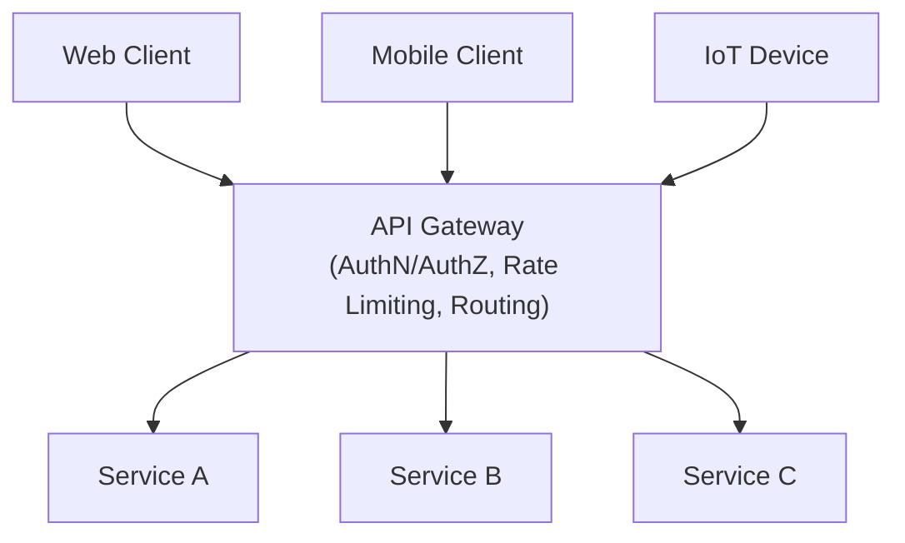
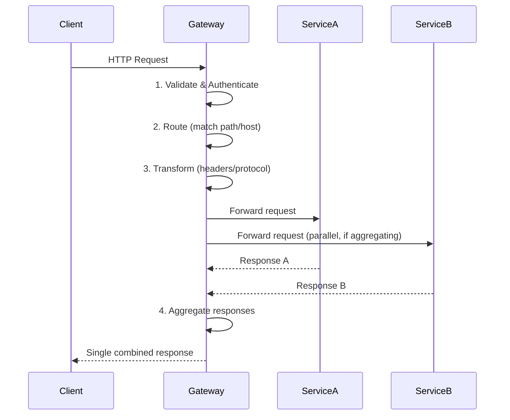
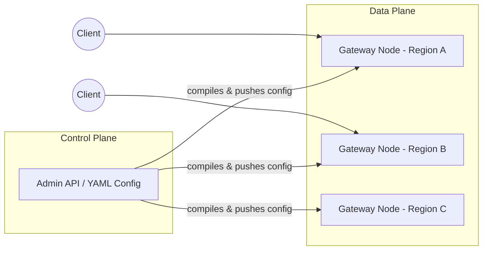

# API Gateway — End-to-End Practical Learning Guide

A complete, hands-on reference for understanding and running an API Gateway — from core theory to production-grade patterns. Built to go from "what is this?" to "I've deployed and broken one on purpose."

> 📁 This repo: `README.md` (theory) · `commands-cheatsheet.md` (copy-paste commands) · `hands-on-labs.md` (runnable labs) · `troubleshooting.md` (when it breaks)

---

## Table of Contents

1. [What is an API Gateway](#1-what-is-an-api-gateway)
2. [Core Architecture & Request Lifecycle](#2-core-architecture--request-lifecycle)
3. [Key Functions & Responsibilities](#3-key-functions--responsibilities)
4. [API Gateway vs Load Balancer vs Service Mesh](#4-api-gateway-vs-load-balancer-vs-service-mesh)
5. [Pros and Cons](#5-pros-and-cons)
6. [Popular API Gateway Tools](#6-popular-api-gateway-tools)
7. [Configuration Mechanics](#7-configuration-mechanics)
8. [Core Feature Deep Dive](#8-core-feature-deep-dive)
9. [Advanced Production Topics](#9-advanced-production-topics)
10. [Extra Topics for Completeness](#10-extra-topics-for-completeness)
11. [Suggested Learning Path](#11-suggested-learning-path)

---

## 1. What is an API Gateway

An API Gateway is the single entry point — the "front door" — for all client requests into a backend made of many services. Instead of a client calling ten different microservices directly, it calls one gateway, which routes, secures, and manages traffic on its behalf.

**Analogy:** A hotel front desk. You don't knock on the kitchen door for food or the housekeeping door for towels — you talk to the receptionist, who coordinates everything behind the scenes.

**Without a gateway:** every client needs to know every service's address, handle its own auth, retries, and rate limiting — repeated N times across N clients.

**With a gateway:** clients know one hostname. Cross-cutting concerns (auth, throttling, logging) live in one place instead of being duplicated inside every microservice.

---

## 2. Core Architecture & Request Lifecycle



Every request that hits the gateway typically passes through four stages:



| Stage | What happens |
|---|---|
| Request Validation & Security | Confirms identity (token/key) and whether the caller is allowed in |
| Routing / Reverse Proxying | Determines which backend service should handle the request |
| Transformation | Rewrites headers, or converts protocol (e.g. REST → gRPC) |
| Response Aggregation | Combines results from multiple services into one client-facing response |

---

## 3. Key Functions & Responsibilities

### 3.1 Routing and Reverse Proxying
Maps public URLs to internal service endpoints.
Example: `api.company.com/v1/users` → internally routed to `10.0.1.5:8080/users` (the User microservice).

### 3.2 Authentication and Authorization
Login/token checks are centralized at the gateway instead of duplicated in every microservice. It verifies API keys, OAuth tokens, or JWTs, and rejects invalid requests before they ever reach a backend — saving compute.

### 3.3 Rate Limiting and Throttling
Caps how many requests a client can make in a window (e.g. 100 requests/minute) to prevent abuse or accidental DDoS-style overload.

### 3.4 Protocol Translation
Clients speak HTTP/JSON (REST); backends may speak gRPC or GraphQL internally. The gateway translates in both directions.

### 3.5 Load Balancing
Spreads incoming traffic across multiple instances of a backend service so no single instance is overwhelmed.

### 3.6 Caching
Serves frequently-requested, rarely-changing data (e.g. a product catalog) directly from the gateway without hitting the backend at all.

---

## 4. API Gateway vs Load Balancer vs Service Mesh

| Feature | Load Balancer | API Gateway | Service Mesh |
|---|---|---|---|
| Primary Focus | Distributing network traffic (L4/L7) | Application logic, security, API management (L7) | East-West (service-to-service) internal communication |
| Location | Edge of the network | Edge of the network | Deep inside the backend cluster |
| Key Capability | Simple routing, health checks | Auth, rate limiting, data transformation | Service discovery, mutual TLS, circuit breaking |
| Typical Example | AWS ELB/NLB, HAProxy | Kong, AWS API Gateway, Apigee | Istio, Linkerd, Consul Connect |

**Rule of thumb:** Load balancer = "which server?" · API Gateway = "which service, and is this caller allowed?" · Service mesh = "how do my *own* services talk to each other safely?" These are often used **together**, not as alternatives.

---

## 5. Pros and Cons

### Pros
- **Separation of concerns** — backend teams focus on business logic, not auth/rate-limit boilerplate.
- **Reduced client complexity** — clients manage one connection to one domain.
- **Centralized analytics/monitoring** — all traffic passes one choke point, ideal for logging and metrics.

### Cons
- **Single point of failure** — if the gateway goes down, the whole app goes down (High Availability is mandatory, not optional).
- **Increased latency** — an extra network hop on every request.
- **Configuration overhead** — routing rules grow complex as the number of microservices grows.

---

## 6. Popular API Gateway Tools

| Category | Tools |
|---|---|
| Cloud-Native / Managed | AWS API Gateway, Azure API Management, Google Cloud API Gateway |
| Open Source / Self-Hosted | Kong (built on Nginx/OpenResty), Apache APISIX, Tyk, KrakenD |
| Reverse Proxies used as Gateways | Nginx, Traefik, Envoy |

This repo's labs primarily use **Kong** (great Admin API for learning via `curl`), plus **Nginx** and **Envoy** for specific features.

---

## 7. Configuration Mechanics

Modern gateways are configured with **Declarative Configuration (Configuration-as-Code)** and GitOps — YAML/JSON or Kubernetes Custom Resources — rather than clicking through a dashboard. This makes config reviewable, versioned, and reproducible.

Three building blocks show up in every gateway's config model:

### 7.1 The Route / Matcher
Defines how the gateway recognizes an incoming request:
- **Path-based** — e.g. `/v1/payments/*`
- **Method-based** — e.g. allow `GET`, intercept `POST`
- **Header/Host-based** — e.g. `Host: api.partner.com`

### 7.2 The Upstream / Target
Where the matched request actually gets forwarded:
- Static IPs, internal DNS names (`payment-service.internal:8080`), or a load balancer
- Often integrates with service discovery (Consul, Kubernetes CoreDNS)

### 7.3 The Plugins / Policies
Middleware actions applied before the request goes upstream, or before the response returns to the client (auth, rate limiting, header injection, etc.)

**Example declarative config** (Kong/Envoy-style):

```yaml
# Conceptual Declarative Configuration
api_version: gateway.v1/route
metadata:
  name: payment-routing-policy
spec:
  match:
    path: "/v1/payments"
    methods: ["POST"]
  upstream:
    service_name: "payment-microservice"
    port: 8080
  plugins:
    - name: rate-limiting
      config:
        requests_per_minute: 100
    - name: jwt-authentication
      config:
        secret_key_env: "JWT_SECRET"
    - name: request-transformer
      config:
        add_headers:
          X-Gateway-Validated: "true"
```

---

## 8. Core Feature Deep Dive

### 8.1 Advanced Security & Identity
- **Token Validation** — unpacks and validates JWTs/OAuth2 tokens (signature + expiry) before letting a request through.
- **SSL/TLS Termination** — decrypts HTTPS at the edge so internal services can talk plain (faster) HTTP behind the gateway.
- **IP Whitelisting / Blacklisting** — explicit allow/deny by CIDR block or partner IP range.
- **WAF Integration** — inspects payloads for SQLi, XSS, and other common web attacks.

### 8.2 Traffic Control & Resiliency
- **Rate Limiting & Quotas** — Token Bucket / Leaky Bucket algorithms; limits can be global, per-IP, or per-API-key.
- **Circuit Breaking** — tracks upstream error rates; if a service starts throwing 5xxs, the gateway "opens the circuit" and stops sending it traffic so it can recover.
- **Canary & Blue-Green Deployments** — splits traffic by percentage (e.g. 90% v1 / 10% v2) to safely test new versions in production.

### 8.3 Data & Protocol Transformation
- **Header & Payload Manipulation** — adds tracing headers (`X-Request-ID`), strips sensitive internal headers, injects user metadata post-auth.
- **Protocol Translation** — bridges REST/JSON clients to internal gRPC or message queues (RabbitMQ, Kafka).
- **Response Aggregation** — fires parallel calls to multiple backends and merges results into one client response.

### 8.4 Observability & Telemetry
- **Distributed Tracing** — injects correlation IDs so one request can be traced across every microservice it touches.
- **Metrics Exporting** — ships latency, throughput, and error-rate metrics to Prometheus, Datadog, New Relic, etc.
- **Access Logging** — structured (usually JSON) logs of every request: path, payload size, response time, status.

---

## 9. Advanced Production Topics

### 9.1 Gateway Deployment Topologies
- **Edge Gateway Pattern** — one centralized gateway for the entire company's incoming traffic.
- **Micro-Gateway / Per-Service Pattern** — each domain gets its own smaller gateway (`payment-gateway`, `auth-gateway`). Limits blast radius: if the payment gateway breaks, everything else stays up.

### 9.2 Monetization and Developer Portals
For gateways exposed to external third-party developers:
- **Developer Portal** — self-service storefront: register, read OpenAPI/Swagger docs, generate API keys.
- **Monetization Engine** — enforces subscription tiers (Free: 1,000 req/day, Premium: unlimited) and hooks into billing (e.g. Stripe) to charge per call.

### 9.3 Backend-for-Frontend (BFF) Pattern
Instead of one generic gateway for every device, BFF uses multiple tailored gateways per experience:
- **Mobile BFF** — strips heavy fields, compresses payloads, aggregates requests to save battery/bandwidth.
- **Web BFF** — handles larger payloads, manages cookie-based sessions, optimizes for desktop layouts.
- **Third-Party API BFF** — focuses on strict rate limits, webhooks, and long-term version stability.

### 9.4 Configuration Synchronization (Control Plane / Data Plane split)



- **Control Plane** — where you write config/routes/plugins. Doesn't handle live traffic.
- **Data Plane** — the actual traffic-handling engine (Nginx/Envoy workers) running globally.

The control plane compiles and pushes config to data plane nodes with zero-downtime, so updating a route doesn't mean restarting every gateway instance worldwide.

---

## 10. Extra Topics for Completeness

A few production-relevant topics that weren't in the original notes but come up constantly in real deployments:

- **API Versioning** — URI (`/v1/`, `/v2/`), header-based, or content-negotiation versioning strategies, and how gateways route each.
- **Idempotency & Retries** — using `Idempotency-Key` headers so gateway-level retries don't double-charge a payment or double-create a resource.
- **mTLS to Upstreams** — the gateway terminates client TLS, but re-encrypts (mutual TLS) when talking to backend services for zero-trust networking.
- **GraphQL Gateway / Federation** — a gateway that stitches multiple GraphQL subgraphs into one schema (e.g. Apollo Gateway, GraphQL Mesh).
- **WebSocket / gRPC-Web / Server-Sent Events support** — not all gateways proxy long-lived or streaming connections the same way as request/response REST.
- **Schema Validation** — validating request/response bodies against an OpenAPI spec at the gateway, rejecting malformed payloads before they reach a service.
- **Cost & Capacity Planning** — the extra network hop and gateway compute cost at scale; when to shard into micro-gateways purely for cost reasons.

Labs and troubleshooting entries for several of these are included in the other files.

---

## 11. Suggested Learning Path

- [ ] Read Sections 1–6 above (concepts)
- [ ] `hands-on-labs.md` → Lab 1–2: environment setup + first gateway deployment
- [ ] `hands-on-labs.md` → Lab 3–4: routing + JWT auth
- [ ] `hands-on-labs.md` → Lab 5–6: rate limiting + TLS termination
- [ ] `hands-on-labs.md` → Lab 7–8: circuit breaking + canary deployment
- [ ] `hands-on-labs.md` → Lab 9–11: protocol translation, response aggregation, observability
- [ ] `hands-on-labs.md` → Lab 12–14: control/data plane split, dev portal, BFF pattern
- [ ] Keep `commands-cheatsheet.md` open in a second tab while doing labs
- [ ] Hit an error? Check `troubleshooting.md` before Googling

---

## References / Tool Docs
- Kong: https://docs.konghq.com
- Envoy: https://www.envoyproxy.io/docs
- Nginx: https://nginx.org/en/docs/
- AWS API Gateway: https://docs.aws.amazon.com/apigateway/
- Apache APISIX: https://apisix.apache.org/docs/
