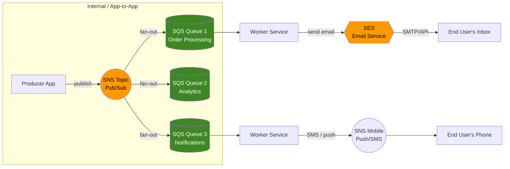
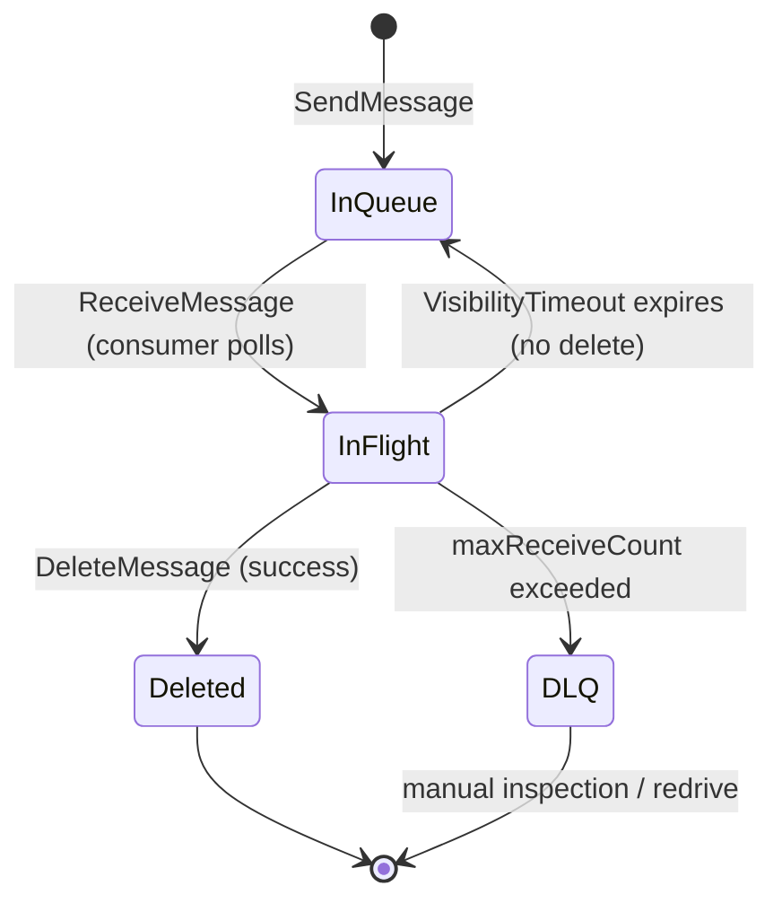
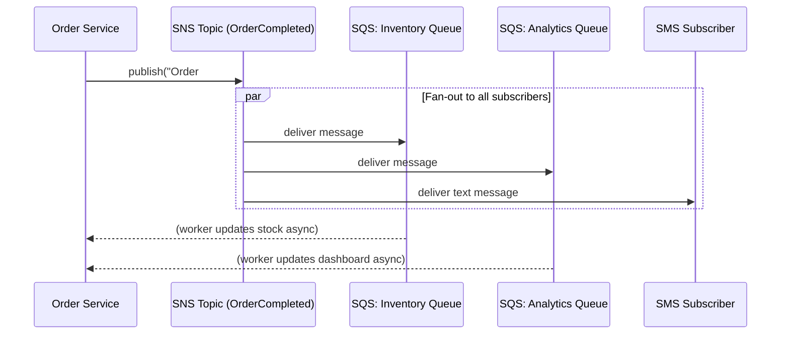
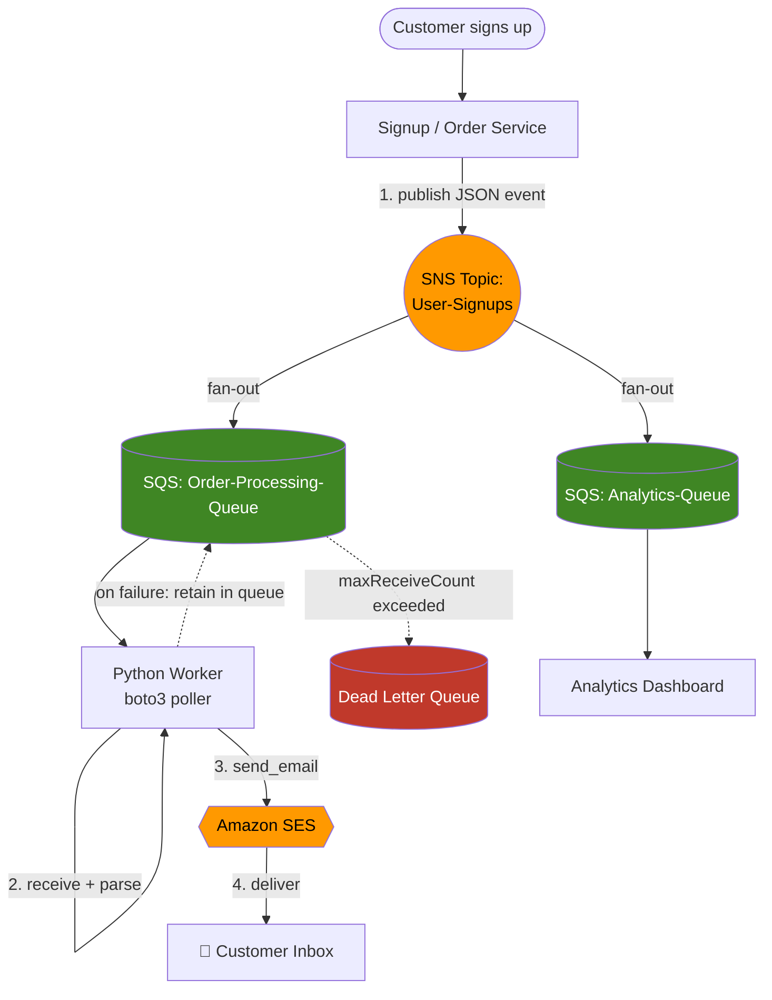

# AWS Messaging Trio — SQS, SNS & SES (End-to-End Practical Guide)

A hands-on, project-based guide to Amazon's core messaging and communication services — built for anyone learning distributed systems on AWS and wants a real GitHub reference (not just theory).

> **The analogy:** Think of a shipping & communication network.
> - **SQS** = the warehouse conveyor belt — holds packages (messages) safely until a worker is ready.
> - **SNS** = the broadcasting tower / megaphone — shout once, everyone subscribed hears it instantly.
> - **SES** = the digital post office — sends and receives real email to/from the outside world.

## 📚 Repository Contents

| File | What's inside |
|---|---|
| [`README.md`](./README.md) | Concepts, architecture diagrams, feature breakdown, comparison tables (this file) |
| [`commands-cheatsheet.md`](./commands-cheatsheet.md) | Every AWS CLI command + IAM policy JSON + boto3 snippets you'll need |
| [`hands-on-labs.md`](./hands-on-labs.md) | 10 step-by-step labs from "hello queue" to a full SNS→SQS→SES production pipeline |
| [`troubleshooting.md`](./troubleshooting.md) | Real errors, root causes, and fixes for all three services |

---

## 🗺️ How the Three Services Relate

**Reading it:** SNS *pushes* to many subscribers at once (fan-out). SQS *holds* work until a consumer pulls it. SES is the only one of the three that talks to a real human inbox outside AWS.

---

## 1️⃣ AWS SQS (Simple Queue Service)

A distributed **message queuing** service used to decouple and scale microservices, distributed systems, and serverless applications.

### Key Features

| Feature | Description |
|---|---|
| **Decoupling** | Producer drops a message and moves on; consumer pulls at its own pace — the two never talk directly. |
| **Standard Queue** | Nearly unlimited throughput. Best-effort ordering, **at-least-once** delivery (occasional duplicates possible — design consumers to be idempotent). |
| **FIFO Queue** | Strict ordering + exactly-once processing. Default throughput: 300 msg/sec (3,000/sec with batching of 10). With **High Throughput Mode** enabled: up to ~70,000 msg/sec without batching, even higher with batching (varies by region). |
| **Visibility Timeout** | When a consumer pulls a message it becomes invisible to others for a set period. If the consumer never deletes it (crash, timeout), it reappears for retry. |
| **Long Polling** | `WaitTimeSeconds` up to 20s — the API call waits for a message instead of immediately returning empty, cutting cost and empty-poll noise. |
| **Dead Letter Queue (DLQ)** | After `maxReceiveCount` failed processing attempts, the message is automatically moved to a separate queue for inspection instead of looping forever. |
| **Message Retention** | Default 4 days, configurable 1 minute – 14 days. |
| **Max Message Size** | 256 KB (use the SQS Extended Client + S3 for larger payloads). |
| **Batching** | Send/receive/delete up to 10 messages per API call — same cost as one message, so it's cheaper at scale. |
| **In-flight Message Limit** | 120,000 for Standard queues, 20,000 for FIFO queues. |
| **Server-Side Encryption (SSE)** | Encrypt messages at rest using AWS KMS (SSE-SQS or SSE-KMS). |
| **Delay Queues** | Postpone delivery of *new* messages by up to 15 minutes. |

### SQS Message Lifecycle

### Practical Use Case
A flash-sale e-commerce checkout: instead of making the customer wait while payment, inventory, and shipping are processed, the web app drops an `OrderPlaced` message into SQS and immediately responds "Your order is being processed!" A background worker fleet drains the queue at its own pace.

---

## 2️⃣ AWS SNS (Simple Notification Service)

A **pub/sub (publish/subscribe)** service. Unlike SQS (pull), SNS **pushes** messages out to every subscriber the instant they're published.

### Key Features

| Feature | Description |
|---|---|
| **Pub/Sub Architecture** | Publishers send to a **Topic**; any number of **Subscribers** (SQS, Lambda, HTTP/S, Email, SMS, Mobile Push) listen on it. |
| **Fan-out Pattern** | One message → automatically replicated & pushed to N different SQS queues / Lambdas simultaneously. This is the backbone of decoupled event-driven architectures. |
| **Message Filtering** | Subscribers attach a **filter policy** so they only receive messages matching specific attributes (e.g. `status == "shipped"`), instead of every message on the topic. |
| **FIFO Topics** | Ordered, exactly-once delivery to FIFO SQS queues. Default 300 msg/sec (3,000 msg/sec with batching); High Throughput Mode scales to ~30,000 TPS by default in some regions. |
| **Standard Topics** | Best-effort ordering, at-least-once delivery, near-unlimited throughput. |
| **Multi-protocol Delivery** | SQS, Lambda, HTTP(S) endpoints, Email/Email-JSON, SMS text messages, Mobile Push (APNs/FCM), and even another AWS account. |
| **No Persistence** | SNS is ephemeral — if there's no subscriber at publish time, the message is gone (unlike SQS which holds messages up to 14 days). |
| **Message Attributes** | Metadata key/value pairs attached to a message, used for filtering without parsing the body. |
| **Delivery Retry Policy** | Configurable retry/backoff for HTTP(S) endpoints. |
| **Encryption** | SSE via KMS for topics at rest. |

### SNS Fan-out in Action

### Practical Use Case
An order completes → the order system publishes **one** `OrderCompleted` event to an SNS topic. An Inventory queue updates stock, an Analytics queue updates the dashboard, and an SMS subscription texts the customer — all from a single `publish()` call.

---

## 3️⃣ AWS SES (Simple Email Service)

A high-scale, cost-effective service for sending **transactional, marketing, and bulk email**, and optionally receiving it.

### Key Features

| Feature | Description |
|---|---|
| **High Deliverability** | AWS manages IP reputation and gives you tools to authenticate mail: **SPF**, **DKIM**, **DMARC** — critical to landing in the inbox instead of spam. |
| **Outbound Sending** | `SendEmail` (simple), `SendRawEmail` (attachments/custom MIME), `SendBulkTemplatedEmail` (templated, up to 50 recipients per call). |
| **Inbound Email** | Receipt rules can trigger S3 storage, SNS notification, or a Lambda function when mail arrives at your domain (e.g. `support@yourcompany.com`). |
| **Sandbox Mode** | Every new account starts here: **200 emails / 24 hours**, **max 1 email/sec**, and you may only send **to and from verified identities**. You must request **Production Access** to lift these limits. |
| **Production Quotas** | After approval, typical starting quotas are much higher (e.g. 50,000/day at ~14 msg/sec) and scale further with sending reputation. |
| **Identity Verification** | Verify an individual email address (quick testing) or an entire domain (production — enables DKIM signing for every address `@yourdomain.com`). |
| **Configuration Sets** | Group sending options (e.g. tracking, IP pools) and route event notifications (opens, clicks, bounces, complaints) to SNS/CloudWatch/Kinesis Firehose. |
| **Bounce & Complaint Handling** | Subscribe SNS to bounce/complaint events so you can automatically suppress bad addresses — required for maintaining sender reputation. |
| **Dedicated IPs** | Optional leased IPs for large senders who need isolated reputation. |
| **Message Size Limit** | 10 MB (attachments included, post-MIME-encoding). |

### Practical Use Case
Password reset links, monthly statements, order confirmations, and newsletters — delivered straight to a user's Gmail/Outlook inbox, triggered programmatically from your backend.

---

## 🏗️ Full End-to-End Architecture (What This Repo Builds)

This is exactly what **Lab 8** in [`hands-on-labs.md`](./hands-on-labs.md) builds and runs.

---

## 📊 Summary Comparison

| Aspect | SQS | SNS | SES |
|---|---|---|---|
| **Communication type** | App-to-App (pull) | App-to-App / App-to-Person (push) | App-to-Person (email) |
| **Mechanism** | Polling — consumer pulls | Pub/Sub — instantly pushed | SMTP / API — delivered to inboxes |
| **Persistence** | Yes, up to 14 days | No — ephemeral, lost if no subscriber | No |
| **Ordering** | FIFO queues: strict / Standard: best-effort | FIFO topics: strict / Standard: best-effort | N/A |
| **Delivery guarantee** | At-least-once (Standard) / Exactly-once (FIFO) | At-least-once (Standard) / Exactly-once (FIFO) | Best-effort with bounce/complaint feedback |
| **Fan-out capable** | No (it's the destination) | Yes — one topic → many subscribers | No |
| **Typical trigger source** | Polled by workers, or triggers Lambda | Published by an app, or triggered by another AWS service (S3, CloudWatch) | Called directly by app code |
| **Target audience** | Internal microservices | Multi-channel: services + end users | External end users |

---

## 🔐 Security & Production Best Practices (added — not in the original notes)

- **IAM least privilege** — grant only the specific actions needed (`sqs:SendMessage`, `sns:Publish`, `ses:SendEmail`, etc.) scoped to specific resource ARNs. Full policy examples are in the cheatsheet.
- **Encrypt at rest** — enable SSE (KMS) on SQS queues and SNS topics holding sensitive data.
- **Resource policies** — an SNS topic needs an access policy that explicitly allows it to `sqs:SendMessage` into a subscribed queue (the console does this for you; CLI/IaC setups often forget it — see troubleshooting.md).
- **Least-privilege sender identity for SES** — verify a domain (not just one address) in production, and enable DKIM signing.
- **Idempotent consumers** — Standard SQS/SNS are at-least-once, so design workers to safely handle duplicate deliveries (e.g. dedupe on a unique order ID).
- **Dead Letter Queues everywhere** — always attach a DLQ + CloudWatch alarm on `ApproximateNumberOfMessagesVisible` in the DLQ so failures are never silent.
- **Monitor sender reputation** — track SES bounce rate (<5%) and complaint rate (<0.1%); AWS can throttle or suspend sending if these are exceeded.
- **Cost awareness** — SQS/SNS are priced per request (batch to save money); SES is priced per message + per GB of attachment data; CloudWatch alarms cost per alarm/month.

---

## ✅ Prerequisites

- An AWS account (free tier is enough for every lab here)
- [AWS CLI v2](https://docs.aws.amazon.com/cli/latest/userguide/getting-started-install.html) installed and configured (`aws configure`)
- Python 3.9+ with `boto3` (`pip install boto3`)
- An IAM user/role with programmatic access and permissions for SQS, SNS, and SES (see `commands-cheatsheet.md` for a ready-made policy)

## 🚀 Suggested Learning Path

1. Read the concepts above for all three services.
2. Skim [`commands-cheatsheet.md`](./commands-cheatsheet.md) so you know what commands exist.
3. Work through [`hands-on-labs.md`](./hands-on-labs.md) in order — each lab builds on the last, ending in a full working pipeline.
4. Keep [`troubleshooting.md`](./troubleshooting.md) open while you work; almost every mistake beginners make here is documented with the fix.

---

*This guide was compiled and expanded into a structured, practical learning resource — covering FIFO queues, DLQs, message filtering, encryption, monitoring, and security practices in addition to the core SQS/SNS/SES fundamentals.*
